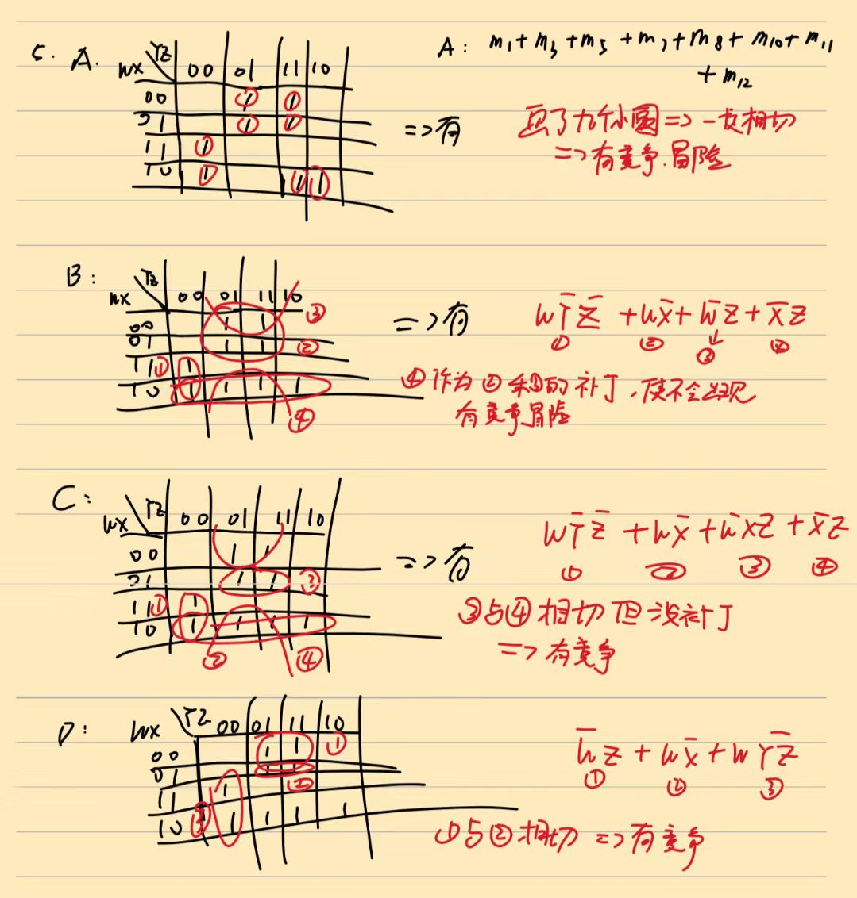
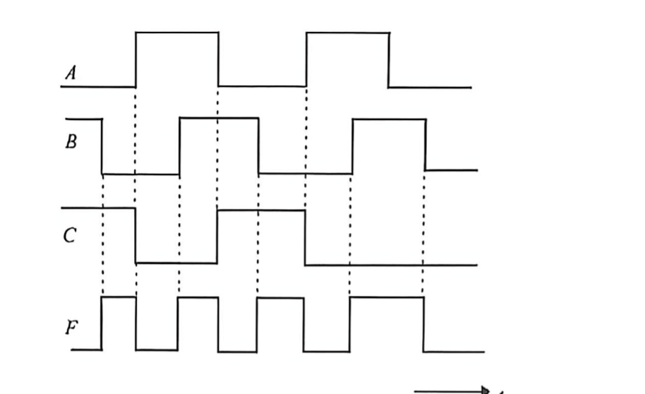
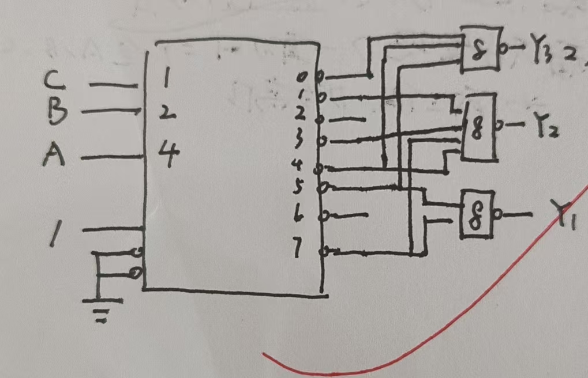
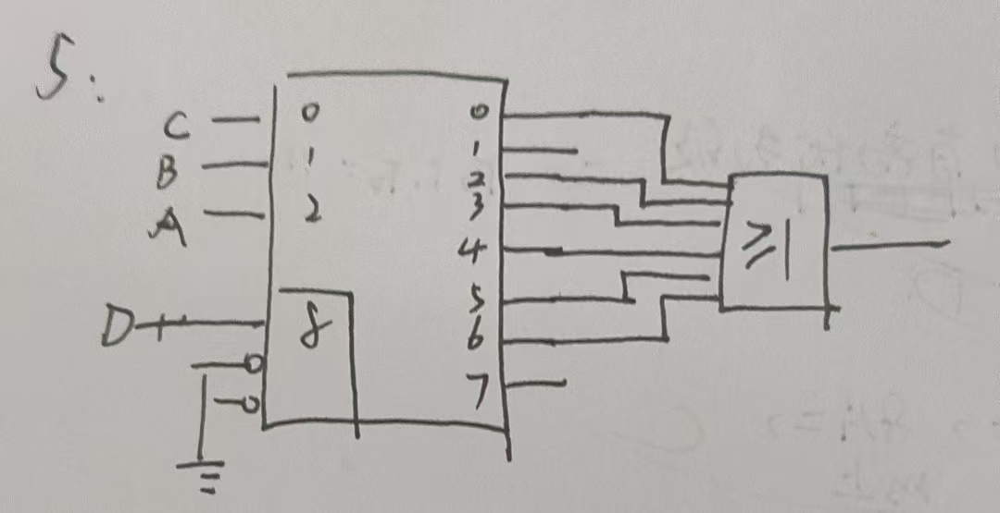

# 组合逻辑电路 · 错题本

> [!info] 本模块错题索引
>
> | 序号 | 错题标题 | 核心陷阱 | 难度 |
> |------|----------|----------|------|
> | [01](#错题01竞争冒险的判定与消除包含定理秒杀法) | 竞争冒险的判定与消除（包含定理秒杀法） | 卡诺圈相邻未缝合、包含定理快速补冗余项 $\overline{X}Z$ | ⭐⭐⭐⭐ |
> | [02](#错题02卡诺图上安全状态转换的判定) | 卡诺图上安全状态转换的判定 | 起终点是否被同一卡诺圈包裹、单变量变化vs多变量冒险 | ⭐⭐⭐⭐ |
> | [03](#错题03从波形图逆推逻辑门输出方程式) | 从波形图逆推逻辑门输出方程式 | 波形切片还原真值表、缺项作任意项(Don't Care)化简 | ⭐⭐⭐ |
> | [04](#错题04多变量逻辑抽象与真值表建模看球赛问题) | 多变量逻辑抽象与真值表建模（看球赛问题） | 使能端/否决端建模、最小项展开与化简 | ⭐⭐⭐ |
> | [05](#错题05最简无冒险电路设计圈0法降维打击) | 最简无冒险电路设计（圈0法降维打击） | SOP冗余爆炸时切换OR-AND结构、圈0读最大项 | ⭐⭐⭐⭐ |
> | [06](#错题06译码器的级联扩展6线-64线) | 译码器的级联扩展（6线-64线） | 只算输出层忘算控制层、高位地址线无处可接 | ⭐⭐⭐ |
> | [07](#错题07使能端的选通作用消除逻辑冒险) | 使能端的选通作用（消除逻辑冒险） | 把使能端当纯开关、忽视选通消毛刺的动态功能 | ⭐⭐⭐ |
> | [08](#错题08用MSI译码器实现多输出组合逻辑) | 用MSI译码器实现多输出组合逻辑 | 权重倒置接错引脚、低电平有效却用或门 | ⭐⭐⭐⭐ |
> | [09](#错题09使能端降维用3-8译码器实现4变量函数) | 使能端降维（用3-8译码器实现4变量函数） | 盲目展开4变量最小项碰壁、忘记使能端可扩维 | ⭐⭐⭐⭐ |
> | [10](#错题10数据选择器MUX的逻辑功能边界) | 数据选择器（MUX）的逻辑功能边界 | 并/串变换误判为时序、忘记MUX是万能逻辑器件 | ⭐⭐⭐ |
> | [11](#错题11用4选1-MUX实现逻辑函数真值表秒杀法) | 用4选1 MUX实现逻辑函数（真值表秒杀法） | 高低位主观颠倒、不展开最小项直接硬凑 | ⭐⭐⭐ |
>
> **更新日期**：2026-04-24

---

## 错题01：竞争冒险的判定与消除（包含定理秒杀法）

**题目：** 下列各逻辑函数相等，其中无冒险现象的为（ ）

A. $F = \overline{W}XYZ + W\overline{X}YZ + \overline{W}X\overline{Y}Z + \overline{W}XY\overline{Z} + W\overline{X}\overline{Y}Z + \overline{W}\overline{X}Y\overline{Z} + W\overline{X}Y\overline{Z} + W\overline{X}\overline{Y}\overline{Z} + WX\overline{Y}\overline{Z}$

B. $F = W\overline{Y}\overline{Z} + W\overline{X} + \overline{W}Z + \overline{X}Z$

C. $F = W\overline{Y}\overline{Z} + W\overline{X} + \overline{W}XZ + \overline{X}Z$

D. $F = \overline{W}Z + W\overline{X} + W\overline{Y}\overline{Z}$

**正确答案：** **B**

### 一、考察本质与核心考点

1. **静态冒险的物理意义：** 在组合逻辑电路中，当某一个输入变量发生跳变时，如果卡诺图上存在**两个相邻的"1"没有被划入同一个公共的卡诺圈**，电路就会在状态切换的瞬间产生极短的逻辑错误（毛刺）。

2. **消除冒险的通用法则：** 增加冗余项。即在卡诺图上画一个跨越边界的新卡诺圈，把那些没有被同一个圈包住的相邻"1"给缝合起来。

3. **代数秒杀法：** 灵活运用逻辑代数中的**包含定理**（Consensus Theorem）。

### 二、深度推演（两种解法）

#### 解法一：几何直观法（卡诺图诊断）

四个选项本质是同一个逻辑函数的不同形态。选择最简表达式 **选项 D** ($F = \overline{W}Z + W\overline{X} + W\overline{Y}\overline{Z}$) 作为基准来画卡诺图。

**1. 诊断原始状态（寻找漏洞）**

|**WX\YZ**|**00**|**01**|**11**|**10**|
|---|---|---|---|---|
|**00**|0|**1** (A圈)|**1** (A圈)|0|
|**01**|0|**1** (A圈)|**1** (A圈)|0|
|**11**|**1** (C圈)|0|0|0|
|**10**|**1** (C圈/B圈)|**1** (B圈)|**1** (B圈)|**1** (B圈)|

- **A圈** $\rightarrow \overline{W}Z$
- **B圈** $\rightarrow W\overline{X}$
- **C圈** $\rightarrow W\overline{Y}\overline{Z}$

**发现问题：** $WX=00$ 列的 `(00, 01)` 与 $WX=10$ 列的 `(10, 01)` 逻辑相邻（只差变量 $W$），但它们分别属于 A 圈和 B 圈，**缺乏一个共同的圈将它们包围**。当 $X=0, Y=0, Z=1$ 且 $W$ 发生跳变时，必生冒险。`(00, 11)` 和 `(10, 11)` 同理。

**2. 缝合漏洞（消除冒险）**

必须增加一个圈，覆盖 $WX=00$ 且 $YZ=01/11$，以及 $WX=10$ 且 $YZ=01/11$ 的格子。

提取公共特征：$X=0$ 且 $Z=1$，因此冗余项（缝合圈）为：**$\overline{X}Z$**。

将冗余项加入原式：

$$F = W\overline{Y}\overline{Z} + W\overline{X} + \overline{W}Z + \overline{X}Z$$

此结果与 **选项 B** 完全一致。



#### 解法二：代数推导法（考场秒杀）

直接使用**包含定理**：

$$A B + \overline{A} C + B C = A B + \overline{A} C$$

> [!tip] 包含定理释义
> 互反变量的两个乘积项，加上它们剩余因子的乘积项，逻辑结果不变。多出来的项即为消除冒险的冗余项。

**推导步骤：**

1. 观察选项 D：$F = \overline{W}Z + W\overline{X} + W\overline{Y}\overline{Z}$
2. 聚焦前两项：$\overline{W}Z$ 和 $W\overline{X}$
3. 发现互反变量：$\overline{W}$ 和 $W$
4. 提取剩余因子并相乘：$Z \cdot \overline{X} = \overline{X}Z$
5. 将冗余项 $\overline{X}Z$ 补回原式，即可消除竞争冒险

加上冗余项后的表达式即为 **选项 B**。

---

## 错题02：卡诺图上安全状态转换的判定

**题目：** 函数 $F = YZ + X\overline{Z} + W\overline{Y}$，判断下列状态转换中哪些无冒险。


**核心判定依据：** 在卡诺图上，如果状态转换的起始点和终点**被同一个卡诺圈包围**，则无冒险；如果它们跨越了不同卡诺圈的边界（且边界处没有重叠的其他圈覆盖），则必生冒险。

**卡诺图与圈划分：**

- **圈①** ($YZ$)：覆盖 $Y=1, Z=1$ 的列（即 11 列）
- **圈②** ($X\overline{Z}$)：覆盖 $X=1$ 且 $Z=0$ 的格子（跨越 01 行和 11 行，与 00 列和 10 列的交界处）
- **圈③** ($W\overline{Y}$)：覆盖 $W=1$ 且 $Y=0$ 的格子（即 11 行和 10 行，与 00 列和 01 列的交叉区域，$2 \times 2$ 田字格）

**图解状态转换诊断：**

|**WX\YZ**|**00**|**01**|**11**|**10**|
|---|---|---|---|---|
|**00**|0|0|**1** (圈①)|0|
|**01**|**1** (圈②)|0|**1** (圈①)|**1** (圈②)|
|**11**|**1** (圈②/③)|**1** (圈③)|**1** (圈①)|**1** (圈②)|
|**10**|**1** (圈③)|**1** (圈③)|**1** (圈①)|0|

**逐项分析：**

- **A选项 ($0111 \rightarrow 1110$)：**
    - 起点 `(01, 11)` 在**圈①**内，终点 `(11, 10)` 在**圈②**内。跨圈 + 多变量（W和Z）同时变化，斜着跳跃，**产生冒险**。

- **B选项 ($1001 \rightarrow 1011$)：**
    - 起点 `(10, 01)` 仅属**圈③**，终点 `(10, 11)` 仅属**圈①**。相邻的"1"之间无公共圈覆盖（静态 1 冒险边界），**产生冒险**。

- **C选项 ($1001 \rightarrow 1101$)：**
    - 起点和终点**同时被圈③ ($W\overline{Y}$) 包裹**。整个移动过程未离开圈③安全区，输出始终被钳制在 1，**无冒险，安全**。

- **D选项 ($0000 \rightarrow 0101$)：**
    - 起点 0，终点 0。多变量跳变（X和Z），若 X 先变 1 进入 `(01, 00)`（被圈②覆盖，输出为 1），产生 $0 \rightarrow 1 \rightarrow 0$ 毛刺（静态 0 冒险），**产生冒险**。

---

## 错题03：从波形图逆推逻辑门输出方程式

**题目：** 已知某逻辑门的输入 $A, B, C$ 及输出 $F$ 的波形如图所示，试写出该门的输出方程式。（提示：波形中缺项可作任意项）



### 一、解题核心工作流

处理所有波形图题目的通用法则：**"以虚线为界，切片读状态"**。

波形在时间轴上连续变化，但数字逻辑只关心稳态。通过图上的垂直虚线，将连续的时间轴切分成若干个离散的"时间片"（Interval），然后读取每个时间片里 $A, B, C$ 和 $F$ 的高低电平（高为 `1`，低为 `0`），从而还原出真值表。

### 二、详细步骤拆解

#### 第一步：切片读取，还原真值表

按照从左到右的时间顺序，观察虚线划分出的 8 个有效时间段：

|**时间片**|**A**|**B**|**C**|**F**|**最小项**|**备注**|
|---|---|---|---|---|---|---|
|1|0|1|1|**0**|$m_3 = 0$|起始状态|
|2|0|0|1|**1**|$m_1 = 1$|$F$ 出现高电平|
|3|1|0|0|**0**|$m_4 = 0$||
|4|1|1|0|**1**|$m_6 = 1$||
|5|0|1|1|**0**|$m_3 = 0$|与时间片 1 重复|
|6|0|0|0|**1**|$m_0 = 1$|$F$ 再次拉高|
|7|1|1|0|**1**|$m_6 = 1$|脉冲跨越虚线，维持高电平|
|8|1|1|1|**0**|$m_7 = 0$||

#### 第二步：寻找"缺项"（任意项）

3 个变量应有 $2^3 = 8$ 种组合。已提取的最小项集合：$\{m_0, m_1, m_3, m_4, m_6, m_7\}$。

缺失两种状态：**$m_2 (010)$** 和 **$m_5 (101)$**。

题目说明"缺项可作任意项"，因此 $m_2$ 和 $m_5$ 在卡诺图中填入 **`X` (Don't Care)**，是下一步极致化简的关键拼图。

#### 第三步：绘制并化简卡诺图

|**A\BC**|**00**|**01**|**11**|**10**|
|---|---|---|---|---|
|**0**|**1** ($m_0$)|**1** ($m_1$)|0 ($m_3$)|**X** ($m_2$)|
|**1**|0 ($m_4$)|**X** ($m_5$)|0 ($m_7$)|**1** ($m_6$)|

**画圈化简（充分利用 `X`）：**

1. **左上角组合：** $m_0(000)$ 和 $m_1(001)$ 都是 `1`，相邻可圈。
    - 公共因子：$A=0, B=0$ → **$\overline{A}\overline{B}$**

2. **右侧组合（利用无关项）：** $m_6(110)$ 是 `1`，其上方 $m_2(010)$ 是 `X`，将其视为 `1` 上下圈在一起（跨越 $A=0$ 和 $A=1$ 的两格圈）。
    - 公共因子：$B=1, C=0$ → **$B\overline{C}$**

3. 剩余 $m_5$ (`X`) 无法帮助扩大其他全 `1` 的圈，视为 `0` 舍弃。

### 三、最终结论

$$F = \overline{A}\overline{B} + B\overline{C}$$

> [!warning] 避坑指南
> 如果忽略了"缺项可作任意项"的提示，直接将未出现的状态默认当成 `0` 去化简，就无法借用 $m_2$ 去圈 $m_6$，导致 $m_6$ 只能写成 $AB\overline{C}$ 等更复杂的式子，得不到最简方程式，白白扣除化简分。

---

> [!summary] 本模块做题方法论
>
> | 方法 | 适用场景 | 口诀 |
> |------|----------|------|
> | **包含定理** | 已知最简式，快速补冗余项消除冒险 | 互反变量取剩余因子之积 |
> | **卡诺图诊断** | 判定状态转换是否安全 | 起终点同圈则安全，出圈则冒险 |
> | **波形图切片** | 从波形逆推逻辑表达式 | 以虚线为界，切片读状态 |
> | **任意项利用** | 波形缺项/无关项化简 | 缺项填 X，化简时按需取 1 或 0 |

---

## 错题04：多变量逻辑抽象与真值表建模（看球赛问题）

**题目：** 若你（Y）想去看球赛，但不愿一个人去，如果小李（L）或小陈（C）去，你就去，但若小王（W）去，则你一定不去（不论小李或小陈去否）。请将上述"你看球赛了（F）"这件事列出真值表，并写出逻辑表达式。

### 一、逻辑抽象与变量定义

**输入变量（4个）：**

| 变量 | 含义 | 正逻辑定义 |
|------|------|------------|
| $Y$ | 主观意愿 | $Y=1$ 你想去，$Y=0$ 你不想去 |
| $L$ | 小李是否去 | $L=1$ 小李去，$L=0$ 小李不去 |
| $C$ | 小陈是否去 | $C=1$ 小陈去，$C=0$ 小陈不去 |
| $W$ | 小王是否去（否决条件） | $W=1$ 小王去，$W=0$ 小王不去 |

**输出变量（1个）：** $F=1$ 你去看球赛了，$F=0$ 你没去。

**逻辑关系拆解：**

1. **总开关（使能端）：** 只有 $Y=1$ 时，后续陪同条件才有意义；$Y=0$ 则 $F=0$
2. **否决条件（一票否决）：** 小王不能去 $\rightarrow \overline{W}$
3. **充分条件（使能）：** 小李或小陈至少去一个 $\rightarrow (L + C)$

### 二、真值表（$2^4 = 16$ 行）

**快速填表口诀：**
- $Y=0$ → $F$ 直接填 0（前 8 行）
- $Y=1$ 且 $W=1$ → $F$ 直接填 0（一票否决）
- $Y=1$ 且 $W=0$ → 看 $(L+C)$ 是否 $\geq 1$

| $Y$ | $L$ | $C$ | $W$ | $F$ | 逻辑分析 |
|-----|-----|-----|-----|-----|----------|
| 0 | 0 | 0 | 0 | 0 | 你不想去，谁去都不好使 |
| 0 | 0 | 0 | 1 | 0 | 你不想去 |
| 0 | 0 | 1 | 0 | 0 | 你不想去 |
| 0 | 0 | 1 | 1 | 0 | 你不想去 |
| 0 | 1 | 0 | 0 | 0 | 你不想去 |
| 0 | 1 | 0 | 1 | 0 | 你不想去 |
| 0 | 1 | 1 | 0 | 0 | 你不想去 |
| 0 | 1 | 1 | 1 | 0 | 你不想去 |
| 1 | 0 | 0 | 0 | 0 | 想去，但没人陪，不去 |
| 1 | 0 | 0 | 1 | 0 | 没人陪且小王在，不去 |
| 1 | 0 | 1 | 0 | **1** | 小陈陪，小王不在，**去** |
| 1 | 0 | 1 | 1 | 0 | 小王一票否决，不去 |
| 1 | 1 | 0 | 0 | **1** | 小李陪，小王不在，**去** |
| 1 | 1 | 0 | 1 | 0 | 小王一票否决，不去 |
| 1 | 1 | 1 | 0 | **1** | 李陈都陪，小王不在，**去** |
| 1 | 1 | 1 | 1 | 0 | 小王一票否决，不去 |

### 三、逻辑表达式推导

#### 思路一：直译法（推荐）

按逻辑关系拆解直接写出表达式：

$$F = Y \cdot (L + C) \cdot \overline{W}$$

展开为与或式：

$$F = YL\overline{W} + YC\overline{W}$$

#### 思路二：最小项法

从真值表中找出 $F=1$ 的 3 行，写出最小项之和：

$$F = Y\overline{L}C\overline{W} + YL\overline{C}\overline{W} + YLC\overline{W}$$

提取公因子 $Y\overline{W}$：

$$F = Y\overline{W}(\overline{L}C + L\overline{C} + LC)$$

括号内 $(\overline{L}C + L\overline{C} + LC)$ 化简为 $(L + C)$，最终得到：

$$\boxed{F = Y(L + C)\overline{W}}$$

> [!tip] 工程视角
> 变量 $Y$ 相当于逻辑电路的 **使能控制端 (Enable)**，$W$ 相当于**片选禁止 (Chip Disable)**，而 $L, C$ 则是**数据输入端**。这道题本质上是体验"控制端"与"数据端"在实际系统中的协同工作。
>
> **核心考点：** 从自然语言描述中抽象出多变量逻辑关系，正确识别使能条件、否决条件和数据条件，并能用两种方法（直译法 vs 最小项法）推导并相互验证。

---

## 错题05：最简无冒险电路设计（圈0法降维打击）

**题目：** 如何才能将函数 $F(A,B,C) = \overline{A}C + \overline{B}\overline{C} + AB$ 设计成一个最简又无静态冒险的组合电路？

### 一、核心矛盾

"最简"与"无冒险"天然对立——消除冒险的常规手段是加冗余项，但这会使电路变复杂。此题的关键在于跳出 SOP（与或式）思维，利用 OR-AND（或与式）结构天然免疫静态 1 冒险的特性。

### 二、卡诺图与冒险诊断

**填入卡诺图：**

- $\overline{A}C$：$m_1, m_3$
- $\overline{B}\overline{C}$：$m_0, m_4$
- $AB$：$m_6, m_7$

|**A\BC**|**00**|**01**|**11**|**10**|
|---|---|---|---|---|
|**0**|1 ($m_0$)|1 ($m_1$)|1 ($m_3$)|**0** ($m_2$)|
|**1**|1 ($m_4$)|**0** ($m_5$)|1 ($m_7$)|1 ($m_6$)|

**SOP 圈 1 的困境：** 6 个"1"首尾相连形成闭合环，相邻"1"之间均缺少公共卡诺圈：

- $m_0$ 与 $m_1$ 相邻但无公共圈 → 静态 1 冒险
- $m_3$ 与 $m_7$ 相邻但无公共圈 → 静态 1 冒险
- $m_6$ 与 $m_4$ 相邻但无公共圈 → 静态 1 冒险

若补全 3 个冗余项：

$$F = \overline{A}C + \overline{B}\overline{C} + AB + \overline{A}\overline{B} + BC + A\overline{C}$$

6 项、6 个与门 + 1 个 6 输入或门，**此路不通**。

### 三、圈 0 法 → 或与式（OR-AND）

**关键物理定律：**

| 电路结构 | 可能产生的冒险 | 不会产生的冒险 |
|----------|---------------|---------------|
| AND-OR（先与后或） | 静态 1 冒险 | 静态 0 冒险 |
| OR-AND（先或后与） | 静态 0 冒险 | 静态 1 冒险 |

卡诺图中仅有 **2 个 0**：$m_2(010)$ 和 $m_5(101)$，它们**不相邻**（海明距离为 3），因此圈 0 不存在静态 0 冒险。选用 OR-AND 结构，天然无冒险。

#### 第一步：写反函数 $\overline{F}$

$F=0$ 的格子：$m_2(010)$ 和 $m_5(101)$。

$$\overline{F} = \overline{A}B\overline{C} + A\overline{B}C$$

#### 第二步：摩根定律求 $F$

$$F = \overline{\overline{F}} = \overline{\overline{A}B\overline{C} + A\overline{B}C}$$

**外层拆或：**

$$F = \overline{\overline{A}B\overline{C}} \cdot \overline{A\overline{B}C}$$

**内层拆与（$\overline{\overline{A}} = A$）：**

$$\overline{\overline{A}B\overline{C}} = A + \overline{B} + C$$

$$\overline{A\overline{B}C} = \overline{A} + B + \overline{C}$$

#### 第三步：最终结果

$$\boxed{F = (A + \overline{B} + C)(\overline{A} + B + \overline{C})}$$

**仅需 2 个 3 输入或门 + 1 个 2 输入与门**，比 SOP 的 6 项方案简洁得多，且 OR-AND 结构对这 2 个孤立的 0 天然无静态 0 冒险。

### 四、底层对称性规律

> [!tip] 最小项 ↔ 最大项的对称性
> - 卡诺图上的 0 → 反函数 $\overline{F}$ 的最小项 $m_i$
> - 对 $m_i$ 取反 → 最大项 $M_i$（即 $\overline{m_i} = M_i$）
> - **直接用最大项写连乘，本质上就是对"由 0 组成的最小项"执行摩根定律**
>
> 以后遇到类似题目，拥有两套互相印证的武器库：
> 1. **卡诺图直接圈 0 读最大项**
> 2. **先写 $\overline{F}$ 的最小项之和，再用摩根定律展开**

> [!warning] 避坑指南
> 遇到"最简 + 无冒险"同时要求时，不要条件反射地用 SOP 加冗余项。先画卡诺图观察 0 的分布——如果 0 很少且不形成相邻对，OR-AND（或与式）往往是更优甚至唯一可行的方案。

---

## 错题06：译码器的级联扩展（6线-64线）

**题目：** 欲组建 6 线-64 线译码器，则需用 3 线-8 线译码器（74138）：

A. 2 片　　B. 6 片　　C. 9 片　　D. 12 片

**正确答案：** **C（9 片）**

### 一、核心考点

**译码器的扩展（Cascade/Expansion）**：当单一芯片的地址线（输入）和输出线不足时，需通过**并联地址线 + 级联片选信号**的方式实现扩展。

### 二、错误路径（警惕陷阱）

1. **直觉陷阱——只考虑输出端：** 计算 $64 \div 8 = 8$，直接选 8（本题无此选项，但常见题会有），忽略了还需要 1 片芯片来控制这 8 片输出层芯片的使能。
2. **逻辑断层——高位地址线无处可接：** 不清楚 $A_5, A_4, A_3$ 应接入何处，导致无法理解多出的那一片芯片的作用。

### 三、正确解析

实现 6-64 扩展，需将 6 位输入地址分为**低位**和**高位**两部分：

#### 第一层：输出层（低位寻址）—— 8 片

- 8 片 74138 的 $A_2, A_1, A_0$ **全部并联**，接入总输入的低 3 位
- 共产生 $8 \times 8 = 64$ 条输出线

#### 第二层：控制层（高位片选）—— 1 片

- 1 片 74138 作为"总指挥"，输入接入总输入的高 3 位（$A_5, A_4, A_3$）
- 它的 8 个输出端 $Y_0 \sim Y_7$ 分别连接到上述 8 片输出层芯片的使能端（Enable）
- **作用：** 决定在某一时刻，哪一片输出层芯片被"激活"工作

#### 架构图

```
控制层 (A5-A3)
  ┌─────────────┐
  │  74138 控制  │
  │   (1 片)     │
  └──┬──┬──┬┬┬┬┬┘
     │  │  │││││
    Y0 Y1 Y2...Y7
     │  │  │││││
     ▼  ▼  ▼▼▼▼▼
输出层 (A2-A0 并联)
┌────┬────┬───┬────┐
│ #1 │ #2 │...│ #8 │  ← 8 片 74138
└┬──┬┘┬──┬┘   └┬──┬┘
 Y0-Y7 Y8-Y15  Y56-Y63
```

#### 最终计算

$$8 \text{ (输出级)} + 1 \text{ (控制级)} = \boxed{9 \text{ 片}}$$

### 四、秒杀公式（通用规律）

若用 $n$ 线译码器组建 $M$ 线译码器，所需芯片数 $N$ 为：

$$N = \sum \frac{\text{目标输出数}}{\text{单片输出数}}$$

> 持续除以单片输出数，直到商为 1，然后求和。

**本题计算：**

$$64 \div 8 = 8 \quad \rightarrow \quad 8 \div 8 = 1 \quad \rightarrow \quad 8 + 1 = 9 \text{ 片}$$

> [!warning] 避坑指南
> 译码器扩展题务必分清**输出层**和**控制层**。只算输出数量会漏掉控制级芯片。通用秒杀法：持续除以单片输出数直到商为 1，所有商求和即为所需片数。

---

## 错题07：使能端的选通作用（消除逻辑冒险）

**题目：** 在图示译码器电路中，使能（片选）端 $\overline{CS}$ 的作用之一是：

A. 使译码器输出有确定的逻辑电平
B. 接通电源和地址
C. 控制输出信号的极性
D. 获得无逻辑冒险的规定输出


**正确答案：** **D**

### 一、核心考点

**使能端（Enable/CS/Strobe）的多重身份：**

| 功能场景 | 使能端角色 | 典型应用 |
|----------|-----------|---------|
| **静态扩展** | 片选信号（级联控制） | 译码器扩展（如 6-64 线）中高位地址选片 |
| **数据分配** | 数据输入端 | 将 $\overline{CS}$ 作为数据源，译码器变成 1-8 分配器 |
| **动态消险** | 选通信号（Strobe） | 地址信号稳定后再开启，**消除过渡态毛刺** |

### 二、错误路径（警惕陷阱）

1. **惯性思维陷阱（错选 A 或 B）：** 把 $\overline{CS}$ 当成单纯的"电源开关"或"总闸"，觉得开启了才有输出，A 的"确定逻辑电平"听起来合理，但这是使能的静态功能而非本题考查的重点。
2. **片面认知陷阱（错选 A）：** 刚做完级联扩展题，脑子里只剩"使能端 = 芯片扩展"，当选项里没有"扩展"字眼时容易懵。
3. **术语盲区：** "逻辑冒险"若未与时序/延迟建立联系，容易被当作干扰项排除。

### 三、正确解析——为什么选 D

#### 毛刺的产生机理

当输入地址信号（如 $A_0, A_1$）发生状态转换（例如 $01 \rightarrow 10$）时，由于各逻辑门的**传输延迟不同**，两根信号线不可能绝对同时到达。这期间会出现短暂的过渡状态（如 $00$ 或 $11$）。

如果译码器一直处于工作状态，这个短暂过渡状态就会被译码，导致本不该有输出的引脚上出现**短暂脉冲（毛刺 / 逻辑冒险）**。

#### $\overline{CS}$ 的化解之道（选通控制）

```
时间轴示意：

A0,A1 变化中 ────────── 稳定 ──────────────
                 │
CS(高电平封锁) ──┘      └── CS=0（选通开启）
                 ↑
           等待稳定后才开放输出
           过渡态毛刺被屏蔽
```

1. **地址信号变化期间：** 令 $\overline{CS} = 1$（高电平，因为低电平有效），强制封锁译码器，所有输出保持无效状态（通常全 1）
2. **地址信号稳定后：** 令 $\overline{CS} = 0$（低电平脉冲）唤醒译码器
3. **结果：** 输出端给出干净、无毛刺的"规定输出"

### 四、使能端功能总结

> [!tip] $\overline{CS}$ 的三重身份
> 1. **静态：** 芯片使能/禁用（开关）
> 2. **级联：** 高位地址片选（扩展）
> 3. **动态：** 选通消毛刺（本题考点）——这是工程实践中最常用却最容易被忽视的功能

> [!warning] 避坑指南
> 看到"使能端作用"类题目，不要只想到"开关"或"扩展"。在动态电路中，使能端的核心价值是**选通（Strobe）**——在输入稳定后才开放输出，从根源上消除竞争冒险产生的毛刺。

---

## 错题08：用MSI译码器实现多输出组合逻辑

**题目：** 试用 3 线-8 线译码器 CT3138 和门电路产生如下多输出逻辑函数，并画出必要的连线图。

$$Y_1 = AC$$

$$Y_2 = \overline{A}\overline{B}C + A\overline{B}\overline{C} + BC$$

$$Y_3 = \overline{B}\overline{C} + A\overline{B}C$$


**正确答案：** 见下方完整解题步骤

### 一、为什么这是一道好题

这道题将**纯数学的逻辑代数（化简/展开）与现实物理器件的特性（低电平有效）**结合在一起。不仅考查"译码器是最小项发生器"这一核心概念，还强制要求运用摩根定律适配实际芯片的输出逻辑。

### 二、核心错误路径（考试极易翻车）

#### 陷阱一：权重倒置（致命级）

- **错误做法：** 看到译码器输入端标着 1, 2, 4，就顺手把 $A$ 接到 1，$B$ 接到 2，$C$ 接到 4
- **后果：** 高低位完全颠倒，算出的最小项全部对不上
- **纠正：** 必须明确输入变量的权重，通常 $A$ 为最高位（接权重 4），$C$ 为最低位（接权重 1）

#### 陷阱二：无脑使用或门（易错级）

- **错误做法：** 算出 $Y_1 = m_5 + m_7$，直接把 5 和 7 引脚拉出来接"或门 (OR)"
- **后果：** 忽略芯片输出端带小圆圈（低电平有效，输出 $\overline{m_i}$），直接相加逻辑完全错误
- **纠正：** 必须通过两次取反，用**与非门 (NAND)** 替代或门

### 三、标准解题步骤

#### Step 1：代数展开，化为最小项之和

设 $A, B, C$ 分别对应权重 $4, 2, 1$。

**处理 $Y_1$**（补全缺失变量 $B$）：

$$Y_1 = AC = A(B + \overline{B})C = ABC + A\overline{B}C$$

$$Y_1 = m_7 + m_5 = \sum m(5, 7)$$

**处理 $Y_2$**（补全 $BC$ 项缺失变量 $A$）：

$$Y_2 = \overline{A}\overline{B}C + A\overline{B}\overline{C} + (A + \overline{A})BC = \overline{A}\overline{B}C + A\overline{B}\overline{C} + ABC + \overline{A}BC$$

$$Y_2 = m_1 + m_4 + m_7 + m_3 = \sum m(1, 3, 4, 7)$$

**处理 $Y_3$**（补全 $\overline{B}\overline{C}$ 项缺失变量 $A$）：

$$Y_3 = (A + \overline{A})\overline{B}\overline{C} + A\overline{B}C = A\overline{B}\overline{C} + \overline{A}\overline{B}\overline{C} + A\overline{B}C$$

$$Y_3 = m_4 + m_0 + m_5 = \sum m(0, 4, 5)$$

#### Step 2：结合芯片特性，摩根定律变换

CT3138 输出为 $\overline{m_i}$（低电平有效），需对上述公式**连续取两次反**：

$$Y_1 = \overline{\overline{m_5 + m_7}} = \overline{\overline{m_5} \cdot \overline{m_7}}$$

→ 取引脚 5、7，接 **2 输入与非门**

$$Y_2 = \overline{\overline{m_1 + m_3 + m_4 + m_7}} = \overline{\overline{m_1} \cdot \overline{m_3} \cdot \overline{m_4} \cdot \overline{m_7}}$$

→ 取引脚 1、3、4、7，接 **4 输入与非门**

$$Y_3 = \overline{\overline{m_0 + m_4 + m_5}} = \overline{\overline{m_0} \cdot \overline{m_4} \cdot \overline{m_5}}$$

→ 取引脚 0、4、5，接 **3 输入与非门**

#### Step 3：硬件连线图

```
输入变量            CT3138                    外部门电路
                    ┌──────────┐
A ──────────────── 4│          │0 ──┐
                    │          │1 ──┼──────────────────┐
B ──────────────── 2│          │2   │                  │
                    │          │3 ──┼────────────┐     │
C ──────────────── 1│          │4 ──┼──────┐     │     │
                    │          │5 ─┐│      │     │     │
VCC ─────────── EN_H│          │6  ││      │     │     │
                    │          │7 ─┼│─┐    │     │     │
GND ─────── EN_L1/L2│          │   ││ │    │     │     │
                    └──────────┘   ││ │    │     │     │
                                   ││ │    │     │     │
                    ┌──────────┐   ││ │    │     │     │
Y1 ◄── NAND ◄──────┤ 5,7 引脚 │◄──┘│ │    │     │     │
Y2 ◄── NAND ◄──────┤1,3,4,7脚 │◄───┼─┼────┘     │     │
Y3 ◄── NAND ◄──────┤ 0,4,5脚  │◄───┴─┼──────────┘     │
                    └──────────┘      │                │
```


### 四、解题 SOP（译码器设计题通用）

> [!tip] 三步法：展开 → 取反 → 画图
> 1. **展开：** 将目标函数补全为最小项之和 $\sum m(\cdots)$
> 2. **取反：** 利用 $F = \overline{\overline{F}}$ 和摩根定律，将 $\sum m_i$ 变为 $\overline{\prod \overline{m_i}}$，适配低电平有效输出
> 3. **画图：** 引脚 → 与非门 → 输出，别忘了使能端接法

> [!warning] 避坑指南
> 1. **接线前先确认权重：** $A$ 接最高权重端（4），$C$ 接最低权重端（1），不可想当然
> 2. **低电平有效 = 必须用与非门：** 译码器输出 $\overline{m_i}$，合成逻辑函数只能用 NAND，绝不能用 OR
> 3. **补全最小项时要仔细：** 像 $AC$ 这种缺 $B$ 的项，必须乘 $(B + \overline{B})$ 展开，不能遗漏

---

## 错题09：使能端降维（用3-8译码器实现4变量函数）

**题目：** 试以图示 3 线-8 线译码器及门电路实现 4 变量逻辑函数：

$$F(A,B,C,D) = \overline{C}D + \overline{A}BD + A\overline{B}D$$


**正确答案：** 见下方完整解题步骤

### 一、为什么这是一道好题

这道题打破了"3 个地址线只能处理 3 个变量"的常规思维，强迫你理解**使能端（EN）不仅是个开关，还可以作为数据输入引脚来扩维**。搞懂这道题，以后不管遇到 $N$ 线译码器处理 $N+1$ 个变量，都能秒杀。

### 二、核心错误路径（考试极易翻车）

#### 陷阱一：盲目求 4 变量最小项（绝境路径）

- **错误逻辑：** 顺着做题惯性，直接把 $F$ 展开成 4 变量标准与或式（算出 $m_9, m_{11}, m_{13}, m_{15}$ 等）
- **碰壁时刻：** 一抬头看图，3-8 译码器最大输出只有 7 号引脚！根本没有地方接 $m_{13}$ 或 $m_{15}$，直接死胡同

#### 陷阱二：引脚不够用硬拼凑（零分路径）

- **错误逻辑：** 发现变量多了一个，试图用外部的与门、或门在输入端把四个变量硬凑成三个（比如把 $C$ 和 $D$ 先"与"一下再接进去）
- **碰壁时刻：** 破坏了最小项映射原理，连线极其复杂且逻辑完全错误，阅卷时直接零分

### 三、标准解题步骤

#### Step 1：提取公因式，实施"降维"

观察原函数 $F(A,B,C,D) = \overline{C}D + \overline{A}BD + A\overline{B}D$，发现**每一项都有变量 $D$**。

果断将 $D$ 提取出来，让括号内变成纯粹的 3 变量函数：

$$F = D \cdot (\overline{C} + \overline{A}B + A\overline{B})$$

#### Step 2：将括号内的 3 变量函数化为标准最小项

设 $A$ 为最高位（权重 4），$B$ 为中间位（权重 2），$C$ 为最低位（权重 1）。

**逐项展开：**

$$\overline{C} = \overline{A}\overline{B}\overline{C} + \overline{A}B\overline{C} + A\overline{B}\overline{C} + AB\overline{C} \rightarrow m_0, m_2, m_4, m_6$$

$$\overline{A}B = \overline{A}B\overline{C} + \overline{A}BC \rightarrow m_2, m_3$$

$$A\overline{B} = A\overline{B}\overline{C} + A\overline{B}C \rightarrow m_4, m_5$$

**合并并去重：**

$$F = D \cdot \sum m(0, 2, 3, 4, 5, 6)$$

#### Step 3：硬件映射与逻辑变换（摩根定律）

138 译码器输出为 $\overline{m_i}$（低电平有效），需通过两次取反用**与非门 (NAND)** 处理：

$$F = D \cdot (m_0 + m_2 + m_3 + m_4 + m_5 + m_6)$$

$$F = \overline{\overline{D \cdot m_0} \cdot \overline{D \cdot m_2} \cdot \overline{D \cdot m_3} \cdot \overline{D \cdot m_4} \cdot \overline{D \cdot m_5} \cdot \overline{D \cdot m_6}}$$

#### Step 4：硬件连线图

```
输入变量              3-8 译码器
                      ┌──────────┐
A(高位) ──────────── 2│          │0 ──┐
                      │          │1   │
B ────────────────── 1│          │2 ──┼────┐
                      │          │3 ──┼──┐ │
C(低位) ──────────── 0│          │4 ──┼──┼─┤
                      │          │5 ──┼──┼─┤
D(降维) ─────── EN(高)│          │6 ──┼──┼─┤
                      │          │7   │  │ │
GND ─────── EN(低)×2  │          │    │  │ │
                      └──────────┘    │  │ │
                                      │  │ │
                      ┌──────────┐    │  │ │
F ◄────── NAND ◄─────┤ 0,2,3,   │◄───┴──┴─┘
                      │ 4,5,6    │
                      └──────────┘
```

### 四、画图核对清单

> [!tip] 手绘连线图自查 3 项
> 1. **地址输入：** $A$ 接地址端 2（高位），$B$ 接地址端 1，$C$ 接地址端 0（低位）
> 2. **使能端降维（核心）：** 变量 $D$ 接入高电平有效的使能端（EN，无圆圈），其余两个低电平有效使能端接地（GND）
>    - 原理：只有 $D=1$ 时芯片才工作，完美实现"乘以 $D$"
> 3. **输出端逻辑：** 引脚 0, 2, 3, 4, 5, 6 → 6 输入与非门 → $F$

### 五、核心方法论：使能端降维法

> [!abstract] 通用规律：$N$ 线译码器处理 $N+1$ 个变量
> 当函数的所有项都含某个变量 $X$ 时：
> 1. **提取公因子：** $F = X \cdot G(A,B,C)$，括号内变为 $N$ 变量函数
> 2. **$X$ 接使能端：** 高电平有效使能端接 $X$，实现"只有 $X=1$ 才输出"
> 3. **地址线接其余变量：** $G$ 的变量按正常权重接地址端
> 4. **输出端照常处理：** 用与非门合成最小项

> [!warning] 避坑指南
> 1. **先观察再展开：** 看到 4 变量函数 + 3-8 译码器，第一步永远是找公因子，不要上来就展开 4 变量最小项
> 2. **使能端不是只能接地或电源：** 高电平有效的 EN 端接变量 $D$，这就是"降维"的本质——用控制端代替一根地址线
> 3. **核对引脚号范围：** 展开后最小项编号若超过 7（如 $m_9, m_{13}$），说明降维失败或方向错误

---

## 错题10：数据选择器（MUX）的逻辑功能边界

**题目：** 数据选择器（MUX）不能实现的功能是：

A. 数据延迟　　B. 数据并/串变换　　C. 数据选择　　D. 产生逻辑函数

**正确答案：** **A**

### 一、核心考点

**组合逻辑电路与时序逻辑电路的本质区别**。数据选择器（MUX）是纯粹的组合逻辑电路，输出仅取决于当前时刻的输入，内部**没有记忆（存储）功能**。

### 二、错误路径（警惕陷阱）

#### 陷阱一：对选项 B（并/串变换）过度脑补

- **错误逻辑：** 觉得"并/串变换"需要移位寄存器，而移位寄存器是时序逻辑，所以光靠 MUX 做不了，错选 B
- **纠正：** MUX 是实现并/串变换的核心器件。把并行数据接在数据输入端（$D_0 \sim D_7$），让地址线按顺序循环变化，输出端就会依次吐出这些数据，完成并转串。虽然产生地址循环通常需要计数器，但 MUX 本身具备这种"空间转时间"的物理通道能力

#### 陷阱二：遗忘 MUX 的"隐藏大招"（选项 D）

- **错误逻辑：** 只记得 MUX 叫"数据选择器"，觉得它只能选信号，不能做布尔逻辑，从而排除 D
- **纠正：** MUX 被称为**"万能逻辑器件"**。一个 $n$ 位地址线的 MUX，可以直接实现任何 $n$ 变量（甚至 $n+1$ 变量）的逻辑函数——把真值表直接写死在数据输入端即可（Look-Up Table 思想）

### 三、四个选项逐一拆解

| 选项 | 功能 | MUX 能否实现 | 原因 |
|------|------|:---:|------|
| **A** | 数据延迟 | **不能** | 延迟需要记忆元件（触发器/寄存器），MUX 是纯组合逻辑，输入撤销输出立刻消失 |
| B | 并/串变换 | 能 | 并行数据接数据端，地址端递增循环，输出即为串行数据流 |
| C | 数据选择 | 能 | 本职工作，相当于多路开关 |
| D | 产生逻辑函数 | 能 | 万能逻辑器件，数据端接 0/1 即可查表实现任意逻辑函数 |

### 四、底层原理：为什么 MUX 做不到延迟

```
组合逻辑 (MUX)                    时序逻辑 (触发器)
┌───────────┐                     ┌───────────┐
│ 输入 → 输出 │  无记忆            │ 输入 → 输出 │  有记忆
│             │  信号即时通过       │   ██ CLK ██ │  时钟控制
│  输入消失   │                     │             │  数据被锁存
│  输出归零   │                     │  输入消失   │
│             │                     │  输出保持   │  ← 这才是延迟
└───────────┘                     └───────────┘
```

> [!tip] 记忆口诀
> **MUX 四件事：选、变、生、不延**
> - **选**：数据选择（本职）
> - **变**：并/串变换（空间→时间）
> - **生**：产生逻辑函数（万能器件 / LUT 思想）
> - **不延**：唯独不能做数据延迟（没有记忆元件）

> [!warning] 避坑指南
> 看到"MUX 不能做什么"类题目，核心判据只有一个：**是否需要记忆功能**。需要存储/延迟/保持的，MUX 一律做不到；只要是"根据输入算输出"的组合逻辑操作，MUX 都能做。

---

## 错题11：用4选1 MUX实现逻辑函数（真值表秒杀法）

**题目：** 若用 4 选 1 原码输出 MUX，实现函数 $F = \overline{P} + Q$ 时，其中 $P$ 为地址高位，$Q$ 为低位，则输入数据 $D_0D_1D_2D_3$ 应为：

A. 1101　　B. 1001　　C. 0110　　D. 1011

**正确答案：** **A（1101）**

### 一、核心考点

**MUX 本质上是一个固化的硬件真值表（Look-Up Table）。** 地址输入端负责穷举所有变量组合，数据输入端负责填入对应组合的结果（0 或 1）。

### 二、错误路径（警惕陷阱）

#### 陷阱一：高低位主观颠倒（致命级）

- **错误做法：** 做题时习惯把先看到的变量当低位，或不看题目条件，按自己习惯分配引脚
- **后果：** 本题规定 $P$ 为高位（权重 2），$Q$ 为低位（权重 1）。颠倒后 $D_1$ 和 $D_2$ 的值完全互换，直接选错
- **纠正：** 必须严格按题目给定的权重分配，做题第一步就标注高位/低位

#### 陷阱二：不化简直接硬凑（逻辑断层）

- **错误做法：** 看着 $F = \overline{P} + Q$，试图直接"猜" $D_0 \sim D_3$ 的值，不展开标准最小项
- **后果：** 容易漏项。$\overline{P}$ 其实包含 $\overline{P}Q$ 和 $\overline{P}\overline{Q}$ 两种情况，硬凑极易丢失细节
- **纠正：** 老老实实列真值表或展开最小项

### 三、正确解析

#### 解法一：真值表秒杀法（考场推荐）

直接回归 MUX "硬件真值表"本质：列出 $P, Q$ 所有组合，逐行计算 $F$ 值。

| $P$（高位） | $Q$（低位） | 选中引脚 | 代入 $F = \overline{P} + Q$ | 接线值 |
|:---:|:---:|:---:|---|:---:|
| 0 | 0 | $D_0$ | $\overline{0} + 0 = 1 + 0 = \mathbf{1}$ | $D_0 = 1$ |
| 0 | 1 | $D_1$ | $\overline{0} + 1 = 1 + 1 = \mathbf{1}$ | $D_1 = 1$ |
| 1 | 0 | $D_2$ | $\overline{1} + 0 = 0 + 0 = \mathbf{0}$ | $D_2 = 0$ |
| 1 | 1 | $D_3$ | $\overline{1} + 1 = 0 + 1 = \mathbf{1}$ | $D_3 = 1$ |

**顺次读取：$D_0D_1D_2D_3 = 1101$，选 A。**

#### 解法二：代数展开法（严谨推导）

将目标函数展开为包含 $P, Q$ 的标准最小项：

$$F = \overline{P}(Q + \overline{Q}) + (P + \overline{P})Q = \overline{P}Q + \overline{P}\overline{Q} + PQ + \overline{P}Q$$

去重合并，按最小项排列：

$$F = \mathbf{1} \cdot \overline{P}\overline{Q} + \mathbf{1} \cdot \overline{P}Q + \mathbf{0} \cdot P\overline{Q} + \mathbf{1} \cdot PQ$$

对比 4 选 1 MUX 标准输出方程：

$$F = \overline{P}\overline{Q}D_0 + \overline{P}QD_1 + P\overline{Q}D_2 + PQD_3$$

**直接对应系数：$D_0=1,\ D_1=1,\ D_2=0,\ D_3=1$。**

### 四、MUX 实现逻辑函数通用 SOP

> [!tip] 真值表法三步口诀
> 1. **标权重：** 根据题目明确谁是高位、谁是低位（做题第一件事）
> 2. **列真值表：** 穷举所有地址组合，逐行代入目标函数计算 $F$ 值
> 3. **读结果：** 从 $D_0$ 到 $D_3$（从高位 0 到高位 1）顺次读取，即为答案

> [!warning] 避坑指南
> 1. **权重标注必须在第一步：** $P$ 是高位还是低位，题目说了算，不是你说了算
> 2. **真值表法优于代数法：** 考场中代数展开容易算错/漏项，真值表逐行代入最稳
> 3. **读数顺序：** $D_0$ 对应"地址全 0"的行，$D_3$ 对应"地址全 1"的行，不要反过来
