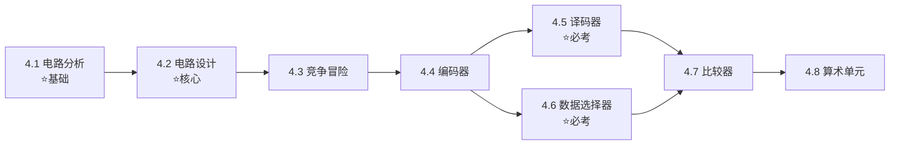

# 第四章：组合逻辑电路

> [!info] 章节概述
> 本章是数字电子技术的**核心章节**，系统讲解组合逻辑电路的分析方法、设计方法，以及典型组合逻辑器件的原理和应用。掌握本章内容对于数字电路设计和822考试至关重要。

> [!tip] 考试重要性
> 本章是822考试**必考章节**，组合逻辑电路分析、设计以及译码器、数据选择器的应用是高频考点！

> [!warning] 822考纲对照
> **大纲要求**：
> 1. 掌握组合逻辑电路的分析方法
> 2. 掌握组合逻辑电路的设计方法
> 3. 掌握竞争-冒险现象及消除方法
> 4. 掌握典型组合逻辑电路的功能和应用
>
> **已标注"⛔ 不考"的内容可跳过学习**

---

## 📚 知识点导航

### 4.1 组合逻辑电路分析
[[考研专业课/数字电子技术/4-组合逻辑电路/01-组合逻辑电路分析|→ 组合逻辑电路分析]]

**核心内容**：
- 组合逻辑电路的定义与特点 ✅
- 分析四步法 ✅
- 波形分析法 ✅

**考试频率**：⭐⭐⭐⭐⭐

---

### 4.2 组合逻辑电路设计
[[考研专业课/数字电子技术/4-组合逻辑电路/02-组合逻辑电路设计|→ 组合逻辑电路设计]]

**核心内容**：
- 设计四步法 ✅
- 单输出电路优化 ✅
- 多输出电路优化（共享乘积项） ✅
- 多级电路优化（提取公因子、函数分解） ✅

**考试频率**：⭐⭐⭐⭐⭐

---

### 4.3 竞争-冒险现象
[[考研专业课/数字电子技术/4-组合逻辑电路/03-竞争与冒险|→ 竞争与冒险]]

**核心内容**：
- 产生原因（门延迟） ✅
- 竞争类型（1型、0型冒险） ✅
- 消除方法 ✅

**考试频率**：⭐⭐⭐

---

### 4.4 编码器 ⭐核心
[[考研专业课/数字电子技术/4-组合逻辑电路/04-编码器|→ 编码器]]

**核心内容**：
- 普通编码器 ✅
- 优先编码器（CD4532） ✅
- 键盘编码应用 ✅

**考试频率**：⭐⭐⭐⭐

---

### 4.5 译码器与数据分配器 ⭐核心
[[考研专业课/数字电子技术/4-组合逻辑电路/05-译码器与数据分配器|→ 译码器与数据分配器]]

**核心内容**：
- 二进制译码器（74LS138） ✅
- 显示译码器 ✅
- 数据分配器 ✅
- 用译码器实现逻辑函数 ⭐必考

**考试频率**：⭐⭐⭐⭐⭐

---

### 4.6 数据选择器 ⭐核心
[[考研专业课/数字电子技术/4-组合逻辑电路/06-数据选择器|→ 数据选择器]]

**核心内容**：
- 2选1、4选1、8选1 MUX ✅
- 74LS151、74LS153 ✅
- 用MUX实现逻辑函数 ⭐必考
- 并行转串行应用 ✅

**考试频率**：⭐⭐⭐⭐⭐

---

### 4.7 数值比较器
[[考研专业课/数字电子技术/4-组合逻辑电路/07-数值比较器|→ 数值比较器]]

**核心内容**：
- 1位比较器 ✅
- 多位比较器 ✅
- 级联扩展 ✅

**考试频率**：⭐⭐⭐

---

### 4.8 算术运算单元
[[考研专业课/数字电子技术/4-组合逻辑电路/08-算术运算单元|→ 算术运算单元]]

**核心内容**：
- 半加器 ✅
- 全加器 ✅
- 多位加法器 ✅
- 减法器 ✅

**考试频率**：⭐⭐⭐⭐

---

## 📝 章节总结
[[考研专业课/数字电子技术/4-组合逻辑电路/📝 章节总结|→ 查看本章总结]]

---

## 🎯 学习路线

**学习建议**：
1. 先掌握**分析和设计的基本方法**，这是后续学习的基础
2. 理解**竞争冒险**产生原因，掌握消除方法
3. **编码器**是典型器件的入门，理解优先级概念
4. **译码器和数据选择器**是必考点，必须掌握用它们实现逻辑函数 ⭐
5. 比较器和算术单元了解基本原理即可

---

## ⚠️ 常见错误

| 错误类型 | 表现 | 避免方法 |
|----------|------|----------|
| 分析步骤跳过 | 直接看图说功能 | 必须写出表达式、化简、列真值表 |
| 设计真值表错误 | 遗漏输入组合或输出错误 | 检查$2^n$行是否完整 |
| 译码器实现函数 | 忘记最小项形式 | $L = \sum m_i \cdot Y_i$，注意低电平有效 |
| MUX实现函数 | 地址端和选择端混淆 | 区分$A_i$（地址）和$D_i$（数据） |
| 竞争冒险判断 | 忽略互补项 | 检查是否有$A \cdot \bar{A}$或$A + \bar{A}$形式 |
| 全加器 | 忘记进位输入 | 全加器有$C_{i-1}$，半加器没有 |

---

## 📊 重点公式速查

### 组合逻辑电路输出表达式

$$L_i = f(A_1, A_2, \dots, A_n) \quad (i = 1, 2, \dots, m)$$

### 格雷码转二进制码

$$\begin{cases}
B_{n-1} = G_{n-1} \\
B_{n-2} = B_{n-1} \oplus G_{n-2} \\
\vdots \\
B_0 = B_1 \oplus G_0
\end{cases}$$

### 二进制码转格雷码

$$\begin{cases}
G_{n-1} = B_{n-1} \\
G_{n-2} = B_{n-1} \oplus B_{n-2} \\
\vdots \\
G_0 = B_1 \oplus B_0
\end{cases}$$

### 译码器输出（74LS138）

$$\bar{Y}_i = \overline{G_1 \cdot G_2 \cdot G_3 \cdot m_i}$$

其中$m_i$为最小项

### 数据选择器输出

$$Y = \sum_{i=0}^{2^n-1} D_i \cdot m_i$$

### 半加器

$$\begin{cases}
S = A \oplus B \\
C = A \cdot B
\end{cases}$$

### 全加器

$$\begin{cases}
S_i = A_i \oplus B_i \oplus C_{i-1} \\
C_i = A_i B_i + A_i C_{i-1} + B_i C_{i-1}
\end{cases}$$

---

## 🔗 知识关联

- **前置知识**：[[考研专业课/数字电子技术/2-逻辑代数与硬件描述语言基础/|第二章：逻辑代数基础]]、[[考研专业课/数字电子技术/3-逻辑门电路/|第三章：逻辑门电路]]
- **本章定位**：掌握组合逻辑电路的分析设计方法，为时序电路学习打基础
- **后续章节**：
  - [[考研专业课/数字电子技术/5-触发器/|第五章：触发器]]
  - [[考研专业课/数字电子技术/6-时序逻辑电路/|第六章：时序逻辑电路]]

---

*创建日期: 2026-03-27*
*最后更新: 2026-03-27*
