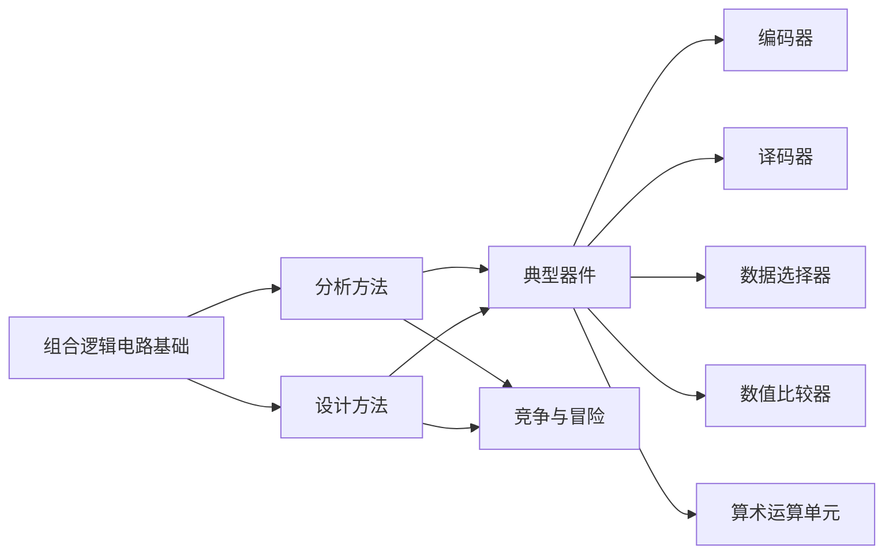

# 第四章：组合逻辑电路 - 章节总结

> [!abstract] 本章定位
> 本章是数字电子技术的核心章节，主线是“分析已有电路”“按需求设计电路”“掌握典型 MSI 组合器件”“识别并消除竞争-冒险”。在 822 复习中，**译码器实现逻辑函数**、**数据选择器实现逻辑函数**、**组合逻辑电路分析/设计四步法**属于高频考点。

---

## 一、章节知识框架

### 1. 基本定义

组合逻辑电路的输出仅取决于**当前输入**，与历史状态无关：

$$L_i = f(A_1, A_2, \dots, A_n) \quad (i = 1, 2, \dots, m)$$

其本质特征有两条：
- 电路中**不含存储元件**
- 输出与输入之间**没有反馈记忆回路**

> [!tip] 一句话区分
> 组合逻辑看“此刻输入”，时序逻辑还要看“原来状态”。

---

## 二、分析与设计两大主线

### 1. 组合逻辑电路分析四步法

适用于“给你逻辑图，问你实现什么功能”。

**核心要点：**
1. 从输入到输出逐级写表达式
2. 用代数法或卡诺图化简
3. 真值表必须写满 $2^n$ 行
4. 最终功能判断以真值表为准

**典型功能识别：**
- 异或链路常对应**奇偶校验**
- 题干若给出电路图，先别急着猜功能，必须先写式子再下结论

### 2. 组合逻辑电路设计四步法

适用于“给你功能描述，问你如何画电路”。

**设计的本质：** 分析的逆过程。

**设计中最容易错的一步：**
- 逻辑抽象阶段对“0/1 的物理意义”定义错误，后续全错

### 3. 优化实现的三类思路

#### 单输出电路
目标是得到最简与-或式或适合某种门电路的表达式：

$$L = AB + CD = \overline{\overline{AB} \cdot \overline{CD}}$$

#### 多输出电路
重点是**共享乘积项**，减少门的个数。

#### 多级逻辑电路
通过**提取公因子**、**函数分解**降低扇入数，但会增加级数与延迟。

> [!warning] 设计权衡
> 两级电路速度快，多级电路门输入少；考试题常要求你同时考虑“是否最简”和“是否便于实现”。

---

## 三、竞争与冒险

### 1. 基本概念

- **竞争**：两个互相关联的信号本应同时变化，但因门延迟不同而出现先后
- **冒险**：由于竞争造成输出端出现错误窄脉冲（毛刺）

核心关系：**竞争是因，冒险是果。**

### 2. 判断依据

若逻辑表达式在某些输入条件下可化为：

$$A \cdot \bar{A}$$

或

$$A + \bar{A}$$

则可能存在冒险。

卡诺图上如果两个相邻的 1 没有被同一个圈覆盖，也意味着可能有静态 1 冒险。

### 3. 消除方法

#### 方法一：消去互补项
例如：

$$F = (A+B)(\bar{A}+C) = AC + \bar{A}B + BC$$

消去互补相乘项后，可从根本上消险。

#### 方法二：增加冗余项（最常用）
例如：

$$L = AC + B\bar{C}$$

当 $A=B=1$ 时有：

$$L = C + \bar{C}$$

增加冗余项 $AB$ 后：

$$L = AC + B\bar{C} + AB$$

可消除毛刺。

#### 方法三：输出端并联电容
适合低速电路，原理是滤波，但会使边沿变缓。

> [!important] 本章最常考的竞争-冒险处理方法
> **卡诺图找缝隙 + 增加冗余项桥接相邻圈。**

---

## 四、典型组合逻辑器件总结

## 4.1 编码器

### 1. 基本概念

编码器完成“输入信号编号 -> 二进制代码”的转换。

- 普通编码器：任意时刻只允许一个输入有效
- 优先编码器：允许多个输入同时有效，但只编码**优先级最高**者

### 2. 重点器件：74HC148 / 74LS148

8 线-3 线优先编码器，特点：
- 输入低电平有效
- 输出为反码
- 下标越大，优先级越高

**高频考点：**
- 附加端状态判断
- 级联扩展
- 正负逻辑转换

### 3. 附加端状态速记

| 状态 | $S'$ | $Y'_S$ | $Y'_{EX}$ | 含义 |
|------|------|--------|-----------|------|
| 禁用 | 1 | 1 | 1 | 芯片关闭 |
| 待机 | 0 | 0 | 1 | 无有效输入 |
| 编码 | 0 | 1 | 0 | 正在编码 |

### 4. 经典应用：两片 74HC148 组成 16-4 编码器

关键思路：
- 高位片处理高优先级输入
- 高位片 $Y'_S$ 控制低位片 $S'$
- 低 3 位输出需做正负逻辑变换
- 最高位可由 $Y'_{EX}$ 取反得到

> [!tip] 编码器扩展口诀
> 高位片常开，$Y'_S$ 控低位片；低有效求“或”，优先想到与非门。

---

## 4.2 译码器

### 1. 基本概念

译码器是编码器的逆过程：

- 输入 $n$ 位二进制码
- 输出 $2^n$ 个译码结果
- 任意时刻通常只有一个输出有效

### 2. 重点器件：74HC138

74HC138 是 3 线-8 线译码器，输出低电平有效。

使能条件必须满足：

$$G_1 = 1, \quad \bar{G}_{2A} = 0, \quad \bar{G}_{2B} = 0$$

即口诀：**一高两低**。

### 3. 输出表达式

$$\bar{Y}_i = \overline{G_1 \cdot \overline{G_{2A}} \cdot \overline{G_{2B}} \cdot m_i}$$

本质上，74HC138 的每个输出端都对应一个**最小项的反变量**。

### 4. 必考：用译码器实现逻辑函数

若目标函数为：

$$F = \sum m(i_1, i_2, \dots)$$

则把对应的低有效输出端接入**与非门**即可，因为：

$$\overline{\bar{m}_{i_1} \cdot \bar{m}_{i_2} \cdots} = m_{i_1} + m_{i_2} + \cdots$$

**万能三步法：**
1. 化成最小项之和
2. 使能端接成“一高两低”，变量按高低位接地址端
3. 对应输出端接与非门汇总

### 5. 级联扩展：两片 74HC138 组成 4-16 译码器

设计核心：
- 低 3 位并联接入两片的地址端
- 最高位作为片选信号
- 可用“需非门方案”或“利用使能极性免非门方案”

### 6. 使能端的高级用法

使能端不仅用于级联，还可：
- 作为**动态选通端**，在输入稳定后开放输出，减小毛刺
- 作为**降维控制端**，实现用 3-8 译码器处理 4 变量函数

> [!important] 译码器本章总纲
> **译码器 = 最小项发生器。** 一切实现题都围绕这句话展开。

---

## 4.3 数据选择器（MUX）

### 1. 基本概念

数据选择器从多路输入中选一路送到输出端，其一般表达式为：

$$Y = \sum_{i=0}^{2^n-1} D_i \cdot m_i$$

其中 $m_i$ 为地址变量形成的最小项。

### 2. 常见器件

- 74HC153 / 74LS153：双 4 选 1，地址端共用，使能端独立
- 74LS151：8 选 1，既有原码输出也有反码输出

### 3. 必考：用 MUX 实现逻辑函数

#### 真值表法
适用于“$2^n$ 选 1 实现 $n$ 变量函数”：
- 变量接地址端
- 真值表输出直接填到各个 $D_i$

#### 代数展开法 / 降维法
适用于“用较小 MUX 实现更多变量函数”：
- 选 $n-1$ 个变量接地址端
- 剩余变量作数据端系数
- 将函数展开到标准 MUX 方程上逐项对应

### 4. 级联扩展

以 74HC153 构造 8 选 1 为例：
- 低两位共用地址端
- 高位经互补控制两个使能端
- 两个输出再相或得到总输出

> [!tip] MUX 口诀
> 低位共用接地址，高位反相接使能，输出或门得最终。

### 5. MUX 与译码器对比

| 比较项 | 译码器 | 数据选择器 |
|--------|--------|------------|
| 实现函数方式 | 最小项输出后外接门合成 | 数据端直接写系数 |
| 降维能力 | 较弱 | 强 |
| 多输出场景 | 更合适 | 每个函数常需单独器件 |

---

## 4.4 数值比较器

### 1. 基本任务

对两个二进制数比较大小，输出三种互斥关系：
- $A > B$
- $A = B$
- $A < B$

### 2. 1 位比较器核心表达式

$$Y_{A>B} = A\bar{B}$$

$$Y_{A=B} = \bar{A}\bar{B} + AB = \overline{A \oplus B}$$

$$Y_{A<B} = \bar{A}B$$

### 3. 多位比较原则

从高位到低位逐位比较：
- 高位先决定大小
- 高位相等时，比较低位

### 4. 重点器件：74LS85

74LS85 是 4 位比较器，可级联扩展。

级联公式：

$$Y_{A>B} = (A>B) + (A=B) \cdot I_{A>B}$$

$$Y_{A=B} = (A=B) \cdot I_{A=B}$$

$$Y_{A<B} = (A<B) + (A=B) \cdot I_{A<B}$$

单片使用时，最低位片应固定：
- $I_{A>B}=0$
- $I_{A=B}=1$
- $I_{A<B}=0$

> [!warning] 高频小坑
> 74LS85 做级联题时最容易错的不是表达式，而是**最低位片初始化输入**。

---

## 4.5 算术运算单元

### 1. 半加器

半加器处理两个 1 位输入：

$$S = A \oplus B$$

$$C = A \cdot B$$

其中：
- 和是异或
- 进位是与

### 2. 全加器

全加器比半加器多一个低位进位输入：

$$S = A \oplus B \oplus C_{i-1}$$

$$C_i = AB + AC_{i-1} + BC_{i-1} = AB + (A \oplus B)C_{i-1}$$

其本质规律：
- 输入中有奇数个 1，则和位为 1
- 输入中至少有两个 1，则进位为 1

### 3. 多位加法器

#### 行波进位加法器（RCA）
- 结构简单
- 进位逐级传递
- 延迟大

#### 超前进位加法器（CLA）
引入：

$$G_i = A_iB_i, \quad P_i = A_i \oplus B_i$$

满足：

$$C_i = G_i + P_iC_{i-1}$$

通过提前并行展开各位进位，显著提高速度。

### 4. 重点器件：74HC283

74HC283 是四位超前进位加法器，掌握：
- 两组 4 位输入
- 一个低位进位输入 $CI$
- 4 位和输出
- 一个进位输出 $CO$

### 5. 减法实现

加法器实现减法的标准方法：

$$A - B = A + \bar{B} + 1$$

> [!important] 算术单元的复习主线
> 半加器是起点，全加器是核心，多位加法器是应用，补码减法是综合题落点。

---

## 五、本章核心公式速查

### 1. 组合逻辑电路描述式

$$L_i = f(A_1, A_2, \dots, A_n)$$

### 2. 格雷码与二进制码转换

$$\begin{cases}
B_{n-1} = G_{n-1} \\
B_{n-2} = B_{n-1} \oplus G_{n-2} \\
\vdots \\
B_0 = B_1 \oplus G_0
\end{cases}$$

$$\begin{cases}
G_{n-1} = B_{n-1} \\
G_{n-2} = B_{n-1} \oplus B_{n-2} \\
\vdots \\
G_0 = B_1 \oplus B_0
\end{cases}$$

### 3. 74HC138 输出表达式

$$\bar{Y}_i = \overline{G_1 \cdot \overline{G_{2A}} \cdot \overline{G_{2B}} \cdot m_i}$$

### 4. 数据选择器输出式

$$Y = \sum_{i=0}^{2^n-1} D_i \cdot m_i$$

### 5. 半加器

$$\begin{cases}
S = A \oplus B \\
C = A \cdot B
\end{cases}$$

### 6. 全加器

$$\begin{cases}
S_i = A_i \oplus B_i \oplus C_{i-1} \\
C_i = A_iB_i + A_iC_{i-1} + B_iC_{i-1}
\end{cases}$$

---

## 六、考试高频题型与解题模板

### 1. 电路分析题

模板：
- 写表达式
- 化简
- 列真值表
- 判断功能

### 2. 电路设计题

模板：
- 明确输入输出及 0/1 含义
- 列真值表
- 写标准式并化简
- 画电路

### 3. 译码器实现函数题

模板：
- 化为最小项之和
- 变量按高低位接地址端
- 低有效输出接与非门

### 4. MUX 实现函数题

模板：
- 先定地址变量
- 其余变量或常量接数据端
- 对照 MUX 标准输出式确定 $D_i$

### 5. 竞争-冒险题

模板：
- 看是否可化为 $A\bar{A}$ 或 $A+\bar{A}$
- 卡诺图找未缝合相邻圈
- 增加冗余项或改写结构

### 6. 级联扩展题

模板：
- 高位作片选 / 控制
- 低位作组内地址
- 明确器件的使能极性

---

## 七、易错点总表

| 易错点 | 错误表现 | 正确做法 |
|--------|----------|----------|
| 分析题跳步 | 直接猜电路功能 | 必须按“表达式→真值表→功能”走 |
| 设计题抽象错误 | 0/1 含义定义错 | 先写清每个变量的物理意义 |
| 译码器实现函数 | 低电平有效却接或门 | 低有效求和用与非门 |
| 74HC138 使能端 | 忘记“一高两低” | 先检查芯片是否真正工作 |
| MUX 实现函数 | 地址端和数据端混淆 | 地址负责选路，数据负责写值 |
| 优先编码器 | 忘记输出是反码 | 先判断是原码还是反码 |
| 比较器级联 | 级联输入初始化接错 | 最低位片固定接 0,1,0 |
| 全加器/半加器 | 忘记进位输入 | 全加器 3 输入，半加器 2 输入 |
| 竞争-冒险 | 只会判断不会消除 | 学会加冗余项桥接卡诺圈 |

---

## 八、复习优先级建议

### 第一优先级：必须拿下
- 组合逻辑电路分析四步法
- 组合逻辑电路设计四步法
- 74HC138 的功能、级联与实现逻辑函数
- 数据选择器实现逻辑函数
- 全加器与多位加法器

### 第二优先级：必须会判断
- 竞争与冒险的成因、判定与消除
- 优先编码器的状态判断与级联
- 数值比较器的级联规则

### 第三优先级：易出综合题
- 译码器与 MUX 的对比选型
- 用使能端做降维、做选通、做扩展
- 典型器件之间的共通思路：**高位片选，低位寻址，低有效求和用与非**

---

## 九、知识关联

- **前置基础**：逻辑代数、最小项与最大项、卡诺图、逻辑门电路
- **本章作用**：从“基本逻辑表达式”过渡到“MSI 组合器件与系统设计”
- **后续衔接**：本章的方法和器件思想会直接进入触发器与时序逻辑电路的学习

> [!summary] 本章一句话收束
> 这一章真正要掌握的，不只是几个芯片，而是统一的方法论：**分析靠真值表，设计靠最小项，实现靠器件特性，优化要同时考虑门数、延迟和冒险。**
