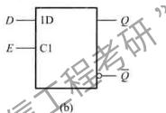

# D锁存器

> [!warning] 822考纲对照
> **大纲要求**：理解D锁存器的工作原理
>
> **考试频率**：⭐⭐

---

## 1. 基本概念

> [!info] 定义
> D锁存器是一种只有**置0**和**置1**功能的锁存器，消除了SR锁存器的非定义状态，工作中不存在约束条件。

### D锁存器特点
- 两个输入端：数据端D和使能端E
- **无约束条件**（不需要$SR=0$）
- 当E=1时，输出跟随输入D变化
- 当E=0时，输出保持E下降沿前的状态

---

## 2. 传输门控D锁存器

### 电路结构

在基本双稳态电路中插入两个传输门：

```
        TG1
D ─────/ ─────┐
              │
         ┌────┴────┐
         │  G1  G2 │
         │         │
         └────┬────┘
              │
        TG2   │
    ────/ ────┘
    │
   E (使能信号)
```

### 工作原理

| E | TG1 | TG2 | 功能 |
|---|-----|-----|------|
| 1 | 导通 | 断开 | Q跟随D |
| 0 | 断开 | 导通 | Q保持 |

> [!tip] 透明特性
> 当E=1时，Q端**透明**地跟随D端变化，因此又称**透明锁存器**

---

## 3. 功能表

| E | D | Q | $\bar{Q}$ | 功能 |
|---|---|---|-----------|------|
| 0 | × | 不变 | 不变 | **保持** |
| 1 | 0 | 0 | 1 | **置0** |
| 1 | 1 | 1 | 0 | **置1** |

### 特性方程

当E=1时：
$$Q = D$$

---

## 4. 逻辑符号



- C1：控制关联，E信号控制D输入

## 5. 与D触发器的区别

| 特性 | D锁存器 | D触发器 |
|------|---------|---------|
| 敏感信号 | **电平敏感** | **边沿敏感** |
| 状态更新 | E=1期间持续更新 | 仅在CP边沿更新 |
| 透明性 | E=1时透明 | 不透明 |
| 抗干扰 | 较弱 | 较强 |

> [!danger] 常见混淆
> - **锁存器**：电平敏感，E=1期间Q随D变
> - **触发器**：边沿敏感，仅在触发沿瞬间采样D

*创建日期: 2026-03-27*
*最后更新: 2026-03-27*
