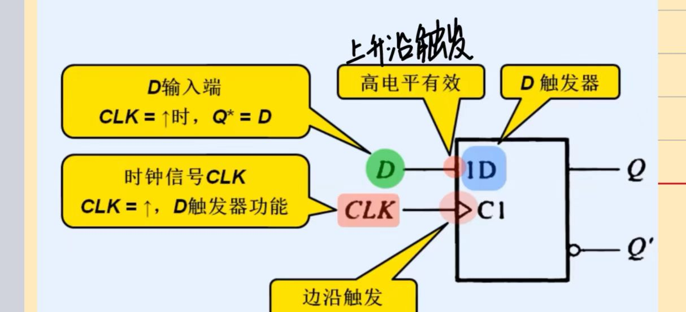

# D触发器

> [!warning] 822考纲对照
> **大纲要求**：熟练掌握D触发器的特性方程，能根据特性方程画出输出波形
>
> **考试频率**：⭐⭐⭐⭐⭐ 必考

---

## 1. 基本概念

> [!info] 定义
> D触发器是一种具有**置0**和**置1**功能的触发器，其输出状态在时钟脉冲边沿到来后等于D端的输入值。

### 触发器特点
- 具有两个稳定状态（0状态和1状态）
- 在时钟脉冲**上升沿**（或下降沿）触发
- 具有记忆功能：状态一旦确定，就能自行保持
- 输出状态由时钟边沿到来前瞬间的D信号决定

### 与锁存器的区别
| 特性 | 锁存器 | 触发器 |
|------|--------|--------|
| 敏感信号 | **电平敏感** | **边沿敏感** |
| 状态更新 | E=1期间持续更新 | 仅在边沿瞬间更新 |
| 抗干扰 | 较弱 | 较强 |

---

## 2. 特性表

> [!info] D触发器特性表
> 描述输入信号D、现态$Q^n$与次态$Q^{n+1}$之间逻辑关系的真值表。

| D | $Q^n$ | $Q^{n+1}$ | 功能说明 |
|---|-------|-----------|----------|
| 0 | 0 | 0 | 置0 |
| 0 | 1 | 0 | 置0 |
| 1 | 0 | 1 | 置1 |
| 1 | 1 | 1 | 置1 |

> [!tip] 记忆技巧
> 无论现态是什么，次态**始终等于D**！

---

## 3. 特性方程 ⭐核心

$$Q^{n+1} = D$$

> [!tip] 理解
> - $Q^n$：时钟边沿到来前的状态（现态）
> - $Q^{n+1}$：时钟边沿到来后的状态（次态）
> - D：数据输入端
> - **次态等于D，与现态无关**

---

## 4. 状态图

```
        D=0          D=1
     ┌──────┐     ┌──────┐
     │      ↓     │      ↓
   ┌─┴─┐         ┌─┴─┐
   │ 0 │◄────────│ 1 │
   └─┬─┘  D=0    └─┬─┘
     │      ┌──────┘
     └──────┘ D=1
```

> [!info] 状态图说明
> - 圆圈表示触发器的两个状态（0和1）
> - 带箭头的方向线表示状态转换方向
> - 方向线旁的数字表示转换条件（D的值）

### 状态转换规律
| 现态 | D值 | 次态 | 说明 |
|------|-----|------|------|
| 0 | 0 | 0 | 保持0 |
| 0 | 1 | 1 | 0→1 |
| 1 | 0 | 0 | 1→0 |
| 1 | 1 | 1 | 保持1 |

---

## 5. 逻辑符号




