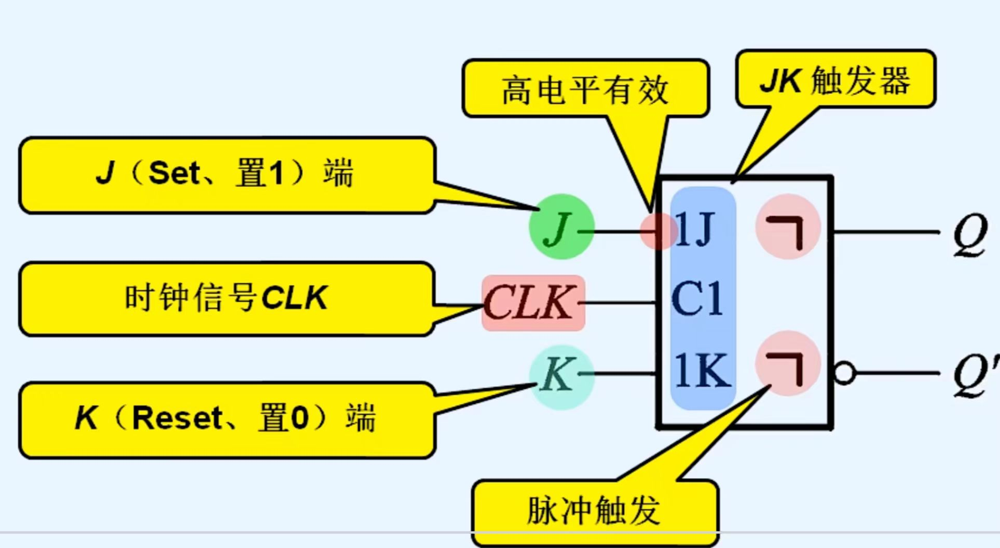
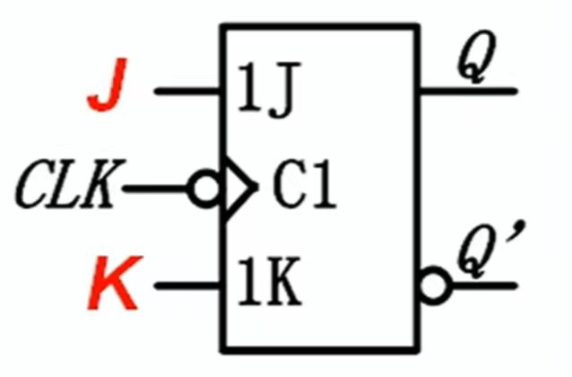

# JK触发器

> [!warning] 822考纲对照
> **大纲要求**：熟练掌握JK触发器的特性方程，能根据特性方程画出输出波形
>
> **考试频率**：⭐⭐⭐⭐⭐ 必考

---

## 1. 基本概念

> [!info] 定义
> JK触发器是**功能最强大**的触发器，具有**保持、置0、置1、翻转**四种功能，且没有约束条件。

### JK触发器特点
- 两个输入端：J（置1端）和K（置0端）
- 无约束条件（J=K=1是允许的）
- 在所有触发器中逻辑功能最强
- 可转换为其他任意功能的触发器

---

## 2. 特性表 ⭐核心

> [!info] JK触发器特性表

| J | K | $Q^n$ | $Q^{n+1}$ | 功能说明 |
|---|---|-------|-----------|----------|
| 0 | 0 | 0 | 0 | **保持** |
| 0 | 0 | 1 | 1 | **保持** |
| 0 | 1 | 0 | 0 | **置0** |
| 0 | 1 | 1 | 0 | **置0** |
| 1 | 0 | 0 | 1 | **置1** |
| 1 | 0 | 1 | 1 | **置1** |
| 1 | 1 | 0 | 1 | **翻转** |
| 1 | 1 | 1 | 0 | **翻转** |

### 功能总结表（简化版）

| J | K | $Q^{n+1}$ | 功能 |
|---|---|-----------|------|
| 0 | 0 | $Q^n$ | 保持 |
| 0 | 1 | 0 | 置0 |
| 1 | 0 | 1 | 置1 |
| 1 | 1 | $\bar{Q}^n$ | 翻转 |

> [!tip] 记忆口诀
> - **J=K=0**：保持不变
> - **J=0, K=1**：K（Kill）置0
> - **J=1, K=0**：J（Jump）置1
> - **J=K=1**：翻转（Toggle）

---

## 3. 特性方程 ⭐核心

$$Q^{n+1} = J\bar{Q}^n + \bar{K}Q^n$$

### 特性方程推导

从特性表写出最小项表达式：

$$Q^{n+1} = J\bar{Q}^n\bar{K} + J\bar{Q}^nK + \bar{J}Q^n\bar{K} + JQ^n\bar{K}$$

化简：

$$\begin{aligned}
Q^{n+1} &= J\bar{Q}^n(\bar{K} + K) + Q^n\bar{K}(\bar{J} + J) \\
&= J\bar{Q}^n \cdot 1 + Q^n\bar{K} \cdot 1 \\
&= J\bar{Q}^n + \bar{K}Q^n
\end{aligned}$$

> [!tip] 理解技巧
> - $J\bar{Q}^n$：当现态为0且J=1时，次态变1
> - $\bar{K}Q^n$：当现态为1且K=0时，次态保持1

---

## 4. 状态图

```
              J=1, K=0
         ┌───────────────┐
         │               ↓
       ┌─┴─┐           ┌─┴─┐
       │ 0 │           │ 1 │
       └─┬─┘           └─┬─┘
         │   J=0, K=1    │
         └───────────────┘

    J=0, K=× (保持0)    J=×, K=0 (保持1)
    J=1, K=× (0→1)      J=×, K=1 (1→0)
```

### 状态转换条件

| 转换 | 条件 | 简化条件 |
|------|------|----------|
| 0→0 | J=0, K=0 或 J=0, K=1 | J=0, K=× |
| 0→1 | J=1, K=0 或 J=1, K=1 | J=1, K=× |
| 1→0 | J=0, K=1 或 J=1, K=1 | J=×, K=1 |
| 1→1 | J=0, K=0 或 J=1, K=0 | J=×, K=0 |

> [!tip] 状态图简化记忆
> - 从0出发：J决定去向（J=0保持，J=1翻到1）
> - 从1出发：K决定去向（K=0保持，K=1翻到0）
> - **×表示无关项**

---

## 5. 逻辑符号

### 5.1 主从结构JK触发器



### 5.2 边沿触发器



---

## 6. 四种工作模式

### 6.1 保持模式（J=K=0）

$$Q^{n+1} = 0 \cdot \bar{Q}^n + 1 \cdot Q^n = Q^n$$

- 输出状态保持不变
- 相当于存储1位数据

### 6.2 置0模式（J=0, K=1）

$$Q^{n+1} = 0 \cdot \bar{Q}^n + 0 \cdot Q^n = 0$$

- 无论现态如何，次态必为0

### 6.3 置1模式（J=1, K=0）

$$Q^{n+1} = 1 \cdot \bar{Q}^n + 1 \cdot Q^n = 1$$

- 无论现态如何，次态必为1

### 6.4 翻转模式（J=K=1）⭐重要

$$Q^{n+1} = 1 \cdot \bar{Q}^n + 0 \cdot Q^n = \bar{Q}^n$$

- 每来一个时钟脉冲，状态翻转一次
- **计数工作状态**：可用于计数器
- **二分频**：Q端频率是CP频率的一半

> [!example] 计数应用
> 当J=K=1时：
> - CP：010101010101
> - Q：0→1→0→1→0→1
> - Q频率 = CP频率 ÷ 2

---

## 7. 与D触发器的对比

| 特性 | D触发器 | JK触发器 |
|------|---------|----------|
| 输入端 | 1个（D） | 2个（J、K） |
| 功能数 | 2种（置0、置1） | 4种（保持、置0、置1、翻转） |
| 特性方程 | $Q^{n+1}=D$ | $Q^{n+1}=J\bar{Q}^n+\bar{K}Q^n$ |
| 约束条件 | 无 | 无 |
| 计数功能 | 需外接电路 | J=K=1即可 |
| 应用 | 数据存储 | 计数器、通用时序电路 |

---

## 8. 典型例题

> [!example] 例1：基本波形分析
> 设下降沿触发JK触发器的初始状态$Q=0$，CP、J、K的波形已知，画出Q端波形。

**分析方法**：
1. 找出CP的**所有下降沿**时刻
2. 确定每个下降沿**前瞬间**J、K的值
3. 根据特性表/特性方程确定次态
4. 特别注意J=K=1时的翻转

> [!example] 例2：计数器应用
> 将JK触发器的J、K端都接高电平（J=K=1），构成T'触发器：
> - 每来一个CP脉冲，Q翻转一次
> - 实现二分频功能
> - Q输出方波频率 = CP频率 ÷ 2

---

## 9. 常见错误

> [!danger] 错误警示

| 错误类型 | 表现 | 纠正方法 |
|----------|------|----------|
| 触发沿判断错误 | 上升沿/下降沿混淆 | 看清逻辑符号中的小圆圈 |
| J=K=1处理错误 | 以为是禁止状态 | J=K=1是翻转，不是禁止 |
| 保持条件记错 | J=K=0时以为翻转 | J=K=0保持，J=K=1翻转 |
| 忘记检查初态 | 初态影响第一拍 | 题目未给则假设Q=0 |

---

## 🔗 知识关联

- **前置知识**：[[05-D触发器|D触发器]]
- **相关内容**：[[07-T触发器与T'触发器|T触发器]]、[[09-触发器逻辑功能转换|功能转换]]
- **应用章节**：[[考研专业课/数字电子技术/6-时序逻辑电路/|第六章：时序逻辑电路]]

---

## 📝 个人笔记

> [!personal] 学习心得
> （此处记录个人理解和易错点）


*创建日期: 2026-03-27*
*最后更新: 2026-03-27*
