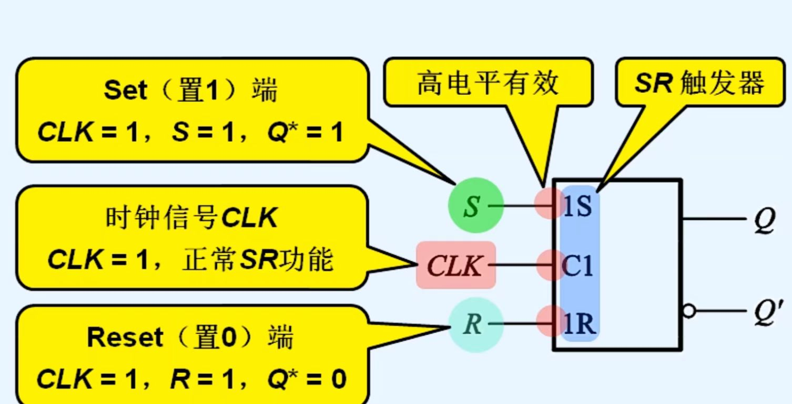

# SR触发器

> [!warning] 822考纲对照
> **大纲要求**：了解SR触发器的特性方程及约束条件
>
> **考试频率**：⭐⭐

---

## 1. 基本概念

> [!info] 定义
> SR触发器是仅有**置位**和**复位**功能的触发器，与SR锁存器功能相同，但采用边沿触发方式。

### SR触发器特点
- 两个输入端：S（置位端）和R（复位端）
- 具有保持、置0、置1三种功能
- **有约束条件**：$SR = 0$

---

## 2. 特性表

| S | R | $Q^n$ | $Q^{n+1}$ | 功能 |
|---|---|-------|-----------|------|
| 0 | 0 | 0 | 0 | **保持** |
| 0 | 0 | 1 | 1 | **保持** |
| 0 | 1 | 0 | 0 | **置0** |
| 0 | 1 | 1 | 0 | **置0** |
| 1 | 0 | 0 | 1 | **置1** |
| 1 | 0 | 1 | 1 | **置1** |
| 1 | 1 | 0 | 不确定 | **禁止** |
| 1 | 1 | 1 | 不确定 | **禁止** |

---

## 3. 特性方程

$$\left\{ \begin{array}{l}
Q^{n+1} = S + \bar{R}Q^n \\
SR = 0 \quad (\text{约束条件})
\end{array} \right.$$

> [!danger] 约束条件
> **$SR = 0$**：即S和R不能同时为1！

---

## 4. 状态图

```
        S=0,R=0       S=1,R=0
     ┌──────────┐  ┌──────────┐
     │          ↓  │          ↓
   ┌─┴─┐          ┌─┴─┐
   │ 0 │◄─────────│ 1 │
   └─┬─┘  S=0,R=1 └─┬─┘
     │      ┌────────┘
     └──────┘ S=1,R=0
```

---

## 5. 与JK触发器对比

| 特性 | SR触发器 | JK触发器 |
|------|----------|----------|
| 输入端 | S、R | J、K |
| 约束条件 | **有**（$SR=0$） | **无** |
| S=R=1 | 禁止状态 | 翻转功能 |
| 功能数 | 3种 | 4种 |

> [!tip] 记忆
> JK触发器是SR触发器的改进版：
> - J对应S（置1）
> - K对应R（置0）
> - J=K=1时实现翻转（SR触发器禁止）

---

## 6. 逻辑符号



---

## 7. 为什么使用较少

> [!info] 原因
> 1. **有约束条件**，使用不便
> 2. **功能不如JK触发器完整**（无翻转功能）
> 3. 集成芯片产品少

在实际应用中，D触发器和JK触发器更为常用。

---

## 🔗 知识关联

- **前置知识**：[[02-SR锁存器（基本 RS 触发器和同步 RS 触发器）|SR锁存器]]
- **对比学习**：[[06-JK触发器|JK触发器]]

---

## 📝 个人笔记

> [!personal] 学习心得
> （此处记录个人理解和易错点）


*创建日期: 2026-03-27*
*最后更新: 2026-03-27*
