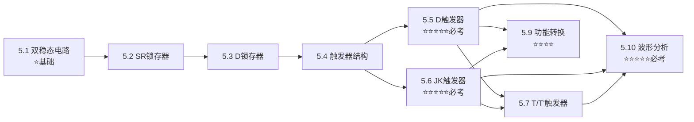

# 第五章：锁存器和触发器

> [!info] 章节概述
> 本章是数字电子技术的**核心章节**，系统讲解锁存器和触发器的电路结构、工作原理及逻辑功能。触发器是构成时序逻辑电路的基本单元，掌握本章内容对于822考试至关重要。

> [!tip] 考试重要性
> 本章是822考试**必考章节**，D触发器、JK触发器的特性方程和波形分析是高频考点！

> [!warning] 822考纲对照
> **大纲要求**：
> 1. 掌握触发器的概念和特点
> 2. **熟练掌握D触发器的特性方程**：$Q^{n+1}=D$
> 3. **熟练掌握JK触发器的特性方程**：$Q^{n+1}=J\bar{Q}^n+\bar{K}Q^n$
> 4. 掌握T触发器和T'触发器的特性方程
> 5. 掌握RS触发器的特性方程及约束条件
> 6. **能根据特性方程熟练画出输出波形**
>
> **已标注"⛔ 不考"的内容可跳过学习**

---

## 📚 知识点导航

### 5.1 基本双稳态电路
[[考研专业课/数字电子技术/5-锁存器和触发器/01-基本双稳态电路|→ 基本双稳态电路]]

**核心内容**：
- 双稳态电路的定义 ✅
- 两个稳定状态（0和1） ✅
- 存储功能原理 ✅

**考试频率**：⭐

---

### 5.2 SR锁存器
[[02-SR锁存器（基本 RS 触发器和同步 RS 触发器）|→ SR锁存器]]

**核心内容**：
- 基本SR锁存器（或非门、与非门构成） ✅
- 功能表、约束条件$SR=0$ ✅
- 门控SR锁存器 ✅
- 去抖动电路应用 ✅

**考试频率**：⭐⭐

**⛔ 不考**：CMOS晶体管级电路细节

---

### 5.3 D锁存器
[[考研专业课/数字电子技术/5-锁存器和触发器/03-D锁存器|→ D锁存器]]

**核心内容**：
- 传输门控D锁存器 ✅
- 逻辑门控D锁存器 ✅
- 透明锁存器特性 ✅
- 定时参数（$t_{SU}$、$t_H$、$t_w$） ✅

**考试频率**：⭐⭐

---

### 5.4 触发器的电路结构
[[考研专业课/数字电子技术/5-锁存器和触发器/04-触发器的电路结构|→ 触发器的电路结构]]

**核心内容**：
- 锁存器vs触发器（电平敏感vs边沿敏感） ✅
- 主从D触发器 ✅
- 维持阻塞触发器 ✅
- 利用传输延迟的触发器 ✅
- 上升沿vs下降沿触发 ✅

**考试频率**：⭐⭐

**⛔ 不考**：详细电路分析

---

### 5.5 D触发器 ⭐核心
[[考研专业课/数字电子技术/5-锁存器和触发器/05-D触发器|→ D触发器]]

**核心内容**：
- 特性表 ✅
- **特性方程**：$Q^{n+1}=D$ ⭐必考
- 状态图 ✅
- 异步置位/复位端 ✅
- 动态特性参数 ✅

**考试频率**：⭐⭐⭐⭐⭐ **必考**

---

### 5.6 JK触发器 ⭐核心
[[考研专业课/数字电子技术/5-锁存器和触发器/06-JK触发器|→ JK触发器]]

**核心内容**：
- 特性表 ✅
- **特性方程**：$Q^{n+1}=J\bar{Q}^n+\bar{K}Q^n$ ⭐必考
- 状态图 ✅
- 四种功能：保持、置0、置1、翻转 ✅
- 计数工作状态（J=K=1） ✅

**考试频率**：⭐⭐⭐⭐⭐ **必考**

---

### 5.7 T触发器与T'触发器
[[考研专业课/数字电子技术/5-锁存器和触发器/07-T触发器与T'触发器|→ T触发器与T'触发器]]

**核心内容**：
- T触发器特性方程：$Q^{n+1}=T\bar{Q}^n+\bar{T}Q^n$ ✅
- T'触发器特性方程：$Q^{n+1}=\bar{Q}^n$ ✅
- 用JK触发器构成T/T'触发器 ✅
- 用D触发器构成T/T'触发器 ✅

**考试频率**：⭐⭐⭐

---

### 5.8 SR触发器
[[08-SR触发器（主从SR触发器）|→ SR触发器]]

**核心内容**：
- 特性表、特性方程 ✅
- 约束条件：$SR=0$ ✅

**考试频率**：⭐⭐

---

### 5.9 触发器逻辑功能转换 ⭐常考
[[考研专业课/数字电子技术/5-锁存器和触发器/09-触发器逻辑功能转换|→ 触发器逻辑功能转换]]

**核心内容**：
- D触发器 → JK触发器 ⭐
- D触发器 → T触发器 ⭐
- D触发器 → T'触发器 ⭐
- JK触发器 → T/T'触发器 ✅

**考试频率**：⭐⭐⭐⭐ **常考**

---

### 5.10 触发器波形分析 ⭐必考
[[考研专业课/数字电子技术/5-锁存器和触发器/10-触发器波形分析|→ 触发器波形分析]]

**核心内容**：
- 波形分析四步法 ✅
- D触发器波形例题 ⭐
- JK触发器波形例题 ⭐
- 带异步控制的波形分析 ⭐
- 综合练习题 ✅

**考试频率**：⭐⭐⭐⭐⭐ **必考**

---

## 📝 章节总结
[[考研专业课/数字电子技术/5-锁存器和触发器/📝 章节总结|→ 查看本章总结]]

---

## 🎯 学习路线

**学习建议**：
1. 先理解**双稳态电路**和**锁存器**的基本原理
2. 重点掌握**D触发器**和**JK触发器**的特性方程 ⭐
3. 理解**触发器电路结构**的边沿触发特点
4. **波形分析**是必考题型，多做练习 ⭐
5. **功能转换**常考，掌握转换方法

---

## ⚠️ 常见错误

| 错误类型 | 表现 | 避免方法 |
|----------|------|----------|
| 锁存器/触发器混淆 | 电平敏感/边沿敏感不分 | 记住：锁存器电平，触发器边沿 |
| 触发沿判断错误 | 上升沿画成下降沿 | 仔细看逻辑符号的小圆圈 |
| J=K=1处理错误 | 以为是禁止状态 | J=K=1是**翻转**，不是禁止 |
| 波形分析读值错误 | 看了触发沿后的值 | 必须看**前瞬间**的值 |
| 忘记异步信号 | 忽略$\bar{S}_D/\bar{R}_D$ | 先处理异步信号，优先级最高 |
| SR约束条件遗漏 | S=R=1时认为有确定状态 | SR触发器/锁存器必须满足$SR=0$ |

---

## 📊 重点公式速查

### D触发器
$$Q^{n+1} = D$$

### JK触发器
$$Q^{n+1} = J\bar{Q}^n + \bar{K}Q^n$$

### T触发器
$$Q^{n+1} = T\bar{Q}^n + \bar{T}Q^n = T \oplus Q^n$$

### T'触发器
$$Q^{n+1} = \bar{Q}^n$$

### SR触发器
$$\left\{ \begin{array}{l} Q^{n+1} = S + \bar{R}Q^n \\ SR = 0 \quad (\text{约束条件}) \end{array} \right.$$

### 功能转换

| 已有 \ 目标 | D | JK | T | T' |
|-------------|---|-----|---|-----|
| **D** | - | $D=J\bar{Q}+\bar{K}Q$ | $D=T \oplus Q$ | $D=\bar{Q}$ |
| **JK** | $J=D, K=\bar{D}$ | - | $J=K=T$ | $J=K=1$ |

---

## 🔗 知识关联

- **前置知识**：[[考研专业课/数字电子技术/3-逻辑门电路/|第三章：逻辑门电路]]、[[考研专业课/数字电子技术/4-组合逻辑电路/|第四章：组合逻辑电路]]
- **本章定位**：触发器是时序逻辑电路的基本存储单元
- **后续章节**：[[考研专业课/数字电子技术/6-时序逻辑电路/|第六章：时序逻辑电路]]

---

## 📈 学习进度

[[考研专业课/数字电子技术/5-锁存器和触发器/📊 学习进度|→ 查看学习进度]]

---

*创建日期: 2026-03-27*
*最后更新: 2026-03-27*
