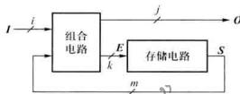
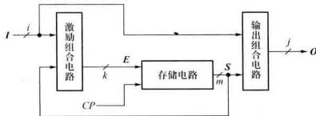
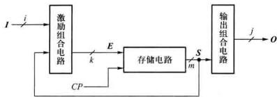

# 01 时序逻辑电路基本概念

## 一、时序电路与组合电路的区别

| 特征 | 组合逻辑电路 | 时序逻辑电路 |
|------|-------------|-------------|
| 输出 | 仅取决于当前输入 | 取决于当前输入**和**电路原状态 |
| 结构 | 只有逻辑门 | 组合电路 + **存储电路**（触发器/锁存器） |
| 记忆功能 | 无 | 有 |
| 典型器件 | 编码器、译码器、加法器 | 计数器、寄存器 |

## 二、时序电路的基本结构

时序电路由两大部分组成：
1. **组合电路**：完成逻辑运算
2. **存储电路**：记忆电路状态（由触发器/锁存器组成）



### 四组信号变量

| 变量 | 符号 | 含义 |
|------|------|------|
| 输入信号 | $I = (I_1, I_2, \dots, I_i)$ | 外部输入 |
| 输出信号 | $O = (O_1, O_2, \dots, O_j)$ | 电路输出 |
| 激励信号 | $E = (E_1, E_2, \dots, E_k)$ | 驱动存储电路转换 |
| 状态信号 | $S = (S_1, S_2, \dots, S_m)$ | 存储电路当前状态（现态） |

### 三个基本方程组

$$
E = f(I, S) \quad \text{——激励方程}
$$

$$
S^{n+1} = g(E, S^n) \quad \text{——状态转换方程（转换方程）}
$$

$$
O = h(I, S) \quad \text{——输出方程}
$$

> [!note] 说明
> - $S^n$ 表示现态，$S^{n+1}$ 表示次态
> - 时序电路也称为**有限状态机 (FSM)**

### 时序电路的三大特征

1. 由**组合电路**和**存储电路**组成
2. 状态与**时间**相关，任一时刻的状态不仅与当前输入有关，还与电路**以前状态**有关
3. 输出信号由**输入信号**和**电路状态**共同决定

## 三、时序电路的分类

### 1. 按时钟分

| 类型 | 特点 |
|------|------|
| **同步时序电路** | 所有触发器共用同一时钟，状态更新**同时**发生 |
| **异步时序电路** | 触发器时钟端不统一，状态更新**不同时** |

> [!important] 同步 vs 异步
> - 同步：分析和设计方法系统化，电路行为易控制，**实际工程中广泛采用**
> - 异步：状态转换有时间差异，可能出现短时间不稳定，设计调试困难

### 2. 按输出特性分

| 类型              | 输出方程          | 特点             | 图像                                                      |
| --------------- | ------------- | -------------- | ------------------------------------------------------- |
| **米利型 (Mealy)** | $O = h(I, S)$ | 输出取决于输入**和**状态 |  |
| **穆尔型 (Moore)** | $O = h(S)$    | 输出**仅**取决于状态   |     |

> [!tip] 区分技巧
> - **穆尔型**输出只看状态，不受输入"毛刺"影响，抗干扰性能更好
> - 现代高速设计一般**优先采用穆尔型**
> - 可在米利型输出端加一级触发器，构成"流水线输出"转化为穆尔型（延迟一个时钟周期）

## 四、功能表达方式

时序电路的逻辑功能可用以下 **5 种**方式表达（可互相转换）：

| 方式        | 特点                              |
| --------- | ------------------------------- |
| **逻辑方程组** | 激励方程组 + 转换方程组 + 输出方程组，可直接从电路图推导 |
| **转换表**   | 用二进制编码表示状态，紧凑明了                 |
| **状态表**   | 用状态名表示，更易理解电路行为                 |
| **状态图**   | 图形化表达，**最直观**，设计时的起点            |
| **时序图**   | 波形形式，适合实验调试和仿真                  |

> [!warning] 考试重点
> - 能够在**方程组、转换表、状态表、状态图、时序图**之间进行相互转换
> - 状态图中每个状态引出的方向线数量 = $2^i$（$i$ 为输入变量数目）


## 逻辑功能表示（方程组提取）

分析时序电路的第一步是从电路图中提取三大方程。本例为一个单输入 ($X$)、单输出 ($Z$)、包含两个触发器 ($Q_1, Q_0$) 的系统。

**1. 输出方程 (Output Equation)**

$$Z = \overline{X \cdot Q_1 \cdot \overline{Q_0}}$$

> **⚠️ 核心易错点 (红笔批注还原)：**
> 
> 根据与非逻辑，**只有当 $X=1$ 且 $Q_1=1$ 且 $\overline{Q_0}=1$（即 $Q_0=0$）时，输出 $Z$ 才为 0**。其余所有状态下 $Z$ 均为 1。这是后续填表的关键定海神针。

**2. 激励方程 (Excitation Equation)**

假设使用的是 D 触发器（根据次态等于激励推断）：

$$D_1 = Q_0$$

$$D_0 = X$$

**3. 次态转换方程 (State Transition Equation)**

将激励方程代入 D 触发器的特性方程 ($Q^{n+1} = D$)：

$$Q_1^{n+1} = D_1 = Q_0$$

$$Q_0^{n+1} = D_0 = X$$

---

## 二、 状态表绘制 (State Table)

为了确保状态表不出错，采用“先填真值表，再转状态表”的工程化解题策略。

### 1. 基础真值表（过渡用）

根据次态方程 $Q_1^{n+1} = Q_0, Q_0^{n+1} = X$ 以及输出方程直接穷举计算：

|**现态 Q1​**|**现态 Q0​**|**输入 X**|**次态 Q1n+1​**|**次态 Q0n+1​**|**输出 Z**|
|---|---|---|---|---|---|
|0|0|0|0|0|1|
|0|0|1|0|1|1|
|0|1|0|1|0|1|
|0|1|1|1|1|1|
|1|0|0|0|0|1|
|**1**|**0**|**1**|**0**|**1**|**0**|
|1|1|0|1|0|1|
|1|1|1|1|1|1|

### 2. 标准状态表 (二维降维表示)

将现态作为行，输入作为列，单元格内填写 `次态 / 输出` ($Q_1^{n+1}Q_0^{n+1} / Z$)：

|**现态 Q1​Q0​ \ 输入 X**|**X=0**|**X=1**|
|---|---|---|
|**00**|00 / 1|01 / 1|
|**01**|10 / 1|11 / 1|
|**10**|00 / 1|01 / 0|
|**11**|10 / 1|11 / 1|

---

## 三、 状态图 (State Diagram)

根据上面的状态表，可以将表格转化为可视化的有向图。圆圈内代表现态，箭头上的标注格式为 `输入 X / 输出 Z`。

_(在你的知识库中，可以直接渲染以下 Mermaid 代码生成状态图)_

代码段

```
stateDiagram-v2
    direction LR
    state "00" as S0
    state "01" as S1
    state "10" as S2
    state "11" as S3

    S0 --> S0 : 0/1
    S0 --> S1 : 1/1
    
    S1 --> S2 : 0/1
    S1 --> S3 : 1/1
    
    S2 --> S0 : 0/1
    S2 --> S1 : 1/0
    
    S3 --> S2 : 0/1
    S3 --> S3 : 1/1
```

**看图解读法则：**

以初始状态 `00` 为例，当输入来了一个 `0`，顺着箭头看，次态依旧是 `00`，且当前这步操作产生的输出 $Z$ 为 `1`。这与状态表中 `00` 行 `X=0` 列的数据 (`00 / 1`) 完全一致。