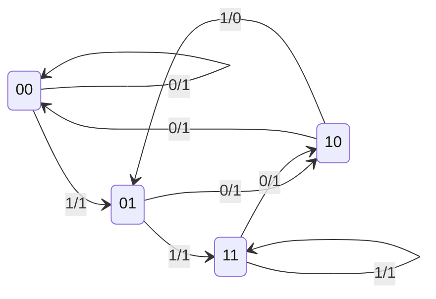
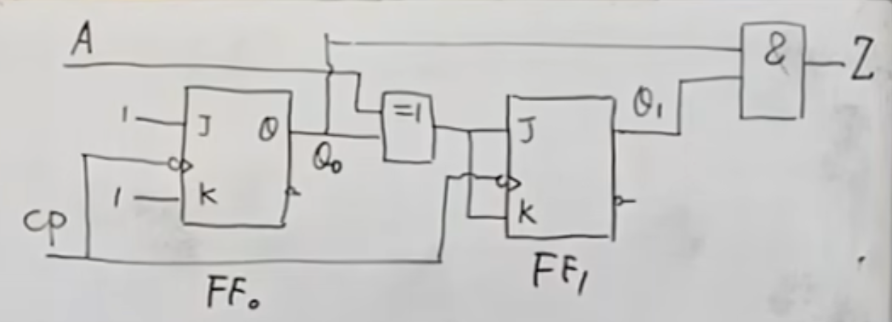
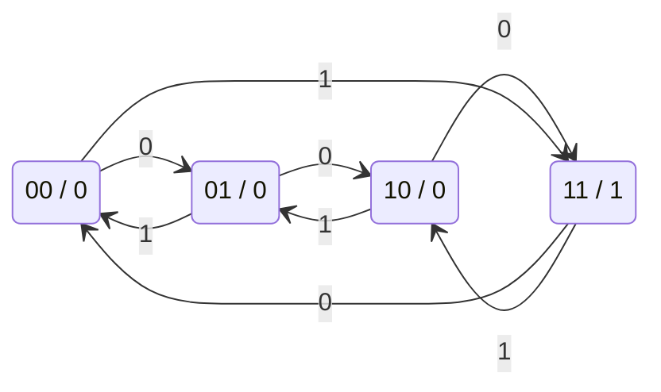

# 01 时序逻辑电路基本概念

---

## 一、时序电路 vs 组合电路

| 特征 | 组合逻辑电路 | 时序逻辑电路 |
|:---|:---|:---|
| 输出决定因素 | 仅取决于**当前输入** | 取决于当前输入 **+** 电路**原状态** |
| 电路结构 | 只有逻辑门 | 组合电路 + **存储电路**（触发器/锁存器） |
| 记忆功能 | **无** | **有** |
| 典型器件 | 编码器、译码器、加法器 | 计数器、寄存器 |

### 时序电路的三大特征

1. 由**组合电路**和**存储电路**组成
2. 状态与**时间**相关——任一时刻的状态不仅与当前输入有关，还与电路**以前状态**有关
3. 输出信号由**输入信号**和**电路状态**共同决定

---

## 二、时序电路的基本结构

时序电路由两大部分组成：

- **组合电路**：完成逻辑运算
- **存储电路**：记忆电路状态（由触发器/锁存器组成）

### 2.1 四组信号变量

| 变量类型 | 符号 | 含义 |
|:---|:---|:---|
| 输入信号 | $I = (I_1, I_2, \dots, I_i)$ | 外部输入 |
| 输出信号 | $O = (O_1, O_2, \dots, O_j)$ | 电路输出 |
| 激励信号 | $E = (E_1, E_2, \dots, E_k)$ | 驱动存储电路转换 |
| 状态信号 | $S = (S_1, S_2, \dots, S_m)$ | 存储电路当前状态（**现态**） |

### 2.2 三个基本方程组

| 方程 | 表达式 | 含义 |
|:---|:---|:---|
| **激励方程** | $E = f(I, S)$ | 激励由输入和现态决定 |
| **状态转换方程** | $S^{n+1} = g(E, S^n)$ | 次态由激励和现态决定 |
| **输出方程** | $O = h(I, S)$ | 输出由输入和现态决定 |

> [!note] 说明
> - $S^n$ 表示**现态**，$S^{n+1}$ 表示**次态**
> - 时序电路也称为**有限状态机 (FSM)**

---

## 三、时序电路的分类

### 3.1 按时钟信号分类

| 类型 | 特点 |
|:---|:---|
| **同步时序电路** | 所有触发器共用同一时钟，状态更新**同时**发生 |
| **异步时序电路** | 触发器时钟端不统一，状态更新**不同时** |

> [!important] 同步 vs 异步
> - **同步时序**：分析和设计方法系统化，电路行为易控制 → **实际工程中广泛采用**
> - **异步时序**：状态转换有时间差异，可能出现短时间不稳定 → 设计调试困难

### 3.2 按输出特性分类

| 类型 | 输出方程 | 输出取决于 | 结构图 |
|:---|:---|:---|:---|
| **米利型 (Mealy)** | $O = h(I, S)$ | 输入 **+** 状态 |  |
| **穆尔型 (Moore)** | $O = h(S)$ | **仅**状态 |  |

> [!tip] 区分与选用技巧
> - **穆尔型**输出只看状态，不受输入"毛刺"影响 → 抗干扰性能更好
> - 现代高速设计中**优先采用穆尔型**
> - 可在米利型输出端加一级触发器，构成"流水线输出"转化为穆尔型（延迟一个时钟周期）

---

## 四、逻辑功能的五种表达方式

时序电路的逻辑功能可用以下 **5 种方式**表达，且**可互相转换**：

| 表达方式 | 特点 | 用途 |
|:---|:---|:---|
| **逻辑方程组** | 激励方程 + 转换方程 + 输出方程 | 直接从电路图推导 |
| **转换表** | 用二进制编码表示状态，紧凑明了 | 便于电路实现 |
| **状态表** | 用状态名表示 | 更易理解电路行为 |
| **状态图** | 图形化表达，**最直观** | 设计时的起点 |
| **时序图** | 波形形式 | 适合实验调试和仿真 |

> [!warning] 考试重点
> - 能够在**方程组 ↔ 转换表 ↔ 状态表 ↔ 状态图 ↔ 时序图**之间进行相互转换
> - 状态图每个状态引出的方向线数量 $= 2^i$（$i$ 为输入变量数目）

## 五、综合实例：电路分析全流程

> 已知一个单输入 ($X$)、单输出 ($Z$)、含两个 D 触发器 ($Q_1, Q_0$) 的时序电路，完成从电路图到状态图的全部分析。

### 5.1 方程组提取

#### (1) 输出方程

$$Z = \overline{X \cdot Q_1 \cdot \overline{Q_0}}$$

> [!warning] 核心易错点
> 根据与非逻辑：**只有当 $X=1$ 且 $Q_1=1$ 且 $\overline{Q_0}=1$（即 $Q_0=0$）时，输出 $Z$ 才为 0**。其余所有状态下 $Z$ 均为 1。这是后续填表的「定海神针」。

#### (2) 激励方程（D 触发器，$D$ 端输入即激励）

$$D_1 = Q_0$$
$$D_0 = X$$

#### (3) 次态转换方程

将激励方程代入 D 触发器的特性方程 $Q^{n+1} = D$：

$$Q_1^{n+1} = D_1 = Q_0$$
$$Q_0^{n+1} = D_0 = X$$

---

### 5.2 状态表绘制

> **解题策略**：先填穷举功能表（过渡），再压缩为标准二维状态表。

#### 步骤一：穷举功能表

| $Q_1$ | $Q_0$ | $X$ | $Q_1^{n+1}$ | $Q_0^{n+1}$ | $Z$ |
|:---:|:---:|:---:|:---:|:---:|:---:|
| 0 | 0 | 0 | 0 | 0 | 1 |
| 0 | 0 | 1 | 0 | 1 | 1 |
| 0 | 1 | 0 | 1 | 0 | 1 |
| 0 | 1 | 1 | 1 | 1 | 1 |
| 1 | 0 | 0 | 0 | 0 | 1 |
| **1** | **0** | **1** | **0** | **1** | **0** ← 唯一使 $Z=0$ 的行 |
| 1 | 1 | 0 | 1 | 0 | 1 |
| 1 | 1 | 1 | 1 | 1 | 1 |

#### 步骤二：标准二维状态表

> 格式：单元格内容为 `次态 / 输出`，即 $Q_1^{n+1}Q_0^{n+1} \mathbin{/} Z$

| 现态 $Q_1 Q_0$ \ 输入 $X$ | $X=0$ | $X=1$ |
|:---:|:---:|:---:|
| **00** | 00 / 1 | 01 / 1 |
| **01** | 10 / 1 | 11 / 1 |
| **10** | 00 / 1 | 01 / **0** |
| **11** | 10 / 1 | 11 / 1 |

---

### 5.3 状态图

> 圆圈内为现态，箭头标注格式：`输入 X / 输出 Z`

> [!note] 状态图解读法则
> 以初始状态 `00` 为例：当输入为 `0` 时，次态保持 `00`，输出 $Z=1$；当输入为 `1` 时，次态跳转到 `01`，输出 $Z=1$。这与状态表中 `00` 行的数据完全一致。

---

## 六、综合实例二：JK触发器分析（同步可逆计数器）

> 已知一个单输入 ($A$)、单输出 ($Z$)、含两个下降沿触发的 JK 触发器 ($Q_1, Q_0$) 的时序电路，完成从电路图到状态图的全部分析。

### 6.1 三大核心方程提取

#### (1) 输出方程

$$Z = Q_1 Q_0 \quad \text{(Moore型)}$$

> [!tip] 考点批注
> 输出 $Z$ 仅由触发器的当前状态 ($Q_1, Q_0$) 决定，不包含外部输入 $A$，因此是标准的 **Moore（穆尔）型** 状态机。

#### (2) 激励方程

- 低位触发器 $FF_0$：$J_0 = 1,\; K_0 = 1$
- 高位触发器 $FF_1$：$J_1 = A \oplus Q_0,\; K_1 = A \oplus Q_0$

#### (3) 状态方程

代入 JK 触发器特性方程 $Q^{n+1} = J\overline{Q} + \overline{K}Q$：

$$Q_0^{n+1} = 1 \cdot \overline{Q_0} + 0 \cdot Q_0 = \overline{Q_0}$$

$$Q_1^{n+1} = (A \oplus Q_0)\overline{Q_1} + \overline{(A \oplus Q_0)}Q_1 = A \oplus Q_0 \oplus Q_1$$

---

### 6.2 功能表（基础真值表）

穷举输入 $A$ 与现态 $Q_1, Q_0$ 的所有组合，计算次态与输出：

| $A$ | $Q_1$ | $Q_0$ | $Q_1^{n+1}$ | $Q_0^{n+1}$ | $Z$ |
|:---:|:---:|:---:|:---:|:---:|:---:|
| 0 | 0 | 0 | 0 | 1 | 0 |
| 0 | 0 | 1 | 1 | 0 | 0 |
| 0 | 1 | 0 | 1 | 1 | 0 |
| 0 | 1 | 1 | 0 | 0 | 1 |
| 1 | 0 | 0 | 1 | 1 | 0 |
| 1 | 0 | 1 | 0 | 0 | 0 |
| 1 | 1 | 0 | 0 | 1 | 0 |
| 1 | 1 | 1 | 1 | 0 | 1 |

---

### 6.3 状态表（二维降维映射）

将功能表转化为标准的二维状态表，行代表现态，列代表输入。**Moore 型的 $Z$ 单独作为一列**（与 Mealy 型不同，$Z$ 与输入 $A$ 的当前取值无关）。

| 现态 $Q_1Q_0$ \ 输入 $A$ | $A=0$ | $A=1$ | $Z$ |
|:---:|:---:|:---:|:---:|
| **00** | 01 | 11 | 0 |
| **01** | 10 | 00 | 0 |
| **10** | 11 | 01 | 0 |
| **11** | 00 | 10 | 1 |

> [!warning] 核心易错点
> Moore 型与 Mealy 型状态表的区别：
> - **Moore 型**：输出 $Z$ 单独作为一列，因为 $Z$ 只与当前状态有关，与输入 $A$ 的当前取值无关
> - **Mealy 型**：输出需要写在次态旁边，格式为 `次态/输出`

---

### 6.4 状态图

Moore 型状态图中，输出标注在状态圈内部（格式：`现态/输出`）。

---

### 6.5 电路功能总结

这是一个由 $A$ 控制方向的 **2位同步可逆计数器（模4）**：

- **$A=0$ 时**：状态 $00 \to 01 \to 10 \to 11$ 递增，执行**加法计数**
- **$A=1$ 时**：状态 $00 \to 11 \to 10 \to 01$ 递减，执行**减法计数**
- 输出 $Z$ 为**进位/借位标志脉冲**（仅在 $Q_1Q_0 = 11$ 时 $Z=1$）

---

### 6.6 Mealy 型 vs Moore 型对比总结

| 对比维度 | 实例一（D触发器） | 实例二（JK触发器） |
|:---|:---|:---|
| **状态机类型** | Mealy 型 | Moore 型 |
| **输出方程** | $Z = \overline{X \cdot Q_1 \cdot \overline{Q_0}}$ | $Z = Q_1 Q_0$ |
| **输出依赖** | 输入 $X$ + 现态 | 仅现态 |
| **状态表格式** | 次态/输出 合并 | 次态 + 输出独立列 |
| **状态图标法** | 箭头标注 `输入/输出` | 输出写圈内，箭头仅标输入 |
| **电路功能** | 序列检测器 | 可逆计数器 |
