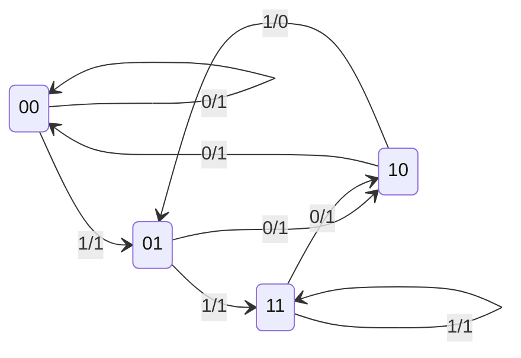
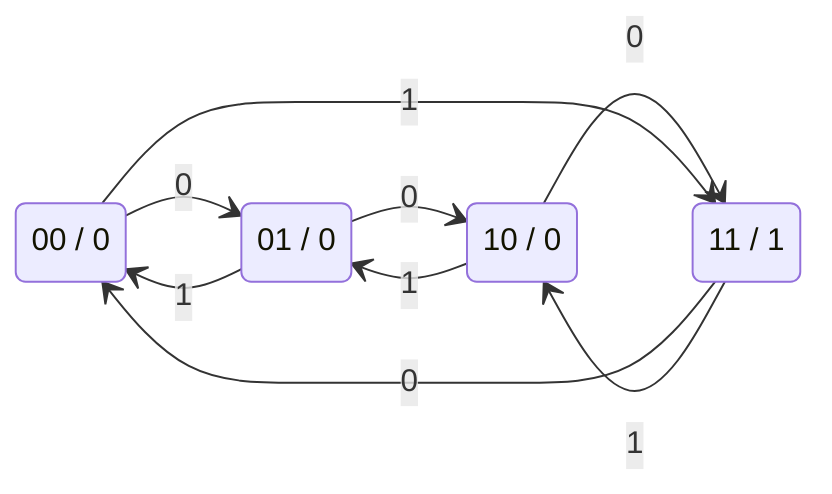
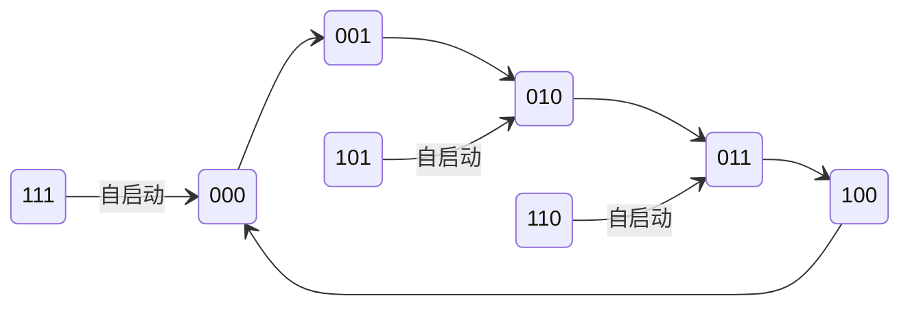
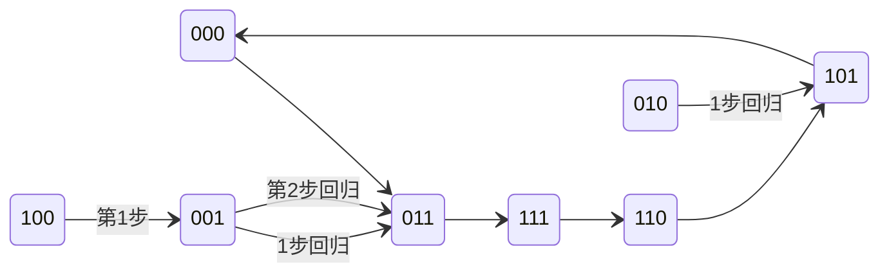

# 01 时序逻辑电路基本概念

---

## 一、时序电路 vs 组合电路

| 特征 | 组合逻辑电路 | 时序逻辑电路 |
|:---|:---|:---|
| 输出决定因素 | 仅取决于**当前输入** | 取决于当前输入 **+** 电路**原状态** |
| 电路结构 | 只有逻辑门 | 组合电路 + **存储电路**（触发器/锁存器） |
| 记忆功能 | **无** | **有** |
| 典型器件 | 编码器、译码器、加法器 | 计数器、寄存器 |

### 时序电路的三大特征

1. 由**组合电路**和**存储电路**组成
2. 状态与**时间**相关——任一时刻的状态不仅与当前输入有关，还与电路**以前状态**有关
3. 输出信号由**输入信号**和**电路状态**共同决定

---

## 二、时序电路的基本结构

时序电路由两大部分组成：

- **组合电路**：完成逻辑运算
- **存储电路**：记忆电路状态（由触发器/锁存器组成）

### 2.1 四组信号变量

| 变量类型 | 符号 | 含义 |
|:---|:---|:---|
| 输入信号 | $I = (I_1, I_2, \dots, I_i)$ | 外部输入 |
| 输出信号 | $O = (O_1, O_2, \dots, O_j)$ | 电路输出 |
| 激励信号 | $E = (E_1, E_2, \dots, E_k)$ | 驱动存储电路转换 |
| 状态信号 | $S = (S_1, S_2, \dots, S_m)$ | 存储电路当前状态（**现态**） |

### 2.2 三个基本方程组

| 方程 | 表达式 | 含义 |
|:---|:---|:---|
| **激励方程** | $E = f(I, S)$ | 激励由输入和现态决定 |
| **状态转换方程** | $S^{n+1} = g(E, S^n)$ | 次态由激励和现态决定 |
| **输出方程** | $O = h(I, S)$ | 输出由输入和现态决定 |

> [!note] 说明
> - $S^n$ 表示**现态**，$S^{n+1}$ 表示**次态**
> - 时序电路也称为**有限状态机 (FSM)**

---

## 三、时序电路的分类

### 3.1 按时钟信号分类

| 类型 | 特点 |
|:---|:---|
| **同步时序电路** | 所有触发器共用同一时钟，状态更新**同时**发生 |
| **异步时序电路** | 触发器时钟端不统一，状态更新**不同时** |

> [!important] 同步 vs 异步
> - **同步时序**：分析和设计方法系统化，电路行为易控制 → **实际工程中广泛采用**
> - **异步时序**：状态转换有时间差异，可能出现短时间不稳定 → 设计调试困难

### 3.2 按输出特性分类

| 类型 | 输出方程 | 输出取决于 | 结构图 |
|:---|:---|:---|:---|
| **米利型 (Mealy)** | $O = h(I, S)$ | 输入 **+** 状态 |  |
| **穆尔型 (Moore)** | $O = h(S)$ | **仅**状态 |  |

> [!tip] 区分与选用技巧
> - **穆尔型**输出只看状态，不受输入"毛刺"影响 → 抗干扰性能更好
> - 现代高速设计中**优先采用穆尔型**
> - 可在米利型输出端加一级触发器，构成"流水线输出"转化为穆尔型（延迟一个时钟周期）

---

## 四、逻辑功能的五种表达方式

时序电路的逻辑功能可用以下 **5 种方式**表达，且**可互相转换**：

| 表达方式 | 特点 | 用途 |
|:---|:---|:---|
| **逻辑方程组** | 激励方程 + 转换方程 + 输出方程 | 直接从电路图推导 |
| **转换表** | 用二进制编码表示状态，紧凑明了 | 便于电路实现 |
| **状态表** | 用状态名表示 | 更易理解电路行为 |
| **状态图** | 图形化表达，**最直观** | 设计时的起点 |
| **时序图** | 波形形式 | 适合实验调试和仿真 |

> [!warning] 考试重点
> - 能够在**方程组 ↔ 转换表 ↔ 状态表 ↔ 状态图 ↔ 时序图**之间进行相互转换
> - 状态图每个状态引出的方向线数量 $= 2^i$（$i$ 为输入变量数目）

## 五、综合实例：电路分析全流程

> 已知一个单输入 ($X$)、单输出 ($Z$)、含两个 D 触发器 ($Q_1, Q_0$) 的时序电路，完成从电路图到状态图的全部分析。

### 5.1 方程组提取

#### (1) 输出方程

$$Z = \overline{X \cdot Q_1 \cdot \overline{Q_0}}$$

> [!warning] 核心易错点
> 根据与非逻辑：**只有当 $X=1$ 且 $Q_1=1$ 且 $\overline{Q_0}=1$（即 $Q_0=0$）时，输出 $Z$ 才为 0**。其余所有状态下 $Z$ 均为 1。这是后续填表的「定海神针」。

#### (2) 激励方程（D 触发器，$D$ 端输入即激励）

$$D_1 = Q_0$$
$$D_0 = X$$

#### (3) 次态转换方程

将激励方程代入 D 触发器的特性方程 $Q^{n+1} = D$：

$$Q_1^{n+1} = D_1 = Q_0$$
$$Q_0^{n+1} = D_0 = X$$

---

### 5.2 状态表绘制

> **解题策略**：先填穷举功能表（过渡），再压缩为标准二维状态表。

#### 步骤一：穷举功能表

| $Q_1$ | $Q_0$ | $X$ | $Q_1^{n+1}$ | $Q_0^{n+1}$ | $Z$ |
|:---:|:---:|:---:|:---:|:---:|:---:|
| 0 | 0 | 0 | 0 | 0 | 1 |
| 0 | 0 | 1 | 0 | 1 | 1 |
| 0 | 1 | 0 | 1 | 0 | 1 |
| 0 | 1 | 1 | 1 | 1 | 1 |
| 1 | 0 | 0 | 0 | 0 | 1 |
| **1** | **0** | **1** | **0** | **1** | **0** ← 唯一使 $Z=0$ 的行 |
| 1 | 1 | 0 | 1 | 0 | 1 |
| 1 | 1 | 1 | 1 | 1 | 1 |

#### 步骤二：标准二维状态表

> 格式：单元格内容为 `次态 / 输出`，即 $Q_1^{n+1}Q_0^{n+1} \mathbin{/} Z$

| 现态 $Q_1 Q_0$ \ 输入 $X$ | $X=0$ | $X=1$ |
|:---:|:---:|:---:|
| **00** | 00 / 1 | 01 / 1 |
| **01** | 10 / 1 | 11 / 1 |
| **10** | 00 / 1 | 01 / **0** |
| **11** | 10 / 1 | 11 / 1 |

---

### 5.3 状态图

> 圆圈内为现态，箭头标注格式：`输入 X / 输出 Z`

> [!note] 状态图解读法则
> 以初始状态 `00` 为例：当输入为 `0` 时，次态保持 `00`，输出 $Z=1$；当输入为 `1` 时，次态跳转到 `01`，输出 $Z=1$。这与状态表中 `00` 行的数据完全一致。

---

## 六、综合实例二：JK触发器分析（同步可逆计数器）

> 已知一个单输入 ($A$)、单输出 ($Z$)、含两个下降沿触发的 JK 触发器 ($Q_1, Q_0$) 的时序电路，完成从电路图到状态图的全部分析。

### 6.1 三大核心方程提取

#### (1) 输出方程

$$Z = Q_1 Q_0 \quad \text{(Moore型)}$$

> [!tip] 考点批注
> 输出 $Z$ 仅由触发器的当前状态 ($Q_1, Q_0$) 决定，不包含外部输入 $A$，因此是标准的 **Moore（穆尔）型** 状态机。

#### (2) 激励方程

- 低位触发器 $FF_0$：$J_0 = 1,\; K_0 = 1$
- 高位触发器 $FF_1$：$J_1 = A \oplus Q_0,\; K_1 = A \oplus Q_0$

#### (3) 状态方程

代入 JK 触发器特性方程 $Q^{n+1} = J\overline{Q} + \overline{K}Q$：

$$Q_0^{n+1} = 1 \cdot \overline{Q_0} + 0 \cdot Q_0 = \overline{Q_0}$$

$$Q_1^{n+1} = (A \oplus Q_0)\overline{Q_1} + \overline{(A \oplus Q_0)}Q_1 = A \oplus Q_0 \oplus Q_1$$

---

### 6.2 功能表（基础真值表）

穷举输入 $A$ 与现态 $Q_1, Q_0$ 的所有组合，计算次态与输出：

| $A$ | $Q_1$ | $Q_0$ | $Q_1^{n+1}$ | $Q_0^{n+1}$ | $Z$ |
|:---:|:---:|:---:|:---:|:---:|:---:|
| 0 | 0 | 0 | 0 | 1 | 0 |
| 0 | 0 | 1 | 1 | 0 | 0 |
| 0 | 1 | 0 | 1 | 1 | 0 |
| 0 | 1 | 1 | 0 | 0 | 1 |
| 1 | 0 | 0 | 1 | 1 | 0 |
| 1 | 0 | 1 | 0 | 0 | 0 |
| 1 | 1 | 0 | 0 | 1 | 0 |
| 1 | 1 | 1 | 1 | 0 | 1 |

---

### 6.3 状态表（二维降维映射）

将功能表转化为标准的二维状态表，行代表现态，列代表输入。**Moore 型的 $Z$ 单独作为一列**（与 Mealy 型不同，$Z$ 与输入 $A$ 的当前取值无关）。

| 现态 $Q_1Q_0$ \ 输入 $A$ | $A=0$ | $A=1$ | $Z$ |
|:---:|:---:|:---:|:---:|
| **00** | 01 | 11 | 0 |
| **01** | 10 | 00 | 0 |
| **10** | 11 | 01 | 0 |
| **11** | 00 | 10 | 1 |

> [!warning] 核心易错点
> Moore 型与 Mealy 型状态表的区别：
> - **Moore 型**：输出 $Z$ 单独作为一列，因为 $Z$ 只与当前状态有关，与输入 $A$ 的当前取值无关
> - **Mealy 型**：输出需要写在次态旁边，格式为 `次态/输出`

---

### 6.4 状态图

Moore 型状态图中，输出标注在状态圈内部（格式：`现态/输出`）。

---

### 6.5 电路功能总结

这是一个由 $A$ 控制方向的 **2位同步可逆计数器（模4）**：

- **$A=0$ 时**：状态 $00 \to 01 \to 10 \to 11$ 递增，执行**加法计数**
- **$A=1$ 时**：状态 $00 \to 11 \to 10 \to 01$ 递减，执行**减法计数**
- 输出 $Z$ 为**进位/借位标志脉冲**（仅在 $Q_1Q_0 = 11$ 时 $Z=1$）

---

### 6.6 Mealy 型 vs Moore 型对比总结

| 对比维度 | 实例一（D触发器） | 实例二（JK触发器） |
|:---|:---|:---|
| **状态机类型** | Mealy 型 | Moore 型 |
| **输出方程** | $Z = \overline{X \cdot Q_1 \cdot \overline{Q_0}}$ | $Z = Q_1 Q_0$ |
| **输出依赖** | 输入 $X$ + 现态 | 仅现态 |
| **状态表格式** | 次态/输出 合并 | 次态 + 输出独立列 |
| **状态图标法** | 箭头标注 `输入/输出` | 输出写圈内，箭头仅标输入 |
| **电路功能** | 序列检测器 | 可逆计数器 |

---

## 七、综合实例三：同步五进制计数器与自启动分析

> 已知一个含三个 JK 触发器（$Q_1, Q_2, Q_3$）、无外部输入变量的时序电路，完成电路分析并检验自启动能力。

f

### 7.1 三大核心方程提取

#### (1) 输出方程

无独立输出方程（状态直接作为输出），属于 **Moore 型**。

#### (2) 激励方程

$$J_1 = \overline{Q_3},\quad K_1 = 1$$
$$J_2 = Q_1,\quad K_2 = Q_1$$
$$J_3 = Q_1 Q_2,\quad K_3 = 1$$

#### (3) 状态方程

代入 JK 触发器特性方程 $Q^{n+1} = J\overline{Q} + \overline{K}Q$：

$$Q_1^{n+1} = J_1 \overline{Q_1} + \overline{K_1} Q_1 = \overline{Q_3}\,\overline{Q_1} + 0 \cdot Q_1 = \overline{Q_3}\,\overline{Q_1}$$

$$Q_2^{n+1} = J_2 \overline{Q_2} + \overline{K_2} Q_2 = Q_1\overline{Q_2} + \overline{Q_1}Q_2 = Q_1 \oplus Q_2$$

$$Q_3^{n+1} = J_3 \overline{Q_3} + \overline{K_3} Q_3 = (Q_1 Q_2)\overline{Q_3} + 0 \cdot Q_3 = Q_1 Q_2 \overline{Q_3}$$

---

### 7.2 状态转移表

将 8 种状态代入状态方程计算次态：

| 现态 $Q_3 Q_2 Q_1$ | 次态 $Q_3^{n+1} Q_2^{n+1} Q_1^{n+1}$ | 逻辑说明 |
|:---:|:---:|:---|
| **000** | 001 | $Q_1^+ = 1\cdot1=1,\; Q_2^+ = 0\oplus0=0,\; Q_3^+ = 0\cdot0\cdot1=0$ |
| **001** | 010 | $Q_1^+ = 1\cdot0=0,\; Q_2^+ = 1\oplus0=1,\; Q_3^+ = 1\cdot0\cdot1=0$ |
| **010** | 011 | $Q_1^+ = 1\cdot1=1,\; Q_2^+ = 0\oplus1=1,\; Q_3^+ = 0\cdot1\cdot1=0$ |
| **011** | 100 | $Q_1^+ = 1\cdot0=0,\; Q_2^+ = 1\oplus1=0,\; Q_3^+ = 1\cdot1\cdot1=1$ |
| **100** | 000 | $Q_1^+ = 0\cdot1=0,\; Q_2^+ = 0\oplus0=0,\; Q_3^+ = 0\cdot0\cdot0=0$ |
| **101** | 010 | $Q_1^+ = 0\cdot0=0,\; Q_2^+ = 1\oplus0=1,\; Q_3^+ = 1\cdot0\cdot0=0$ |
| **110** | 010 | $Q_1^+ = 0\cdot1=0,\; Q_2^+ = 0\oplus1=1,\; Q_3^+ = 0\cdot1\cdot0=0$ |
| **111** | 000 | $Q_1^+ = 0\cdot0=0,\; Q_2^+ = 1\oplus1=0,\; Q_3^+ = 1\cdot1\cdot0=0$ |

---

### 7.3 状态图

- **实线箭头**：有效状态循环（主工作区）
- **虚线箭头**：无效状态到主循环的跳转（自启动路径）

> [!note] 状态图说明
> 由于无外部输入变量（纯 Moore 型），状态转移条件恒为真，箭头无需标注触发条件。

---

### 7.4 功能总结

电路在 $000 \to 001 \to 010 \to 011 \to 100 \to 000$ 之间循环，包含 **5 个有效状态**，构成 **模 5 计数器**（同步五进制计数器）。

> [!tip] 识别技巧
> 有效循环含 N 个独立状态 $\implies$ 模 N 计数器。此处 5 个状态 $\implies$ 五进制。

---

### 7.5 自启动分析（无挂起检验）

#### 为什么要检验自启动？

3 个触发器理论上有 $2^3 = 8$ 个状态。计数器只用了 5 个，剩下 3 个是 **无效状态**（101, 110, 111）。若电路上电或受干扰进入无效状态，能否自动回到主循环？

#### 检验方法

将每个无效状态代入状态方程，检查次态是否落入主循环：

| 无效状态 | 次态计算 | 结果 | 是否回归？ |
|:---:|:---|:---:|:---:|
| **101** | $Q_1^+ = \overline{1}\cdot\overline{0}=0,\; Q_2^+ = 1\oplus0=1,\; Q_3^+ = 1\cdot0\cdot\overline{1}=0$ | **010** | ✅ 是 |
| **110** | $Q_1^+ = \overline{1}\cdot\overline{1}=0,\; Q_2^+ = 0\oplus1=1,\; Q_3^+ = 0\cdot1\cdot\overline{1}=0$ | **010** | ✅ 是 |
| **111** | $Q_1^+ = \overline{1}\cdot\overline{0}=0,\; Q_2^+ = 1\oplus1=0,\; Q_3^+ = 1\cdot1\cdot\overline{1}=0$ | **000** | ✅ 是 |

所有无效状态的次态均属于有效循环，**经过 1 个时钟周期即可自动回归**。

$$ \boxed{\text{该电路具有自启动能力（无挂起现象）}} $$

> [!warning] 核心考点
> - **自启动**：无效状态能否自动回到有效循环
> - **无挂起**：不存在"死循环"或"死锁"的无效状态子图
> - 若存在某个无效状态陷入另一个无效状态的死循环 $\implies$ **无自启动能力**
> - 实际工程中，必须确保计数器具有自启动能力，否则上电或受干扰后可能永久失效

---

## 八、综合实例四：同步五进制计数器（真值表中间变量法）

> 已知一个含三个 JK 触发器（$Q_1, Q_2, Q_3$）、无外部输入变量的时序电路，用**中间变量法**快速分析电路功能，检验自启动能力。

### 8.1 提取激励方程

观察电路图直接写出驱动信号：

$$J_3 = Q_2,\quad K_3 = \overline{Q_2}$$
$$J_2 = \overline{Q_3},\quad K_2 = \overline{Q_1}$$
$$J_1 = 1,\quad K_1 = Q_3$$

### 8.2 构建状态转换真值表（中间变量法）

> **方法要点**：穷举 8 种现态 → 根据激励方程算出 $J,K$ 中间变量 → 根据 JK 特性判断次态。一步到位，无需写出完整状态方程。

| 现态 $Q_3 Q_2 Q_1$ | $J_3 K_3$ | $J_2 K_2$ | $J_1 K_1$ | JK 行为分析 | 次态 $Q_3^+ Q_2^+ Q_1^+$ |
|:---:|:---:|:---:|:---:|:---|:---:|
| **000** | $0\;1$ | $1\;1$ | $1\;0$ | $Q_3\text{: }0\!\to\!0,\; Q_2\text{: }0\!\to\!1,\; Q_1\text{: }0\!\to\!1$ | **011** |
| **001** | $0\;1$ | $1\;0$ | $1\;0$ | $Q_3\text{: }0\!\to\!0,\; Q_2\text{: }0\!\to\!1,\; Q_1\text{: }1\!\to\!1$ | **011** |
| **010** | $1\;0$ | $1\;1$ | $1\;0$ | $Q_3\text{: }0\!\to\!1,\; Q_2\text{: }1\!\to\!0,\; Q_1\text{: }0\!\to\!1$ | **101** |
| **011** | $1\;0$ | $1\;0$ | $1\;0$ | $Q_3\text{: }0\!\to\!1,\; Q_2\text{: }1\!\to\!1,\; Q_1\text{: }1\!\to\!1$ | **111** |
| **100** | $0\;1$ | $0\;1$ | $1\;1$ | $Q_3\text{: }1\!\to\!0,\; Q_2\text{: }0\!\to\!0,\; Q_1\text{: }0\!\to\!1$ | **001** |
| **101** | $0\;1$ | $0\;0$ | $1\;1$ | $Q_3\text{: }1\!\to\!0,\; Q_2\text{: }0\!\to\!0,\; Q_1\text{: }1\!\to\!0$ | **000** |
| **110** | $1\;0$ | $0\;1$ | $1\;1$ | $Q_3\text{: }1\!\to\!1,\; Q_2\text{: }1\!\to\!0,\; Q_1\text{: }0\!\to\!1$ | **101** |
| **111** | $1\;0$ | $0\;0$ | $1\;1$ | $Q_3\text{: }1\!\to\!1,\; Q_2\text{: }1\!\to\!1,\; Q_1\text{: }1\!\to\!0$ | **110** |

> [!tip] JK 触发器快速记忆
> | $J\;K$ | 行为 |
> |:---:|:---:|
> | $0\;0$ | **保持**（$Q^+ = Q$） |
> | $0\;1$ | **复位**（$Q^+ = 0$） |
> | $1\;0$ | **置位**（$Q^+ = 1$） |
> | $1\;1$ | **翻转**（$Q^+ = \overline{Q}$） |

---

### 8.3 状态图

> [!note] 自启动路径说明
> 无效状态 **001** 和 **010** 经过 1 个时钟周期即可回归主循环；**100** 需要 2 个时钟周期（$100 \to 001 \to 011$）回归主循环。

---

### 8.4 功能总结

有效状态循环：$000 \to 011 \to 111 \to 110 \to 101 \to 000$，包含 **5 个有效状态**，构成 **模 5 计数器**（同步五进制计数器）。

| 分析项 | 结论 |
|:---|:---|
| 有效状态数 | 5 个（000, 011, 111, 110, 101） |
| 无效状态 | 3 个（001, 010, 100） |
| 电路类型 | 同步五进制计数器（Moore 型） |
| 自启动能力 | ✅ 能自启动（无挂起） |
| 最长恢复时间 | 2 个时钟周期（$100 \to 001 \to 011$） |

> [!warning] 中间变量法 vs 状态方程法
> - **中间变量法**：直接查 JK 行为表（00 保持 / 01 复位 / 10 置位 / 11 翻转），**速度快**，适合考场
> - **状态方程法**：先写出完整的 $Q^{n+1} = J\overline{Q} + \overline{K}Q$ 表达式再代入，**不易错**，适合平时练习
> - 两种方法本质等价，考试时可任选其一
