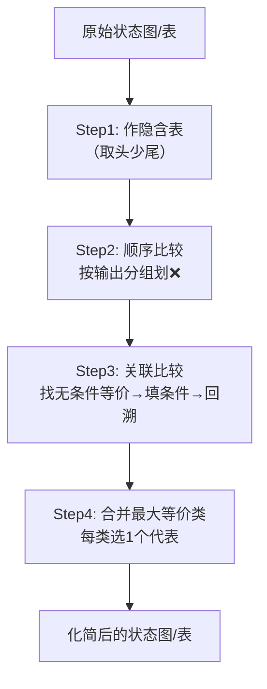

# 03-1 状态化简 (State Minimization)

> [!abstract] 概述
> 状态化简的最终目的是**消除时序逻辑电路中的多余状态**，从而减少所需的触发器数量，降低硬件电路的复杂度和成本。

---

## 🎯 考点定位

| 考查角度 | 要求 |
|:--------:|:----:|
| **概念辨析** | 等价状态 / 等价类 / 最大等价类的定义与关系 |
| **方法应用** | 隐含表法化简状态（大题常考步骤） |
| **化简结果** | 从最大等价类中选代表状态，画出化简后的状态图/表 |

> [!tip] 命题规律
> 状态化简通常作为**时序逻辑电路设计大题中的一个环节**出现，一般不单独出题。掌握隐含表法四步走即可拿分。

---

## 📇 速记卡 — 核心概念一览

| 概念 | 一句话定义 | 记忆点 |
|:----:|:----------|:------:|
| **等价状态** | 相同输入→相同输出+等效次态 | 输出+次态，**缺一不可** |
| **传递性** | A≡B, B≡C ⇒ A≡C | 数学等价关系 |
| **等价类** | 两两等价的状态集合 | 集合内的状态可互换 |
| **最大等价类** | 不能再合并的等价类 | 每个类**只留1个代表** |

---

## 一、核心概念（逐层递进）

### 1️⃣ 等价状态

> [!info] 判定条件
> 两个状态等价，**必须同时满足**：
> 1. **输出完全相同** — 所有相同输入下，输出 $Y$ 一致
> 2. **次态等效** — 次态转移属以下三种情况之一

**次态等效的三种情况：**

| 类型 | 模式 | 示例 | 记忆口诀 |
|:----:|:----|:----|:--------:|
| **a. 次态相同** | A→C, B→C | 最简单，直接等效 | **同归** |
| **b. 次态交错** | A→B, B→A | 互相依赖，形成闭环 | **互指** |
| **c. 条件等价** | A→(C,D), B→(C,D) | 若(C,D)等价则A,B等价 | **牵连** |

### 2️⃣ 传递性

> 等价状态之间具有数学上的传递关系：$A \equiv B$ 且 $B \equiv C$ ⇒ $A \equiv C$

### 3️⃣ 等价类 → 4️⃣ 最大等价类

> [!example] 推导过程
> 原状态集：$\{A, B, C, D, E, F, G\}$
>
> 通过隐含表法求得全部等价关系：
> - $(A, D, F)$ 两两等价
> - $(B, E)$ 等价
> - $(C, G)$ 等价
>
> 这些就是 **3 个最大等价类**，化简后只需 **3 个状态** 替代原来的 7 个状态。

---

## 二、隐含表法
## 二、 隐含表法 (Implication Table Method) 实战推导

隐含表法是寻找等价状态最系统、最不易遗漏的方法。板书中的口诀 **“取头少尾”** 是画隐含表的关键技巧。

### 1. 原始状态转移表

这是化简前的原始状态表（格式：`现态 -> 次态 / 输出`）。

|现态 (S)|输入 X = 0 (次态 / 输出)|输入 X = 1 (次态 / 输出)|
|---|---|---|
|**A**|A / 0|E / 0|
|**B**|E / 1|C / 1|
|**C**|A / 1|D / 1|
|**D**|F / 0|B / 0|
|**E**|B / 1|C / 1|
|**F**|F / 0|E / 0|
|**G**|A / 1|D / 1|

导出到 Google 表格

### 2. 隐含表图表复原与推导

根据“取头少尾”原则画表：纵轴去掉第一个状态 A（取头），横轴去掉最后一个状态 G（少尾），形成阶梯状表格。

> **符号说明：**
> 
> - **❌ (红叉)：** 代表两个状态由于输出不同，或者隐含条件不成立，**绝不等价**。
>     
> - **✔️ (对勾)：** 代表两个状态无条件等价，或其隐含条件已被证实成立，**确定等价**。
>     
> - **括号内字母 (如 AF, BE)：** 代表这两个状态等价的**前提条件**（隐含条件）。
>     

|状态|A|B|C|D|E|F|
|---|---|---|---|---|---|---|
|**B**|❌||||||
|**C**|❌|❌ _(AE, CD)_|||||
|**D**|✔️ _(AF, BE)_|❌|❌||||
|**E**|❌|✔️|❌ _(AB, CD)_|❌|||
|**F**|✔️ _(AF)_|❌|❌|✔️ _(BE)_|❌||
|**G**|❌|❌ _(AE, CD)_|✔️ _(AD)_|❌|❌ _(AB, CD)_|❌|

导出到 Google 表格

### 3. 隐含表“四步走”解题流程拆解

板书中右侧总结的四个步骤是解题的灵魂：

- **Step 1: 作表** 利用“取头少尾”画出阶梯状表格，这样保证了任意两个状态之间只有一个交叉格，不会重复比较。
    
- **Step 2: 顺序比较（划 ❌）** 这是**第一遍筛选**。直接比较两个状态的**输出**是否完全相同。
    
    - 通过观察状态表：A, D, F 的输出全是 `0,0`（属于第一类）；B, C, E, G 的输出全是 `1,1`（属于第二类）。
        
    - **动作：** 将所有属于不同类的状态交叉格（如 A与B, D与E 等）全部打上 ❌。
        
- **Step 3: 关联比较（填条件与打 ✔️）** 这是**第二遍及后续筛选**。针对还没有打 ❌ 的格子，比较它们的**次态**。
    
    - **找无条件等价：**
        
        - 格子 `(B, E)`：B的次态是E,C；E的次态是B,C。次态交错，直接打 **✔️**。
            
        - 格子 `(C, G)`：C的次态是A,D；G的次态也是A,D。次态相同，直接打 **✔️**。
            
        - 格子 `(A, F)`：A的次态是A,E；F的次态是F,E。由于自己和自己等价(A与F比，隐含条件是AF)，相当于各自维持原状态，直接打 **✔️**。
            
    - **写隐含条件：**
        
        - 格子 `(A, D)`：次态分别是(A,F)和(E,B)。所以填入条件 `(AF, BE)`。
            
        - 格子 `(D, F)`：次态分别是(F,F)和(B,E)。所以填入条件 `(BE)`。
            
    - **关联回溯验证（板书中的红笔标记）：**
        
        - 因为我们在前面已经确定了 `B和E等价` (✔️)，所以格子 `(D, F)` 的隐含条件 `(BE)` 成立！将 `(D, F)` 打上 **✔️**。
            
        - 因为我们证实了 `A和F等价`，且 `B和E等价`，所以格子 `(A, D)` 的隐含条件 `(AF, BE)` 均成立！将 `(A, D)` 打上 **✔️**。
            
- **Step 4: 合并最大等价类** 根据隐含表中所有的 ✔️ 汇总：
    
    - 发现：`(A,F)` 等价，`(A,D)` 等价，`(D,F)` 等价 → 根据传递性，构成最大等价类 **`(A, D, F)`**。
        
    - 发现：`(B,E)` 等价 → 构成最大等价类 **`(B, E)`**。
        
    - 发现：`(C,G)` 等价 → 构成最大等价类 **`(C, G)`**。
        

**最终结果：** 该时序电路可以被化简为 3 个状态，即最大等价类集合为 **`(A, D, F) (B, E) (C, G)`**。
## 五、整体流程

---

## ⚠️ 易错点 & 避坑指南

| 易错点 | 错误做法 | ✅ 正确做法 |
|:------|:---------|:-----------|
| **遗漏等价** | 只比较了输出，没比较次态 | 输出+次态，**两个条件必须同时满足** |
| **漏掉传递性** | 只标记 (A,B) 和 (B,C)，漏了 (A,C) | 检查所有可传递的等价关系 |
| **隐含条件未回溯** | 填了条件但不回去验证 | 条件成立后才能打 ✔️，否则 ❌ |
| **等价类合并不全** | 漏掉中间状态 | 用传递性穷举，确认两两等价后再合并 |

---

> [!tip] 考试要点速查
> 1. **等价状态的判定条件**：输出相同 + 次态等效
> 2. **传递性的应用**：$A \equiv B$，$B \equiv C$ → $A \equiv C$
> 3. **隐含表法四步**：作表 → 顺序比较划 ❌ → 关联比较填条件打 ✔️ → 合并最大等价类
> 4. **「取头少尾」原则**：画隐含表的口诀
