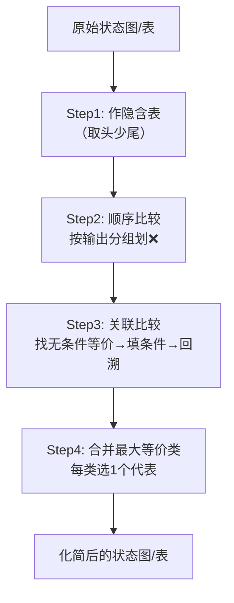

# 03-1 状态化简 (State Minimization)

> [!abstract] 概述
> 状态化简的最终目的是**消除时序逻辑电路中的多余状态**，从而减少所需的触发器数量，降低硬件电路的复杂度和成本。

---

## 🎯 考点定位

| 考查角度 | 要求 |
|:--------:|:----:|
| **概念辨析** | 等价状态 / 等价类 / 最大等价类的定义与关系 |
| **方法应用** | 隐含表法化简状态（大题常考步骤） |
| **化简结果** | 从最大等价类中选代表状态，画出化简后的状态图/表 |

> [!tip] 命题规律
> 状态化简通常作为**时序逻辑电路设计大题中的一个环节**出现，一般不单独出题。掌握隐含表法四步走即可拿分。

---

## 📇 速记卡 — 核心概念一览

| 概念 | 一句话定义 | 记忆点 |
|:----:|:----------|:------:|
| **等价状态** | 相同输入→相同输出+等效次态 | 输出+次态，**缺一不可** |
| **传递性** | A≡B, B≡C ⇒ A≡C | 数学等价关系 |
| **等价类** | 两两等价的状态集合 | 集合内的状态可互换 |
| **最大等价类** | 不能再合并的等价类 | 每个类**只留1个代表** |

---

## 一、核心概念（逐层递进）

### 1️⃣ 等价状态

> [!info] 判定条件
> 两个状态等价，**必须同时满足**：
> 1. **输出完全相同** — 所有相同输入下，输出 $Y$ 一致
> 2. **次态等效** — 次态转移属以下三种情况之一

**次态等效的三种情况：**

| 类型 | 模式 | 示例 | 记忆口诀 |
|:----:|:----|:----|:--------:|
| **a. 次态相同** | A→C, B→C | 最简单，直接等效 | **同归** |
| **b. 次态交错** | A→B, B→A | 互相依赖，形成闭环 | **互指** |
| **c. 条件等价** | A→(C,D), B→(C,D) | 若(C,D)等价则A,B等价 | **牵连** |

### 2️⃣ 传递性

> 等价状态之间具有数学上的传递关系：$A \equiv B$ 且 $B \equiv C$ ⇒ $A \equiv C$

### 3️⃣ 等价类 → 4️⃣ 最大等价类

> [!example] 推导过程
> 原状态集：$\{A, B, C, D, E, F, G\}$
>
> 通过隐含表法求得全部等价关系：
> - $(A, D, F)$ 两两等价
> - $(B, E)$ 等价
> - $(C, G)$ 等价
>
> 这些就是 **3 个最大等价类**，化简后只需 **3 个状态** 替代原来的 7 个状态。

---

## 二、隐含表法

### 口诀：「取头少尾」

- **纵轴**：去掉第一个状态（取头）
- **横轴**：去掉最后一个状态（少尾）
- 形成**阶梯状表格**，保证任意两个状态之间只有一个交叉格

### 隐含表符号说明

| 符号 | 含义 | 应对策略 |
|:----:|:----|:--------:|
| ❌ | 绝不等价（输出不同/隐含条件不成立） | 放弃，继续看下一格 |
| ✔️ | 确定等价（无条件 or 隐含条件已证实） | 标记，后续用于关联验证 |
| (AF, BE) | 隐含条件（等价的前提条件） | 需去其他格子证实后才可打 ✔️ |

---

## 三、实战推导：隐含表「四步走」

> [!warning] 核心考法
> 考试中给你一个状态表/状态图，要求你**用隐含表法化简状态**。按以下4步，步步得分。

### Step 1️⃣ — 作表

画出阶梯状表格，纵轴**取头**（去掉第一个状态），横轴**少尾**（去掉最后一个状态）。

```
纵轴：A B C D E F（共6行，去掉尾状态 G）
横轴：B C D E F（共5列，去掉头状态 A）
```

### Step 2️⃣ — 顺序比较（划 ❌）

**依据：输出是否相同。** 将状态按输出分组：

| 输出类型 | 状态 |
|:--------:|:----:|
| 输出 = 00 | A, D, F |
| 输出 = 11 | B, C, E, G |

> [!danger] 操作
> 不同组的状态之间 → 直接打 ❌

### Step 3️⃣ — 关联比较（填条件 + 打 ✔️）

对尚未打 ❌ 的格子，分析次态关系：

**第一步：找无条件等价**

| 格子 | 次态分析 | 结论 |
|:----:|:---------|:----:|
| (B, E) | B→E,C；E→B,C（交错） | ✅ ✔️ |
| (C, G) | C→A,D；G→A,D（相同） | ✅ ✔️ |
| (A, F) | A→A,E；F→F,E（各自与自己等价） | ✅ ✔️ |

**第二步：写隐含条件**

| 格子 | 次态分析 | 填入条件 |
|:----:|:---------|:--------:|
| (A, D) | A→A,F；D→E,B | (AF, BE) |
| (D, F) | D→F,F；F→B,E | (BE) |

**第三步：关联回溯验证**

| 推断链路 | 结论 |
|:---------|:----:|
| (B,E) 已 ✔️ → (D,F) 的隐含条件 (BE) 成立 → | ✅ (D,F) 打 ✔️ |
| (A,F) 已 ✔️ 且 (B,E) 已 ✔️ → (A,D) 的隐含条件 (AF,BE) 均成立 → | ✅ (A,D) 打 ✔️ |

> [!tip] 回溯技巧
> 从**已被标记 ✔️ 的格子**出发，反向扫描哪些格子的隐含条件包含了这些已确认的等价对，逐层推进。

### Step 4️⃣ — 合并最大等价类

| 已证实的等价关系 | 传递性推导 | 最大等价类 |
|:----------------|:-----------|:----------:|
| (A,F) ✔️, (A,D) ✔️, (D,F) ✔️ | A≡D≡F | **(A, D, F)** |
| (B,E) ✔️ | 仅此一对 | **(B, E)** |
| (C,G) ✔️ | 仅此一对 | **(C, G)** |

> [!success] 最终结果
> 该时序电路可被化简为 **3 个状态**：$(A, D, F)$、$(B, E)$、$(C, G)$。用新状态 $A', B', C'$ 替代即可。

---

## 四、完整隐含表（参考）

**纵轴**：A B C D E F（去掉尾 G）
**横轴**：B C D E F（去掉头 A）

|   | B | C | D | E | F |
|:-:|:-:|:-:|:-:|:-:|:-:|
| **A** | ❌ | ❌ | ✔️ (AF,BE) | ❌ | ✔️ |
| **B** | — | ❌ | ❌ | ✔️ | ❌ |
| **C** | — | — | ❌ | ❌ | (AE,CD) |
| **D** | — | — | — | ❌ | ✔️ (BE) |
| **E** | — | — | — | — | ❌ |
| **F** | — | — | — | — | — |

---

## 五、整体流程



---

## ⚠️ 易错点 & 避坑指南

| 易错点 | 错误做法 | ✅ 正确做法 |
|:------|:---------|:-----------|
| **遗漏等价** | 只比较了输出，没比较次态 | 输出+次态，**两个条件必须同时满足** |
| **漏掉传递性** | 只标记 (A,B) 和 (B,C)，漏了 (A,C) | 检查所有可传递的等价关系 |
| **隐含条件未回溯** | 填了条件但不回去验证 | 条件成立后才能打 ✔️，否则 ❌ |
| **等价类合并不全** | 漏掉中间状态 | 用传递性穷举，确认两两等价后再合并 |

---

> [!tip] 考试要点速查
> 1. **等价状态的判定条件**：输出相同 + 次态等效
> 2. **传递性的应用**：$A \equiv B$，$B \equiv C$ → $A \equiv C$
> 3. **隐含表法四步**：作表 → 顺序比较划 ❌ → 关联比较填条件打 ✔️ → 合并最大等价类
> 4. **「取头少尾」原则**：画隐含表的口诀
