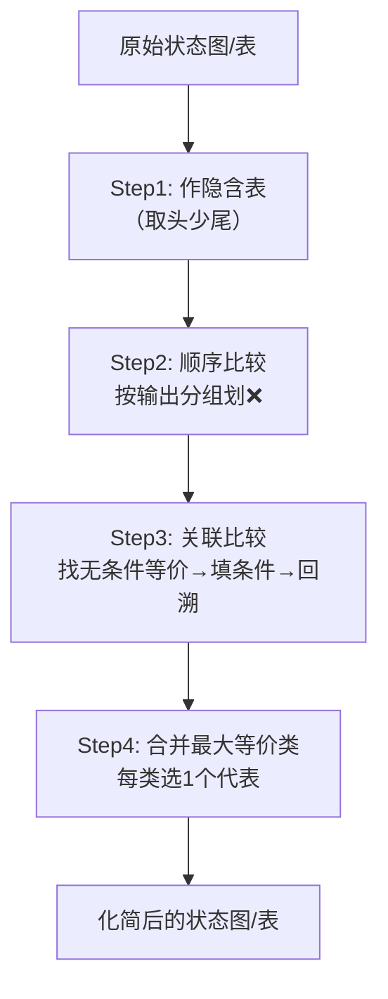

# 03-1 状态化简 (State Minimization)

> [!abstract] 概述
> 状态化简的最终目的是**消除时序逻辑电路中的多余状态**，从而减少所需的触发器数量，降低硬件电路的复杂度和成本。

---

## 🎯 考点定位

| 考查角度 | 要求 |
|:--------:|:----:|
| **概念辨析** | 等价状态 / 等价类 / 最大等价类的定义与关系 |
| **方法应用** | 隐含表法化简状态（大题常考步骤） |
| **化简结果** | 从最大等价类中选代表状态，画出化简后的状态图/表 |

> [!tip] 命题规律
> 状态化简通常作为**时序逻辑电路设计大题中的一个环节**出现，一般不单独出题。掌握隐含表法四步走即可拿分。

---

## 一、核心概念（逐层递进）

### 1️⃣ 等价状态

> [!info] 判定条件
> 两个状态等价，**必须同时满足**：
> 1. **输出完全相同** — 所有相同输入下，输出 $Y$ 一致
> 2. **次态等效** — 次态转移属以下三种情况之一

**次态等效的三种情况：**

| 类型 | 模式 | 示例 | 记忆口诀 |
|:----:|:----|:----|:--------:|
| **a. 次态相同** | A→C, B→C | 最简单，直接等效 | **同归** |
| **b. 次态交错** | A→B, B→A | 互相依赖，形成闭环 | **互指** |
| **c. 条件等价** | A→(C,D), B→(C,D) | 若(C,D)等价则A,B等价 | **牵连** |

### 2️⃣ 传递性

> 等价状态之间具有数学上的传递关系：
>
> $$A \equiv B \quad \text{且} \quad B \equiv C \quad \Rightarrow \quad A \equiv C$$

### 3️⃣ 等价类

两两等价的状态构成的集合，集合内的状态可互换。

### 4️⃣ 最大等价类

不能再合并的等价类，**每个类只保留 1 个代表状态**。

> [!example] 化简思路
> 原状态集：$\{A, B, C, D, E, F, G\}$（7 个状态）
>
> 通过隐含表法求得全部等价关系：
> - $(A, D, F)$ 两两等价
> - $(B, E)$ 等价
> - $(C, G)$ 等价
>
> 得到 **3 个最大等价类** $\to$ 化简后只需 **3 个状态**。

---

## 二、隐含表法 — 系统化解题方法

隐含表法是寻找等价状态最系统、最不易遗漏的方法。核心口诀：**"取头少尾"**。

### 整体流程预览



---

### Step 0：原始状态转移表

这是化简前的原始状态表（格式：`现态 -> 次态 / 输出`）。

| 现态 (S) | 输入 X = 0 (次态 / 输出) | 输入 X = 1 (次态 / 输出) |
|:--------:|:------------------------:|:------------------------:|
| **A**    | A / 0                    | E / 0                    |
| **B**    | E / 1                    | C / 1                    |
| **C**    | A / 1                    | D / 1                    |
| **D**    | F / 0                    | B / 0                    |
| **E**    | B / 1                    | C / 1                    |
| **F**    | F / 0                    | E / 0                    |
| **G**    | A / 1                    | D / 1                    |

---

### Step 1：作表（取头少尾）

> **取头少尾**：纵轴去掉第一个状态 A（取头），横轴去掉最后一个状态 G（少尾），形成阶梯状表格。

| 状态 | A   | B   | C   | D   | E   | F   |
|:----:|:---:|:---:|:---:|:---:|:---:|:---:|
| **B** | ❌  |     |     |     |     |     |
| **C** | ❌  | ❌ (AE, CD) |     |     |     |     |
| **D** | ✔️ (AF, BE) | ❌  | ❌  |     |     |     |
| **E** | ❌  | ✔️  | ❌ (AB, CD) | ❌  |     |     |
| **F** | ✔️ (AF) | ❌  | ❌  | ✔️ (BE) | ❌  |     |
| **G** | ❌  | ❌ (AE, CD) | ✔️ (AD) | ❌  | ❌ (AB, CD) | ❌  |

> **符号说明：**
> - **❌（红叉）**：两个状态**绝不等价**（输出不同或隐含条件不成立）
> - **✔️（对勾）**：两个状态**确定等价**（无条件等价或隐含条件已验证成立）
> - **括号内字母（如 AF, BE）**：两个状态等价的**前提条件**（隐含条件）

---

### Step 2：顺序比较（划 ❌） — 第一遍筛选

直接比较两个状态的**输出**是否完全相同：

- 观察原始状态表：**A, D, F** 的输出全是 `0,0`（第一类）；**B, C, E, G** 的输出全是 `1,1`（第二类）
- **动作**：将所有**跨类**状态对打上 ❌（如 A&B, D&E 等）

---

### Step 3：关联比较（填条件与打 ✔️） — 第二遍及后续筛选

针对还没有打 ❌ 的格子，比较它们的**次态**。

**（1）找无条件等价：**

| 格子 | 比较内容 | 结论 |
|:---:|:---------|:----:|
| (B,E) | B的次态→E,C；E的次态→B,C | 次态交错 → **✔️** |
| (C,G) | C的次态→A,D；G的次态→A,D | 次态相同 → **✔️** |
| (A,F) | A的次态→A,E；F的次态→F,E | 自己与自己比 → **✔️** |

**（2）写隐含条件：**

| 格子 | 次态对 | 填入条件 |
|:---:|:-------|:--------:|
| (A,D) | (A,F) 和 (E,B) | `(AF, BE)` |
| (D,F) | (F,F) 和 (B,E) | `(BE)` |

**（3）关联回溯验证（关键步骤）：**

- `(D,F)` 的隐含条件 `(BE)`：已证 B≡E（✔️）→ 条件成立 → 将 `(D,F)` 打 **✔️**
- `(A,D)` 的隐含条件 `(AF, BE)`：已证 A≡F 且 B≡E（✔️）→ 条件成立 → 将 `(A,D)` 打 **✔️**

> [!warning] 易漏点
> 填了隐含条件**必须回去验证**，条件成立才能打 ✔️，否则要改为 ❌。

---

### Step 4：合并最大等价类

根据隐含表中所有的 ✔️ 汇总：

| ✔️ 标记 | 传递推导 | 最大等价类 |
|:------:|:---------|:----------:|
| (A,F), (A,D), (D,F) | A≡F, A≡D, D≡F | **$(A, D, F)$** |
| (B,E) | 直接等价 | **$(B, E)$** |
| (C,G) | 直接等价 | **$(C, G)$** |

**最终结果：** 该时序电路可化简为 **3 个状态**：

$$\boxed{(A, D, F) \quad (B, E) \quad (C, G)}$$

---

## 三、解题口诀速记

```
作表取头又少尾，输出分组先划叉
次态比较找等价，填完条件要回溯
传递推导合并类，每类只留一代表
```

---

## ⚠️ 易错点 & 避坑指南

| 易错点 | 错误做法 | ✅ 正确做法 |
|:------|:---------|:-----------|
| **遗漏等价** | 只比较了输出，没比较次态 | 输出+次态，**两个条件必须同时满足** |
| **漏掉传递性** | 只标记 (A,B) 和 (B,C)，漏了 (A,C) | 检查所有可传递的等价关系 |
| **隐含条件未回溯** | 填了条件但不回去验证 | 条件成立后才能打 ✔️，否则 ❌ |
| **等价类合并不全** | 漏掉中间状态 | 用传递性穷举，确认两两等价后再合并 |

---

> [!tip] 考试要点速查
> 1. **等价状态的判定条件**：输出相同 + 次态等效
> 2. **传递性的应用**：$A \equiv B$，$B \equiv C$ $\Rightarrow$ $A \equiv C$
> 3. **隐含表法四步**：作表 $\to$ 顺序比较划 ❌ $\to$ 关联比较填条件打 ✔️ $\to$ 合并最大等价类
> 4. **「取头少尾」原则**：画隐含表的口诀
