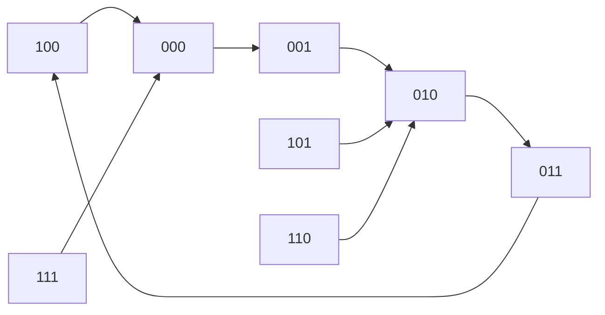

# 04 异步时序逻辑电路的分析

> [!abstract] 概述
> 异步时序电路与同步时序电路最大的区别：**没有统一的时钟脉冲**，各存储单元状态更新不同时。

## 一、异步时序电路分析注意事项

### 1. 必须考虑各触发器的时钟信号

- 需列出各触发器的**时钟信号方程组**
- 用 $cp_n$ 表示第 $n$ 个触发器是否有时钟信号作用
  - 有时钟信号有效沿 → $cp_n = 1$（触发器可能翻转）
  - 无时钟信号有效沿 → $cp_n = 0$（触发器保持原态）

### 2. 必须按信号作用顺序逐级推导

- 同步电路可从任意触发器开始分析
- **异步电路必须从输入信号能触发的第一个触发器开始**，逐级确定

### 3. 状态转换有时间延迟

- 各触发器不是同时更新状态的
- 存在"不稳定"的过渡期
- 输入信号必须等电路稳定后才允许改变

## 二、异步电路的转换方程

引入 $cp_n$ 后，触发器特性方程改写为：

$$Q^{n+1} = D \cdot cp + Q^n \cdot \bar{cp}$$

> [!note] 含义
> - $cp = 1$：触发器正常更新（次态 = 激励值）
> - $cp = 0$：触发器保持现态

## 三、分析步骤

```
列时钟方程组 + 激励方程组 → 改写转换方程（引入cp）
→ 从第一个触发器开始逐级推导 → 列转换表 → 画状态图 → 确定功能
```


## 四、异步与同步电路对比

| 特征 | 同步电路 | 异步电路 |
|------|---------|---------|
| 时钟 | 统一CP | 不统一或无CP |
| 状态更新 | 同时 | 逐级延迟 |
| 分析复杂度 | 较低 | 较高 |
| 工作速度 | 较快 | 较慢 |
| 可靠性 | 高（不受时钟偏移影响） | 较低（存在竞争冒险） |

## 五、典型例题：异步五进制计数器分析

> [!example] 题目
> 由三个下降沿触发的 JK 触发器（$FF_0, FF_1, FF_2$）构成异步时序电路，$Q_2$ 为高位，$Q_0$ 为低位。分析其逻辑功能并判断自启动能力。


### 1. 逻辑方程推导

#### 时钟方程（异步电路关键）

$$CP_0 = CP \downarrow \quad \text{（外部时钟下降沿触发）}$$
$$CP_1 = Q_0 \downarrow \quad \text{（$Q_0$ 下降沿触发）}$$
$$CP_2 = CP \downarrow \quad \text{（外部时钟下降沿触发）}$$

#### 激励方程

$$FF_0: J_0 = \overline{Q_2},\quad K_0 = 1$$
$$FF_1: J_1 = 1,\quad K_1 = 1$$
$$FF_2: J_2 = Q_0 \cdot Q_1,\quad K_2 = 1$$

#### 状态方程（代入 $Q^{n+1} = J\overline{Q} + \overline{K}Q$）

$$Q_0^{n+1} = \overline{Q_2}\overline{Q_0} + \overline{1}Q_0 = \overline{Q_2}\,\overline{Q_0} \quad \text{（$CP_0\downarrow$ 时生效）}$$
$$Q_1^{n+1} = 1\cdot\overline{Q_1} + \overline{1}Q_1 = \overline{Q_1} \quad \text{（$CP_1\downarrow$ 即 $Q_0\downarrow$ 时生效）}$$
$$Q_2^{n+1} = Q_0Q_1\overline{Q_2} + \overline{1}Q_2 = Q_0Q_1\overline{Q_2} \quad \text{（$CP_2\downarrow$ 时生效）}$$

### 2. 状态转换表

初始状态 $Q_0Q_1Q_2 = 000$，列顺序 $Q_0, Q_1, Q_2$，二进制权重 $Q_2(MSB)Q_1Q_0(LSB)$：

| CP | $Q_0Q_1Q_2$ (现态) | 动作分析 | $Q_0^{n+1}Q_1^{n+1}Q_2^{n+1}$ (次态) | $Q_2Q_1Q_0$ |
|:---:|:---:|---|---|:---:|
| 0 | 0 0 0 | — | 1 0 0 | 001 (1) |
| 1 | 1 0 0 | $CP_0\downarrow$: $Q_0:1\to0$ → $FF_1$翻转($0\to1$) ；$CP_2\downarrow$: $Q_2^{n+1}=0$ | 0 1 0 | 010 (2) |
| 2 | 0 1 0 | $CP_0\downarrow$: $Q_0:0\to1$ → $FF_1$不动；$CP_2\downarrow$: $Q_2^{n+1}=0$ | 1 1 0 | 011 (3) |
| 3 | 1 1 0 | $CP_0\downarrow$: $Q_0:1\to0$ → $FF_1$翻转($1\to0$)；$CP_2\downarrow$: $Q_2^{n+1}=1$ | 0 0 1 | 100 (4) |
| 4 | 0 0 1 | $CP_0\downarrow$: $Q_0^{n+1}=0$ → $FF_1$不动；$CP_2\downarrow$: $Q_2^{n+1}=0$ | 0 0 0 | 000 (0) |

### 3. 状态转换图



> [!note] 状态图说明
> - 圆圈内数据排列为 $Q_2Q_1Q_0$（高位在左）
> - 实线箭头：有效工作循环
> - 虚线箭头：无效状态回归路径

### 4. 功能与自启动分析

**有效工作循环：**
$$000 \rightarrow 001 \rightarrow 010 \rightarrow 011 \rightarrow 100 \rightarrow 000$$

结论：该电路是一个 **模5（五进制）加法计数器**。

**无效状态及自启动验证：**

电路共 3 个触发器，$2^3=8$ 个状态，5 个有效状态外有 3 个无效状态：**101, 110, 111**。

| 当前状态 | $Q_0^{n+1}$ | $Q_1^{n+1}$ | $Q_2^{n+1}$ | 次态 | 回归？ |
|:---:|:---:|:---:|:---:|:---:|:---:|
| 101 | $\overline1\cdot\overline1=0$（产生下降沿） | $\overline0=1$（翻转） | $1\cdot0\cdot\overline1=0$ | 010 | 是 |
| 110 | $\overline1\cdot\overline0=0$（无变化） | 保持1 | $0\cdot1\cdot\overline1=0$ | 010 | 是 |
| 111 | $\overline1\cdot\overline1=0$（产生下降沿） | $\overline1=0$（翻转） | $1\cdot1\cdot\overline1=0$ | 000 | 是 |

所有无效状态均在 **1个时钟周期内** 回归有效循环。

### 5. 最终结论

> [!success] 结论
> - **逻辑功能**：异步五进制加法计数器
> - **自启动能力**：具备自启动能力，不受开机随机状态干扰
