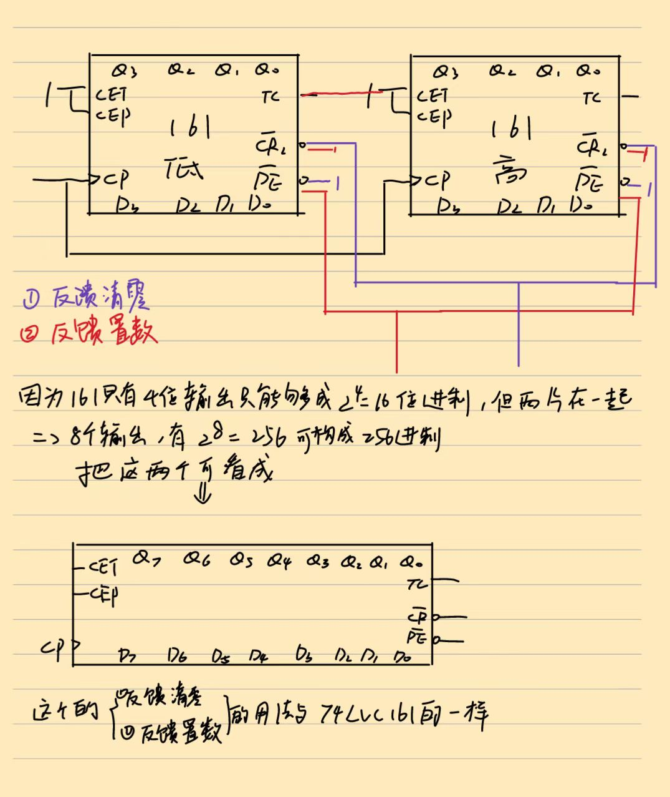
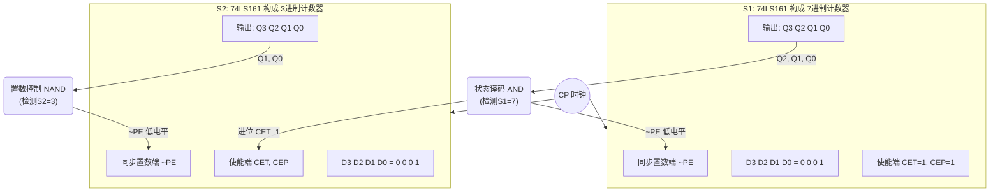

# 06 计数器

> [!abstract] 概述
> 计数器是最常用的时序电路，功能包括：**计数、分频、定时、产生节拍脉冲**。

## 一、计数器的分类

| 分类依据 | 类型 |
|---------|------|
| 触发器动作 | 同步计数器、异步计数器 |
| 数值增减 | 递增计数器、递减计数器、可逆计数器 |
| 编码方式 | 二进制、BCD、循环码 |
| 模数 | 模 $n$（$n$ 进制） |

**模 $M$**：计数器一个计数周期内的状态总数。

## 二、二进制计数器
###  典型集成计数器：74LVC161


**功能**：4 位同步二进制递增计数器

| 引脚 | 功能 | 有效电平 |
|------|------|---------|
| $\overline{CR}$ | 异步清零 | 低电平有效 |
| $\overline{PE}$ | 同步并行置数 | 低电平有效 |
| CEP, CET | 计数使能 | 高电平有效 |
| CP | 时钟 | 上升沿 |
| $D_3 \sim D_0$ | 并行数据输入 | - |
| $Q_3 \sim Q_0$ | 并行输出 | - |
| TC | 进位输出 | $Q_3Q_2Q_1Q_0 \cdot CET$ |

**功能表**：

| $\overline{CR}$ | $\overline{PE}$ | CEP | CET | CP | 功能 |
|:---:|:---:|:---:|:---:|:---:|------|
| L | × | × | × | × | 异步清零 |
| H | L | × | × | ↑ | 同步置数 |
| H | H | L | × | × | 保持 |
| H | H | × | L | × | 保持（TC=0） |
| H | H | H | H | ↑ | 计数 |


## 三、用集成计数器构成任意模数计数器

### 0. 先看懂 74LVC161 的功能表（这是基础）

| 输入 |  |  |  | 输出行为 | 说明 |
|:---:|:---:|:---:|:---:|---------|------|
| $\overline{CR}$=L | × | × | × | $Q$ **立即**变 0000 | **异步**清零（不受 CP 控制） |
| $\overline{CR}$=H, $\overline{PE}$=L | × | × | CP↑ | $Q \gets D$ | **同步**置数（等 CP 到才生效） |
| $\overline{CR}$=H, $\overline{PE}$=H | CEP·CET=H | CP↑ | $Q$ 加 1 | 正常计数 |
| $\overline{CR}$=H, $\overline{PE}$=H | CEP·CET=L | × | $Q$ 不变 | 保持 |

> 关键记忆：**$\overline{CR}$ 最高优先级**（异步），**$\overline{PE}$ 次高**（同步），**使能控制计数/保持**

---

### 概览：反馈清零 vs 反馈置数

| | **反馈清零法** | **反馈置数法** |
|:--|:--------------|:--------------|
| **一句话** | 到了终点就炸 | 终点前一步就跳 |
| **控制引脚** | $\overline{CR}$（清零端） | $\overline{PE}$（置数端） |
| **检测哪个状态** | 检测 $S_N$（第 $N$ 个状态） | 检测 $S_{N-1}$（第 $N-1$ 个状态） |
| **回到哪里** | 强制回到 0000 | 加载 $D$ 端设定的值 |
| **适用条件** | 芯片有清零端 | 芯片有置数端 |

> [!tip] 口诀记忆
> - **清零看 $S_N$**：一到终点就炸，甭等 CP
> - **置数看 $S_{N-1}$**：到终点前一步刹车，下一个 CP 再跳

---

### 方法1：反馈清零法

#### 1.1 原理

> 当计数器计数到 $S_N$（第 $N$ 个状态）时，译码电路检测到该状态，**立即**将 $\overline{CR}$ 拉低 → 输出强制归零。

#### 1.2 两种清零方式对比

| 清零方式 | 触发时刻 | 检测哪个状态 | $S_N$ 会出现吗？ |
|:--------|:--------|:-----------|:---------------|
| **异步清零** | 到达 $S_N$ **立刻** | $S_N$ | 出现一瞬间（窄脉冲） |
| **同步清零** | 到达 $S_{N-1}$ → **下一个 CP 到来时** | $S_{N-1}$ | **不出现** |

#### 1.3 通用步骤

1. 确定模数 $N$
2. 若是 **异步清零**：$S_N$ 译码 → 接 $\overline{CR}$
3. 若是 **同步清零**：$S_{N-1}$ 译码 → 接 $\overline{CR}$

---

#### 1.4 例：74LVC161 **异步清零** → 模9计数器

> **设计思路**：$S_N = S_9 = 1001$ → 检测 $Q_3$ 和 $Q_0$ 同时为 1 → 拉低 $\overline{CR}$

$$\overline{CR} = \overline{Q_3 Q_0}$$

**状态转移表（核心）**：

| CP | $Q_3$ | $Q_2$ | $Q_1$ | $Q_0$ | 十进制 | $\overline{CR}$ | 事件 |
|:--:|:-----:|:-----:|:-----:|:-----:|:------:|:---------------:|:----|
| 0 | 0 | 0 | 0 | 0 | 0 | H | 起始 |
| 1 | 0 | 0 | 0 | 1 | 1 | H | ↑ |
| 2 | 0 | 0 | 1 | 0 | 2 | H | ↑ |
| 3 | 0 | 0 | 1 | 1 | 3 | H | ↑ |
| 4 | 0 | 1 | 0 | 0 | 4 | H | ↑ |
| 5 | 0 | 1 | 0 | 1 | 5 | H | ↑ |
| 6 | 0 | 1 | 1 | 0 | 6 | H | ↑ |
| 7 | 0 | 1 | 1 | 1 | 7 | H | ↑ |
| 8 | 1 | 0 | 0 | 0 | 8 | H | ↑ |
| **→9** | **1** | **0** | **0** | **1** | **9** | **L** | ⚡ **$S_9$ 到达 → 异步清零 → 瞬间跳回 0000** |
| 0(重) | 0 | 0 | 0 | 0 | 0 | H | 重新从 0 开始 |
| 1(重) | 0 | 0 | 0 | 1 | 1 | H | ... |

**状态转换图**：
```
      ┌──────────────────────────────────────────┐
      │                                           │
      ∨                                           │
  0000 → 0001 → 0010 → 0011 → 0100 → 0101 → 0110 → 1000
      ↑                                            │
      └────────────────────────────────────────────┘
                                       ↑ 到达1001(一闪而过)
                                         检测Q3·Q0=1 → 清零
```

**补充说明**：
- 有效计数状态：**0000 ~ 1000**（共 9 个）
- 1001 作为**过渡态**存在极短时间（清零响应时间），**输出端看不到稳定的 1001**

---

### 方法2：反馈置数法

#### 2.1 原理

> 当计数器计数到 $S_{N-1}$（第 $N-1$ 个状态）时，译码电路检测到该状态，拉低 $\overline{PE}$ → **下一个 CP 上升沿**时将 $D$ 端预设值加载到输出。

#### 2.2 通用步骤

1. 确定模数 $N$
2. 选择起始状态 $S_{start}$（通常是 0000，也可以不是）
3. 将 $S_{N-1}$（**终点前一步**）译码 → 接 $\overline{PE}$
4. $D$ 端接起始状态值


---

#### 2.3 例：74LVC161 **同步置数** → 模9计数器（方案一：从 0000 开始）

> **设计思路**：$S_{N-1} = S_8 = 1000$ → 检测 $Q_3 = 1$ → 拉低 $\overline{PE}$ → 下个 CP 加载 $D=0000$

$$\overline{PE} = \overline{Q_3}, \quad D_3D_2D_1D_0 = 0000$$

**状态转移表（核心）**：

| CP | $Q_3$ | $Q_2$ | $Q_1$ | $Q_0$ | 十进制 | $\overline{PE}$ | 事件 |
|:--:|:-----:|:-----:|:-----:|:-----:|:------:|:---------------:|:----|
| 0 | 0 | 0 | 0 | 0 | 0 | H | 起始 |
| 1 | 0 | 0 | 0 | 1 | 1 | H | ↑ |
| 2 | 0 | 0 | 1 | 0 | 2 | H | ↑ |
| 3 | 0 | 0 | 1 | 1 | 3 | H | ↑ |
| 4 | 0 | 1 | 0 | 0 | 4 | H | ↑ |
| 5 | 0 | 1 | 0 | 1 | 5 | H | ↑ |
| 6 | 0 | 1 | 1 | 0 | 6 | H | ↑ |
| 7 | 0 | 1 | 1 | 1 | 7 | H | ↑ |
| **→8** | **1** | **0** | **0** | **0** | **8** | **L** | 🚩 **$S_8$ 到达 → $\overline{PE}$ 拉低** |
| **→9** | **0** | **0** | **0** | **0** | **0** | H | ✅ **CP 上升沿 → 同步加载 $D=0000$ → 跳回起始** |
| 10 | 0 | 0 | 0 | 1 | 1 | H | 重新开始 |
| 11 | 0 | 0 | 1 | 0 | 2 | H | ... |

**状态转换图**：
```
      ┌──────────────────────────────────────────┐
      │                                           │
      ∨                                           │
  0000 → 0001 → 0010 → 0011 → 0100 → 0101 → 0110 → 1000
      ↑                                            │
      └────────────────────────────────────────────┘
                                       ↑ 检测到1000后
                                         ⏳ 下一个CP才跳回0000
```

> [!note] 与反馈清零法的关键区别
> - 反馈清零法的状态 **1001 会闪一下**（窄脉冲）
> - 反馈置数法的状态 **1001 从未出现**（到 1000 就跳回去了）

---

#### 2.4 例：反馈置数 → 模9计数器（方案二：利用进位输出 TC）

> **设计思路**：计数到 1111 时 TC=1（表示溢出了）→ 反馈到 $\overline{PE}$ → 下个 CP 加载 $D=0111$

$$TC = Q_3Q_2Q_1Q_0 \cdot CET, \quad \overline{PE} = \overline{TC}, \quad D_3D_2D_1D_0 = 0111$$

**状态转移表**：

| CP | $Q_3$ | $Q_2$ | $Q_1$ | $Q_0$ | 十进制 | 事件 |
|:--:|:-----:|:-----:|:-----:|:-----:|:------:|:----|
| 0 | 0 | 1 | 1 | 1 | **7** | 起始（预置） |
| 1 | 1 | 0 | 0 | 0 | 8 | 计数 ↑ |
| 2 | 1 | 0 | 0 | 1 | 9 | 计数 ↑ |
| 3 | 1 | 0 | 1 | 0 | 10 | 计数 ↑ |
| 4 | 1 | 0 | 1 | 1 | 11 | 计数 ↑ |
| 5 | 1 | 1 | 0 | 0 | 12 | 计数 ↑ |
| 6 | 1 | 1 | 0 | 1 | 13 | 计数 ↑ |
| 7 | 1 | 1 | 1 | 0 | 14 | 计数 ↑ |
| **→8** | **1** | **1** | **1** | **1** | **15** | 🚩 **TC=1 → $\overline{PE}$ 拉低** |
| **→9** | **0** | **1** | **1** | **1** | **7** | ✅ **下个 CP → 加载 $D=0111$ → 回到 7** |

> 有效状态：**7→8→9→10→11→12→13→14→15→回到7**，共 9 个状态

**状态转换图**：
```
  0111 → 1000 → 1001 → 1010 → 1011 → 1100 → 1101 → 1110 → 1111
    ↑                                                          │
    └──────────────────────────────────────────────────────────┘
```

---

### 3. 终极对比 ⭐ 考前必看

#### 反馈清零法 vs 反馈置数法（模9，74LVC161）

| 对比维度 | 反馈清零（异步） | 反馈置数（方案一） | 反馈置数（方案二） |
|:--------|:---------------|:-----------------|:-----------------|
| **检测状态** | 1001（$S_9$） | 1000（$S_8$） | 1111（$TC=1$） |
| **控制引脚** | $\overline{CR}$ | $\overline{PE}$ | $\overline{PE}$ |
| **动作时刻** | **立即**（异步） | **下一个 CP**（同步） | **下一个 CP**（同步） |
| **起始值** | 0000（强制） | 0000（D端设） | 0111（D端设） |
| **有效范围** | 0→1→...→8 | 0→1→...→8 | 7→8→...→15 |
| **1001 出现吗？** | ✅ 一闪而过 | ❌ 从未出现 | ❌ 从未出现 |
| **译码电路** | 与非门 $Q_3Q_0$ | 反相器 $Q_3$ | 直接接 $TC$（最简） |

#### 类比记忆

| 方法 | 类比 | 谁被抓住了？ | 回到哪里？ |
|:----|:----|:-----------|:----------|
| **反馈清零法** | 🏃 跑百米到**终点线**瞬间被拽回起点 | 1001（终点） | 0000（起点） |
| **反馈置数法** | 🏃 折返跑到**终点前一步**就回头跑 | 1000（倒数第二步） | 0000（起点） |

---
### 方法3:  整体反馈法（M<N的情况）



---

### 方法4: 级联法（$M > N$ 的情况）

当目标进制数 $N$ 较大、单片计数器不够用时，使用级联法扩展。以下以设计 **21 进制计数器**为例，综合运用级联法与反馈置数法。

---

#### 4.1 核心设计思路

当目标进制数 $N$ 可以被分解为两个较小的因数相乘（即 $N = N_1 \times N_2$）时，适合使用级联法。

- **拆解公式**：$21 = 7 \times 3$
- **设计方案**：使用两片同步 16 进制计数器（如 74LS161），其中一片 $S_1$ 设计为 **7 进制**，另一片 $S_2$ 设计为 **3 进制**
- **运行机制**：
  - $S_1$ 作为低位计数器，每循环 7 个状态，向 $S_2$ 输出一个进位使能信号
  - $S_2$ 作为高位计数器，只有在收到 $S_1$ 的进位信号时才计数，每 3 个进位信号完成一次循环
  - 整体即构成 $7 \times 3 = 21$ 进制计数器

---

#### 4.2 状态参数计算（反馈置数法）

利用反馈置数法公式：

$$X_i - M_i + 1 = N_i$$

其中 $X_i$ 为反馈置数状态，$M_i$ 为预置初值，$N_i$ 为目标进制。

**① 计数器 $S_1$（7 进制）**

- 令预置初值 $M_1 = 1$（即二进制 0001）
- 代入公式：$X_1 - 1 + 1 = 7 \Rightarrow X_1 = 7$（即二进制 0111）
- 逻辑：从 0001 开始计数，当状态到达 0111 时，产生反馈信号，在下一个 CP 脉冲到来时同步置数回 0001
- **译码条件**：$Q_2 Q_1 Q_0 = 111$

**② 计数器 $S_2$（3 进制）**

- 令预置初值 $M_2 = 1$（即二进制 0001）
- 代入公式：$X_2 - 1 + 1 = 3 \Rightarrow X_2 = 3$（即二进制 0011）
- 逻辑：从 0001 开始计数，当状态到达 0011 时，**且满足进位条件时**，在下一个 CP 脉冲同步置数回 0001
- **译码条件**：$Q_1 Q_0 = 11$

---

#### 4.3 电路逻辑连线图

两片 74LS161 共享同一个时钟源（同步级联），$S_1$ 的 7 进制译码输出同时作为 $S_2$ 的进位使能。



> **连线要点**：
> - $S_1$ 的 CET = CEP = 1（始终使能计数）
> - $S_1$ 状态译码（检测 0111）→ 同时控制 $S_1$ 的 $\overline{PE}$ **和** $S_2$ 的 CET
> - $S_2$ 的 CET 由 $S_1$ 的译码输出控制（收到进位才允许计数）
> - $S_2$ 的状态译码（检测 0011）→ 控制 $S_2$ 的 $\overline{PE}$

---

#### 4.4 状态转换表与重点解析

下表完整推演了 21 个时钟周期的状态变化。重点观察 $S_2$ 何时被允许加 1。

| CP | $S_1$ 状态 | $S_2$ 状态 | 动作说明 |
|:--:|:----------:|:----------:|:---------|
| 1 | 0001 | 0001 | 初始状态 |
| 2 | 0010 | 0001 | $S_1$ 正常计数，$S_2$ 保持 |
| $\vdots$ | $\vdots$ | $\vdots$ | $\vdots$ |
| **7** | **0111** | **0001** | 🚩 **$S_1$ 到达 7。产生进位使能 CET=1** |
| **8** | **0001** | **0010** | $S_1$ 置数回初值，$S_2$ 收到进位，加 1 变为 2 |
| $\vdots$ | $\vdots$ | $\vdots$ | $\vdots$ |
| **14** | **0111** | **0010** | 🚩 $S_1$ 再次到达 7。产生进位使能 |
| **15** | **0001** | **0011** | $S_1$ 置数回初值，$S_2$ 收到进位，加 1 变为 **3（终点）** |
| 16 | 0010 | 0011 | $S_1$ 正常计数，$S_2$ 已到达终点状态 3 |
| $\vdots$ | $\vdots$ | $\vdots$ | $\vdots$ |
| **21** | **0111** | **0011** | 🎯 **全局终点：$S_1=7$ 且 $S_2=3$。下个脉冲双双置数回初值** |
| **1(循)** | **0001** | **0001** | 完成 21 进制循环，回到起点 |

> [!tip] 关键理解
> - $S_2$ 每 **7 个 CP** 才加 1 次（受 $S_1$ 进位控制）
> - $S_2$ 从 1 计数到 3 需要经历 **2 次进位**（1→2→3），即 $2 \times 7 = 14$ 个 CP
> - 加上 $S_1$ 第一轮 7 个 CP，总周期 $7 + 14 = 21$ 个 CP

## 四、环形计数器

### 1. 基本环形计数器

- 将移位寄存器**最高位输出**反馈到**最低位输入**
- $N$ 个触发器 → 模 $N$ 计数器
- 不需译码即可直接输出状态信号
- **缺点**：状态利用率低（$N$ 个触发器只有 $N$ 个有效状态）

### 2. 扭环形计数器（约翰逊计数器）

- 将移位寄存器**最高位取反**反馈到**最低位输入**
- $N$ 个触发器 → 模 $2N$ 计数器（状态数翻倍）
- 译码简单，每次只有一个触发器翻转，**无竞争-冒险**
- 典型芯片：74HC4017（模 10 扭环形计数器）

> [!important] 环形 vs 扭环形
> | 特征 | 环形计数器 | 扭环形计数器 |
> |------|----------|------------|
> | 反馈方式 | $Q_{N-1} \to D_0$ | $\bar{Q}_{N-1} \to D_0$ |
> | 模数 | $N$ | $2N$ |
> | 状态利用率 | 低 | 较高 |
> | 译码难度 | 无需译码 | 简单（每个状态只需2变量） |
