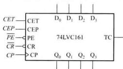

# 06 计数器

> [!abstract] 概述
> 计数器是最常用的时序电路，功能包括：**计数、分频、定时、产生节拍脉冲**。

## 一、计数器的分类

| 分类依据 | 类型 |
|---------|------|
| 触发器动作 | 同步计数器、异步计数器 |
| 数值增减 | 递增计数器、递减计数器、可逆计数器 |
| 编码方式 | 二进制、BCD、循环码 |
| 模数 | 模 $n$（$n$ 进制） |

**模 $M$**：计数器一个计数周期内的状态总数。

## 二、二进制计数器
###  典型集成计数器：74LVC161



**功能**：4 位同步二进制递增计数器

| 引脚 | 功能 | 有效电平 |
|------|------|---------|
| $\overline{CR}$ | 异步清零 | 低电平有效 |
| $\overline{PE}$ | 同步并行置数 | 低电平有效 |
| CEP, CET | 计数使能 | 高电平有效 |
| CP | 时钟 | 上升沿 |
| $D_3 \sim D_0$ | 并行数据输入 | - |
| $Q_3 \sim Q_0$ | 并行输出 | - |
| TC | 进位输出 | $Q_3Q_2Q_1Q_0 \cdot CET$ |

**功能表**：

| $\overline{CR}$ | $\overline{PE}$ | CEP | CET | CP | 功能 |
|:---:|:---:|:---:|:---:|:---:|------|
| L | × | × | × | × | 异步清零 |
| H | L | × | × | ↑ | 同步置数 |
| H | H | L | × | × | 保持 |
| H | H | × | L | × | 保持（TC=0） |
| H | H | H | H | ↑ | 计数 |


## 三、用集成计数器构成任意模数计数器

### 方法1：反馈清零法

**适用**：有清零输入端的计数器

**步骤**：
1. 确定模数 $N$
2. **异步清零**：状态 $S_N$ 译码 → 反馈到 $\overline{CR}$
3. **同步置数**：状态 $S_{N-1}$ 译码 → 反馈到 $\overline{CR}$

> [!warning] 异步清零 vs 同步清零
> - **异步清零**：到达 $S_N$ 状态**立即**清零，$S_N$ 瞬间出现（窄脉冲）
> - **同步清零**：到达 $S_{N-1}$ 状态后，等待**下一个 CP 沿**才清零

---

#### 核心对比：反馈清零法 vs 反馈置数法（模9 计数器）

先从**宏观上**看两种方法的本质区别：

| 方法 | 控制引脚 | 触发条件 | 回到的状态 | 关键差异 |
|:----|:--------|:---------|:----------|:--------|
| **反馈清零法** | $\overline{CR}$（清零） | 检测到 $S_N$（1001） | 强制回到 0000 | 靠"清零"强行复位 |
| **反馈置数法** | $\overline{PE}$（置数） | 检测到 $S_{N-1}$（1000） | 加载 $D$ 端设定值 | 靠"跳转"重新开始 |

**一句话记住**：
- 反馈**清零** → **到达终点**就炸（清零）
- 反馈**置数** → **到终点前一步**就提前跳回去（置数）

---

#### 例：用 74LVC161 构成模 9 计数器 — 状态转移表对比

74LVC161 是**异步清零、同步置数**的 4 位二进制计数器。

##### 反馈清零法（异步清零，检测 $S_9$）

$S_N = S_9 = 1001$，$\overline{CR} = \overline{Q_3 Q_0}$

| CP 序号 | $Q_3$ | $Q_2$ | $Q_1$ | $Q_0$ | 十进制 | 反馈信号 $\overline{CR}$ | 说明 |
|:-------:|:-----:|:-----:|:-----:|:-----:|:------:|:-----------------------:|:----|
| 0 | 0 | 0 | 0 | 0 | 0 | H | 起始 |
| 1 | 0 | 0 | 0 | 1 | 1 | H | 计数 |
| 2 | 0 | 0 | 1 | 0 | 2 | H | 计数 |
| 3 | 0 | 0 | 1 | 1 | 3 | H | 计数 |
| 4 | 0 | 1 | 0 | 0 | 4 | H | 计数 |
| 5 | 0 | 1 | 0 | 1 | 5 | H | 计数 |
| 6 | 0 | 1 | 1 | 0 | 6 | H | 计数 |
| 7 | 0 | 1 | 1 | 1 | 7 | H | 计数 |
| 8 | 1 | 0 | 0 | 0 | 8 | H | 计数 |
| → **9** | **1** | **0** | **0** | **1** | **9** | **L（触发）** | **到达 $S_9$ → $\overline{CR}$ 变低 → 立即异步清零** |
| — | 0 | 0 | 0 | 0 | 0 | H | 瞬间跳回 0000（$S_9$ 仅出现一个窄脉冲） |
| 10 | 0 | 0 | 0 | 1 | 1 | H | 重新开始计数... |

状态转换图：
```
      ┌─────────────────────────────────────┐
      │                                      │
      ∨                                      │
  0000 → 0001 → 0010 → 0011 → 0100 → 0101 → 0111 → 1000 → (1001)
      ↑                                                        │
      └────────────────────────────────────────────────────────┘
                        ↑
                 检测到1001立即清零
```

##### 反馈置数法（同步置数，检测 $S_8$，跳回 0000）

方案一：$S_{N-1} = S_8 = 1000$，$\overline{PE} = \overline{Q_3}$，$D_3D_2D_1D_0 = 0000$

| CP 序号 | $Q_3$ | $Q_2$ | $Q_1$ | $Q_0$ | 十进制 | 反馈信号 $\overline{PE}$ | 说明 |
|:-------:|:-----:|:-----:|:-----:|:-----:|:------:|:-----------------------:|:----|
| 0 | 0 | 0 | 0 | 0 | 0 | H | 起始 |
| 1 | 0 | 0 | 0 | 1 | 1 | H | 计数 |
| 2 | 0 | 0 | 1 | 0 | 2 | H | 计数 |
| 3 | 0 | 0 | 1 | 1 | 3 | H | 计数 |
| 4 | 0 | 1 | 0 | 0 | 4 | H | 计数 |
| 5 | 0 | 1 | 0 | 1 | 5 | H | 计数 |
| 6 | 0 | 1 | 1 | 0 | 6 | H | 计数 |
| 7 | 0 | 1 | 1 | 1 | 7 | H | 计数 |
| → **8** | **1** | **0** | **0** | **0** | **8** | **L（触发）** | **到达 $S_8$ → $\overline{PE}$ 变低** |
| → **9** | **0** | **0** | **0** | **0** | **0** | H | **下一个 CP 上升沿 → 同步加载 $D=0000$** |
| 10 | 0 | 0 | 0 | 1 | 1 | H | 重新开始计数... |

状态转换图：
```
      ┌───────────────────────────────────────┐
      │                                        │
      ∨                                        │
  0000 → 0001 → 0010 → 0011 → 0100 → 0101 → 0111 → 1000
      ↑                                                   │
      └───────────────────────────────────────────────────┘
                         ↑
                  检测到1000后，下一个CP才置数
```

---

> [!tip] 反馈清零 vs 反馈置数 — 直观对比
>
> **反馈清零法**就像**跑百米**：
> - 你跑到终点线（1001）的**那一瞬间**就被拽回起点
> - 终点线本身你踩到了，但只踩了一瞬间
> - 1001 这个状态"存在但不可见"（窄脉冲）
>
> **反馈置数法**就像**折返跑**：
> - 你在到达终点前一步（1000）就转身往回跑
> - 你**根本没碰到**终点线（1001 从未出现）
> - 整个循环中 1001 永远不会出现

---

**反馈置数法方案二（利用进位输出 $TC$）：**

$TC = Q_3Q_2Q_1Q_0 \cdot CET$，$TC$ 反馈到 $\overline{PE}$，$D_3D_2D_1D_0 = 0111$

| CP 序号 | $Q_3$ | $Q_2$ | $Q_1$ | $Q_0$ | 十进制 | 说明 |
|:-------:|:-----:|:-----:|:-----:|:-----:|:------:|:----|
| 0 | 0 | 1 | 1 | 1 | 7 | 起始（预置） |
| 1 | 1 | 0 | 0 | 0 | 8 | 计数 |
| 2 | 1 | 0 | 0 | 1 | 9 | 计数 |
| 3 | 1 | 0 | 1 | 0 | 10 | 计数 |
| 4 | 1 | 0 | 1 | 1 | 11 | 计数 |
| 5 | 1 | 1 | 0 | 0 | 12 | 计数 |
| 6 | 1 | 1 | 0 | 1 | 13 | 计数 |
| 7 | 1 | 1 | 1 | 0 | 14 | 计数 |
| → **8** | **1** | **1** | **1** | **1** | **15** | **$TC=1$ → $\overline{PE}=0$** |
| → **9** | **0** | **1** | **1** | **1** | **7** | **下一个 CP → 加载 $D=0111$，跳回 7** |

> 计数范围：$0111 \sim 1111$，共 9 个状态（7→8→9→10→11→12→13→14→15→回到7）

### 方法3：多片级联（$M < N$ 的情况）

**例：用两片 BCD 计数器构成模 24 计数器**

- 低位片：个位（模 10）
- 高位片：十位（模 10）
- 当输出为 0010 0100（即 24）时，整体反馈清零

## 四、环形计数器

### 1. 基本环形计数器

- 将移位寄存器**最高位输出**反馈到**最低位输入**
- $N$ 个触发器 → 模 $N$ 计数器
- 不需译码即可直接输出状态信号
- **缺点**：状态利用率低（$N$ 个触发器只有 $N$ 个有效状态）

### 2. 扭环形计数器（约翰逊计数器）

- 将移位寄存器**最高位取反**反馈到**最低位输入**
- $N$ 个触发器 → 模 $2N$ 计数器（状态数翻倍）
- 译码简单，每次只有一个触发器翻转，**无竞争-冒险**
- 典型芯片：74HC4017（模 10 扭环形计数器）

> [!important] 环形 vs 扭环形
> | 特征 | 环形计数器 | 扭环形计数器 |
> |------|----------|------------|
> | 反馈方式 | $Q_{N-1} \to D_0$ | $\bar{Q}_{N-1} \to D_0$ |
> | 模数 | $N$ | $2N$ |
> | 状态利用率 | 低 | 较高 |
> | 译码难度 | 无需译码 | 简单（每个状态只需2变量） |
