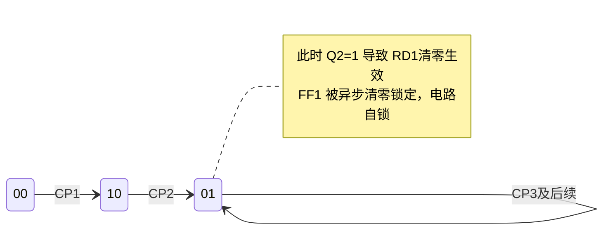

# 6-时序逻辑电路 · 错题本

> [!info] 本模块错题索引
>
> | 序号 | 错题标题 | 核心陷阱 | 难度 |
> |------|----------|----------|------|
> | [01](#错题01双jk触发器异步清零与状态死锁) | 双JK触发器异步清零与状态死锁 | 异步清零端反馈形成自锁、忽略异步复位优先级 | ⭐⭐⭐⭐ |
>
> **更新日期**：2026-05-07

---

## 错题01：双JK触发器异步清零与状态死锁

**题目：** 两个JK触发器组成的时序逻辑电路，初始状态 $Q_1Q_2 = 00$。分析 3 个时钟脉冲后的状态。

电路连接：
- $FF_1$：$J_1 = K_1 = 1$（悬空高电平），异步清零端 $\overline{R_{D1}} = \overline{Q_2}$
- $FF_2$：$J_2 = K_2 = Q_1$，清零端接高电平（无效）

**正确答案：** **B（01）**

### 一、考察本质与核心考点

1. **JK 触发器的逻辑功能**：根据输入端的 J、K 信号判断下一状态
   - $J=1, K=1$：时钟脉冲到来时翻转（$T'$ 触发器）
   - $J=0, K=0$：保持
   - $J=1, K=0$：置 1
   - $J=0, K=1$：清零

2. **同步时序电路分析方法**：驱动方程 → 状态方程 → 状态转换

3. **异步清零端的优先级**（核心考点）：异步清零信号优先级**高于**时钟信号和 J/K 输入信号。一旦有效，触发器无视其他信号立刻清零。

### 二、解题过程

#### 第一步：驱动方程

$$FF_1: \begin{cases} J_1 = 1 \\ K_1 = 1 \\ \overline{R_{D1}} = \overline{Q_2} \end{cases} \quad FF_2: \begin{cases} J_2 = Q_1 \\ K_2 = Q_1 \\ R_{D2} = 1 \end{cases}$$

#### 第二步：状态方程

根据 JK 触发器的特性方程 $Q^{n+1} = J\overline{Q^n} + \overline{K}Q^n$：

$$FF_1: \begin{cases} Q_2 = 0 \text{ 时（清零无效）}: & Q_1^{n+1} = \overline{Q_1^n} \text{（翻转）} \\ Q_2 = 1 \text{ 时（清零生效）}: & Q_1^{n+1} = 0 \text{（强制清零）} \end{cases}$$

$$FF_2: Q_2^{n+1} = Q_1^n \cdot \overline{Q_2^n} + \overline{Q_1^n} \cdot Q_2^n = Q_1^n \oplus Q_2^n$$

#### 第三步：逐步推演状态转换

| CP | $Q_1^n$（初态） | $Q_2^n$（初态） | $\overline{R_{D1}}$ | $FF_1$ 动作 | $FF_2$ 动作 | 结果状态 |
|----|-------------|-------------|-------------------|------------|------------|--------|
| 0（初态） | 0 | 0 | 1（无效） | — | — | 00 |
| 1 | 0 | 0 | 1（无效） | $J_1=K_1=1$，翻转 → 1 | $J_2=K_2=0$，保持 → 0 | **10** |
| 2 | 1 | 0 | 1（无效） | $J_1=K_1=1$，翻转 → 0 | $J_2=K_2=1$，翻转 → 1 | **01** |
| 3 | 0 | 1 | **0（生效）** | **强制清零 → 0** | $J_2=K_2=0$，保持 → 1 | **01** |

### 三、状态转换图

### 四、易错点分析

| 易错点 | 错误表现 | 正确认识 |
|--------|----------|----------|
| **漏看反馈连线** | 只关注 $J$、$K$ 端，忽略 $\overline{Q_2}$ 连回 $FF_1$ 的 $\overline{R_D}$ 端 | 必须全图扫描所有连线，包括异步复位端 |
| **忽略自锁状态** | 没注意到清零端反馈导致电路进入死锁 | 每推导一步，必须检查异步置位/复位端是否被激活 |
| **混淆同步与异步** | 把异步清零当同步清零处理，在时钟边沿才生效 | 异步清零立即生效，与时钟无关 |

### 五、个人笔记

> [!personal] 个人理解
>
> 这道题的关键是**异步清零端的反馈回路**。$FF_2$ 的输出 $Q_2$ 通过 $\overline{Q_2}$ 端连接到 $FF_1$ 的异步清零端。当 $Q_2=1$ 时，$\overline{R_{D1}}=0$ 立刻生效，将 $FF_1$ 锁定在 0 状态。此后无论来多少时钟脉冲，$FF_1$ 都无法翻转，导致 $FF_2$ 的 $J_2=K_2=Q_1=0$ 一直保持，电路永远停在 $Q_1Q_2=01$ 状态。
>
> 这类电路本质上是一个**自锁振荡器**或**单稳态电路**，一旦进入特定状态就会保持不变。
