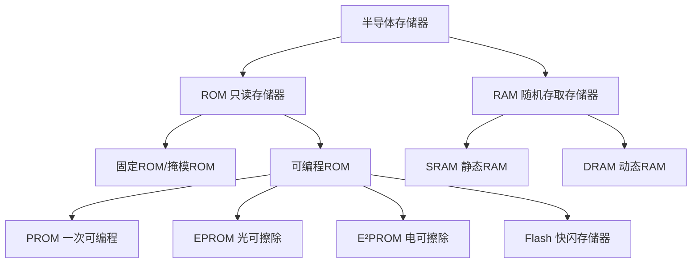

# 存储器概述与分类

> 📚 **学习目标**：掌握半导体存储器的基本概念、分类方法及各类存储器的特点

---

## 一、半导体存储器概述

### 1.1 基本概念

半导体存储器是用于存储大量二值数据的**大规模集成电路**，广泛应用于计算机和数字系统中。

### 1.2 存储容量表示

$$
\text{容量} = \text{字数} \times \text{字长（位数）}
$$

**示例**：$256 \times 8$ 位的存储器
- 字数：256个
- 字长：8位
- 总存储单元：256 × 8 = 2048个

### 1.3 容量单位换算

$$
1\text{K} = 2^{10} = 1024
$$
$$
1\text{M} = 2^{20} = 1024\text{K}
$$
$$
1\text{G} = 2^{30} = 1024\text{M}
$$

### 1.4 地址线与字数关系

$$
N = 2^n
$$

其中：
- $n$ = 地址线数量
- $N$ = 可寻址的字数

**反推公式**：
$$
n = \lceil \log_2 N \rceil
$$

**示例**：
- 4根地址线 → $2^4 = 16$ 个字
- 8根地址线 → $2^8 = 256$ 个字
- 10根地址线 → $2^{10} = 1024 = 1\text{K}$ 个字

---

## 二、半导体存储器分类

### 2.1 总体分类

### 2.2 ROM（只读存储器）

**特点**：
- **非易失性**：断电后数据不丢失
- **正常工作时只读**：数据一般由专用装置写入
- **典型应用**：系统程序、数据表、字符代码

**分类**：

| 类型 | 全称 | 特点 |
|------|------|------|
| **掩模ROM** | Mask ROM | 出厂时数据固定，不可改写 |
| **PROM** | Programmable ROM | 可一次编程，熔丝烧断不可恢复 |
| **EPROM** | Erasable PROM | 紫外线擦除，可多次编程 |
| **E²PROM** | Electrically EPROM | 电擦除，可按字擦写 |
| **Flash** | Flash Memory | 电擦除，按块擦写，集成度高 |

### 2.3 RAM（随机存取存储器）

**特点**：
- **易失性**：断电后数据丢失
- **可读可写**：随时快速读写任意地址
- **典型应用**：数据缓存、计算机内存

**分类**：

| 类型 | 全称 | 存储原理 | 是否需要刷新 |
|------|------|----------|--------------|
| **SRAM** | Static RAM | 锁存器（触发器） | 不需要 |
| **DRAM** | Dynamic RAM | 电容存储电荷 | 需要定期刷新 |

---

## 三、ROM与RAM的核心区别

| 特性 | ROM | RAM |
|------|-----|-----|
| **数据易失性** | 非易失性（断电不丢失） | 易失性（断电丢失） |
| **读写能力** | 正常工作时只读 | 可读可写 |
| **存储单元** | 组合电路（二极管/MOS管） | 时序电路（锁存器/电容） |
| **结构复杂度** | 相对简单 | 相对复杂 |
| **典型应用** | 系统程序、数据表 | 数据缓存、内存 |

---

## 四、各类ROM性能比较

| 类型 | 非易失性 | 高密度 | 单管单元 | 在系统可写 | 擦除方式 |
|------|----------|--------|----------|------------|----------|
| **掩模ROM** | ✅ | ✅ | ✅ | ❌ | 不可擦除 |
| **PROM** | ✅ | ✅ | ✅ | ❌ | 不可擦除 |
| **EPROM** | ✅ | ✅ | ✅ | ❌ | 紫外线擦除 |
| **E²PROM** | ✅ | ❌ | ❌ | ✅ | 电擦除（按字） |
| **Flash** | ✅ | ✅ | ✅ | ✅ | 电擦除（按块） |

---

## 五、常见错误模式

| 错误类型 | 错误示例 | 纠正方法 |
|----------|----------|----------|
| 容量计算错误 | 地址线数与字数关系搞错 | $N = 2^n$，$n$为地址线数 |
| ROM/RAM特性混淆 | 认为RAM也是非易失性 | RAM易失，ROM非易失 |
| 忘记单位换算 | 1K = 1000 | 1K = 1024 |

---

## 六、本节重点

1. **存储容量计算** ⭐⭐⭐
   - 容量 = 字数 × 字长
   - 字数 $N = 2^n$（$n$为地址线数）

2. **ROM与RAM区别** ⭐⭐⭐
   - 易失性、读写能力、存储单元类型

3. **ROM分类及特点** ⭐⭐
   - PROM、EPROM、E²PROM、Flash的区别

---

## 七、例题

### 【例1】容量计算

**题目**：一个存储系统有12根地址线，8根数据线，求其存储容量。

**解**：
$$
\text{字数} = 2^{12} = 4096 = 4\text{K}
$$
$$
\text{容量} = 4\text{K} \times 8\text{位}
$$

### 【例2】地址线计算

**题目**：一个 $1\text{M} \times 8$ 位的存储器，需要多少根地址线？

**解**：
$$
1\text{M} = 2^{20}
$$
$$
n = 20 \text{根地址线}
$$

---

*下一篇：[[02-只读存储器ROM]]*
