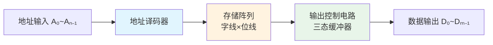

# 只读存储器（ROM）

> [!info] 学习目标
> - 掌握 ROM 的基本结构与工作原理
> - 区分五种 ROM 类型及其特点
> - 掌握 ROM 实现组合逻辑的方法
> - 熟练进行容量计算

> [!tip] 前置知识
> [[01-存储器概述与分类|存储器概述与分类]] — 先理解存储器基本概念、容量计算、ROM/RAM 分类

---

## 一、ROM 的基本结构

### 1.1 结构框图

ROM 由三部分组成：**地址译码器 → 存储阵列 → 输出控制电路**



### 1.2 三部分功能

| 组成部分 | 功能 | 关键要点 |
|---------|------|---------|
| **① 存储阵列** | 存放二值数据 | 存储单元排成矩阵，每单元存 1 位 |
| **② 地址译码器** | 将地址码译成字选信号 | 输入 $n$ 条地址线，输出 $2^n$ 条字线 |
| **③ 输出控制电路** | 连接数据总线 | 含三态缓冲器，无输出时呈**高阻态** |

> [!note] 关键理解
> ROM 的存储阵列本质上是用二极管或 MOS 管构成的**与-或阵列**，属于**组合逻辑电路**，不是时序电路。

### 1.3 基本术语

| 术语 | 含义 | 类比 |
|-----|------|------|
| **字** | 按一定位数编组的一组数据 | — |
| **字长** | 一个字所含的位数 | 一次并行读出的数据宽度 |
| **地址** | 每个字的编号 | 门牌号 |
| **地址单元** | 构成字的存储单元 | 房间 |

### 1.4 容量计算

> [!important] 核心公式
> $$
> \text{容量} = \text{字数} \times \text{字长}
> $$
>
> 地址单元个数 $N$ 与地址码位数 $n$ 的关系：
> $$
> N = 2^n
> $$

**记忆口诀**：地址线出字数 $2^n$，数据线出字长，两者相乘得容量。

---

## 二、各类 ROM 对比详解

### 2.1 演化路线

```
掩模ROM → PROM → EPROM → E²PROM → Flash
(固定)    (一次)   (紫外)   (电擦除)   (快闪)
```

> 发展主线：**可编程性越来越高，擦写越来越方便**

### 2.2 横向对比总表

| 特性 | 掩模ROM | PROM | EPROM | E²PROM | Flash |
|------|---------|------|-------|--------|-------|
| **存储单元** | 二极管/MOS管 | 熔丝管 | SIMOS管 | Flotox MOS管 | 快闪叠栅MOS管 |
| **写入方式** | 掩模工艺 | 烧熔丝 | 编程写入 | 电写入 | 电写入 |
| **擦除方式** | ❌ 不可擦除 | ❌ 不可擦除 | ☀️ 紫外线 15~20min | ⚡ 电擦除（**按字**） | ⚡ 电擦除（**按块**） |
| **可擦写次数** | 0 | 1 次 | 多次 | ≥10000 次 | 多次 |
| **芯片外观** | 普通封装 | 普通封装 | 透明石英盖板 | 普通封装 | 普通封装 |
| **需取出芯片** | — | — | ✅ 需取出 | ❌ 不需取出 | ❌ 不需取出 |
| **集成度** | 高 | 高 | 高 | **较低** | **高** |
| **典型应用** | 大批量定型产品 | 小批量生产 | 早期开发验证 | 参数存储/配置 | U盘、存储卡、SSD |

> [!warning] 易混淆点
> - **EPROM vs E²PROM**：前者紫外线擦除（需取出芯片），后者电擦除（不需取出）
> - **E²PROM vs Flash**：前者按**字**擦写（集成度低），后者按**块**擦写（集成度高）
> - **掩模ROM vs PROM**：前者出厂即固定（制造时决定），后者出厂全 1（用户可烧一次）

### 2.3 各类型详解

#### ① 掩模 ROM
- 出厂时数据由掩模工艺固定
- 由制造商根据用户需求定制
- **成本最低**，适合大批量定型产品

#### ② PROM（可编程 ROM）
- 出厂时所有存储单元全为 1（或全为 0）
- 用户通过编程器烧断熔丝写入，**仅一次**
- 熔丝烧断后不可恢复

#### ③ EPROM（紫外线可擦除 PROM）
- 使用 **SIMOS 管**（叠栅注入 MOS）构成存储单元
- 擦除：紫外线照射芯片 15~20 分钟，**擦除全部内容**
- 芯片封装有**透明石英盖板**，便于紫外线透过
- 可多次擦写

#### ④ E²PROM（电可擦除 PROM）
- 使用 **Flotox MOS 管**（浮栅隧道氧化层 MOS）构成
- **电擦除**，不需要取出芯片，在系统即可操作
- **以字为单位**进行擦写（灵活但速度受限）
- 可重复擦写 **1 万次以上**
- ⚠️ 集成度较低（因存储单元结构较复杂）

#### ⑤ Flash 存储器（快闪存储器）
- 使用**快闪叠栅 MOS 管**，存储单元结构简单（**单管**）
- **电擦除**，但以**块（Block）**为单位擦写
- 兼具 E²PROM 的电擦除便利性和高集成度
- 广泛用于 U 盘、存储卡、SSD

---

## 三、常见错误模式

> [!danger] 高频失分点

| 错误类型 | 错误示例 | 纠正方法 |
|---------|---------|---------|
| **ROM 类型混淆** | 分不清 EPROM 和 E²PROM | EPROM=紫外光，E²PROM=电，看擦除方式 |
| **ROM 本质误解** | 认为 ROM 是时序电路 | **ROM 是组合电路**（与-或阵列） |
| **擦除单位混淆** | 以为 E²PROM 按块擦除 | E²PROM→**按字**，Flash→**按块** |
| **容量计算错误** | 地址线与数据线混淆 | 地址线→字数 $2^n$，数据线→字长 |

---

## 四、本节考点

| 考点 | 重要度 | 说明 |
|-----|--------|------|
| 五种 ROM 的对比区分 | ⭐⭐⭐ | 尤其 EPROM / E²PROM / Flash 三者关系 |
| ROM 是组合电路 | ⭐⭐⭐ | 本质理解，常作为判断题 |
| 容量计算 | ⭐⭐⭐ | 地址线→字数，数据线→字长 |
| E²PROM 与 Flash 擦除方式 | ⭐⭐ | 按字 vs 按块 |

> [!tip] 记忆口诀
> **"掩模固定 PROM 烧，EPROM 紫外照，E² 电擦按字跑，Flash 按块集成高"**

---

*上一篇：[[01-存储器概述与分类]]*
*下一篇：[[03-静态随机存取存储器SRAM]]*
