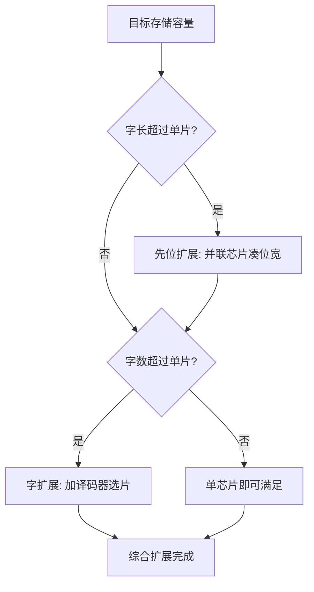
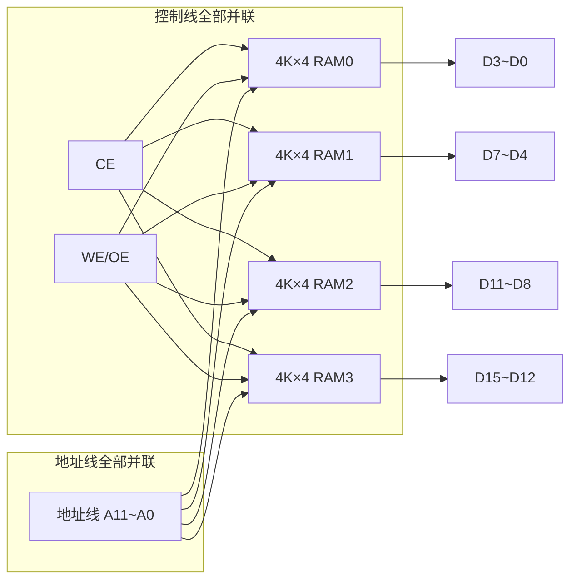
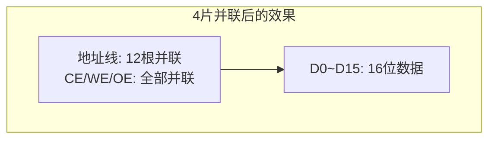
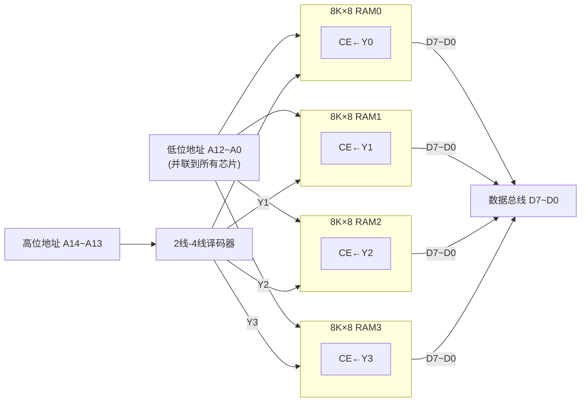
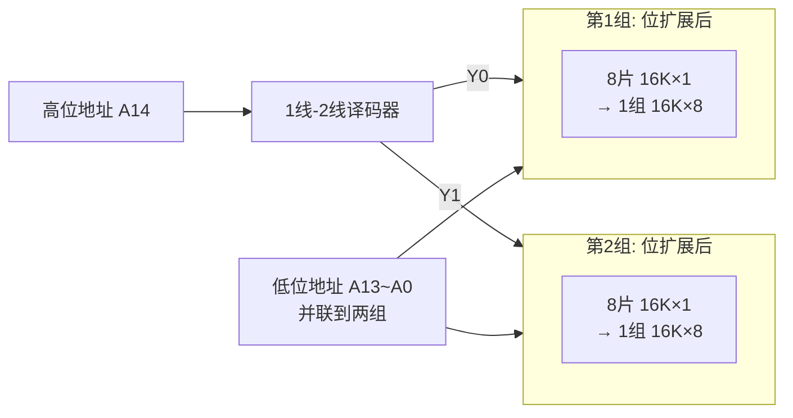

# 存储容量扩展

> 📚 **学习目标**：掌握存储器位扩展和字扩展的方法，能独立完成容量扩展设计
> 🔗 **前置知识**：[[01-存储器概述与分类]]、[[03-静态随机存取存储器SRAM]]、[[04-动态随机存取存储器DRAM]]

---

## 一、概览：两种扩展方向

### 1.1 为什么需要扩展

单个芯片容量有限，实际系统需要更大容量时，用**小容量芯片构成大容量存储系统**。

### 1.2 两种扩展方式速览

| 对比维度 | 🟦 位扩展（字长扩展） | 🟧 字扩展（字数扩展） |
|----------|----------------------|----------------------|
| **解决什么问题** | 数据位宽不够 | 存储单元数量不够 |
| **改变什么** | 字长（数据位数）↑ | 字数（存储单元数）↑ |
| **核心操作** | 芯片**并联** | 加**译码器** + 片选 |
| **关键信号变化** | 数据线变多了 | 地址线变多了 |
| **芯片的CE连接** | 所有CE**并联** | 各CE**分别接译码器输出** |
| **记忆口诀** | **位不够 → 并联拼位宽** | **字不够 → 加译码器选片** |

> [!tip] 快速区分
> - **位扩展** → 数据线数量增加（增宽度）
> - **字扩展** → 地址线数量增加（增深度）
> - 位扩展不改地址线根数，字扩展才改

### 1.3 决策流程



---

## 二、位扩展（字长扩展）

### 2.1 适用场景

实际系统**字长 > 芯片字长**：

- 芯片是 $4\text{K} \times 4$ 位（字长4位），目标要16位 → 位扩展
- 芯片是 $16\text{K} \times 1$ 位（字长1位），目标要8位 → 位扩展

### 2.2 方法：芯片并联

| 信号类型 | 连接方式 | 说明 |
|----------|----------|------|
| **地址线** | 对应并联 | 所有芯片共用同一组地址 |
| **WE / OE** | 全部并联 | 读写同步 |
| **CE（片选）** | 全部并联 | 同时选中所有芯片 |
| **数据线** | 各自独立 | 每片提供字的一部分位宽 |

### 2.3 图示



> 4片 $4\text{K} \times 4$ 位RAM → $4\text{K} \times 16$ 位系统

### 2.4 公式

$$
\text{芯片数} = \frac{\text{目标字长}}{\text{单片字长}}
$$

> [!example] 示例
> 用 $4\text{K} \times 4$ 位芯片构成 $4\text{K} \times 16$ 位
> $$
> \text{芯片数} = \frac{16}{4} = 4 \text{片}
> $$

### 2.5 位扩展接线总结



> [!note] 位扩展后容量变化
> $4\text{K} \times 4 \times 4 \text{片} = 4\text{K} \times 16$ 位 — 字数不变，字长变4倍

---

## 三、字扩展（字数扩展）

### 3.1 适用场景

实际系统**字数 > 芯片字数**：

- 芯片是 $8\text{K} \times 8$ 位，目标要 $32\text{K} \times 8$ 位 → 字扩展（字数4倍）
- 芯片是 $16\text{K} \times 8$ 位，目标要 $64\text{K} \times 8$ 位 → 字扩展（字数4倍）

### 3.2 方法：外加译码器

| 信号类型 | 连接方式 | 说明 |
|----------|----------|------|
| **低位地址线** | 并联到所有芯片 | 决定片内单元地址 |
| **高位地址线** | 接译码器输入 | 决定选哪一片 |
| **译码器输出** | 分别接各芯片CE端 | 一次只选通一片 |
| **数据线** | 对应并联 | 所有芯片共用数据总线 |
| **WE / OE** | 全部并联 | 读写同步 |

### 3.3 图示



> 4片 $8\text{K} \times 8$ 位RAM + 2线-4线译码器 → $32\text{K} \times 8$ 位系统

### 3.4 公式

**芯片数**：
$$
\text{芯片数} = \frac{\text{目标字数}}{\text{单片字数}}
$$

**新增地址线数**（即译码器输入线数）：
$$
\Delta n = \log_2(\text{芯片数})
$$

**译码器选择**：

| 芯片数 | 译码器 | 新增地址线数 |
|--------|--------|------------|
| 2片 | 1线-2线 | 1根 |
| 4片 | 2线-4线 | 2根 |
| 8片 | 3线-8线 | 3根 |

> [!example] 示例
> 用 $8\text{K} \times 8$ 位芯片构成 $32\text{K} \times 8$ 位：
> $$
> \text{芯片数} = \frac{32\text{K}}{8\text{K}} = 4 \text{片}
> $$
> $$
> \Delta n = \log_2 4 = 2 \text{根}
> $$
> - 低位地址线 $A_{12} \sim A_0$（13根）：并联到4片RAM
> - 高位地址线 $A_{14}, A_{13}$（2根）：接2线-4线译码器
> - 译码器输出 $Y_0 \sim Y_3$：分别接4片RAM的CE端

> [!warning] 字扩展核心要点
> - 字扩展**必须加译码器**，不能直接把CE并联
> - 低位地址线接芯片，高位地址线接译码器 — **不要搞反**

---

## 四、综合扩展（位扩展 + 字扩展）

### 4.1 适用场景

目标容量在**字长和字数**上都超过单片芯片。

### 4.2 标准两步法

```
第1步：先位扩展   → 多片芯片并联成一组，满足目标字长
第2步：再字扩展   → 用译码器控制多组芯片的片选端
```

> [!important] 扩展顺序是固定的：**先位后字**。位扩展先产生"一组"，再把"组"当作基本单元做字扩展。

### 4.3 公式

$$
\text{总芯片数} = \underbrace{\frac{\text{目标字数}}{\text{单片字数}}}_{\text{字扩展}} \times \underbrace{\frac{\text{目标字长}}{\text{单片字长}}}_{\text{位扩展}}
$$

### 4.4 图示



> 16片 $16\text{K} \times 1$ 位 + 1线-2线译码器 → $32\text{K} \times 8$ 位

### 4.5 示例

用 $16\text{K} \times 1$ 位芯片构成 $32\text{K} \times 8$ 位：

**计算**：
$$
\text{总芯片数} = \frac{32\text{K}}{16\text{K}} \times \frac{8}{1} = 2 \times 8 = 16 \text{片}
$$

**步骤**：
1. **位扩展**：8片 $16\text{K} \times 1$ 位并联 → 1组 $16\text{K} \times 8$ 位
2. **字扩展**：2组用1线-2线译码器选通 → $32\text{K} \times 8$ 位

---

## 五、设计题通用 SOP（标准化解题流程）

> [!info] 这是综合设计题的**标准步骤**，考试时按此流程答题不会丢分

### 5.1 解题四步法

```
Step 1 ── 计算芯片总数
          公式: (目标字数/单片字数) × (目标字长/单片字长)

Step 2 ── 确定位扩展方案
          每组芯片数 = 目标字长 / 单片字长
          组内接线: 地址线/控制线并联, 数据线独立

Step 3 ── 确定字扩展方案
          组数 = 目标字数 / 单片字数
          译码器: 1片→不用, 2片→1线-2线, 4片→2线-4线, 8片→3线-8线

Step 4 ── 地址线分配
          低位地址线数 = log₂(单片字数) → 并联到所有芯片
          高位地址线数 = log₂(组数)    → 接译码器
```

### 5.2 设计示例

**题目**：用具有CE、OE、WE、容量为 $8\text{K} \times 8$ 位的SRAM芯片，设计一个 $16\text{K} \times 16$ 位的存储器系统。

**解**：

| 步骤 | 计算/方案 | 结果 |
|------|-----------|------|
| **Step1** 芯片总数 | $\frac{16\text{K}}{8\text{K}} \times \frac{16}{8} = 2 \times 2$ | **4片** |
| **Step2** 位扩展 | 2片 $8\text{K} \times 8$ → 1组 $8\text{K} \times 16$ | 2片/组，数据线分高8位/低8位 |
| **Step3** 字扩展 | 2组 → 加1线-2线译码器 | 新增1根地址线 $A_{13}$ |
| **Step4** 地址线 | 低位 $A_{12} \sim A_0$ 并联；高位 $A_{13}$ 接译码器 | 芯片用13根，译码器用1根 |

**接线汇总**：
- $A_{12} \sim A_0$（13根）：并联到4片RAM
- $A_{13}$：接1线-2线译码器输入
- 译码器输出 Y0 → 第1组CE，Y1 → 第2组CE
- WE、OE：并联到4片RAM

---

## 六、常见错误模式

| 错误类型 | 错误表现 | 纠正方法 | 一句话口诀 |
|----------|----------|----------|-----------|
| 位/字扩展混淆 | 分不清用哪种扩展 | 看是数据位不够还是地址深度不够 | 位增数据线，字增地址线 |
| 芯片数算错 | 除法用反 | 字数扩展和字长扩展都用目标÷单片 | 都是目标÷单片 |
| 地址线分配错误 | 高低位搞反 | 低位接芯片（片内寻址），高位接译码器（片间选片） | 低芯高译 |
| 片选信号接错 | 字扩展时CE并联 | 字扩展时CE分别接译码器不同输出 | 字扩CE不并联 |
| 忘记译码器 | 字扩展直接并联芯片 | 字扩展必须加译码器控制片选 | 字扩必加译码器 |
| 扩展顺序记反 | 先做字扩展再做位扩展 | 先位扩展组内并联，再字扩展组间选片 | 先位后字 |

> [!danger] 高频失分点
> - **字扩展的CE不要并联** — 否则所有芯片同时被选中，地址冲突！
> - **低位和高位地址线不要搞混** — 低位接芯片（片内寻址），高位接译码器（片选）

---

## 七、速查卡（复习用）

### 7.1 核心公式卡片

$$
\begin{aligned}
\text{位扩展芯片数} &= \frac{\text{目标字长}}{\text{单片字长}} \\[4pt]
\text{字扩展芯片数} &= \frac{\text{目标字数}}{\text{单片字数}} \\[4pt]
\text{综合总芯片数} &= \frac{\text{目标字数}}{\text{单片字数}} \times \frac{\text{目标字长}}{\text{单片字长}} \\[4pt]
\Delta n_{\text{地址线}} &= \log_2(\text{字扩展芯片数})
\end{aligned}
$$

### 7.2 接线规则卡片

| 信号 | 位扩展 | 字扩展 |
|------|--------|--------|
| **地址线** | 全部并联 | 低位并联到芯片，高位接译码器 |
| **数据线** | 各片独立（拼位宽） | 对应并联（共用总线） |
| **CE** | 全部并联 | 各片分别接译码器输出 |
| **WE/OE** | 全部并联 | 全部并联 |

### 7.3 例题快速索引

| 类型 | 已知条件 | 目标 | 芯片数 | 要点 |
|------|----------|------|--------|------|
| 位扩展 | $4\text{K}\times 4$ 芯片 | $4\text{K}\times 16$ | 4片 | 4片并联，数据线拼16位 |
| 字扩展 | $8\text{K}\times 8$ 芯片 | $32\text{K}\times 8$ | 4片 + 2线-4线译码器 | 低位13根并联，A14A13接译码器 |
| 综合 | $16\text{K}\times 1$ 芯片 | $32\text{K}\times 8$ | 16片 + 1线-2线译码器 | 先8片并联成组，再2线选组 |
| 综合设计 | $8\text{K}\times 8$ 芯片 | $16\text{K}\times 16$ | 4片 + 1线-2线译码器 | 先2片拼16位，再2组字扩展 |

> [!tip] 考前提醒
> - 看到"设计存储系统" → 启动 **4步SOP**
> - 先算芯片总数 → 再确定分组方案
> - 字扩展时CE分别接译码器输出，不要并联

---

*上一篇：[[04-动态随机存取存储器DRAM]]*
