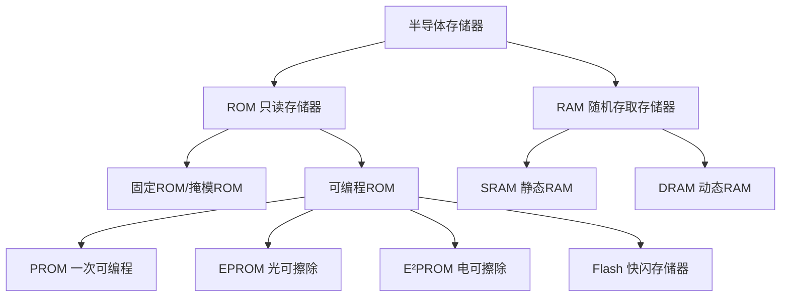
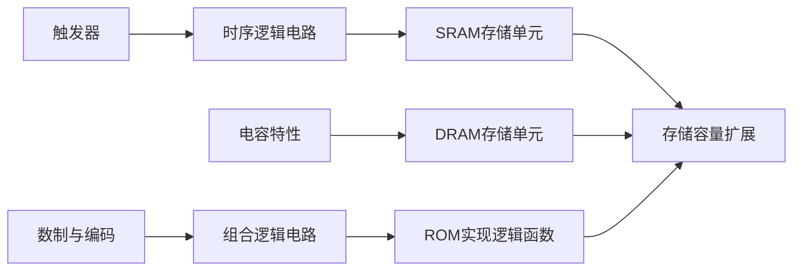

# 半导体存储器 - 考研核心笔记

> 📚 **参考教材**：康华光《电子技术基础-数字部分》第7章
> 🎯 **考试重点**：存储器分类、ROM/RAM结构、容量扩展（⭐⭐⭐）

---

## 一、半导体存储器概述

### 1.1 基本概念

半导体存储器是用于存储大量二值数据的大规模集成电路，广泛应用于计算机和数字系统中。

**存储容量表示**：
$$
\text{容量} = \text{字数} \times \text{字长（位数）}
$$

**容量单位换算**：
$$
1\text{K} = 2^{10} = 1024, \quad 1\text{M} = 2^{20} = 1024\text{K}, \quad 1\text{G} = 2^{30} = 1024\text{M}
$$

**地址线与字数关系**：
$$
N = 2^n
$$
其中 $n$ 为地址线数量，$N$ 为可寻址的字数。

---

## 二、半导体存储器分类

### 2.1 总体分类



### 2.2 ROM与RAM的核心区别

| 特性 | ROM | RAM |
|------|-----|-----|
| **数据易失性** | 非易失性（断电不丢失） | 易失性（断电丢失） |
| **读写能力** | 正常工作时只读 | 可读可写 |
| **存储单元** | 组合电路（二极管/MOS管） | 时序电路（锁存器/电容） |
| **典型应用** | 系统程序、数据表 | 数据缓存、内存 |

---

## 三、只读存储器（ROM）

### 3.1 ROM的基本结构

ROM由三部分组成：
1. **存储阵列**：存放数据的核心部分
2. **地址译码器**：将地址码译成相应的地址信号
3. **输出控制电路**：包含三态缓冲器，控制数据输出

```
地址输入 → 地址译码器 → 存储阵列 → 输出控制电路 → 数据输出
```

### 3.2 ROM的工作原理

- **字线**：地址译码器的输出线
- **位线**：连接存储单元的输出线
- **存储单元**：字线与位线交叉处
  - 有器件连接 → 存储"1"
  - 无器件连接 → 存储"0"

**ROM属于组合逻辑电路**，给定一组输入（地址），便可得到一组输出（内容）。

### 3.3 ROM读操作时序参数

| 参数 | 含义 |
|------|------|
| $t_{AA}$ | 地址存取时间：从地址有效到数据稳定输出 |
| $t_{CE}$ | 片选存取时间：从CE有效到数据稳定输出 |
| $t_{OE}$ | 输出使能时间：从OE有效到数据稳定输出 |
| $t_{OZ}$ | 输出失效时间：CE或OE失效后数据端呈高阻态 |

**读操作步骤**：
1. 地址加到地址输入端
2. 片选信号CE有效（低电平）
3. 输出使能OE有效（低电平）
4. 经过延时后数据稳定输出

### 3.4 各类ROM性能比较

| 类型 | 非易失性 | 高密度 | 单管单元 | 在系统可写 | 擦除方式 |
|------|----------|--------|----------|------------|----------|
| **掩模ROM** | ✅ | ✅ | ✅ | ❌ | 不可擦除 |
| **PROM** | ✅ | ✅ | ✅ | ❌ | 不可擦除 |
| **EPROM** | ✅ | ✅ | ✅ | ❌ | 紫外线擦除 |
| **E²PROM** | ✅ | ❌ | ❌ | ✅ | 电擦除（按字） |
| **Flash** | ✅ | ✅ | ✅ | ✅ | 电擦除（按块） |

### 3.5 ROM的应用

ROM可实现组合逻辑函数，方法是：
- 列出真值表
- 输入作为地址，输出作为存储内容
- 将内容按地址写入ROM

**例题**：用ROM实现二进制码与格雷码转换
- 需要5根地址线（1位方向控制 + 4位输入代码）
- 需要4根数据线（4位输出代码）
- ROM容量至少为 $2^5 \times 4$ 位

---

## 四、随机存取存储器（RAM）

### 4.1 SRAM（静态RAM）

#### 4.1.1 SRAM的基本结构

SRAM由三部分组成：
1. **存储阵列**
2. **地址译码器**
3. **输入/输出控制电路**

**控制信号**：
- $\overline{CE}$：片选信号（低电平有效）
- $\overline{WE}$：写使能信号（低电平有效）
- $\overline{OE}$：输出使能信号（低电平有效）

#### 4.1.2 SRAM工作模式

| 工作模式 | $\overline{CE}$ | $\overline{WE}$ | $\overline{OE}$ | I/O |
|----------|-----------------|-----------------|-----------------|-----|
| **保持（微功耗）** | 1 | × | × | 高阻 |
| **读** | 0 | 1 | 0 | 数据输出 |
| **写** | 0 | 0 | × | 数据输入 |
| **输出无效** | 0 | 1 | 1 | 高阻 |

#### 4.1.3 SRAM存储单元

SRAM存储单元由**6个MOS管**构成：
- $T_1 \sim T_4$：构成RS锁存器，存储1位数据
- $T_5, T_6$：行选择控制门（由行选择线 $X_i$ 控制）
- $T_7, T_8$：列选择控制门（由列选择线 $Y_j$ 控制）

**读写条件**：行选择线和列选择线**均为高电平**时，才能进行读写操作。

**特点**：
- 只要不断电，数据就能永久保存
- 不需要刷新
- 集成度较低，功耗较大

#### 4.1.4 SRAM读写时序参数

**读操作关键参数**：
- $t_{RC}$：读周期（连续两次读操作的最小间隔）
- $t_{AA}$：地址存取时间
- $t_{ACE}$：片选存取时间
- $t_{DOE}$：输出使能时间

**写操作关键参数**：
- $t_{WC}$：写周期
- $t_{SA}$：地址建立时间（写控制信号有效前地址必须稳定）
- $t_{SD}$：数据建立时间（写信号失效前数据必须稳定）

### 4.2 DRAM（动态RAM）

#### 4.2.1 DRAM存储单元

DRAM存储单元由**1个MOS管 + 1个电容**构成：
- **电容C**：存储电荷，有电荷表示"1"，无电荷表示"0"
- **MOS管T**：开关，行选择线高电平时导通

**特点**：
- 结构简单，集成度高
- **需要定期刷新**（因为电容会漏电）
- 典型刷新间隔：15.6μs 或 7.8μs

#### 4.2.2 DRAM的地址分时送入

由于DRAM容量大，地址线多，采用**行、列地址分时送入**：
- 先送行地址（RAS控制）
- 再送列地址（CAS控制）
- 引脚数减少一半

**例**：1M字存储器
- 需要20根地址线（$2^{20}$个地址）
- 采用分时送入只需10根地址线

#### 4.2.3 DRAM的操作方式

1. **读/写操作**：RAS和CAS先后有效，完成读写
2. **页模式操作**：保持RAS低电平，只改变列地址
3. **RAS只刷新**：只刷新指定行，不读写
4. **CAS先于RAS有效的刷新**：自动产生刷新地址

### 4.3 SRAM与DRAM对比

| 特性 | SRAM | DRAM |
|------|------|------|
| **存储单元** | 6管锁存器 | 1管+1电容 |
| **是否需要刷新** | 不需要 | 需要定期刷新 |
| **集成度** | 较低 | 较高 |
| **功耗** | 较大 | 较小 |
| **速度** | 较快 | 较慢 |
| **成本** | 较高 | 较低 |
| **典型应用** | Cache | 主内存 |

---

## 五、存储容量的扩展

### 5.1 位扩展（字长扩展）

**目的**：增加数据位数

**方法**：芯片并联
- 地址线对应并联
- 读/写控制线对应并联
- 片选信号对应并联
- 数据输入/输出端作为字的各个位线

**例**：用4个 $4\text{K} \times 4$ 位RAM → 扩展成 $4\text{K} \times 16$ 位

### 5.2 字扩展（字数扩展）

**目的**：增加存储单元数量

**方法**：外加译码器控制片选端

**例**：用4个 $8\text{K} \times 8$ 位RAM → 扩展成 $32\text{K} \times 8$ 位
- 增加地址线 $A_{14}, A_{13}$
- 用2线-4线译码器控制4片RAM的CE端

### 5.3 容量扩展计算

**所需芯片数**：
$$
\text{芯片数} = \frac{\text{目标容量}}{\text{单片容量}} = \frac{\text{目标字数} \times \text{目标字长}}{\text{单片字数} \times \text{单片字长}}
$$

**例题**：用 $16\text{K} \times 1$ 位芯片构成 $32\text{K} \times 8$ 位存储系统
$$
\text{芯片数} = \frac{32\text{K} \times 8}{16\text{K} \times 1} = \frac{256\text{K}}{16\text{K}} = 16 \text{片}
$$

---

## 六、同步SRAM（了解）

### 6.1 同步SRAM的特点

1. **时钟控制**：读写操作在时钟脉冲节拍控制下完成
2. **内部寄存器**：地址、数据、控制信号在CP上升沿被锁存
3. **丛发（Burst）模式**：给定首地址，可连续读写多个字

### 6.2 同步SRAM的优势

- 应用简便，只需围绕时钟有效沿设计输入信号
- 读写速度高于异步SRAM
- 减少外部地址总线占用时间

---

## 七、常见错误模式

| 错误类型 | 错误示例 | 纠正方法 |
|----------|----------|----------|
| 容量计算错误 | 地址线数与字数关系搞错 | $N = 2^n$，$n$为地址线数 |
| 位扩展/字扩展混淆 | 分不清扩展方式 | 位扩展增数据线，字扩展增地址线 |
| ROM/RAM特性混淆 | 认为RAM也是非易失性 | RAM易失，ROM非易失 |
| 忘记DRAM需要刷新 | 以为DRAM和SRAM一样 | DRAM靠电容存电荷，必须刷新 |
| 片选信号极性错误 | 混淆高/低电平有效 | 大多数为低电平有效，标有上划线 |

---

## 八、考试重点总结

### 8.1 必考知识点

1. **ROM与RAM的区别** ⭐⭐⭐
   - 易失性、读写能力、存储单元类型

2. **存储容量计算** ⭐⭐⭐
   - 字数、字长、地址线数的关系

3. **存储容量扩展** ⭐⭐⭐
   - 位扩展和字扩展的方法
   - 所需芯片数的计算

4. **ROM实现组合逻辑** ⭐⭐
   - 真值表 → ROM内容

5. **SRAM与DRAM对比** ⭐⭐
   - 存储单元结构、刷新需求

### 8.2 典型题型

**题型1**：存储容量计算
- 给定地址线和数据线数量，求容量

**题型2**：存储容量扩展
- 用给定芯片构成目标容量存储器

**题型3**：ROM实现逻辑函数
- 用ROM实现码制转换、逻辑运算

**题型4**：读写时序分析
- 根据时序图判断操作是否正确

---

## 九、例题精讲

### 【例1】存储容量计算

**题目**：一个存储系统有12根地址线，8根数据线，求其存储容量。

**解**：
$$
\text{字数} = 2^{12} = 4096 = 4\text{K}
$$
$$
\text{容量} = 4\text{K} \times 8\text{位}
$$

### 【例2】容量扩展

**题目**：用 $8\text{K} \times 8$ 位的SRAM芯片构成 $32\text{K} \times 8$ 位的存储系统，需要多少芯片？地址线如何连接？

**解**：
$$
\text{芯片数} = \frac{32\text{K} \times 8}{8\text{K} \times 8} = 4\text{片}
$$

**地址线连接**：
- 低位地址线 $A_{12} \sim A_0$：并联到4片RAM
- 高位地址线 $A_{14}, A_{13}$：接2线-4线译码器
- 译码器输出分别接4片RAM的CE端

### 【例3】ROM实现码制转换

**题目**：用ROM实现4位二进制码到格雷码的转换，求ROM容量。

**解**：
- 输入：4位二进制码（16种组合）
- 输出：4位格雷码
- ROM容量：$2^4 \times 4 = 16 \times 4$ 位

---

## 十、知识点关联图



---

## 个人笔记

> [!tip] 学习心得
> - ROM本质上是组合电路，RAM是时序电路
> - 扩展题目先算芯片数，再分配地址线和数据线
> - DRAM的分时送入是高频考点，要理解RAS和CAS的作用

> [!warning] 易错点
> - 地址线数n与字数N的关系：$N = 2^n$，不是$2^{n-1}$
> - 位扩展增加数据线，字扩展增加地址线
> - 片选信号上划线表示低电平有效

---

*最后更新：2026-05-16*
