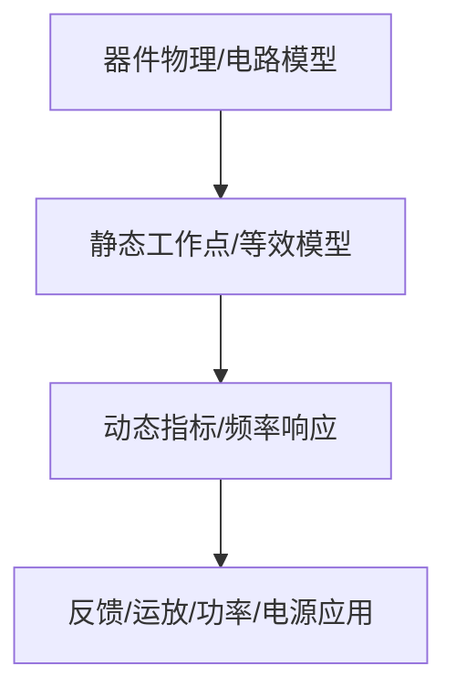

# 01-二极管及其基本电路

> [!info] 使用方式
> 这是拆分后的章节导读。细学时从第一节顺着走；复盘时直接看“章节总复习”；需要查原上下文时回到[[考研专业课/模拟电子技术/详细笔记/01-二极管及其基本电路|整章版详细笔记]]。

---

## 学习路径

| 顺序 | 知识点笔记 | 学习目标 |
| --- | --- | --- |
| 01 | [[考研专业课/模拟电子技术/详细笔记/01-二极管及其基本电路/01-半导体材料与共价键|半导体材料与共价键]] | 知道硅的价电子和共价键结构 |
| 02 | [[考研专业课/模拟电子技术/详细笔记/01-二极管及其基本电路/02-本征半导体与空穴|本征半导体与空穴]] | 会解释本征激发、空穴和复合 |
| 03 | [[考研专业课/模拟电子技术/详细笔记/01-二极管及其基本电路/03-杂质半导体-P型与N型|杂质半导体：P 型与 N 型]] | 会区分 P 型/N 型、多子/少子 |
| 04 | [[考研专业课/模拟电子技术/详细笔记/01-二极管及其基本电路/04-PN结形成与单向导电|PN 结形成与单向导电]] | 能解释 PN 结正偏导通、反偏截止 |
| 05 | [[考研专业课/模拟电子技术/详细笔记/01-二极管及其基本电路/05-二极管结构参数与伏安特性|二极管结构、参数与伏安特性]] | 会读二极管伏安特性和主要参数 |
| 06 | [[考研专业课/模拟电子技术/详细笔记/01-二极管及其基本电路/06-图解法与大信号模型|图解法与大信号模型]] | 会选模型并用负载线求工作点 |
| 07 | [[考研专业课/模拟电子技术/详细笔记/01-二极管及其基本电路/10-稳压管|稳压管与并联稳压电路]] | 会判断稳压状态并选限流电阻 |
| 08 | [[考研专业课/模拟电子技术/详细笔记/01-二极管及其基本电路/99-章节总复习|章节总复习：二极管及其基本电路]] | 回收本章题型、易错点和自测题 |

---

## 快速入口

- 起点：[[考研专业课/模拟电子技术/详细笔记/01-二极管及其基本电路/01-半导体材料与共价键|半导体材料与共价键]]
- 复盘：[[考研专业课/模拟电子技术/详细笔记/01-二极管及其基本电路/99-章节总复习|章节总复习：二极管及其基本电路]]
- 整章版：[[考研专业课/模拟电子技术/详细笔记/01-二极管及其基本电路|整章版详细笔记]]
- 模电索引：[[考研专业课/模拟电子技术/📑 索引]]

---

## 知识网络

