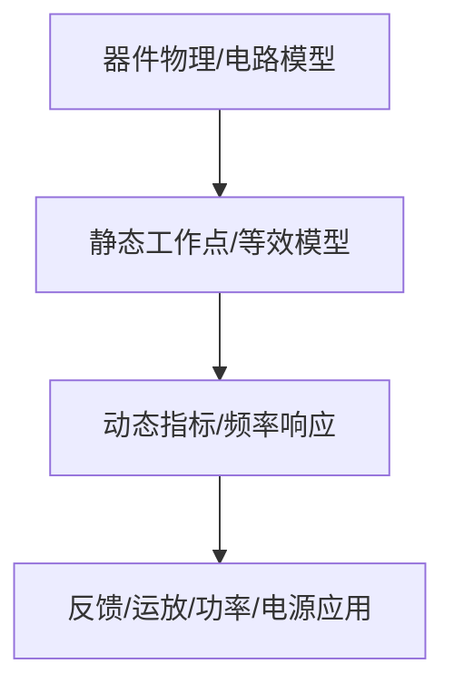

# 02-场效应管及其放大电路

> [!info] 使用方式
> 这是拆分后的章节导读。细学时从第一节顺着走；复盘时直接看“章节总复习”；需要查原上下文时回到[[考研专业课/模拟电子技术/详细笔记/02-场效应管及其放大电路|整章版详细笔记]]。

---

## 学习路径

| 顺序 | 知识点笔记 | 学习目标 |
| --- | --- | --- |
| 01 | [[考研专业课/模拟电子技术/详细笔记/02-场效应管及其放大电路/01-FET核心思想与类型|FET 核心思想与类型]] | 先建立场效应管的控制思想：电压控制电流，栅极近似不开路电流。 |
| 02 | [[考研专业课/模拟电子技术/详细笔记/02-场效应管及其放大电路/02-MOSFET工作区判断|MOSFET 工作区判断]] | 工作区判断是 FET 题第一步，截止、可变电阻区、恒流区条件必须写清。 |
| 03 | [[考研专业课/模拟电子技术/详细笔记/02-场效应管及其放大电路/03-gm与rds参数|$g_m$ 与 $r_{ds}$ 参数]] | 把静态工作点和小信号模型接起来，$g_m$、$r_{ds}$ 都由 Q 点决定。 |
| 04 | [[考研专业课/模拟电子技术/详细笔记/02-场效应管及其放大电路/04-共源极静态与图解|共源极静态分析与图解法]] | 共源是 FET 放大题核心，先求静态，再检查恒流区。 |
| 05 | [[考研专业课/模拟电子技术/详细笔记/02-场效应管及其放大电路/05-共源小信号分析|共源小信号分析]] | 用小信号模型求 $A_v,R_i,R_o$，注意源极电阻和 $r_{ds}$ 的影响。 |
| 06 | [[考研专业课/模拟电子技术/详细笔记/02-场效应管及其放大电路/06-共漏与共栅|共漏、共栅与三种组态对比]] | 三种组态用相位、增益、输入电阻、输出电阻来区分。 |
| 07 | [[考研专业课/模拟电子技术/详细笔记/02-场效应管及其放大电路/07-JFET及其放大电路|JFET 及其放大电路]] | JFET 的控制规律和 MOSFET 不同，但题型仍回到工作区与小信号分析。 |
| 08 | [[考研专业课/模拟电子技术/详细笔记/02-场效应管及其放大电路/99-章节总复习|章节总复习：场效应管]] | 用于回忆 FET 工作区、模型和三种组态的标准题型。 |

---

## 快速入口

- 起点：[[考研专业课/模拟电子技术/详细笔记/02-场效应管及其放大电路/01-FET核心思想与类型|FET 核心思想与类型]]
- 复盘：[[考研专业课/模拟电子技术/详细笔记/02-场效应管及其放大电路/99-章节总复习|章节总复习：场效应管]]
- 整章版：[[考研专业课/模拟电子技术/详细笔记/02-场效应管及其放大电路|整章版详细笔记]]
- 模电索引：[[考研专业课/模拟电子技术/📑 索引]]

---

## 知识网络

