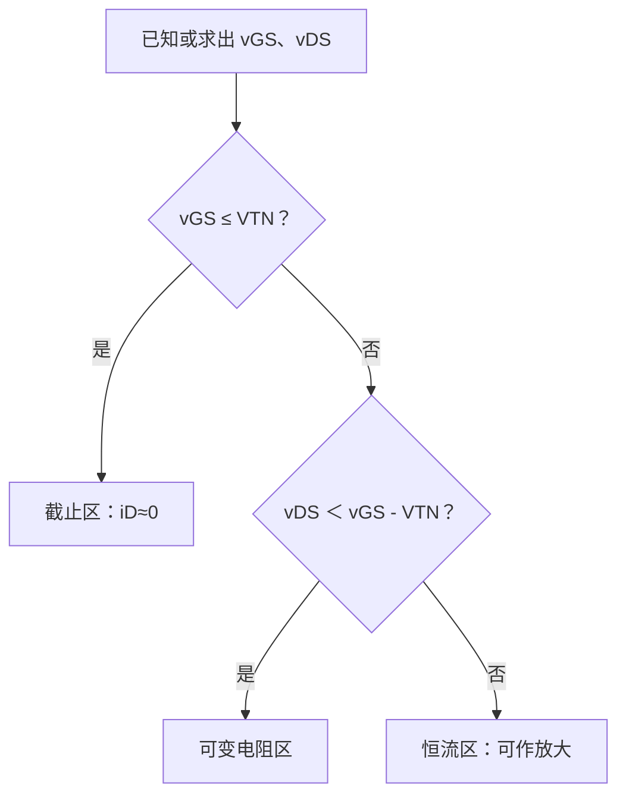
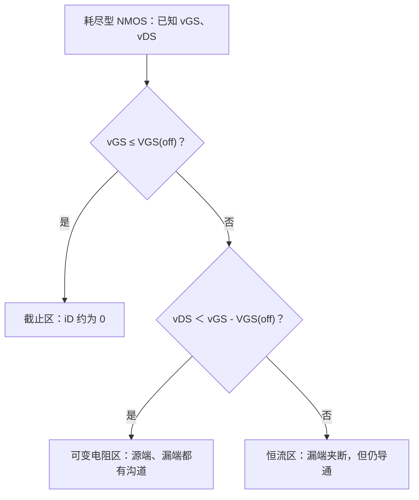

# MOSFET 工作区判断

> [!info] 学习定位
> 这一节是 FET 放大电路的入口：先判断工作区，再决定能不能按放大电路分析。核心顺序是：先看 $v_{GS}$ 是否导通，再比较 $v_{DS}$ 和 $v_{GS}-V_{TN}$。

- 上级：[[考研专业课/模拟电子技术/详细笔记/02-场效应管及其放大电路/00-章节导读|章节导读]]
- 整章：[[考研专业课/模拟电子技术/详细笔记/02-场效应管及其放大电路|整章版]]
- 上一节：[[考研专业课/模拟电子技术/详细笔记/02-场效应管及其放大电路/01-FET核心思想与类型|FET 核心思想与类型]]
- 下一节：[[考研专业课/模拟电子技术/详细笔记/02-场效应管及其放大电路/03-gm与rds参数|$g_m$ 与 $r_{ds}$ 参数]]

---

## 符号表（先看这个）

> [!info]- 符号表（点击展开）
> 本节统一约定：
> - 电压统一按 $v_{XY}=v_X-v_Y$ 理解，例如 $v_{GS}=v_G-v_S$。
> - 小写 $v$、$i$ 表示本节用于判断的大信号瞬时量或直流量；带 $Q$ 的 $V_{GSQ}$、$V_{DSQ}$ 表示静态工作点。
> - NMOS 默认电流参考方向：$i_D$ 从漏极 D 流向源极 S；电子实际运动方向相反。
>
> **电压与电流：**
>
> | 符号 | 含义 | 方向或定义 | 单位/做题用法 |
> | --- | --- | --- | --- |
> | $v_{GS}$ | 栅源电压 | $v_G-v_S$ | V；先用它判断是否导通 |
> | $v_{DS}$ | 漏源电压 | $v_D-v_S$ | V；导通后用它判断可变电阻区或恒流区 |
> | $v_{GD}$ | 栅漏电压 | $v_G-v_D$，且 $v_{GD}=v_{GS}-v_{DS}$ | V；漏端夹断条件常写 $v_{GD}=V_{TN}$ |
> | $V_{GSQ}$ | 静态栅源电压 | Q 点处的 $v_{GS}$ | V；放大电路必须先满足 $V_{GSQ}>V_{TN}$ |
> | $V_{DSQ}$ | 静态漏源电压 | Q 点处的 $v_{DS}$ | V；放大电路还要满足 $V_{DSQ}\geq V_{GSQ}-V_{TN}$ |
> | $i_D$ | 漏极电流 | NMOS 常规定从 D 流向 S | A 或 mA；恒流区内主要由 $v_{GS}$ 决定 |
> | $I_D$ | 直流漏极电流 | 直流或静态值 | A 或 mA；题目求静态工作点时常用 |
>
> **阈值与器件参数：**
>
> | 符号 | 含义 | 典型符号关系 | 做题用法 |
> | --- | --- | --- | --- |
> | $V_{TN}$ | N 沟道 MOSFET 阈值电压 | 增强型 NMOS 通常 $V_{TN}>0$；耗尽型 NMOS 通常 $V_{TN}<0$ | 统一用 $v_{GS}>V_{TN}$ 判断是否存在沟道 |
> | $V_{GS(\mathrm{off})}$ / $U_{GS(\mathrm{off})}$ | 耗尽型 NMOS 的夹断/截止栅源电压 | N 沟道为负值，常与耗尽型阈值 $V_{TN}$ 等价 | 当 $v_{GS}\leq V_{GS(\mathrm{off})}$ 时截止 |
> | $V_{TP}$ | P 沟道 MOSFET 阈值电压 | 增强型 PMOS 通常 $V_{TP}<0$ | PMOS 导通条件要整体反极性判断 |
> | $v_{DS(\mathrm{sat})}$ | 进入恒流区的临界漏源电压 | $v_{DS(\mathrm{sat})}=v_{GS}-V_{TN}$ | 不是 BJT 的“饱和”，而是 MOSFET 夹断边界 |
> | $K_n$ | NMOS 导电因子 | $K_n=\frac{1}{2}\mu_n C_{ox}\frac{W}{L}$ | 题目通常直接给，用于 $i_D=K_n(v_{GS}-V_{TN})^2$ |
> | $\mu_n$ | 电子迁移率 | 与工艺材料有关 | 一般不单独计算，只理解它影响 $K_n$ |
> | $C_{ox}$ | 单位面积氧化层电容 | 与栅氧化层有关 | 一般不单独计算，只理解它影响 $K_n$ |
> | $W$、$L$ | 沟道宽度、长度 | $W/L$ 越大，导电能力越强 | 出现在 $K_n$ 中，常用于理解器件尺寸影响 |
> | $I_{D0}$ | 归一化公式中的参考漏极电流 | 常对应 $v_{GS}=2V_{TN}$ 时的恒流区电流 | 用于 $i_D=I_{D0}(\frac{v_{GS}}{V_{TN}}-1)^2$ |
> | $I_{DSS}$ | 耗尽型管零偏漏极电流 | $v_{GS}=0$ 时的电流 | 主要用于耗尽型 NMOS 或 JFET 类公式 |
>
> **下标与端子：**
>
> | 符号 | 含义 | 记忆方式 |
> | --- | --- | --- |
> | G | Gate，栅极 | 控制端，近似不取直流电流 |
> | D | Drain，漏极 | NMOS 常规电流流入端 |
> | S | Source，源极 | NMOS 常规电流流出端 |
> | B | Body，体端或衬底 | 常与 S 相连，避免体二极管误导通 |
> | N / P | 沟道类型 | N 沟道看电子，P 沟道看空穴与反极性 |
> | T | Threshold，阈值 | $V_T$ 表示刚形成沟道的临界电压 |
---

## 0. 先背判断 SOP

> [!tip] N 沟道增强型 MOSFET 工作区判断
> 1. 先算 $v_{GS}$、$v_{DS}$。
> 2. 先判截止：若 $v_{GS}\leq V_{TN}$，则截止，$i_D\approx0$。
> 3. 若 $v_{GS}>V_{TN}$，再比较 $v_{DS}$ 与 $v_{GS}-V_{TN}$。
> 4. 若 $0\leq v_{DS}<v_{GS}-V_{TN}$，为可变电阻区。
> 5. 若 $v_{DS}\geq v_{GS}-V_{TN}$，为恒流区，也就是放大电路常用区域。

---

## 1. 三个工作区：先记表，再会用

N 沟道增强型 MOSFET 是最常用模板。

| 工作区 | 判断条件 | 电路意义 | 做题动作 |
| --- | --- | --- | --- |
| 截止区 | $v_{GS}\leq V_{TN}$ | 沟道未形成，$i_D\approx0$ | 直接按断开处理 |
| 可变电阻区 | $v_{GS}>V_{TN}$，$0\leq v_{DS}<v_{GS}-V_{TN}$ | 像受 $v_{GS}$ 控制的电阻 | 常用于开关导通、非放大判断 |
| 恒流区 | $v_{GS}>V_{TN}$，$v_{DS}\geq v_{GS}-V_{TN}$ | 像受 $v_{GS}$ 控制的电流源 | 放大电路静态点应在此区 |

放大电路的关键判断：

$$
V_{GSQ}>V_{TN},\qquad V_{DSQ}\geq V_{GSQ}-V_{TN}
$$

> [!warning] 最容易混淆的两个判据
> - 截止看栅源电压：$v_{GS}\leq V_{TN}$，根本没有连续感生沟道。
> - 夹断/进入恒流区看漏端栅沟电压：$v_{GD}=V_{TN}$，等价于 $v_{DS}=v_{GS}-V_{TN}$；此时电流没有变为零。

---

## 2. 夹断为什么不等于截止

![[考研专业课/模拟电子技术/附件/02-场效应管及其放大电路/图-增强型NMOS-状态演变-AI重绘-2026-07-18.png|600]]

> [!note] 图的作用与关键标注
> - 图的作用：从同一器件的横截面直接看出，固定 $v_{GS}$ 后增大 $v_{DS}$ 会使沟道从均匀变为向漏端渐窄。
> - 关键标注：C 图漏端的窄区对应 $v_{GD}$ 下降；蓝色箭头是电子从 S 到 D，红色 $I_D$ 是常规电流从 D 到 S。
> - 做题结论：漏端夹断时仍有 $v_{GS}>V_{TN}$，所以并非截止；电流会继续流动，一级模型中近似为恒流。

对已导通的 NMOS，固定 $v_{GS}>V_{TN}$ 后逐渐增大 $v_{DS}$。沿着 S 到 D 的方向，沟道电位逐渐升高，因而栅对沟道的有效控制电压会逐渐减小；在漏端它正是：

$$
v_{GD}=v_G-v_D=v_{GS}-v_{DS}
$$

其中 $v_{GS}$、$v_{DS}$、$v_{GD}$ 分别是栅源、漏源、栅漏电压，单位均为 V。漏端首先达到 $v_{GD}=V_{TN}$ 时，漏端的反型电荷恰好消失，得到夹断边界：

$$
v_{DS(\mathrm{sat})}=v_{GS}-V_{TN}
$$

此处的“夹断”只表示**漏端附近的反型沟道被夹窄**，绝不是 MOSFET 截止。只要 $v_{GS}>V_{TN}$，电子仍会从源端进入沟道、穿过漏端的高电场区到达漏极，$i_D$ 继续流动。教材的一级模型把这一区域视作恒流区；实际器件受沟道长度调制影响，$i_D$ 会随 $v_{DS}$ 略有增加，这也是后续 $r_{ds}$ 的来源。

> [!note] 手写来源位置
> 你的手写原图已经按原始书写顺序统一保留在 [[考研专业课/模拟电子技术/详细笔记/02-场效应管及其放大电路/01-FET核心思想与类型#4. 手写原图顺序索引（按原笔记顺序保留）|上一节的手写原图顺序索引]]。
>
> 本页只保留“工作区判断”的结构化整理，不再把第 2、3 页手写原图单独拆出来放在这里；对应关系是：第 2 页对应感生沟道，第 3 页对应夹断与恒流区。

---

## 3. 可变电阻区与恒流区的形成机制

![[考研专业课/模拟电子技术/附件/02-场效应管及其放大电路/图4-1-3-可变电阻区与恒流区形成机制.jpg|520]]

当 $v_{GS}>V_{TN}$ 时，栅下形成 N 型感生沟道。若 $v_{DS}$ 很小，沟道还没有在漏端夹断，$i_D$ 随 $v_{DS}$ 近似线性增加，这就是可变电阻区。

当 $v_{DS}$ 增大到

$$
v_{GD}=v_{GS}-v_{DS}=V_{TN}
$$

即

$$
v_{DS}=v_{GS}-V_{TN}
$$

漏端附近反型层消失，出现夹断点。之后 $v_{DS}$ 再增加，主要增加在夹断区上，沟道主体电流变化不大，于是进入恒流区。

---

## 4. 两类特性曲线怎么读

### 4.1 输出特性：固定 $v_{GS}$，看 $i_D$ 随 $v_{DS}$ 怎么变

![[考研专业课/模拟电子技术/附件/02-场效应管及其放大电路/图4-1-4-增强型NMOS输出特性.jpg|520]]

输出特性看的是固定 $v_{GS}$ 时 $i_D$ 与 $v_{DS}$ 的关系。图中左侧是可变电阻区，中间和右侧是恒流区。分界线来自夹断条件：

$$
v_{DS}=v_{GS}-V_{TN}
$$

读图时抓三个位置：

- 左下角：截止区，$v_{GS}\leq V_{TN}$。
- 左侧斜上升区：可变电阻区，$i_D$ 受 $v_{DS}$ 影响明显。
- 右侧近似水平区：恒流区，$i_D$ 主要由 $v_{GS}$ 决定。

### 4.2 转移特性：在恒流区内，看 $i_D$ 随 $v_{GS}$ 怎么变

![[考研专业课/模拟电子技术/附件/02-场效应管及其放大电路/图4-1-5-增强型NMOS转移特性.jpg|520]]

转移特性看的是恒流区内 $i_D$ 与 $v_{GS}$ 的关系。增强型 NMOS 在恒流区常用：

$$
i_D=K_n(v_{GS}-V_{TN})^2
$$

其中

$$
K_n=\frac{1}{2}\mu_n C_{ox}\frac{W}{L}
$$

做题时通常直接给 $K_n$，不用从工艺参数算。

> [!tip] 输出特性和转移特性的区别
> - 输出特性：横轴是 $v_{DS}$，用于判断工作区。
> - 转移特性：横轴是 $v_{GS}$，用于根据栅压求漏极电流。

### 4.3 手写补充：恒流区公式到底在研究什么

这张手写图适合放在“输出特性 → 转移特性”之后，因为它解决的是一个学习入口问题：**我们写 $i_D=f(v_{GS})$ 时，默认已经在恒流区讨论。**

> [!note] 先定研究区域
> - 通常分析 MOSFET 放大时，默认工作在恒流区，也就是认为 $v_{DS}$ 足够大、满足 $v_{DS}\geq v_{GS}-V_{TN}$。
> - 在恒流区内，一级模型认为 $i_D$ 主要由 $v_{GS}$ 决定，近似写成 $i_D=f(v_{GS})$。
> - 在可变电阻区内，$i_D$ 同时与 $v_{GS}$、$v_{DS}$ 有关，不是本节放大分析的重点。

恒流区内常用两种等价写法。若用阈值电压写：

$$
i_D=K_n(v_{GS}-V_{TN})^2
$$

其中

$$
K_n=\frac{1}{2}\mu_n C_{ox}\frac{W}{L}
$$

若教材写成归一化形式，也可写为（这里 $V_{TN}$ 对应手写中的 $U_{GS(th)}$）：

$$
i_D=I_{D0}\left(\frac{v_{GS}}{V_{TN}}-1\right)^2
$$

这里 $I_{D0}$ 表示当 $v_{GS}=2V_{TN}$ 时的恒流区漏极电流；两种写法本质一致，只是参数表示方式不同。

> [!example]- 手写来源：输出/转移特性与恒流区公式
> ![[考研专业课/模拟电子技术/附件/02-场效应管及其放大电路/手写-MOSFET输出转移特性与恒流区公式-2026-07-19.png|420]]
>
> - 图的作用：把输出特性曲线、恒流区默认假设和转移特性公式放在同一页，帮助区分“工作区判断”和“恒流区内求电流”。
> - 关键标注：恒流区内 $i_D$ 近似不随 $v_{DS}$ 变化，主要看 $v_{GS}$；可变电阻区内 $i_D$ 与 $v_{GS}$、$v_{DS}$ 都有关。
> - 做题结论：先判工作区；只有确认在恒流区后，才直接套 $i_D=K_n(v_{GS}-V_{TN})^2$ 或等价公式。
---

## 5. 两个变体：耗尽型 NMOS 与 PMOS

### 5.1 耗尽型 NMOS：$v_{GS}=0$ 时已经有沟道

> [!warning] 这次手写图的正确落点
> 你这次上传的三张图标题和结构是 **N 沟道结型场效应管（JFET）**：栅极是 PN 结，正常工作要保持反偏，所以有 $v_{GS}\leq0$ 的约束。它和耗尽型 MOSFET 在 $I_{DSS}$、负的截止电压、恒流区公式上很像，但结构不同；已整理到 [[考研专业课/模拟电子技术/详细笔记/02-场效应管及其放大电路/07-JFET及其放大电路#12. JFET 及其放大电路|JFET 及其放大电路]]。当前小节只保留耗尽型 MOSFET 的统一判区思路。

![[考研专业课/模拟电子技术/附件/02-场效应管及其放大电路/图4-1-7a-耗尽型NMOS输出特性.jpg|520]]

![[考研专业课/模拟电子技术/附件/02-场效应管及其放大电路/图4-1-7b-耗尽型NMOS转移特性.jpg|520]]

> [!tip] 一句话抓住耗尽型 NMOS
> 耗尽型 NMOS **不用加正的栅源电压也能导通**：制造时已经有 N 型导电沟道，$v_{GS}=0$ 时加上 $v_{DS}$ 就有 $i_D$。负栅压会“耗尽”沟道中的电子，直到 $v_{GS}$ 降到负的 $V_{GS(\mathrm{off})}$ 后截止。

#### 5.1.1 物理图像：先有沟道，再谈增强/耗尽

- **零偏已导通**：耗尽型 NMOS 在 P 型衬底上预先形成 N 型沟道，所以 $v_{GS}=0$ 时源漏之间已经可以导电。
- **$v_{GS}>0$：增强**。正栅压吸引更多电子到沟道附近，沟道变厚，在相同 $v_{DS}$ 下 $i_D$ 变大。
- **$V_{GS(\mathrm{off})}<v_{GS}<0$：耗尽但未截止**。负栅压排斥电子，沟道变窄，$i_D$ 变小。
- **$v_{GS}\leq V_{GS(\mathrm{off})}$：截止**。沟道被耗尽到不能形成连续导电通路，$i_D\approx0$。

> [!example]- 手写来源：耗尽型 NMOS 的结构与零偏沟道
> ![[考研专业课/模拟电子技术/附件/02-场效应管及其放大电路/手写-耗尽型NMOS-01-零偏已有沟道-2026-07-19.jpg|420]]
>
> - 图的作用：说明耗尽型 NMOS 与增强型 NMOS 的关键差别——增强型要靠栅压感生沟道，耗尽型在 $v_{GS}=0$ 时已有沟道。
> - 关键标注：N+ 源漏区、P 型衬底、栅氧化层、已有 N 型沟道。
> - 做题结论：看到“耗尽型”时，不要把 $v_{GS}=0$ 误判为截止；它对应 $I_{DSS}$。

#### 5.1.2 工作区判断：公式形式与增强型一致，只是阈值为负

令耗尽型 NMOS 的截止栅源电压为

$$
V_{GS(\mathrm{off})}<0
$$

它与本节统一符号中的负阈值 $V_{TN}$ 等价。只要统一用

$$
v_{GD}=v_G-v_D=v_{GS}-v_{DS}
$$

就能得到与增强型 NMOS 同形的判断：

| 工作区 | 判断条件 | 沟道图像 | 做题动作 |
| --- | --- | --- | --- |
| 截止区 | $v_{GS}\leq V_{GS(\mathrm{off})}$ | 源端沟道也被耗尽，源漏不连通 | 近似 $i_D=0$ |
| 可变电阻区 | $v_{GS}>V_{GS(\mathrm{off})}$，$0\leq v_{DS}<v_{GS}-V_{GS(\mathrm{off})}$ | 源端、漏端都有沟道 | $i_D$ 同时受 $v_{GS}$、$v_{DS}$ 影响 |
| 恒流区 | $v_{GS}>V_{GS(\mathrm{off})}$，$v_{DS}\geq v_{GS}-V_{GS(\mathrm{off})}$ | 源端有沟道，漏端夹断 | 放大电路常用；$i_D$ 主要由 $v_{GS}$ 决定 |

> [!warning] “漏端夹断”不是“整管截止”
> 恒流区的边界来自漏端条件：
>
> $$
> v_{GD}=V_{GS(\mathrm{off})}
> $$
>
> 因为 $v_{GD}=v_{GS}-v_{DS}$，所以进入恒流区的条件可写成：
>
> $$
> v_{DS}\geq v_{GS}-V_{GS(\mathrm{off})}
> $$
>
> 这只说明漏端附近沟道被夹窄，源端仍满足 $v_{GS}>V_{GS(\mathrm{off})}$，因此电流仍能流动。

> [!example]- 手写来源：输出特性、夹断条件与 $v_{GD}$ 判据
> ![[考研专业课/模拟电子技术/附件/02-场效应管及其放大电路/手写-耗尽型NMOS-02-输出转移与夹断条件-2026-07-19.jpg|440]]
>
> - 图的作用：把固定 $v_{GS}$ 时的输出特性曲线和夹断条件连起来。
> - 关键标注：$v_{GD}=v_{GS}-v_{DS}$；当 $v_{GD}\leq V_{GS(\mathrm{off})}$ 时漏端进入夹断。
> - 做题结论：固定 $v_{GS}$ 后，增大 $v_{DS}$，先在可变电阻区，达到 $v_{DS}=v_{GS}-V_{GS(\mathrm{off})}$ 后进入恒流区。

#### 5.1.3 转移特性：恒流区内才直接写 $i_D=f(v_{GS})$

耗尽型 NMOS 的转移特性常用：

$$
i_D=I_{DSS}\left(1-\frac{v_{GS}}{V_{GS(\mathrm{off})}}\right)^2
$$

其中：

- $I_{DSS}$：$v_{GS}=0$ 且工作在恒流区时的漏极电流。
- $V_{GS(\mathrm{off})}$：负值，表示刚截止时的栅源电压。
- 该式默认讨论**恒流区**，所以用公式前还要检查 $v_{DS}\geq v_{GS}-V_{GS(\mathrm{off})}$。

> [!note]- 三种区域的“沟道口诀”
> 1. **两端都无沟道**：截止区，$v_{GS}\leq V_{GS(\mathrm{off})}$。
> 2. **源端有沟道、漏端夹断**：恒流区，$v_{GS}>V_{GS(\mathrm{off})}$ 且 $v_{GD}\leq V_{GS(\mathrm{off})}$。
> 3. **源端、漏端都有沟道**：可变电阻区，$v_{GS}>V_{GS(\mathrm{off})}$ 且 $v_{GD}>V_{GS(\mathrm{off})}$。

> [!example]- 手写来源：耗尽型 NMOS 三区域总结
> ![[考研专业课/模拟电子技术/附件/02-场效应管及其放大电路/手写-耗尽型NMOS-03-三区域判断总结-2026-07-19.jpg|440]]
>
> - 图的作用：把“源端是否有沟道”和“漏端是否夹断”对应到三种工作区。
> - 关键标注：截止先看 $v_{GS}$；恒流/可变电阻再看 $v_{GD}$ 或等价的 $v_{DS}$。
> - 做题结论：耗尽型 NMOS 的 SOP 与增强型相同，但 $V_{GS(\mathrm{off})}$ 是负数，导致 $v_{GS}=0$ 仍属于导通状态。

### 5.2 P 沟道 MOSFET：难点在极性

![[考研专业课/模拟电子技术/附件/02-场效应管及其放大电路/图4-1-9a-PMOS输出特性.jpg|520]]

![[考研专业课/模拟电子技术/附件/02-场效应管及其放大电路/图4-1-9b-增强型PMOS转移特性.jpg|520]]

P 沟道的难点不在公式，而在极性。增强型 PMOS 的阈值电压 $V_{TP}<0$，要让它导通，需要栅源电压足够负：

$$
v_{GS}\leq V_{TP}
$$

若题目仍把 $i_D$ 参考方向规定为流入漏极，那么 PMOS 的电流数值常带负号；若题目按实际电流方向流出漏极定义，则公式可以写成正值。考试中先看题目电流箭头，不要死背正负号。

> [!warning] PMOS 判断提醒
> 对增强型 PMOS，极性整体反过来：导通常看 $v_{GS}\leq V_{TP}$，恒流区边界可写成 $v_{DS}\leq v_{GS}-V_{TP}$。做题时先画清电压参考方向，再套条件。

---

## 6. 考研做题检查清单

- [ ] 先确认管子类型：N/P、增强/耗尽。
- [ ] 明确题目给的电压方向：$v_{GS}$、$v_{DS}$ 是否按定义取值。
- [ ] 对 NMOS 增强型，先判 $v_{GS}\leq V_{TN}$ 是否截止。
- [ ] 若未截止，再比较 $v_{DS}$ 与 $v_{GS}-V_{TN}$。
- [ ] 静态工作点用于放大时，要检查是否在恒流区。
- [ ] 遇到“夹断”不要误判为截止。
- [ ] 遇到 PMOS，不要死背正负号，先看电流箭头和参考方向。

---

## 相关笔记

- 上一节：[[考研专业课/模拟电子技术/详细笔记/02-场效应管及其放大电路/01-FET核心思想与类型|FET 核心思想与类型]]
- 下一节：[[考研专业课/模拟电子技术/详细笔记/02-场效应管及其放大电路/03-gm与rds参数|$g_m$ 与 $r_{ds}$ 参数]]
