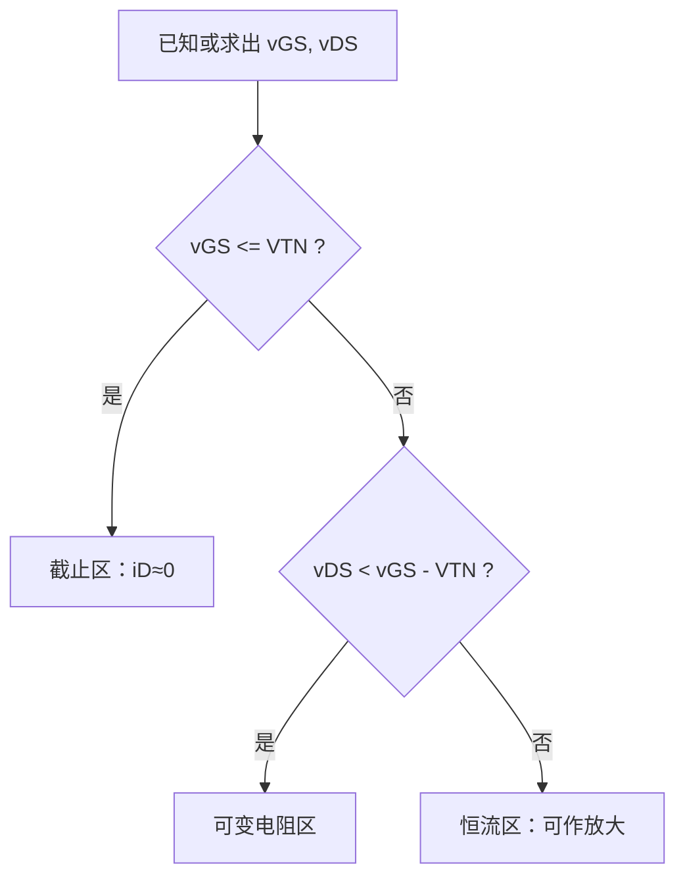

# MOSFET 工作区判断

> [!info] 学习定位
> 这一节是 FET 放大电路的入口：先判断工作区，再决定能不能按放大电路分析。核心顺序是：先看 $v_{GS}$ 是否导通，再比较 $v_{DS}$ 和 $v_{GS}-V_{TN}$。

- 上级：[[考研专业课/模拟电子技术/详细笔记/02-场效应管及其放大电路/00-章节导读|章节导读]]
- 整章：[[考研专业课/模拟电子技术/详细笔记/02-场效应管及其放大电路|整章版]]
- 上一节：[[考研专业课/模拟电子技术/详细笔记/02-场效应管及其放大电路/01-FET核心思想与类型|FET 核心思想与类型]]
- 下一节：[[考研专业课/模拟电子技术/详细笔记/02-场效应管及其放大电路/03-gm与rds参数|$g_m$ 与 $r_{ds}$ 参数]]

---

## 0. 先背判断 SOP

> [!tip] N 沟道增强型 MOSFET 工作区判断
> 1. 先算 $v_{GS}$、$v_{DS}$。
> 2. 先判截止：若 $v_{GS}\leq V_{TN}$，则截止，$i_D\approx0$。
> 3. 若 $v_{GS}>V_{TN}$，再比较 $v_{DS}$ 与 $v_{GS}-V_{TN}$。
> 4. 若 $0\leq v_{DS}<v_{GS}-V_{TN}$，为可变电阻区。
> 5. 若 $v_{DS}\geq v_{GS}-V_{TN}$，为恒流区，也就是放大电路常用区域。

---

## 1. 三个工作区：先记表，再会用

N 沟道增强型 MOSFET 是最常用模板。

| 工作区 | 判断条件 | 电路意义 | 做题动作 |
| --- | --- | --- | --- |
| 截止区 | $v_{GS}\leq V_{TN}$ | 沟道未形成，$i_D\approx0$ | 直接按断开处理 |
| 可变电阻区 | $v_{GS}>V_{TN}$，$0\leq v_{DS}<v_{GS}-V_{TN}$ | 像受 $v_{GS}$ 控制的电阻 | 常用于开关导通、非放大判断 |
| 恒流区 | $v_{GS}>V_{TN}$，$v_{DS}\geq v_{GS}-V_{TN}$ | 像受 $v_{GS}$ 控制的电流源 | 放大电路静态点应在此区 |

放大电路的关键判断：

$$
V_{GSQ}>V_{TN},\qquad V_{DSQ}\geq V_{GSQ}-V_{TN}
$$

> [!warning] 最容易混淆的两个判据
> - 截止看栅源电压：$v_{GS}\leq V_{TN}$，根本没有连续感生沟道。
> - 夹断/进入恒流区看漏端栅沟电压：$v_{GD}=V_{TN}$，等价于 $v_{DS}=v_{GS}-V_{TN}$；此时电流没有变为零。

---

## 2. 夹断为什么不等于截止

![[考研专业课/模拟电子技术/附件/02-场效应管及其放大电路/图-增强型NMOS-状态演变-AI重绘-2026-07-18.png|600]]

> [!note] 图的作用与关键标注
> - 图的作用：从同一器件的横截面直接看出，固定 $v_{GS}$ 后增大 $v_{DS}$ 会使沟道从均匀变为向漏端渐窄。
> - 关键标注：C 图漏端的窄区对应 $v_{GD}$ 下降；蓝色箭头是电子从 S 到 D，红色 $I_D$ 是常规电流从 D 到 S。
> - 做题结论：漏端夹断时仍有 $v_{GS}>V_{TN}$，所以并非截止；电流会继续流动，一级模型中近似为恒流。

对已导通的 NMOS，固定 $v_{GS}>V_{TN}$ 后逐渐增大 $v_{DS}$。沿着 S 到 D 的方向，沟道电位逐渐升高，因而栅对沟道的有效控制电压会逐渐减小；在漏端它正是：

$$
v_{GD}=v_G-v_D=v_{GS}-v_{DS}
$$

其中 $v_{GS}$、$v_{DS}$、$v_{GD}$ 分别是栅源、漏源、栅漏电压，单位均为 V。漏端首先达到 $v_{GD}=V_{TN}$ 时，漏端的反型电荷恰好消失，得到夹断边界：

$$
v_{DS(\mathrm{sat})}=v_{GS}-V_{TN}
$$

此处的“夹断”只表示**漏端附近的反型沟道被夹窄**，绝不是 MOSFET 截止。只要 $v_{GS}>V_{TN}$，电子仍会从源端进入沟道、穿过漏端的高电场区到达漏极，$i_D$ 继续流动。教材的一级模型把这一区域视作恒流区；实际器件受沟道长度调制影响，$i_D$ 会随 $v_{DS}$ 略有增加，这也是后续 $r_{ds}$ 的来源。

> [!note] 手写来源位置
> 你的手写原图已经按原始书写顺序统一保留在 [[考研专业课/模拟电子技术/详细笔记/02-场效应管及其放大电路/01-FET核心思想与类型#4. 手写原图顺序索引（按原笔记顺序保留）|上一节的手写原图顺序索引]]。
>
> 本页只保留“工作区判断”的结构化整理，不再把第 2、3 页手写原图单独拆出来放在这里；对应关系是：第 2 页对应感生沟道，第 3 页对应夹断与恒流区。

---

## 3. 可变电阻区与恒流区的形成机制

![[考研专业课/模拟电子技术/附件/02-场效应管及其放大电路/图4-1-3-可变电阻区与恒流区形成机制.jpg|520]]

当 $v_{GS}>V_{TN}$ 时，栅下形成 N 型感生沟道。若 $v_{DS}$ 很小，沟道还没有在漏端夹断，$i_D$ 随 $v_{DS}$ 近似线性增加，这就是可变电阻区。

当 $v_{DS}$ 增大到

$$
v_{GD}=v_{GS}-v_{DS}=V_{TN}
$$

即

$$
v_{DS}=v_{GS}-V_{TN}
$$

漏端附近反型层消失，出现夹断点。之后 $v_{DS}$ 再增加，主要增加在夹断区上，沟道主体电流变化不大，于是进入恒流区。

---

## 4. 两类特性曲线怎么读

### 4.1 输出特性：固定 $v_{GS}$，看 $i_D$ 随 $v_{DS}$ 怎么变

![[考研专业课/模拟电子技术/附件/02-场效应管及其放大电路/图4-1-4-增强型NMOS输出特性.jpg|520]]

输出特性看的是固定 $v_{GS}$ 时 $i_D$ 与 $v_{DS}$ 的关系。图中左侧是可变电阻区，中间和右侧是恒流区。分界线来自夹断条件：

$$
v_{DS}=v_{GS}-V_{TN}
$$

读图时抓三个位置：

- 左下角：截止区，$v_{GS}\leq V_{TN}$。
- 左侧斜上升区：可变电阻区，$i_D$ 受 $v_{DS}$ 影响明显。
- 右侧近似水平区：恒流区，$i_D$ 主要由 $v_{GS}$ 决定。

### 4.2 转移特性：在恒流区内，看 $i_D$ 随 $v_{GS}$ 怎么变

![[考研专业课/模拟电子技术/附件/02-场效应管及其放大电路/图4-1-5-增强型NMOS转移特性.jpg|520]]

转移特性看的是恒流区内 $i_D$ 与 $v_{GS}$ 的关系。增强型 NMOS 在恒流区常用：

$$
i_D=K_n(v_{GS}-V_{TN})^2
$$

其中

$$
K_n=\frac{1}{2}\mu_n C_{ox}\frac{W}{L}
$$

做题时通常直接给 $K_n$，不用从工艺参数算。

> [!tip] 输出特性和转移特性的区别
> - 输出特性：横轴是 $v_{DS}$，用于判断工作区。
> - 转移特性：横轴是 $v_{GS}$，用于根据栅压求漏极电流。

---

## 5. 两个变体：耗尽型 NMOS 与 PMOS

### 5.1 耗尽型 NMOS：$v_{GS}=0$ 时已经有沟道

![[考研专业课/模拟电子技术/附件/02-场效应管及其放大电路/图4-1-7a-耗尽型NMOS输出特性.jpg|520]]

![[考研专业课/模拟电子技术/附件/02-场效应管及其放大电路/图4-1-7b-耗尽型NMOS转移特性.jpg|520]]

耗尽型 NMOS 的 $V_{TN}<0$，所以 $v_{GS}=0$ 时也有电流，记作 $I_{DSS}$。恒流区常用：

$$
i_D=I_{DSS}\left(1-\frac{v_{GS}}{V_{TN}}\right)^2
$$

注意这里 $V_{TN}$ 是负数。若 $v_{GS}$ 更负，沟道变薄，$i_D$ 变小；若 $v_{GS}$ 为正，沟道变厚，$i_D$ 变大。

### 5.2 P 沟道 MOSFET：难点在极性

![[考研专业课/模拟电子技术/附件/02-场效应管及其放大电路/图4-1-9a-PMOS输出特性.jpg|520]]

![[考研专业课/模拟电子技术/附件/02-场效应管及其放大电路/图4-1-9b-增强型PMOS转移特性.jpg|520]]

P 沟道的难点不在公式，而在极性。增强型 PMOS 的阈值电压 $V_{TP}<0$，要让它导通，需要栅源电压足够负：

$$
v_{GS}\leq V_{TP}
$$

若题目仍把 $i_D$ 参考方向规定为流入漏极，那么 PMOS 的电流数值常带负号；若题目按实际电流方向流出漏极定义，则公式可以写成正值。考试中先看题目电流箭头，不要死背正负号。

> [!warning] PMOS 判断提醒
> 对增强型 PMOS，极性整体反过来：导通常看 $v_{GS}\leq V_{TP}$，恒流区边界可写成 $v_{DS}\leq v_{GS}-V_{TP}$。做题时先画清电压参考方向，再套条件。

---

## 6. 考研做题检查清单

- [ ] 先确认管子类型：N/P、增强/耗尽。
- [ ] 明确题目给的电压方向：$v_{GS}$、$v_{DS}$ 是否按定义取值。
- [ ] 对 NMOS 增强型，先判 $v_{GS}\leq V_{TN}$ 是否截止。
- [ ] 若未截止，再比较 $v_{DS}$ 与 $v_{GS}-V_{TN}$。
- [ ] 静态工作点用于放大时，要检查是否在恒流区。
- [ ] 遇到“夹断”不要误判为截止。
- [ ] 遇到 PMOS，不要死背正负号，先看电流箭头和参考方向。

---

## 相关笔记

- 上一节：[[考研专业课/模拟电子技术/详细笔记/02-场效应管及其放大电路/01-FET核心思想与类型|FET 核心思想与类型]]
- 下一节：[[考研专业课/模拟电子技术/详细笔记/02-场效应管及其放大电路/03-gm与rds参数|$g_m$ 与 $r_{ds}$ 参数]]
