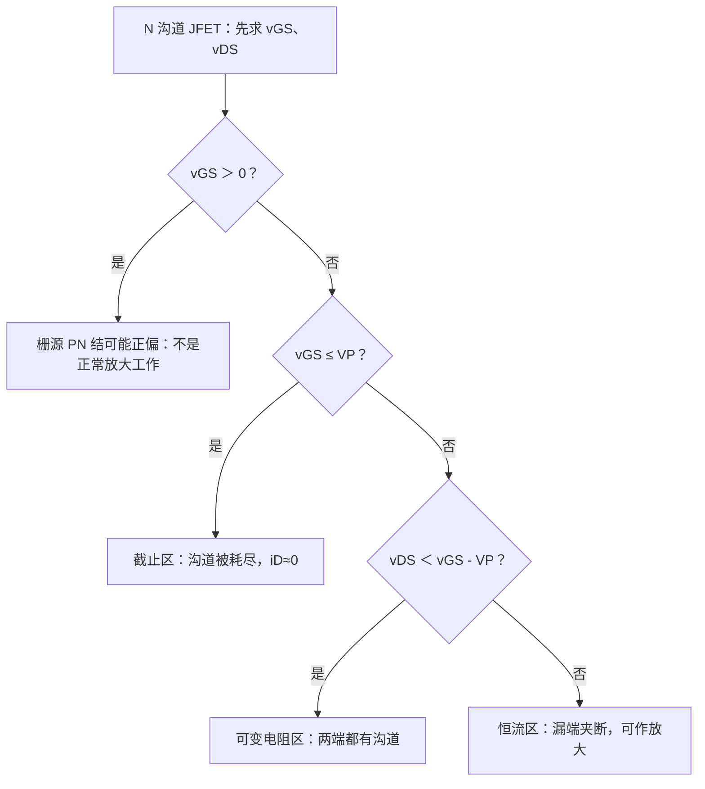

# JFET 及其放大电路

> [!info] 学习定位
> JFET 的控制规律和 MOSFET 不同，但题型仍回到工作区与小信号分析。先抓住“栅源 PN 结反偏”，再用 $v_{DS}=v_{GS}-V_P$ 判断可变电阻区/恒流区。

- 上级：[[考研专业课/模拟电子技术/详细笔记/02-场效应管及其放大电路/00-章节导读|章节导读]]
- 整章：[[考研专业课/模拟电子技术/详细笔记/02-场效应管及其放大电路|整章版]]
- 上一节：[[考研专业课/模拟电子技术/详细笔记/02-场效应管及其放大电路/06-共漏与共栅|共漏、共栅与三种组态对比]]
- 下一节：[[考研专业课/模拟电子技术/详细笔记/02-场效应管及其放大电路/99-章节总复习|章节总复习：场效应管]]
- 对照：[[考研专业课/模拟电子技术/详细笔记/02-场效应管及其放大电路/02-MOSFET工作区判断#5. 两个变体：耗尽型 NMOS 与 PMOS|MOSFET 变体工作区]]

---

## 符号速查

> [!abstract]- 符号速查（JFET 先看这一块）
> 本页默认讨论 **N 沟道 JFET**，且 $v_{DS}\geq 0$、常规漏极电流 $i_D$ 从 D 流向 S。
>
> | 符号 | 含义 | 方向/极性约定 | 做题用法 |
> | --- | --- | --- | --- |
> | G、D、S | 栅极、漏极、源极 | 栅极是 PN 结栅，不是绝缘栅 | 先判断栅源 PN 结是否保持反偏 |
> | $v_{GS}$ | 栅源电压 | $v_G-v_S$；N 沟道正常工作通常 $v_{GS}\leq0$ | 先用它判断是否截止/是否可能正偏 |
> | $v_{DS}$ | 漏源电压 | $v_D-v_S$ | 导通后用它判断可变电阻区或恒流区 |
> | $v_{GD}$ | 栅漏电压 | $v_G-v_D=v_{GS}-v_{DS}$ | 漏端夹断条件常由它推出 |
> | $V_P$ | 夹断/截止电压 | N 沟道通常 $V_P<0$，也常记作 $V_{GS(\mathrm{off})}$ | $v_{GS}\leq V_P$ 时截止；边界 $v_{DS}=v_{GS}-V_P$ |
> | $I_{DSS}$ | 零偏饱和漏极电流 | $v_{GS}=0$ 且在恒流区时的漏极电流 | 转移特性公式的最大参考电流 |
> | $g_m$ | 互导 | $g_m=\partial i_D/\partial v_{GS}$ | 小信号模型中受控源 $g_mv_{gs}$ 的系数 |
> | $r_{ds}$ | 漏源小信号电阻 | 反映恒流区曲线并非完全水平 | 忽略时输出端只看受控电流源，精细题再并联 $r_{ds}$ |

---

## 12. JFET 及其放大电路

### 12.1 JFET 的结构：栅极是 PN 结，必须反偏

![[考研专业课/模拟电子技术/附件/02-场效应管及其放大电路/图4-8-1a-N沟道JFET结构.jpg|520]]

![[考研专业课/模拟电子技术/附件/02-场效应管及其放大电路/图4-8-1b-N沟道JFET符号.jpg|360]]

N 沟道 JFET 在 N 型半导体材料两侧扩散 $P^+$ 区，形成栅极。栅极和 N 沟道之间是 PN 结；正常工作时，栅源 PN 结要保持反向偏置，因此 N 沟道 JFET 通常要求：

$$
v_{GS}\leq0
$$

这和 MOSFET 的关键差别是：MOSFET 是绝缘栅，栅极几乎没有直流电流；JFET 是 PN 结栅，若让栅源结正偏，栅极电流就不再能忽略，放大模型会失效。

> [!warning] 不要把 JFET 当成耗尽型 MOSFET
> - JFET：栅极是 PN 结，核心约束是栅源结反偏，即 N 沟道一般 $v_{GS}\leq0$。
> - 耗尽型 MOSFET：栅极是绝缘栅，$v_{GS}=0$ 时已有沟道，也可以用负栅压耗尽沟道；但“PN 结反偏”不是它的主约束。
> - 二者公式形式很像，都会出现 $I_{DSS}$ 和负的截止电压；考题先看器件符号/结构再套公式。

#### 12.1.1 结构图怎么读

- **零偏已有沟道**：N 沟道本身存在，$v_{GS}=0$ 时只要加上 $v_{DS}$，就能有漏极电流。
- **反偏变大，沟道变窄**：$v_{GS}$ 越负，PN 结耗尽层越宽，导电沟道越窄，$i_D$ 越小。
- **达到截止电压，沟道被耗尽**：当 $v_{GS}\leq V_P$（即 $V_{GS(\mathrm{off})}$）时，沟道被夹断到不能形成连续导电通路，$i_D\approx0$。

> [!example]- 手写来源：N 沟道 JFET 结构与 PN 结反偏
> ![[考研专业课/模拟电子技术/附件/02-场效应管及其放大电路/手写-N沟道JFET-01-结构与PN结反偏-2026-07-20.jpg|440]]
>
> - 图的作用：把“P 区栅极 + N 沟道 + PN 结反偏”对应起来，说明 JFET 为什么通常只在 $v_{GS}\leq0$ 下工作。
> - 关键标注：两侧 $P^+$ 栅区、中央 N 沟道、耗尽层宽度随反偏电压增大而增大。
> - 做题结论：看到 N 沟道 JFET，第一步不是套平方律，而是先确认栅源结没有正偏；$v_{GS}=0$ 不是截止。

JFET 和 MOSFET 的区别：

| 对比项 | MOSFET | JFET |
| --- | --- | --- |
| 栅极结构 | 绝缘栅 | PN 结栅 |
| 栅极电流 | 极小，输入电阻更高 | 反偏时很小，但低于 MOSFET |
| 常用参数 | $V_T,K,g_m,r_{ds}$ | $V_P,I_{DSS},g_m,r_{ds}$ |
| 主要特点 | 集成电路和功率器件常见 | 低噪声场合常见 |

### 12.2 JFET 工作区：先判截止，再判夹断

#### 12.2.1 三个工作区

以 N 沟道 JFET 为例，令 $V_P=V_{GS(\mathrm{off})}<0$。默认 $v_{DS}\geq 0$ 时，三区域判断如下：

| 工作区 | 判断条件 | 沟道图像 | 做题动作 |
| --- | --- | --- | --- |
| 截止区 | $v_{GS}\leq V_P$ | 沟道被耗尽，源漏不连通 | 近似 $i_D=0$ |
| 可变电阻区 | $V_P<v_{GS}\leq0$，$0\leq v_{DS}<v_{GS}-V_P$ | 源端、漏端都有沟道 | $i_D$ 同时受 $v_{GS}$、$v_{DS}$ 影响 |
| 恒流区 | $V_P<v_{GS}\leq0$，$v_{DS}\geq v_{GS}-V_P$ | 漏端夹断，源端仍有沟道 | 放大电路常用；$i_D$ 主要由 $v_{GS}$ 决定 |

#### 12.2.2 输出特性与夹断边界

![[考研专业课/模拟电子技术/附件/02-场效应管及其放大电路/图4-8-5a-JFET输出特性vgs0.jpg|500]]

![[考研专业课/模拟电子技术/附件/02-场效应管及其放大电路/图4-8-5b-JFET输出特性族.jpg|520]]

固定 $v_{GS}$ 后增大 $v_{DS}$，漏端电位升高，漏端栅沟电压变为：

$$
v_{GD}=v_G-v_D=v_{GS}-v_{DS}
$$

当漏端满足

$$
v_{GD}=V_P
$$

时，漏端先进入夹断。于是恒流区边界为：

$$
v_{DS}=v_{GS}-V_P
$$

因为 N 沟道 JFET 的 $V_P<0$，所以这个临界 $v_{DS}$ 通常是正数。到达该边界以后，沟道在漏端夹断，但源端仍满足 $v_{GS}>V_P$，所以整管不是截止；一级模型中 $i_D$ 近似保持恒定。

> [!example] 边界数值一眼算
> 若 $V_P=V_{GS(\mathrm{off})}=-3\text{ V}$，且固定 $v_{GS}=-1\text{ V}$，则：
>
> $$
> v_{DS(\mathrm{sat})}=v_{GS}-V_P=-1-(-3)=2\text{ V}
> $$
>
> 所以 $v_{DS}<2\text{ V}$ 时为可变电阻区，$v_{DS}\geq2\text{ V}$ 时进入恒流区。

> [!example]- 手写来源：输出特性与 $v_{GD}$ 夹断判据
> ![[考研专业课/模拟电子技术/附件/02-场效应管及其放大电路/手写-N沟道JFET-02-输出特性与夹断边界-2026-07-20.jpg|440]]
>
> - 图的作用：把输出特性曲线上的“拐点”与公式 $v_{DS}=v_{GS}-V_P$ 对应起来。
> - 关键标注：示例中 $V_P=-3\text{ V}$、$v_{GS}=-1\text{ V}$，边界 $v_{DS}=2\text{ V}$。
> - 做题结论：固定 $v_{GS}$ 后，先随 $v_{DS}$ 增大而进入可变电阻区；达到夹断边界后进入恒流区，才能近似只由 $v_{GS}$ 决定 $i_D$。

#### 12.2.3 转移特性：恒流区内才直接写 $i_D=f(v_{GS})$

![[考研专业课/模拟电子技术/附件/02-场效应管及其放大电路/图4-8-6-JFET转移特性.jpg|520]]

JFET 转移特性描述的是：**在恒流区内**，$i_D$ 随 $v_{GS}$ 的变化规律。N 沟道 JFET 常用肖克莱方程：

$$
i_D=I_{DSS}\left(1-\frac{v_{GS}}{V_P}\right)^2
$$

其中：

- $I_{DSS}$：$v_{GS}=0$ 且处于恒流区时的漏极电流，也是转移曲线在 $v_{GS}=0$ 处的最大参考值。
- $V_P$：负的截止/夹断电压，即 $V_{GS(\mathrm{off})}$。
- 公式适用前提：$V_P\leq v_{GS}\leq0$ 且 $v_{DS}\geq v_{GS}-V_P$。

> [!warning] 公式不是第一步
> JFET 题不能一上来就套 $i_D=I_{DSS}(1-v_{GS}/V_P)^2$。先判管子是否正常反偏、是否未截止、是否在恒流区；只有这些成立，转移特性公式才是主公式。

> [!example]- 手写来源：转移特性、$I_{DSS}$ 与符号
> ![[考研专业课/模拟电子技术/附件/02-场效应管及其放大电路/手写-N沟道JFET-03-转移特性与符号-2026-07-20.jpg|440]]
>
> - 图的作用：把 $i_D$-$v_{GS}$ 转移曲线、$I_{DSS}$ 的含义和 JFET 符号放在一起。
> - 关键标注：曲线在 $v_{GS}=0$ 处对应 $I_{DSS}$；当 $v_{GS}=V_P$ 时电流降为 0。
> - 做题结论：$I_{DSS}$ 不是任意最大电流，而是零偏且处于恒流区时的漏极电流。

### 12.3 JFET 小信号模型

JFET 的低频小信号模型和 MOSFET 很像：输入端近似开路，输出端是受控电流源 $g_mv_{gs}$，必要时并联 $r_{ds}$。

从转移特性对 $v_{GS}$ 求导，可得 JFET 的互导：

$$
g_m=-\frac{2I_{DSS}}{V_P}\left(1-\frac{V_{GSQ}}{V_P}\right)
$$

由于 N 沟道 JFET 的 $V_P<0$，上式计算出的 $g_m$ 为正值。

也常写成：

$$
g_m=\frac{2}{\lvert V_P\rvert}\sqrt{I_{DSS}I_{DQ}}
$$

其中 $I_{DQ}$ 是静态工作点漏极电流。做小信号题时，先由直流偏置求 $V_{GSQ}$、$I_{DQ}$，再代入 $g_m$，最后进入共源、共漏或共栅等效电路。

### 12.4 JFET 共源电路

![[考研专业课/模拟电子技术/附件/02-场效应管及其放大电路/图4-8-8a-JFET共源极电路.jpg|520]]

![[考研专业课/模拟电子技术/附件/02-场效应管及其放大电路/图4-8-8b-JFET共源小信号等效.jpg|520]]

若忽略 $r_{ds}$：

$$
v_i=v_{gs}+g_mv_{gs}R_s=v_{gs}(1+g_mR_s)
$$

$$
v_o=-g_mv_{gs}R_d
$$

所以：

$$
A_v=-\frac{g_mR_d}{1+g_mR_s}
$$

输入电阻常由栅极偏置电阻决定。若存在串联栅极电阻 $R_{g3}$：

$$
R_i\approx R_{g3}+R_{g1}\parallel R_{g2}
$$

输出电阻：

$$
R_o\approx R_d
$$

### 12.5 考研做题检查清单

- [ ] 先确认是 JFET，不是 MOSFET：看栅极是否为 PN 结栅。
- [ ] N 沟道 JFET 正常放大时，先检查 $v_{GS}\leq0$，避免栅源结正偏。
- [ ] 判断截止：$v_{GS}\leq V_P$ 时，$i_D\approx0$。
- [ ] 若未截止，再比较 $v_{DS}$ 与 $v_{GS}-V_P$。
- [ ] 用转移特性公式前，确认已经在恒流区。
- [ ] 看到 $I_{DSS}$，立刻想到 $v_{GS}=0$ 且恒流区。
- [ ] 计算 $g_m$ 时注意 $V_P<0$，最终 $g_m$ 应为正值。

---

## 相关笔记

- 对照：[[考研专业课/模拟电子技术/详细笔记/02-场效应管及其放大电路/02-MOSFET工作区判断|MOSFET 工作区判断]]
- 上一节：[[考研专业课/模拟电子技术/详细笔记/02-场效应管及其放大电路/06-共漏与共栅|共漏、共栅与三种组态对比]]
- 下一节：[[考研专业课/模拟电子技术/详细笔记/02-场效应管及其放大电路/99-章节总复习|章节总复习：场效应管]]
