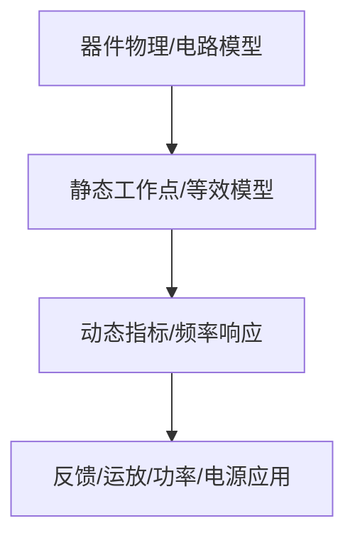

# 03-BJT 与基本放大电路

> [!info] 使用方式
> 这是拆分后的章节导读。细学时从第一节顺着走；复盘时直接看“章节总复习”；需要查原上下文时回到[[考研专业课/模拟电子技术/详细笔记/03-BJT与基本放大电路|整章版详细笔记]]。

---

## 学习路径

> [!important] 修正版学习路线
> 本章不能一上来就背增益公式。正确顺序是：先知道 BJT 怎么导通、怎么进放大区，再设置静态工作点，最后才进入微变等效和动态指标。口诀是：**器件工作区 → 静态 Q 点 → 小信号模型 → 动态指标 → 组态对比**。

| 顺序 | 知识点笔记 | 学习目标 |
| --- | --- | --- |
| 01 | [[考研专业课/模拟电子技术/详细笔记/03-BJT与基本放大电路/01-放大思想与工作区|BJT 器件基础、放大思想与工作区]] | 先补齐 BJT 三层两结、电流关系、特性曲线与工作区判断，解决“凭什么能放大”。 |
| 02 | [[考研专业课/模拟电子技术/详细笔记/03-BJT与基本放大电路/02-直流通路与交流通路|直流通路与交流通路]] | 建立“先直流、后交流”的分析纪律，因为 $r_{be}$ 和动态模型都依赖 Q 点。 |
| 03 | [[考研专业课/模拟电子技术/详细笔记/03-BJT与基本放大电路/03-基本共射放大电路|基本共射放大电路]] | 用固定偏置共射电路学会静态工作点、反相放大和电流到电压的转换。 |
| 04 | [[考研专业课/模拟电子技术/详细笔记/03-BJT与基本放大电路/04-分压式射极偏置|分压式射极偏置共射电路]] | 解决 Q 点稳定问题，理解射极电阻的直流负反馈作用。 |
| 05 | [[考研专业课/模拟电子技术/详细笔记/03-BJT与基本放大电路/05-BJT小信号模型|BJT 小信号模型]] | 把 BJT 换成 $r_{be}$ 与受控源，完成从非线性器件到线性等效电路的转换。 |
| 06 | [[考研专业课/模拟电子技术/详细笔记/03-BJT与基本放大电路/06-共射动态指标|共射电路动态指标]] | 集中训练 $A_v$、$R_i$、$R_o$、$A_{vs}$ 的计算，注意负载和旁路电容影响。 |
| 07 | [[考研专业课/模拟电子技术/详细笔记/03-BJT与基本放大电路/07-三种BJT基本组态|三种 BJT 基本组态]] | 对比共射、共集、共基的相位、增益、输入输出电阻和典型用途。 |
| 08 | [[考研专业课/模拟电子技术/详细笔记/03-BJT与基本放大电路/99-章节总复习|章节总复习：BJT 与基本放大电路]] | 按考研题型复盘：静态工作点、微变等效、动态指标、失真判断。 |

> [!warning] 当前补全状态
> 已恢复 01-07 的拆分笔记文件；原先它们被保留为 `.md.bak_restructure`，所以 Obsidian 里看起来像“内容缺失”。但本章仍需继续补强例题密度，尤其是静态工作点、分压偏置、动态指标三类计算题。

---

## 快速入口

- 起点：[[考研专业课/模拟电子技术/详细笔记/03-BJT与基本放大电路/01-放大思想与工作区|放大思想与 BJT 工作区]]
- 复盘：[[考研专业课/模拟电子技术/详细笔记/03-BJT与基本放大电路/99-章节总复习|章节总复习：BJT 与基本放大电路]]
- 整章版：[[考研专业课/模拟电子技术/详细笔记/03-BJT与基本放大电路|整章版详细笔记]]
- 模电索引：[[考研专业课/模拟电子技术/📑 索引]]

---

## 知识网络

