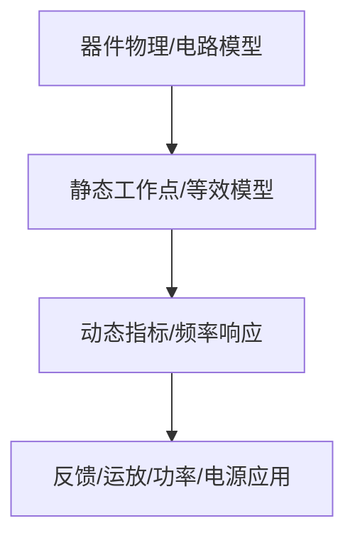

# 03-BJT 与基本放大电路

> [!info] 使用方式
> 这是拆分后的章节导读。细学时从第一节顺着走；复盘时直接看“章节总复习”；需要查原上下文时回到[[考研专业课/模拟电子技术/详细笔记/03-BJT与基本放大电路|整章版详细笔记]]。

---

## 学习路径

| 顺序 | 知识点笔记 | 学习目标 |
| --- | --- | --- |
| 01 | [[考研专业课/模拟电子技术/详细笔记/03-BJT与基本放大电路/01-放大思想与工作区|放大思想与 BJT 工作区]] | 先解决为什么要设 Q 点，以及截止、放大、饱和三种状态怎么判。 |
| 02 | [[考研专业课/模拟电子技术/详细笔记/03-BJT与基本放大电路/02-直流通路与交流通路|直流通路与交流通路]] | BJT 大题永远先直流后交流，因为 $r_{be}$ 由 Q 点决定。 |
| 03 | [[考研专业课/模拟电子技术/详细笔记/03-BJT与基本放大电路/03-基本共射放大电路|基本共射放大电路]] | 共射是核心模板，掌握反相、电流控制和集电极电阻的电流-电压转换。 |
| 04 | [[考研专业课/模拟电子技术/详细笔记/03-BJT与基本放大电路/04-分压式射极偏置|分压式射极偏置共射电路]] | 分压偏置解决 Q 点稳定问题，射极电阻体现直流负反馈。 |
| 05 | [[考研专业课/模拟电子技术/详细笔记/03-BJT与基本放大电路/05-BJT小信号模型|BJT 小信号模型]] | 把 BJT 换成 $r_{be}$ 和受控源，后面动态指标都从这里来。 |
| 06 | [[考研专业课/模拟电子技术/详细笔记/03-BJT与基本放大电路/06-共射动态指标|共射电路动态指标]] | 集中掌握 $A_v,R_i,R_o,A_{vs}$ 的求法和负载影响。 |
| 07 | [[考研专业课/模拟电子技术/详细笔记/03-BJT与基本放大电路/07-三种BJT基本组态|三种 BJT 基本组态]] | 用共射、共集、共基的相位和阻抗特性做对比记忆。 |
| 08 | [[考研专业课/模拟电子技术/详细笔记/03-BJT与基本放大电路/99-章节总复习|章节总复习：BJT 与基本放大电路]] | 考前按 SOP 回忆静态、模型、动态指标和易错点。 |

---

## 快速入口

- 起点：[[考研专业课/模拟电子技术/详细笔记/03-BJT与基本放大电路/01-放大思想与工作区|放大思想与 BJT 工作区]]
- 复盘：[[考研专业课/模拟电子技术/详细笔记/03-BJT与基本放大电路/99-章节总复习|章节总复习：BJT 与基本放大电路]]
- 整章版：[[考研专业课/模拟电子技术/详细笔记/03-BJT与基本放大电路|整章版详细笔记]]
- 模电索引：[[考研专业课/模拟电子技术/📑 索引]]

---

## 知识网络

