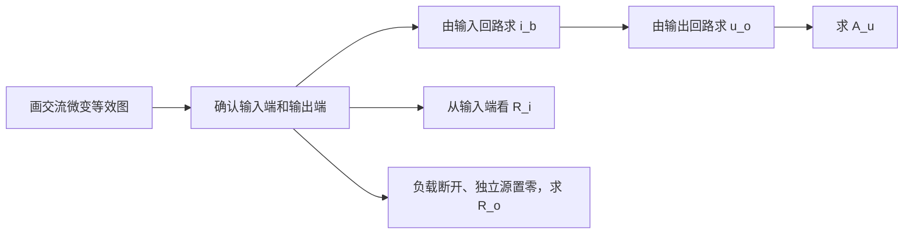

# 共射电路动态指标

> [!info] 学习定位
> 集中掌握 $A_v,R_i,R_o,A_{vs}$ 的求法和负载影响。

- 上级：[[考研专业课/模拟电子技术/详细笔记/03-BJT与基本放大电路/00-章节导读|章节导读]]
- 整章：[[考研专业课/模拟电子技术/详细笔记/03-BJT与基本放大电路|整章版]]
- 上一节：[[考研专业课/模拟电子技术/详细笔记/03-BJT与基本放大电路/05-BJT小信号模型|BJT 小信号模型]]
- 下一节：[[考研专业课/模拟电子技术/详细笔记/03-BJT与基本放大电路/07-三种BJT基本组态|三种 BJT 基本组态]]

> [!abstract]- 符号速查：共射动态指标
>
> | 符号 | 含义 | 做题用法 |
> | --- | --- | --- |
> | $A_u,A_v$ | 电压放大倍数 | 本章两种写法等价，都表示输出电压增量与输入电压增量之比 |
> | $A_{vs}$ | 源电压增益 | 把信号源内阻 $R_{si}$ 的分压也算进去 |
> | $u_i,v_i$ | 输入小信号电压 | 必须先看题目把输入端定义在哪里 |
> | $u_o,v_o$ | 输出小信号电压 | 共射从集电极取出，通常与输入反相 |
> | $i_b,i_c$ | 基极、集电极小信号电流 | 简化模型常用 $i_c=\beta i_b$ |
> | $R_i$ | 输入电阻 | 从输入端向内看，等效为 $U/I$ |
> | $R_o$ | 输出电阻 | 负载断开、独立源置零、从输出端看进去 |
> | $U_{oc}$ | 输出端开路电压 | 戴维南等效源电压 |
> | $R_b$ | 基极回路电阻 | 本节手写图把 $u_i$ 加在 $R_b$ 左端，因此 $R_b$ 参与输入电阻 |
> | $R_C$ | 集电极电阻 | 把 $i_c$ 的变化转换成 $u_o$ 的变化 |
> | $r_{be}$ | b-e 小信号输入电阻 | 由静态工作点决定，见上一节 BJT 小信号模型 |
> | $\beta$ | 共射电流放大系数 | 控制受控电流源 $\beta i_b$ |
> | $R_L'$ | 集电极交流等效负载 | $R_L'=R_C\parallel R_L$ |
> | $r_{ce}$ | BJT 输出电阻 | 简化题常忽略；考虑时输出电阻会变为近似并联关系 |

---

## 8. 共射电路动态指标

动态指标不要直接背结果，先按一条路线走：

### 8.1 固定偏置共射：五页手写图重构

这五页是在上一节“小信号模型”的基础上继续往前走：**把 BJT 换成 $r_{be}$ 和受控电流源以后，怎么求 $A_u$、$R_i$、$R_o$。**

本小节先按手写图里的端口约定整理：$u_i$ 从 $R_b$ 左端加入，输出 $u_o$ 从集电极对地取出，负载暂不接入。

#### 8.1.0 五页手写图识别卡：每页对应一个指标

**第 1 页：由交流微变等效电路求电压放大倍数。**

![[考研专业课/模拟电子技术/附件/03-BJT与基本放大电路/手写原图-共射动态指标-电压放大倍数-2026-07-28.jpg|620]]

- 视觉盘点：上方是固定偏置共射交流通路；下方把 BJT 换成 $r_{be}$ 与受控电流源 $\beta i_b$，输出端在 $R_C$ 两端取 $u_o$。
- 这一页解决的问题：从小信号等效图出发，为什么共射电压增益带负号。
- 输入回路：

$$
u_i=i_bR_b+u_{be}=i_b(R_b+r_{be})
$$

- 输出回路：

$$
u_o=-i_cR_C=-\beta i_bR_C
$$

- 做题结论：

$$
A_u=\frac{u_o}{u_i}=-\frac{\beta R_C}{R_b+r_{be}}
$$

**第 2 页：输入电阻的端口定义。**

![[考研专业课/模拟电子技术/附件/03-BJT与基本放大电路/手写原图-共射动态指标-输入电阻-2026-07-28.jpg|620]]

- 视觉盘点：上方先把“复杂电路”抽象成二端网络，再用外加测试源法定义 $R_i=U/I$；下方回到本电路的小信号等效图。
- 这一页解决的问题：输入电阻不是某个元件本身，而是“从指定输入端看进去”的等效电阻。
- 按本手写图端口，输入电流就是基极小信号电流：

$$
I=i_b
$$

$$
u_i=i_bR_b+i_br_{be}
$$

- 做题结论：

$$
R_i=\frac{u_i}{i_b}=R_b+r_{be}
$$

> [!warning] 输入端放在哪里，$R_i$ 就跟着变
> 这里的 $R_i=R_b+r_{be}$ 只对应“从 $R_b$ 左端输入”的手写图。若题目把输入端定义在基极节点，或者偏置电阻在交流等效中接到交流地，常见结果会变成并联型，例如 $R_B\parallel r_{be}$。先看端口，再写公式。

**第 3 页：输出电阻为什么用戴维南定理。**

![[考研专业课/模拟电子技术/附件/03-BJT与基本放大电路/手写原图-共射动态指标-戴维南定义-2026-07-28.jpg|620]]

- 视觉盘点：手写图引用了戴维南定理：把含独立源、线性电阻和线性受控源的二端网络，对外等效成一个电压源串联一个等效电阻。
- 这一页解决的问题：求输出端对负载的影响时，不一定要把内部电路全带着看，可以先对输出端口做戴维南等效。
- 标准规则：求 $U_{oc}$ 时保留独立源；求 $R_o$ 时独立源置零，但受控源必须保留。
- 做题结论：如果电路里有受控源，不能一看到“源置零”就把所有源都删掉；受控源是否为零，要看控制量是否为零。
- 待确认：页中截图关于“含/不含受控源”的手写归纳容易被误读，我在正文中按标准戴维南求解规则统一整理。

**第 4 页：戴维南求输出电阻的两步。**

![[考研专业课/模拟电子技术/附件/03-BJT与基本放大电路/手写原图-共射动态指标-输出电阻方法-2026-07-28.jpg|620]]

- 视觉盘点：先画含源二端网络，求开路电压 $U_{oc}$；再把独立源置零，从输出端外加测试电压 $U$，用 $U/I$ 求等效电阻。
- 这一页解决的问题：为什么 $R_o$ 是“对负载而言”的外部等效，而不是说内部所有状态都和原电路完全一样。
- 戴维南形式：

$$
\text{输出端口外部等效}\quad \Longrightarrow\quad U_{oc}\ \text{串联}\ R_o
$$

- 做题结论：$R_L$ 只关心端口电压电流关系是否等效，不关心内部每条支路是否保持原来的电压电流。

**第 5 页：固定偏置共射的 $U_{oc}$ 与 $R_o$。**

![[考研专业课/模拟电子技术/附件/03-BJT与基本放大电路/手写原图-共射动态指标-输出电阻推导-2026-07-28.jpg|620]]

- 视觉盘点：上半部分保留输入信号并断开负载，得到开路输出电压；下半部分把独立输入源置零，再从输出端看进去求 $R_o$。
- 开路输出电压：

$$
U_{oc}=-i_cR_C=-\beta i_bR_C
$$

- 求输出电阻时，先把独立输入电压源置零：

$$
u_i=0
$$

于是基极交流电位为零：

$$
v_b=0,\qquad i_b=0
$$

受控电流源虽然原则上要保留，但它的控制量已经为零：

$$
\beta i_b=0
$$

- 做题结论：

$$
R_o=R_C
$$

#### 8.1.1 标准图：固定偏置共射三大动态指标

![[考研专业课/模拟电子技术/附件/03-BJT与基本放大电路/图-固定偏置共射动态指标-Au-Ri-Ro.png|760]]

> [!note] 图的作用
> - 图的作用：把五页手写笔记压成“算 $A_u$、看 $R_i$、用戴维南求 $R_o$”三条主线。
> - 关键标注：输入端口放在 $R_b$ 左端；输出端口从集电极对地取；求 $R_o$ 时独立源置零但受控源保留。
> - 做题结论：固定偏置、无负载、忽略 $r_{ce}$ 时，$A_u=-\beta R_C/(R_b+r_{be})$，$R_i=R_b+r_{be}$，$R_o=R_C$。

#### 8.1.2 公式链：从 $u_i$ 到 $A_u$，从端口到 $R_i,R_o$

> [!note]- 固定偏置共射三大指标推导
> 本推导按手写图端口定义：输入源从 $R_b$ 左端加入，输出从集电极对地取出，负载暂不接入。
>
> 输入侧：
>
> $$
> u_i=i_bR_b+u_{be}=i_bR_b+i_br_{be}=i_b(R_b+r_{be})
> $$
>
> 输出侧：
>
> $$
> i_c=\beta i_b
> $$
>
> 集电极电阻把电流变化转换为电压变化，共射输出反相：
>
> $$
> u_o=-i_cR_C=-\beta i_bR_C
> $$
>
> 所以电压放大倍数为：
>
> $$
> A_u=\frac{u_o}{u_i}=-\frac{\beta R_C}{R_b+r_{be}}
> $$
>
> 输入电阻按测试源定义：
>
> $$
> R_i=\frac{u_i}{i_b}=R_b+r_{be}
> $$
>
> 求输出电阻时，先断开负载，再令独立输入源置零。此时基极交流电位为零：
>
> $$
> v_b=0,\qquad i_b=0
> $$
>
> 因此受控源电流为零：
>
> $$
> \beta i_b=0
> $$
>
> 输出端只剩 $R_C$ 接到交流地：
>
> $$
> R_o=R_C
> $$

#### 8.1.3 做题结论与易错点

- 一句话结论：**固定偏置共射的动态指标先从微变等效图出发，负号来自共射输出反相，输入/输出电阻都必须按端口定义来求。**
- 公式速记：

$$
A_u=-\frac{\beta R_C}{R_b+r_{be}},\qquad R_i=R_b+r_{be},\qquad R_o=R_C
$$

- 若接入负载，输出侧 $R_C$ 要先和 $R_L$ 并联，电压增益中的 $R_C$ 改成 $R_C\parallel R_L$。
- 若考虑 BJT 输出电阻 $r_{ce}$，常见近似为 $R_o\approx R_C\parallel r_{ce}$；普通 822 简化模型通常忽略 $r_{ce}$。
- 求 $R_o$ 的检查句：**断开负载，独立源置零，受控源保留；再看控制量是否变成零。**

### 8.2 通用共射：无旁路电容时

设：

$$
R_L'=R_C\parallel R_L
$$

![[考研专业课/模拟电子技术/附件/03-BJT与基本放大电路/图5-2-10-共射小信号等效电路.jpg]]

这张小信号等效图是共射动态分析的核心。看图时要把 $R_C$ 和 $R_L$ 合成 $R_L'=R_C\parallel R_L$，把射极电阻折算到基极侧就是 $(1+\beta)R_E$。

输入电压：

$$
v_i=i_br_{be}+i_eR_E=i_b\left[r_{be}+(1+\beta)R_E\right]
$$

输出电压：

$$
v_o=-\beta i_b R_L'
$$

所以电压增益：

$$
A_v=\frac{v_o}{v_i}=-\frac{\beta R_L'}{r_{be}+(1+\beta)R_E}
$$

输入电阻：

$$
R_i=R_{B1}\parallel R_{B2}\parallel\left[r_{be}+(1+\beta)R_E\right]
$$

输出电阻常近似：

$$
R_o\approx R_C
$$

源电压增益：

$$
A_{vs}=A_v\frac{R_i}{R_{si}+R_i}
$$

> [!note]- 共射增益公式推导
> 对小信号等效电路，集电极电流增量为：
>
> $$
> i_c=\beta i_b
> $$
>
> 集电极等效负载为：
>
> $$
> R_L'=R_C\parallel R_L
> $$
>
> 共射输出从集电极取出，电流增大时集电极电压下降，因此：
>
> $$
> v_o=-i_cR_L'=-\beta i_bR_L'
> $$
>
> 输入端要同时克服 $r_{be}$ 和射极电阻折算到基极侧的电阻：
>
> $$
> v_i=i_br_{be}+i_eR_E=i_br_{be}+(1+\beta)i_bR_E
> $$
>
> 所以：
>
> $$
> A_v=\frac{v_o}{v_i}=-\frac{\beta R_L'}{r_{be}+(1+\beta)R_E}
> $$

### 8.3 有旁路电容 $C_E$ 时

如果 $C_E$ 足够大，在中频交流通路中可把 $R_E$ 短路。

此时：

$$
A_v=-\frac{\beta R_L'}{r_{be}}
$$

$$
R_i=R_{B1}\parallel R_{B2}\parallel r_{be}
$$

$$
R_o\approx R_C
$$

对比无旁路电容：

| 项目 | 无 $C_E$ | 有 $C_E$ |
| --- | --- | --- |
| 静态稳定 | 有 $R_E$，稳定 | 有 $R_E$，稳定 |
| 交流增益 | 较小 | 较大 |
| 输入电阻 | 较大 | 较小 |
| 失真 | 较小，负反馈更明显 | 较大风险 |

### 8.4 $R_L$ 和 $R_{si}$ 的影响

负载 $R_L$ 会与 $R_C$ 并联：

$$
R_L'=R_C\parallel R_L
$$

$R_L$ 越小，$R_L'$ 越小，电压增益绝对值越小。

信号源内阻 $R_{si}$ 会分压：

$$
v_i=v_s\frac{R_i}{R_{si}+R_i}
$$

所以真正从信号源看到的增益是：

$$
A_{vs}=A_v\frac{R_i}{R_{si}+R_i}
$$

![[考研专业课/模拟电子技术/附件/03-BJT与基本放大电路/图5-2-11-输出电阻测试等效电路.jpg]]

求输出电阻时，要把独立源置零、负载断开，并从输出端加测试源。多数 822 题可近似写 $R_o\approx R_C$，但这张图能帮你理解为什么严格分析时还会牵涉 $r_{ce}$、$R_E$ 和信号源内阻。

---

## 相关笔记

- 上一节：[[考研专业课/模拟电子技术/详细笔记/03-BJT与基本放大电路/05-BJT小信号模型|BJT 小信号模型]]
- 下一节：[[考研专业课/模拟电子技术/详细笔记/03-BJT与基本放大电路/07-三种BJT基本组态|三种 BJT 基本组态]]
