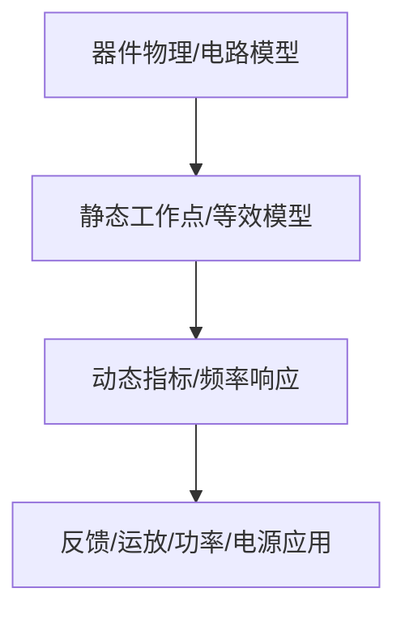

# 04-放大电路的频率响应

> [!info] 使用方式
> 这是拆分后的章节导读。细学时从第一节顺着走；复盘时直接看“章节总复习”；需要查原上下文时回到[[考研专业课/模拟电子技术/详细笔记/04-放大电路的频率响应|整章版详细笔记]]。

---

## 学习路径

| 顺序 | 知识点笔记 | 学习目标 |
| --- | --- | --- |
| 01 | [[考研专业课/模拟电子技术/详细笔记/04-放大电路的频率响应/01-频率响应总框架|频率响应总框架]] | 先把低频、中频、高频和通频带概念建立起来。 |
| 02 | [[考研专业课/模拟电子技术/详细笔记/04-放大电路的频率响应/02-单时间常数RC电路|单时间常数 RC 电路]] | RC 高通/低通是所有频响分析的底层模板。 |
| 03 | [[考研专业课/模拟电子技术/详细笔记/04-放大电路的频率响应/03-低频响应|放大电路低频响应]] | 低频主要看耦合电容、旁路电容和下限频率。 |
| 04 | [[考研专业课/模拟电子技术/详细笔记/04-放大电路的频率响应/04-高频响应|放大电路高频响应]] | 高频主要看结电容、极间电容和上限频率。 |
| 05 | [[考研专业课/模拟电子技术/详细笔记/04-放大电路的频率响应/05-密勒效应|密勒效应]] | 密勒效应解释为什么反相放大器输入电容会被放大。 |
| 06 | [[考研专业课/模拟电子技术/详细笔记/04-放大电路的频率响应/06-增益带宽积与扩展通频带|增益带宽积与扩展通频带]] | 负反馈和电路结构改变带宽，本质是增益与带宽的交换。 |
| 07 | [[考研专业课/模拟电子技术/详细笔记/04-放大电路的频率响应/07-多级频响与瞬态响应|多级频响与瞬态响应]] | 多级系统的截止频率和瞬态指标用于综合题判断。 |
| 08 | [[考研专业课/模拟电子技术/详细笔记/04-放大电路的频率响应/99-章节总复习|章节总复习：频率响应]] | 用来回忆波特图、截止频率、密勒效应和易错点。 |

---

## 快速入口

- 起点：[[考研专业课/模拟电子技术/详细笔记/04-放大电路的频率响应/01-频率响应总框架|频率响应总框架]]
- 复盘：[[考研专业课/模拟电子技术/详细笔记/04-放大电路的频率响应/99-章节总复习|章节总复习：频率响应]]
- 整章版：[[考研专业课/模拟电子技术/详细笔记/04-放大电路的频率响应|整章版详细笔记]]
- 模电索引：[[考研专业课/模拟电子技术/📑 索引]]

---

## 知识网络

