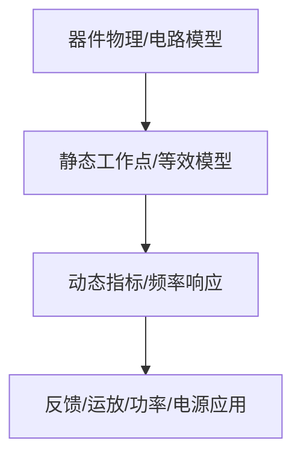

# 05-差分放大电路与集成运放

> [!info] 使用方式
> 这是拆分后的章节导读。细学时从第一节顺着走；复盘时直接看“章节总复习”；需要查原上下文时回到[[考研专业课/模拟电子技术/详细笔记/05-差分放大电路与集成运放|整章版详细笔记]]。

---

## 学习路径

| 顺序 | 知识点笔记 | 学习目标 |
| --- | --- | --- |
| 01 | [[考研专业课/模拟电子技术/详细笔记/05-差分放大电路与集成运放/01-电流源|集成电路中的电流源]] | 电流源是差分和运放内部电路的偏置基础。 |
| 02 | [[考研专业课/模拟电子技术/详细笔记/05-差分放大电路与集成运放/02-差分放大核心思想|差分放大核心思想]] | 抓住差模要放大、共模要抑制这条主线。 |
| 03 | [[考研专业课/模拟电子技术/详细笔记/05-差分放大电路与集成运放/03-差模分析|差模分析]] | 差模分析决定有用信号增益。 |
| 04 | [[考研专业课/模拟电子技术/详细笔记/05-差分放大电路与集成运放/04-共模分析与CMRR|共模分析与 CMRR]] | 共模分析决定抗干扰能力，CMRR 是核心指标。 |
| 05 | [[考研专业课/模拟电子技术/详细笔记/05-差分放大电路与集成运放/05-BJT射极耦合差分电路|BJT 射极耦合差分电路]] | BJT 差分对按差模、共模、输出方式拆开算。 |
| 06 | [[考研专业课/模拟电子技术/详细笔记/05-差分放大电路与集成运放/06-有源负载差分电路|带有源负载的差分放大电路]] | 有源负载用于提高增益，是集成运放内部常见结构。 |
| 07 | [[考研专业课/模拟电子技术/详细笔记/05-差分放大电路与集成运放/07-集成运放内部结构|集成运放内部结构]] | 理解输入级、中间级、输出级和偏置电路的分工。 |
| 08 | [[考研专业课/模拟电子技术/详细笔记/05-差分放大电路与集成运放/08-运放参数与虚短虚断边界|运放参数与虚短虚断边界]] | 会用虚短虚断，也要知道它在线性负反馈条件下才成立。 |
| 09 | [[考研专业课/模拟电子技术/详细笔记/05-差分放大电路与集成运放/99-章节总复习|章节总复习：差分与集成运放]] | 回忆差模/共模、CMRR、运放结构和题型 SOP。 |

---

## 快速入口

- 起点：[[考研专业课/模拟电子技术/详细笔记/05-差分放大电路与集成运放/01-电流源|集成电路中的电流源]]
- 复盘：[[考研专业课/模拟电子技术/详细笔记/05-差分放大电路与集成运放/99-章节总复习|章节总复习：差分与集成运放]]
- 整章版：[[考研专业课/模拟电子技术/详细笔记/05-差分放大电路与集成运放|整章版详细笔记]]
- 模电索引：[[考研专业课/模拟电子技术/📑 索引]]

---

## 知识网络

