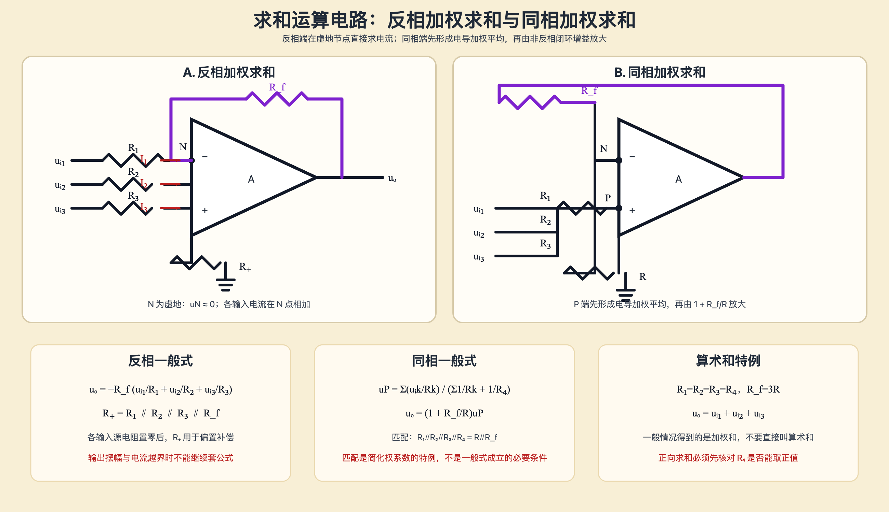

# 求和运算电路

- 上级：[[考研专业课/模拟电子技术/详细笔记/05-差分放大电路与集成运放/00-章节导读|章节导读]]
- 上一节：[[考研专业课/模拟电子技术/详细笔记/05-差分放大电路与集成运放/10-同相比例运算电路|同相比例运算电路]]
- 下一节：[[考研专业课/模拟电子技术/详细笔记/05-差分放大电路与集成运放/99-章节总复习|章节总复习：差分与集成运放]]

> [!abstract]- 符号速查
> - $u_{i1},u_{i2},u_{i3}$：三路输入电压，单位 V。
> - $R_1,R_2,R_3$：三路输入电阻，单位 $\Omega$。
> - $R_f$：输出到反相端的反馈电阻，单位 $\Omega$。
> - $R_+$：反相结构同相端的偏置补偿电阻，单位 $\Omega$。
> - $R$：同相结构中反相端到地的电阻；$R_4$：同相端到地的电阻，单位 $\Omega$。
> - $u_P,u_N$：运放同相端、反相端节点电压；$u_o$：输出电压，单位 V。
> - 默认输入源内阻可忽略；若第 $k$ 路源内阻为 $R_{s,k}$，把该路的有效串联电阻改写为 $R_k+R_{s,k}$。

## 1. 一句话结论

求和运算的核心不是“看到多个输入就直接相加”，而是先判断求和发生在哪个节点：

- **反相求和**：各路电流在反相端的虚地节点直接相加，再经 $R_f$ 转成输出电压。
- **同相求和**：各路先在同相端形成按电导加权的平均值，再由非反相闭环增益 $1+R_f/R$ 放大。
- **严格的算术和**只是同相加权求和在特定电阻匹配下的特例；一般情况下得到的是加权和。

> [!note] 图的作用
> 左侧把三路输入电流送入反相端虚地节点，直接显示“电流相加”；右侧把三路输入送入同相端的共享节点，显示“电导加权平均后再放大”。下方公式卡把一般式、匹配化简式和算术和特例放在同一张图中，便于做题时先选正确模板。

> [!abstract] 网络卡片
> 手写页讨论的是两种结构：上半部分为反相求和，$R_1,R_2,R_3$ 接到反相节点，$R_f$ 反馈；下半部分为同相求和，输入通过 $R_1,R_2,R_3$ 汇到 $P$ 节点，$R_4$ 将 $P$ 节点接地，反相端由 $R_f$ 与 $R$ 构成非反相增益网络。手稿没有给出固定数值，因此以下保留一般参数式。

### 原手写页

![[考研专业课/模拟电子技术/附件/05-差分放大电路与集成运放/手写-求和运算电路-反相与同相-2026-09-20.png]]

> [!note] 原稿对应
> - 原图上半部分：反相加权求和，结论是 $u_o=-R_f\left(u_{i1}/R_1+u_{i2}/R_2+u_{i3}/R_3\right)$。
> - 原图下半部分：同相加权求和，手稿最后的简单式需要附带电阻匹配条件，不能当作一般式直接使用。

## 2. 反相加权求和

### 2.1 识别条件与核心思想

三路输入经 $R_1,R_2,R_3$ 汇入反相端 $N$，输出经 $R_f$ 反馈到同一点，同相端接地（实际可串 $R_+$ 做偏置补偿）。只要运放处于线性区且反馈为负反馈，就可以使用：

- 虚断：$i_P\approx i_N\approx0$；
- 虚短：$u_N\approx u_P=0$，所以 $N$ 点是虚地；
- KCL：各输入电阻电流在 $N$ 点相加。

### 2.2 一般公式

> [!note]-
> 令三路电流方向均指向 $N$ 点，且输入源内阻先忽略：
>
> $$
> u_N\approx0,\qquad i_N\approx0
> $$
>
> $$
> I_1=\frac{u_{i1}}{R_1},\qquad
> I_2=\frac{u_{i2}}{R_2},\qquad
> I_3=\frac{u_{i3}}{R_3}
> $$
>
> 对 $N$ 点列 KCL：
>
> $$
> \frac{0-u_o}{R_f}=I_1+I_2+I_3
> $$
>
> 因而
>
> $$
> \boxed{u_o=-R_f\left(\frac{u_{i1}}{R_1}+\frac{u_{i2}}{R_2}+\frac{u_{i3}}{R_3}\right)}
> $$

每一路的权重为 $-R_f/R_k$。输入为正时，输出贡献为负；改变某一路输入极性即可实现加减混合。

### 2.3 输入电阻与偏置补偿

对理想电压源而言，第 $k$ 路源看到的输入电阻就是本路的 $R_k$。若信号源内阻不可忽略，应把第 $k$ 路的有效输入电阻看成 $R_k+R_{s,k}$，于是

$$
u_o=-R_f\sum_{k=1}^{3}\frac{u_{ik}}{R_k+R_{s,k}}.
$$

为了减小输入偏置电流造成的输出误差，反相端与同相端应尽量看到相等的直流等效电阻。理想源内阻可忽略时：

$$
\boxed{R_+\approx R_1\parallel R_2\parallel R_3\parallel R_f}
$$

若源内阻不可忽略，补偿值应改为

$$
\boxed{R_+\approx
(R_1+R_{s,1})\parallel(R_2+R_{s,2})\parallel(R_3+R_{s,3})\parallel R_f}.
$$

## 3. 同相加权求和

### 3.1 结构与一般式

同相端 $P$ 接收多路输入：$u_{i1},u_{i2},u_{i3}$ 分别经 $R_1,R_2,R_3$ 接入，另有 $R_4$ 将 $P$ 节点接地。反相端通过 $R_f$ 与 $R$ 构成普通非反相闭环。

这里的关键是：$P$ 节点不是虚地，也不是某一路输入电压，而是所有支路按电导加权后的节点电压。

> [!note]-
> 由于运放输入电流近似为零，对 $P$ 节点列 KCL：
>
> $$
> \frac{u_P-u_{i1}}{R_1}
> +\frac{u_P-u_{i2}}{R_2}
> +\frac{u_P-u_{i3}}{R_3}
> +\frac{u_P}{R_4}=0
> $$
>
> 整理得到
>
> $$
> \boxed{
> u_P=
> \frac{\dfrac{u_{i1}}{R_1}+\dfrac{u_{i2}}{R_2}+\dfrac{u_{i3}}{R_3}}
> {\dfrac1{R_1}+\dfrac1{R_2}+\dfrac1{R_3}+\dfrac1{R_4}}
> }
> $$
>
> 在线性负反馈下 $u_N\approx u_P$，反相端分压给出
>
> $$
> u_o=\left(1+\frac{R_f}{R}\right)u_P
> $$
>
> 因而同相求和的一般式为
>
> $$
> \boxed{
> u_o=
> \left(1+\frac{R_f}{R}\right)
> \frac{\dfrac{u_{i1}}{R_1}+\dfrac{u_{i2}}{R_2}+\dfrac{u_{i3}}{R_3}}
> {\dfrac1{R_1}+\dfrac1{R_2}+\dfrac1{R_3}+\dfrac1{R_4}}
> }.
> $$

这才是同相求和的**一般式**。它本质上是“加权平均 × 非反相增益”，不能在没有附加条件时直接写成 $R_f\sum u_{ik}/R_k$。

### 3.2 电阻匹配后的简化式

手写笔记中给出的简洁结果需要以下匹配：

$$
\boxed{R_1\parallel R_2\parallel R_3\parallel R_4=R\parallel R_f}.
$$

令

$$
R_P=R_1\parallel R_2\parallel R_3\parallel R_4,\qquad
R_N=R\parallel R_f.
$$

当 $R_P=R_N$ 时，

$$
\left(1+\frac{R_f}{R}\right)R_P
=\left(1+\frac{R_f}{R}\right)(R\parallel R_f)=R_f,
$$

故一般式化为

$$
\boxed{
u_o=R_f\left(\frac{u_{i1}}{R_1}+\frac{u_{i2}}{R_2}+\frac{u_{i3}}{R_3}\right)
}.
$$

匹配有两个作用：

1. 把一般式的总比例系数化成 $R_f$，公式更像直接加权和；
2. 让两输入端看到的直流等效电阻相等，有利于补偿输入偏置电流误差。

因此，**匹配是化简式与偏置补偿的条件，不是一般同相求和公式成立的前提**。

### 3.3 $R_4$ 能否取正值

若 $R_1,R_2,R_3,R$ 和 $R_f$ 已经确定，匹配条件要求

$$
\frac1{R_4}
=\frac1{R\parallel R_f}
-\frac1{R_1}-\frac1{R_2}-\frac1{R_3}.
$$

所以：

- 右侧 $>0$：存在有限的正电阻 $R_4$；
- 右侧 $=0$：只能取 $R_4\to\infty$，等效为不接 $R_4$；
- 右侧 $<0$：不存在满足条件的正电阻，不能硬套匹配化简式。

这一步是同相求和设计题常见的可行性检查。

## 4. 算术和特例

“加权求和”和“算术和”要分开记：

- 一般反相式、同相式都属于加权求和，权重由电阻比决定；
- 只有各路系数被设计成相同且等于 1 时，才是严格的算术和。

一个常用同相特例是

$$
R_1=R_2=R_3=R_4=R,\qquad R_f=3R.
$$

此时

$$
u_P=\frac{u_{i1}+u_{i2}+u_{i3}}4,\qquad
1+\frac{R_f}{R}=4,
$$

因此

$$
\boxed{u_o=u_{i1}+u_{i2}+u_{i3}}.
$$

无论使用哪种结构，都要检查输出摆幅、输出电流、输入共模范围和频率/压摆率边界；一旦运放饱和，虚短和线性闭环公式都不能继续套用。

## 5. 做题 SOP

1. **看输入端**：输入进 $N$ 端，多半是反相求和；输入汇到 $P$ 端，多半是同相求和。
2. **判反馈**：先确认输出回路使差模输入减小，且运放工作在线性区。
3. **标节点**：反相结构标 $u_N\approx0$ 虚地；同相结构先标共享节点 $u_P$，不要把它误写成某一路输入。
4. **列 KCL**：反相在 $N$ 点直接加电流；同相在 $P$ 点先求电导加权平均。
5. **代入闭环关系**：同相结构再乘 $1+R_f/R$。
6. **查特殊条件**：只有看到 $R_1\parallel R_2\parallel R_3\parallel R_4=R\parallel R_f$，才把同相一般式化为 $R_f\sum u_{ik}/R_k$。
7. **查实际边界**：输入源内阻、偏置补偿、输出摆幅、电流和频率限制是否满足。

## 6. 易错点与最低掌握标准

### 6.1 易错点

1. 把同相求和的一般式误写成简单加权和，漏掉 $P$ 节点分母。
2. 忘记反相求和的负号，或把正输入的输出方向判断反。
3. 看到同相结构就把 $u_P$ 直接写成某一路 $u_i$；多输入时必须先列节点 KCL。
4. 把“匹配条件”误当成同相一般式成立的必要条件；一般式不需要匹配。
5. 计算偏置补偿时忽略信号源内阻，仍机械写 $R_+=R_1\parallel R_2\parallel R_3\parallel R_f$。
6. 未检查 $R_4$ 是否能取正值，就直接使用匹配化简式。
7. 不检查输出摆幅和输出电流，在线性区之外继续使用虚短、虚断。

### 6.2 最低掌握标准

- 1 分钟内写出反相求和一般式，并说明虚地与 KCL 来源。
- 1 分钟内写出同相求和一般式，并解释为什么是“加权平均 × 非反相增益”。
- 能判断同相简单式的匹配条件，并由此反推 $R_4$ 的可行性。
- 能区分加权和与算术和，记住 $R_1=R_2=R_3=R_4=R,\ R_f=3R$ 的算术和特例。
- 能根据源内阻修正偏置补偿电阻，并检查运放实际输出边界。

## 7. 微型自测

1. 反相求和中 $R_1=10\text{ k}\Omega$、$R_2=20\text{ k}\Omega$、$R_3=40\text{ k}\Omega$、$R_f=40\text{ k}\Omega$，且 $(u_{i1},u_{i2},u_{i3})=(0.1,0.2,0.3)\text{ V}$，求 $u_o$ 并判断输出极性。
2. 同相求和中，为什么一般式必须包含 $1/R_4$？$R_4$ 去掉后公式怎样变化？
3. 已知 $R\parallel R_f=4\text{ k}\Omega$，$R_1=10\text{ k}\Omega$、$R_2=20\text{ k}\Omega$、$R_3=20\text{ k}\Omega$，按匹配条件求 $R_4$，并判断它是否为正值（应得到 $R_4=20\text{ k}\Omega$）。
4. 证明当 $R_1=R_2=R_3=R_4=R,\ R_f=3R$ 时，同相求和电路实现算术和。
5. 为什么同相求和的一般式成立不要求电阻匹配，而手稿中的简单式要求匹配？
6. 若反相求和三路源内阻分别为 $R_{s,1},R_{s,2},R_{s,3}$，偏置补偿电阻应如何修改？

## 8. 相关笔记

- [[考研专业课/模拟电子技术/详细笔记/05-差分放大电路与集成运放/09-反相比例与T形反馈运算电路|反相比例与 T 形反馈运算电路]]：虚地、反相 KCL、输入电阻与偏置补偿的基础。
- [[考研专业课/模拟电子技术/详细笔记/05-差分放大电路与集成运放/10-同相比例运算电路|同相比例运算电路]]：非反相增益、虚短虚断与实际边界。
- [[考研专业课/模拟电子技术/详细笔记/05-差分放大电路与集成运放/99-章节总复习|章节总复习：差分与集成运放]]：章节级题型 SOP、易错点与回忆自测。
