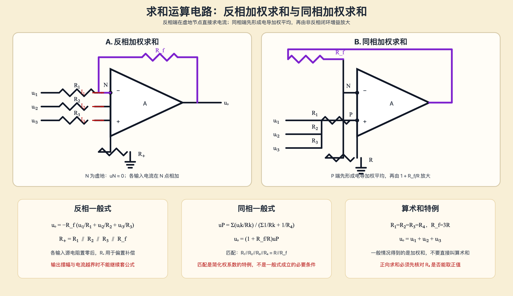
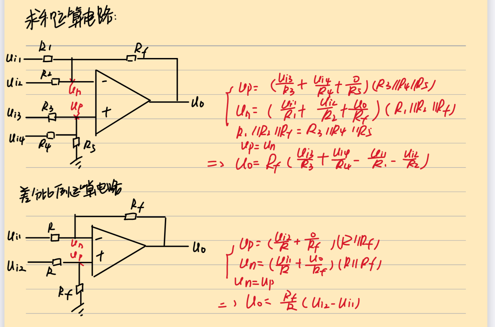

# 求和运算电路

- 上级：[[考研专业课/模拟电子技术/详细笔记/05-差分放大电路与集成运放/00-章节导读|章节导读]]
- 上一节：[[考研专业课/模拟电子技术/详细笔记/05-差分放大电路与集成运放/10-同相比例运算电路|同相比例运算电路]]
- 下一节：[[考研专业课/模拟电子技术/详细笔记/05-差分放大电路与集成运放/12-积分与微分运算电路|积分与微分运算电路]]

> [!abstract]- 符号速查
> - $u_{i1},u_{i2},u_{i3}$：三路输入电压，单位 V。
> - $u_{i4}$：加减运算中同相端的第四路输入电压，单位 V。
> - $R_1,R_2,R_3,R_4$：输入电阻，单位 $\Omega$；$R_5$：同相求和节点到地的电阻，单位 $\Omega$。
> - $R_f$：输出到反相端的反馈电阻，单位 $\Omega$。
> - $R_+$：反相结构同相端的偏置补偿电阻，单位 $\Omega$。
> - $R$：同相结构中反相端到地的电阻；$R_4$：同相端到地的电阻，单位 $\Omega$。
> - $u_P,u_N$：运放同相端、反相端节点电压；$u_o$：输出电压，单位 V。
> - 默认输入源内阻可忽略；若第 $k$ 路源内阻为 $R_{s,k}$，把该路的有效串联电阻改写为 $R_k+R_{s,k}$。

## 1. 一句话结论

求和运算的核心不是“看到多个输入就直接相加”，而是先判断求和发生在哪个节点：

- **反相求和**：各路电流在反相端的虚地节点直接相加，再经 $R_f$ 转成输出电压。
- **同相求和**：各路先在同相端形成按电导加权的平均值，再由非反相闭环增益 $1+R_f/R$ 放大。
- **严格的算术和**只是同相加权求和在特定电阻匹配下的特例；一般情况下得到的是加权和。

> [!note] 图的作用
> 左侧把三路输入电流送入反相端虚地节点，直接显示“电流相加”；右侧把三路输入送入同相端的共享节点，显示“电导加权平均后再放大”。下方公式卡把一般式、匹配化简式和算术和特例放在同一张图中，便于做题时先选正确模板。

> [!abstract] 网络卡片
> 手写页讨论的是两种结构：上半部分为反相求和，$R_1,R_2,R_3$ 接到反相节点，$R_f$ 反馈；下半部分为同相求和，输入通过 $R_1,R_2,R_3$ 汇到 $P$ 节点，$R_4$ 将 $P$ 节点接地，反相端由 $R_f$ 与 $R$ 构成非反相增益网络。手稿没有给出固定数值，因此以下保留一般参数式。

### 原手写页

![[考研专业课/模拟电子技术/附件/05-差分放大电路与集成运放/手写-求和运算电路-反相与同相-2026-09-20.png]]

> [!note] 原稿对应
> - 原图上半部分：反相加权求和，结论是 $u_o=-R_f\left(u_{i1}/R_1+u_{i2}/R_2+u_{i3}/R_3\right)$。
> - 原图下半部分：同相加权求和，手稿最后的简单式需要附带电阻匹配条件，不能当作一般式直接使用。

## 2. 反相加权求和

### 2.1 识别条件与核心思想

三路输入经 $R_1,R_2,R_3$ 汇入反相端 $N$，输出经 $R_f$ 反馈到同一点，同相端接地（实际可串 $R_+$ 做偏置补偿）。只要运放处于线性区且反馈为负反馈，就可以使用：

- 虚断：$i_P\approx i_N\approx0$；
- 虚短：$u_N\approx u_P=0$，所以 $N$ 点是虚地；
- KCL：各输入电阻电流在 $N$ 点相加。

### 2.2 一般公式

> [!note]-
> 令三路电流方向均指向 $N$ 点，且输入源内阻先忽略：
>
> $$
> u_N\approx0,\qquad i_N\approx0
> $$
>
> $$
> I_1=\frac{u_{i1}}{R_1},\qquad
> I_2=\frac{u_{i2}}{R_2},\qquad
> I_3=\frac{u_{i3}}{R_3}
> $$
>
> 对 $N$ 点列 KCL：
>
> $$
> \frac{0-u_o}{R_f}=I_1+I_2+I_3
> $$
>
> 因而
>
> $$
> \boxed{u_o=-R_f\left(\frac{u_{i1}}{R_1}+\frac{u_{i2}}{R_2}+\frac{u_{i3}}{R_3}\right)}
> $$

每一路的权重为 $-R_f/R_k$。输入为正时，输出贡献为负；改变某一路输入极性即可实现加减混合。

## 3. 差分比例运算电路和加减混合计算

### 3.1 对称结构与公式

原图下半部分取两路输入电阻均为 $R$，两条反馈/接地电阻均为 $R_f$：

> [!note]-
> 同相端是分压节点：
>
> $$
> u_P=\left(\frac{u_{i2}}{R}+\frac{0}{R_f}\right)(R\parallel R_f)
> =\frac{R_f}{R+R_f}u_{i2}.
> $$
>
> 反相端由输入支路和反馈支路共同决定：
>
> $$
> u_N=\left(\frac{u_{i1}}{R}+\frac{u_o}{R_f}\right)(R\parallel R_f).
> $$
>
> 由负反馈得到 $u_N\approx u_P$，整理得
>
> $$
> \boxed{u_o=\frac{R_f}{R}(u_{i2}-u_{i1})}.
> $$

正输入产生正输出，负输入产生负输出；当 $u_{i1}=u_{i2}$ 时，理想输出为零，因此该结构也可看作最基本的差分放大器。

## 4. 相关笔记

- [[考研专业课/模拟电子技术/详细笔记/05-差分放大电路与集成运放/09-反相比例与T形反馈运算电路|反相比例与 T 形反馈运算电路]]：虚地、反相 KCL、输入电阻与偏置补偿的基础。
- [[考研专业课/模拟电子技术/详细笔记/05-差分放大电路与集成运放/10-同相比例运算电路|同相比例运算电路]]：非反相增益、虚短虚断与实际边界。
- [[考研专业课/模拟电子技术/详细笔记/05-差分放大电路与集成运放/12-积分与微分运算电路|积分与微分运算电路]]：下一节动态运算电路，电容反馈实现积分、电容输入实现微分。
- [[考研专业课/模拟电子技术/详细笔记/05-差分放大电路与集成运放/99-章节总复习|章节总复习：差分与集成运放]]：章节级题型 SOP、易错点与回忆自测。
