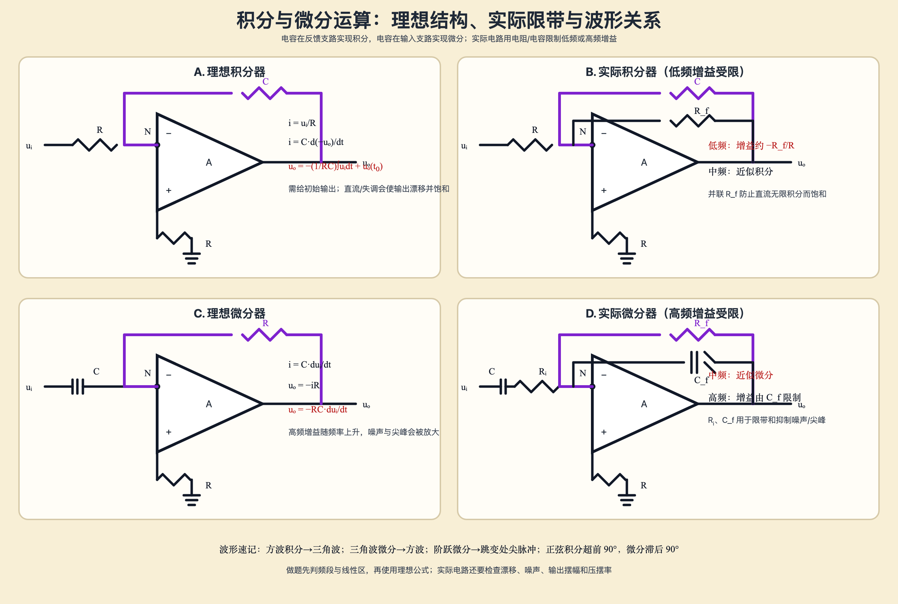

# 积分与微分运算电路

- 上级：[[考研专业课/模拟电子技术/详细笔记/05-差分放大电路与集成运放/00-章节导读|章节导读]]
- 上一节：[[考研专业课/模拟电子技术/详细笔记/05-差分放大电路与集成运放/11-求和运算电路|求和运算电路]]
- 下一节：[[考研专业课/模拟电子技术/详细笔记/05-差分放大电路与集成运放/99-章节总复习|章节总复习：差分与集成运放]]

> [!abstract]- 符号速查
> - $u_i(t)$、$u_o(t)$：输入、输出瞬时电压，单位 V。
> - $R$、$R_i$、$R_f$：输入电阻、实际微分器输入限带电阻、反馈电阻，单位 $\Omega$。
> - $C$、$C_i$、$C_f$：反馈电容、输入电容、反馈限带电容，单位 F。
> - $t_0$：积分起始时刻；$u_o(t_0)$：该时刻的初始输出电压。
> - $s=j\omega$：拉普拉斯/频域变量；$\omega=2\pi f$，单位 rad/s。
> - 默认运放在线性负反馈区，输入电流近似为零，且输入共模、输出摆幅、压摆率均未越界。

## 1. 一句话结论

- **积分器**：电阻在输入、 电容在反馈，输出是输入的反向积分，必须保留初始条件。
- **微分器**：电容在输入、电阻在反馈，输出是输入的反向微分；理想电路高频增益无限上升，实际必须限带。
- 实际积分器用 $R_f$ 限制低频/直流增益，防止漂移后饱和；实际微分器用 $R_i$、$C_f$ 限制低频和高频增益，抑制噪声与尖峰。

> [!note] 图的作用
> 左上是理想积分器，右上是并联 $R_f$ 的实际积分器；左下是理想微分器，右下是加入输入 $R_i$ 与反馈 $C_f$ 的实际微分器。四格图把“电容位置—传递函数—频段限制”一一对应起来。

### 原手写页

![[考研专业课/模拟电子技术/附件/05-差分放大电路与集成运放/手写-积分与微分运算-2026-09-22.png]]

> [!note] 原稿对应
> - 原图上半：由 $i=C\,du/dt$ 和虚地得到理想积分器。
> - 原图下半：由 $i=C\,du_i/dt$、反馈电阻压降得到理想微分器。
> - 原图中 $P$ 端接地电阻用于提供直流通路；理想推导中它不改变闭环传递函数。

## 2. 理想积分器

### 2.1 拓扑与核心思想

输入 $u_i$ 经 $R$ 进入反相端 $N$，电容 $C$ 从输出反馈到 $N$，同相端 $P$ 接地。负反馈线性工作时：

$$
u_N\approx u_P=0,\qquad i_N\approx i_P\approx0.
$$

因此输入电流不能流入运放，只能流过反馈电容；“电阻把电压变成电流，电容把电流积成电压”就是积分器的物理链。

### 2.2 时域推导

> [!note]-
> 由虚地，
>
> $$
> i_R=\frac{u_i-u_N}{R}\approx\frac{u_i}{R}.
> $$
>
> 取电容电流方向为从 $N$ 指向输出端：
>
> $$
> i_C=C\frac{d(u_N-u_o)}{dt}\approx-C\frac{du_o}{dt}.
> $$
>
> 在 $N$ 点列 KCL，$i_R=i_C$：
>
> $$
> \frac{u_i}{R}=-C\frac{du_o}{dt}.
> $$
>
> 积分得到
>
> $$
> \boxed{
> u_o(t)=u_o(t_0)-\frac1{RC}\int_{t_0}^{t}u_i(\tau)\,d\tau
> }.
> $$

初始条件不能无故删掉；只有题目明确给出 $u_o(t_0)=0$ 时，才可写成从零开始的积分。

### 2.3 频域与波形

零初始条件下

$$
\boxed{H_I(s)=\frac{U_o(s)}{U_i(s)}=-\frac1{sRC}}.
$$

对正弦信号，积分器的幅值为 $1/(\omega RC)$，相位为 **超前 $90^\circ$**：

$$
H_I(j\omega)=-\frac1{j\omega RC}=\frac{j}{\omega RC}.
$$

常见波形：

- 阶跃输入 → 斜坡输出；
- 方波输入 → 三角波输出；
- 正弦输入 → 余弦型输出，幅值随频率升高而减小。

## 3. 实际积分器

### 3.1 并联反馈电阻的作用

在反馈电容旁并联 $R_f$，反馈阻抗为

$$
Z_f=R_f\parallel\frac1{sC}
=\frac{R_f}{1+sR_fC}.
$$

因而

$$
\boxed{
H_{I,\mathrm{practical}}(s)
=-\frac{Z_f}{R}
=-\frac{R_f/R}{1+sR_fC}
}.
$$

- 低频：$|sR_fC|\ll1$，$H\approx-R_f/R$，不再对直流无限积分；
- 中频：$|sR_fC|\gg1$，$H\approx-1/(sRC)$，表现为积分器；
- 直流失调和偏置电流不再无限积累，输出更不容易慢慢漂到饱和。

### 3.2 实际边界

1. 输入信号的直流分量、输入失调电压和偏置电流都会造成输出斜坡漂移。
2. 输出幅值受电源、输出摆幅和压摆率限制，积分时间过长容易饱和。
3. 选 $R_f$ 时要兼顾低频增益、噪声和输入偏置误差；不能只按理想 $1/(RC)$ 选值。

## 4. 理想微分器

### 4.1 拓扑与核心思想

输入电容 $C$ 串在输入支路，反馈元件为电阻 $R$，同相端接地。输入电容把电压变化率转换成电流，反馈电阻再把电流转换为输出电压。

### 4.2 时域推导

> [!note]-
> 虚地使反相端电压近似为零，输入电容电流为
>
> $$
> i_C=C\frac{d(u_i-u_N)}{dt}\approx C\frac{du_i}{dt}.
> $$
>
> 该电流流过反馈电阻，电阻两端电压为 $0-u_o$：
>
> $$
> 0-u_o=i_CR.
> $$
>
> 因而
>
> $$
> \boxed{u_o(t)=-RC\frac{du_i(t)}{dt}}.
> $$

### 4.3 频域与波形

$$
\boxed{H_D(s)=\frac{U_o(s)}{U_i(s)}=-sRC}.
$$

对正弦信号，微分器的幅值为 $\omega RC$，相位为 **滞后 $90^\circ$**：

$$
H_D(j\omega)=-j\omega RC.
$$

常见波形：

- 三角波输入 → 方波输出；
- 阶跃输入 → 跳变瞬间出现尖脉冲；
- 高频噪声和尖峰会被显著放大。

## 5. 实际微分器

### 5.1 限带结构

实际微分器在输入电容后串联 $R_i$，并在反馈电阻 $R_f$ 旁并联 $C_f$。其传递函数可写成

$$
\boxed{
H_{D,\mathrm{practical}}(s)
=-\frac{R_f\parallel 1/(sC_f)}
{R_i+1/(sC_i)}
}.
$$

在中间频段，若输入电容仍主要呈容性、反馈电容尚未明显旁路 $R_f$，可近似为

$$
H_{D,\mathrm{practical}}(s)\approx -sR_fC_i.
$$

频率过低时，输入电容阻抗过大，微分作用被削弱；频率过高时，$R_i$ 和 $C_f$ 限制增益，避免噪声无限放大。

### 5.2 选频段的检查

- 低端边界由输入 $C_i$ 与 $R_i$ 共同决定；
- 高端边界由反馈 $R_f$ 与 $C_f$ 共同决定；
- 题目若给出频率范围，先确认信号处于近似微分的中间频段，再使用 $-R_fC_i\,du_i/dt$；
- 最后检查运放单位增益带宽、压摆率、输出摆幅和负载。

## 6. 统一做题 SOP

1. **看电容位置**：反馈端是 $C$，优先按积分器；输入端是 $C$，优先按微分器。
2. **查反馈与线性区**：没有有效负反馈或已经饱和时，不能直接用虚短。
3. **标虚地/虚短**：写出 $u_N\approx0$ 或 $u_N\approx u_P$，再列 $N$ 点 KCL。
4. **先写时域关系**：积分器从 $i=u/R$ 与 $i=C\,du/dt$ 出发；微分器从输入电容电流出发。
5. **保留初始条件**：积分题没有明确零初始时，保留 $u_o(t_0)$。
6. **判断实际频段**：实际电路先看 $R_f$、$R_i$、$C_f$ 引入的限带，再决定能否用理想式。
7. **查输出边界**：对阶跃、方波和尖峰输入，重点检查饱和、压摆率和输出电流。

## 7. 易错点与最低掌握标准

### 7.1 易错点

1. 积分器漏写初始输出 $u_o(t_0)$。
2. 把积分器和微分器的电容位置记反。
3. 把积分器/微分器的反相负号漏掉。
4. 把积分器对正弦的相位写成滞后 $90^\circ$；本结构 $H=-1/(j\omega RC)$，实际是超前 $90^\circ$。
5. 把理想微分器直接用于高频噪声丰富的信号，忽略高频增益无限上升。
6. 认为并联 $R_f$ 会改变“中频积分公式”；它主要限制低频/直流增益。
7. 阶跃输入下继续假设输出线性无限增长，忘记电源和压摆率边界。

### 7.2 最低掌握标准

- 能从 $N$ 点 KCL 独立推出 $u_o(t)=u_o(t_0)-\frac1{RC}\int u_i\,dt$。
- 能从输入电容电流推出 $u_o=-RC\,du_i/dt$。
- 能写出 $H_I(s)=-1/(sRC)$、$H_D(s)=-sRC$，并判断相位方向。
- 能说明 $R_f$ 为什么防止积分器直流漂移，$R_i/C_f$ 为什么限制微分器高频噪声。
- 能由输入波形快速判断输出是斜坡、三角波、方波还是尖脉冲。

## 8. 微型自测

1. 理想积分器 $R=10\text{ k}\Omega$、$C=0.1\ \mu\text{F}$，输入 $u_i=1\text{ V}$ 的阶跃，且 $u_o(0)=0$，写出输出斜率。
2. 输入 $u_i(t)=\sin\omega t$ 时，理想积分器和微分器的输出分别超前还是滞后 $90^\circ$？
3. 为什么实际积分器要在 $C$ 旁并联 $R_f$？低频和中频分别近似什么增益？
4. 方波输入理想积分器得到什么波形？三角波输入理想微分器得到什么波形？
5. 为什么理想微分器不能直接用于含大量高频噪声的测量信号？

## 9. 相关笔记

- [[考研专业课/模拟电子技术/详细笔记/05-差分放大电路与集成运放/10-同相比例运算电路|同相比例运算电路]]：非反相闭环增益与虚短虚断边界。
- [[考研专业课/模拟电子技术/详细笔记/05-差分放大电路与集成运放/11-求和运算电路|求和运算电路]]：静态电阻加权、加减运算与差分比例运算。
- [[考研专业课/模拟电子技术/详细笔记/05-差分放大电路与集成运放/99-章节总复习|章节总复习：差分与集成运放]]：章节级运放题型 SOP、易错点与自测。
