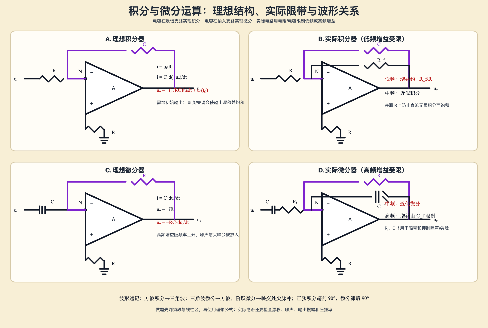

# 积分与微分运算电路

- 上级：[[考研专业课/模拟电子技术/详细笔记/05-差分放大电路与集成运放/00-章节导读|章节导读]]
- 上一节：[[考研专业课/模拟电子技术/详细笔记/05-差分放大电路与集成运放/11-求和运算电路|求和运算电路]]
- 下一节：[[考研专业课/模拟电子技术/详细笔记/05-差分放大电路与集成运放/99-章节总复习|章节总复习：差分与集成运放]]

> [!abstract]- 符号速查
> - $u_i(t)$、$u_o(t)$：输入、输出瞬时电压，单位 V。
> - $R$、$R_i$、$R_f$：输入电阻、实际微分器输入限带电阻、反馈电阻，单位 $\Omega$。
> - $C$、$C_i$、$C_f$：反馈电容、输入电容、反馈限带电容，单位 F。
> - $t_0$：积分起始时刻；$u_o(t_0)$：该时刻的初始输出电压。
> - $s=j\omega$：拉普拉斯/频域变量；$\omega=2\pi f$，单位 rad/s。
> - 默认运放在线性负反馈区，输入电流近似为零，且输入共模、输出摆幅、压摆率均未越界。

## 1. 一句话结论

- **积分器**：电阻在输入、 电容在反馈，输出是输入的反向积分，必须保留初始条件。
- **微分器**：电容在输入、电阻在反馈，输出是输入的反向微分；理想电路高频增益无限上升，实际必须限带。
- 实际积分器用 $R_f$ 限制低频/直流增益，防止漂移后饱和；实际微分器用 $R_i$、$C_f$ 限制低频和高频增益，抑制噪声与尖峰。

> [!note] 图的作用
> 左上是理想积分器，右上是并联 $R_f$ 的实际积分器；左下是理想微分器，右下是加入输入 $R_i$ 与反馈 $C_f$ 的实际微分器。四格图把“电容位置—传递函数—频段限制”一一对应起来。

### 原手写页

![[考研专业课/模拟电子技术/附件/05-差分放大电路与集成运放/手写-积分与微分运算-2026-09-22.png]]

> [!note] 原稿对应
> - 原图上半：由 $i=C\,du/dt$ 和虚地得到理想积分器。
> - 原图下半：由 $i=C\,du_i/dt$、反馈电阻压降得到理想微分器。
> - 原图中 $P$ 端接地电阻用于提供直流通路；理想推导中它不改变闭环传递函数。

## 2. 相关笔记

- [[考研专业课/模拟电子技术/详细笔记/05-差分放大电路与集成运放/10-同相比例运算电路|同相比例运算电路]]：非反相闭环增益与虚短虚断边界。
- [[考研专业课/模拟电子技术/详细笔记/05-差分放大电路与集成运放/11-求和运算电路|求和运算电路]]：静态电阻加权、加减运算与差分比例运算。
- [[考研专业课/模拟电子技术/详细笔记/05-差分放大电路与集成运放/99-章节总复习|章节总复习：差分与集成运放]]：章节级运放题型 SOP、易错点与自测。
