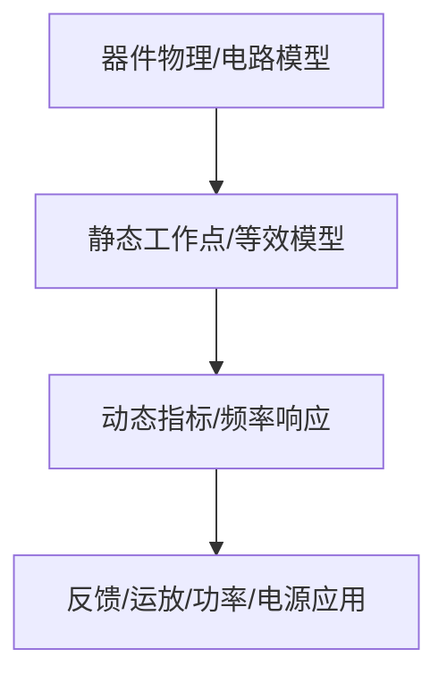

# 06-负反馈放大电路

> [!info] 使用方式
> 这是拆分后的章节导读。细学时从第一节顺着走；复盘时直接看“章节总复习”；需要查原上下文时回到[[考研专业课/模拟电子技术/详细笔记/06-负反馈放大电路|整章版详细笔记]]。

---

## 学习路径

| 顺序 | 知识点笔记 | 学习目标 |
| --- | --- | --- |
| 01 | [[考研专业课/模拟电子技术/详细笔记/06-负反馈放大电路/01-反馈基本概念与极性|反馈基本概念与极性]] | 先会找反馈通路，再用瞬时极性法判断正负反馈。 |
| 02 | [[考研专业课/模拟电子技术/详细笔记/06-负反馈放大电路/02-输入混合与输出取样|串联/并联反馈与电压/电流反馈]] | 串并联看输入端，电压电流看输出端，这是反馈组态判断核心。 |
| 03 | [[考研专业课/模拟电子技术/详细笔记/06-负反馈放大电路/03-四种负反馈组态|四种负反馈组态]] | 把电压串联、电压并联、电流串联、电流并联和放大器类型对应起来。 |
| 04 | [[考研专业课/模拟电子技术/详细笔记/06-负反馈放大电路/04-闭环增益表达式|闭环增益的一般表达式]] | 掌握 $A_f=A/(1+AF)$ 和反馈深度的意义。 |
| 05 | [[考研专业课/模拟电子技术/详细笔记/06-负反馈放大电路/05-深度负反馈近似计算|深度负反馈近似计算]] | 深度负反馈下闭环增益主要由反馈网络决定。 |
| 06 | [[考研专业课/模拟电子技术/详细笔记/06-负反馈放大电路/06-输入输出电阻影响|负反馈对输入输出电阻的影响]] | 串联/并联决定输入电阻，电压/电流决定输出电阻。 |
| 07 | [[考研专业课/模拟电子技术/详细笔记/06-负反馈放大电路/07-稳定性与自激|负反馈稳定性与自激]] | 高频相移可能让负反馈变正反馈，稳定性看环路增益。 |
| 08 | [[考研专业课/模拟电子技术/详细笔记/06-负反馈放大电路/99-章节总复习|章节总复习：负反馈]] | 用于回忆反馈组态判断、深度负反馈和稳定性。 |

---

## 快速入口

- 起点：[[考研专业课/模拟电子技术/详细笔记/06-负反馈放大电路/01-反馈基本概念与极性|反馈基本概念与极性]]
- 复盘：[[考研专业课/模拟电子技术/详细笔记/06-负反馈放大电路/99-章节总复习|章节总复习：负反馈]]
- 整章版：[[考研专业课/模拟电子技术/详细笔记/06-负反馈放大电路|整章版详细笔记]]
- 模电索引：[[考研专业课/模拟电子技术/📑 索引]]

---

## 知识网络

