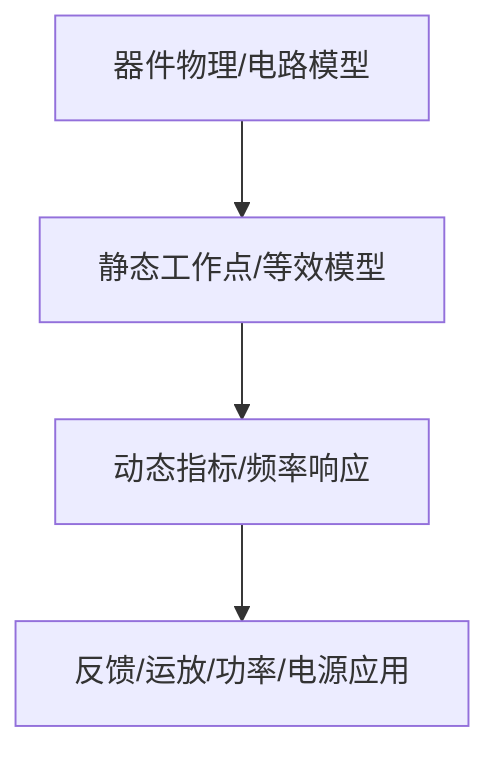

# 07-功率放大电路

> [!info] 使用方式
> 这是拆分后的章节导读。细学时从第一节顺着走；复盘时直接看“章节总复习”；需要查原上下文时回到[[考研专业课/模拟电子技术/详细笔记/07-功率放大电路|整章版详细笔记]]。

---

## 学习路径

| 顺序 | 知识点笔记 | 学习目标 |
| --- | --- | --- |
| 01 | [[考研专业课/模拟电子技术/详细笔记/07-功率放大电路/01-功率放大核心矛盾与类型|功率放大核心矛盾与类型]] | 功放不是追求电压增益，而是输出功率、效率和失真之间取平衡。 |
| 02 | [[考研专业课/模拟电子技术/详细笔记/07-功率放大电路/02-乙类互补对称功放|乙类双电源互补对称功放]] | 乙类互补功放是功率计算的核心模型。 |
| 03 | [[考研专业课/模拟电子技术/详细笔记/07-功率放大电路/03-功率效率管耗|功率、效率与管耗公式]] | 这节集中背公式和适用条件，题目通常直接考计算。 |
| 04 | [[考研专业课/模拟电子技术/详细笔记/07-功率放大电路/04-交越失真与甲乙类|交越失真与甲乙类功放]] | 甲乙类用微小偏置消除交越失真。 |
| 05 | [[考研专业课/模拟电子技术/详细笔记/07-功率放大电路/05-单电源与D类功放|单电源互补对称与 D 类功放]] | 知道单电源输出电容作用和 D 类高效率原因。 |
| 06 | [[考研专业课/模拟电子技术/详细笔记/07-功率放大电路/06-选管条件|功放管选管条件]] | 选管题检查最大管耗、耐压和电流余量。 |
| 07 | [[考研专业课/模拟电子技术/详细笔记/07-功率放大电路/99-章节总复习|章节总复习：功率放大电路]] | 复盘功率、效率、管耗、交越失真和选管。 |

---

## 快速入口

- 起点：[[考研专业课/模拟电子技术/详细笔记/07-功率放大电路/01-功率放大核心矛盾与类型|功率放大核心矛盾与类型]]
- 复盘：[[考研专业课/模拟电子技术/详细笔记/07-功率放大电路/99-章节总复习|章节总复习：功率放大电路]]
- 整章版：[[考研专业课/模拟电子技术/详细笔记/07-功率放大电路|整章版详细笔记]]
- 模电索引：[[考研专业课/模拟电子技术/📑 索引]]

---

## 知识网络

