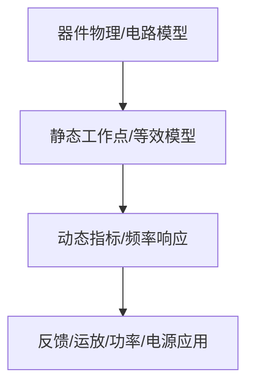

# 08-信号处理与信号产生电路

> [!info] 使用方式
> 这是拆分后的章节导读。细学时从第一节顺着走；复盘时直接看“章节总复习”；需要查原上下文时回到[[考研专业课/模拟电子技术/详细笔记/08-信号处理与信号产生电路|整章版详细笔记]]。

---

## 学习路径

| 顺序 | 知识点笔记 | 学习目标 |
| --- | --- | --- |
| 01 | [[考研专业课/模拟电子技术/详细笔记/08-信号处理与信号产生电路/01-滤波器基础|滤波器基础与二阶有源滤波]] | 滤波器按频率选择信号，重点掌握类型、截止频率和幅频特性。 |
| 02 | [[考研专业课/模拟电子技术/详细笔记/08-信号处理与信号产生电路/02-正弦波振荡条件|正弦波振荡条件]] | 振荡题先写幅值条件和相位条件。 |
| 03 | [[考研专业课/模拟电子技术/详细笔记/08-信号处理与信号产生电路/03-RC正弦波振荡|RC 正弦波振荡]] | RC 振荡常考起振条件和振荡频率。 |
| 04 | [[考研专业课/模拟电子技术/详细笔记/08-信号处理与信号产生电路/04-LC正弦波振荡|LC 正弦波振荡]] | LC 振荡适合较高频率，重点看选频网络。 |
| 05 | [[考研专业课/模拟电子技术/详细笔记/08-信号处理与信号产生电路/05-电压比较器|电压比较器]] | 比较器工作在非线性区，不能套虚短。 |
| 06 | [[考研专业课/模拟电子技术/详细笔记/08-信号处理与信号产生电路/06-方波与锯齿波产生|方波与锯齿波产生电路]] | 波形产生题抓阈值、电容充放电和翻转条件。 |
| 07 | [[考研专业课/模拟电子技术/详细笔记/08-信号处理与信号产生电路/99-章节总复习|章节总复习：信号处理与信号产生]] | 回忆滤波、振荡、比较器和波形产生的题型。 |

---

## 快速入口

- 起点：[[考研专业课/模拟电子技术/详细笔记/08-信号处理与信号产生电路/01-滤波器基础|滤波器基础与二阶有源滤波]]
- 复盘：[[考研专业课/模拟电子技术/详细笔记/08-信号处理与信号产生电路/99-章节总复习|章节总复习：信号处理与信号产生]]
- 整章版：[[考研专业课/模拟电子技术/详细笔记/08-信号处理与信号产生电路|整章版详细笔记]]
- 模电索引：[[考研专业课/模拟电子技术/📑 索引]]

---

## 知识网络

