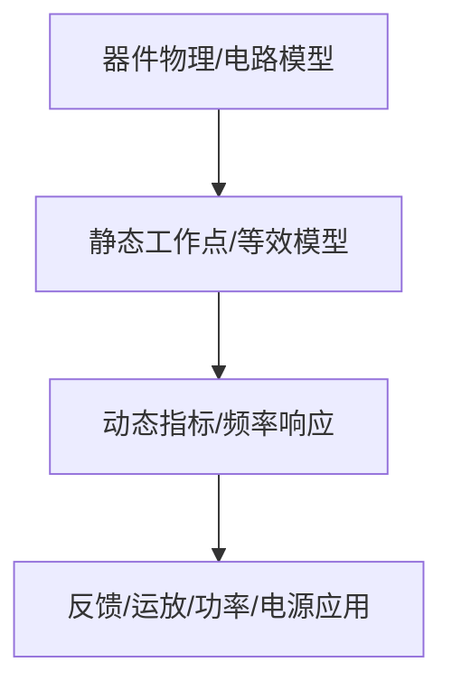

# 09-直流稳压电源

> [!info] 使用方式
> 这是拆分后的章节导读。细学时从第一节顺着走；复盘时直接看“章节总复习”；需要查原上下文时回到[[考研专业课/模拟电子技术/详细笔记/09-直流稳压电源|整章版详细笔记]]。

---

## 学习路径

| 顺序 | 知识点笔记 | 学习目标 |
| --- | --- | --- |
| 01 | [[考研专业课/模拟电子技术/详细笔记/09-直流稳压电源/01-直流稳压电源总结构|直流稳压电源总结构]] | 电源题按变压、整流、滤波、稳压四段拆。 |
| 02 | [[考研专业课/模拟电子技术/详细笔记/09-直流稳压电源/02-单相桥式整流|单相桥式整流]] | 桥式整流重点看导通路径、输出平均值和二极管反向耐压。 |
| 03 | [[考研专业课/模拟电子技术/详细笔记/09-直流稳压电源/03-滤波电路|滤波电路]] | 滤波电容决定脉动大小和二极管冲击电流。 |
| 04 | [[考研专业课/模拟电子技术/详细笔记/09-直流稳压电源/04-线性串联反馈式稳压|线性串联反馈式稳压]] | 串联稳压本质是负反馈控制调整管。 |
| 05 | [[考研专业课/模拟电子技术/详细笔记/09-直流稳压电源/05-三端集成稳压器|三端集成稳压器]] | 三端稳压器按固定/可调和保护条件来记。 |
| 06 | [[考研专业课/模拟电子技术/详细笔记/09-直流稳压电源/06-开关稳压电路|开关稳压电路]] | 开关稳压靠储能元件和占空比调节，效率高但纹波和噪声要关注。 |
| 07 | [[考研专业课/模拟电子技术/详细笔记/09-直流稳压电源/99-章节总复习|章节总复习：直流稳压电源]] | 复盘整流、滤波、稳压和电源设计 SOP。 |

---

## 快速入口

- 起点：[[考研专业课/模拟电子技术/详细笔记/09-直流稳压电源/01-直流稳压电源总结构|直流稳压电源总结构]]
- 复盘：[[考研专业课/模拟电子技术/详细笔记/09-直流稳压电源/99-章节总复习|章节总复习：直流稳压电源]]
- 整章版：[[考研专业课/模拟电子技术/详细笔记/09-直流稳压电源|整章版详细笔记]]
- 模电索引：[[考研专业课/模拟电子技术/📑 索引]]

---

## 知识网络

