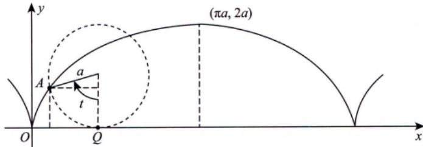
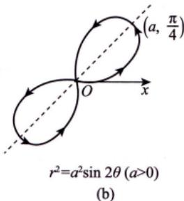
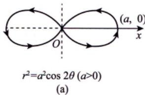
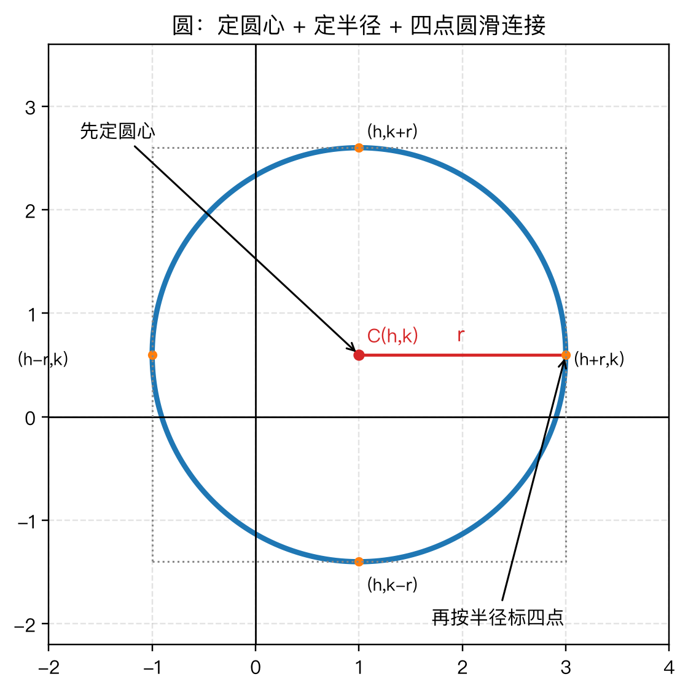
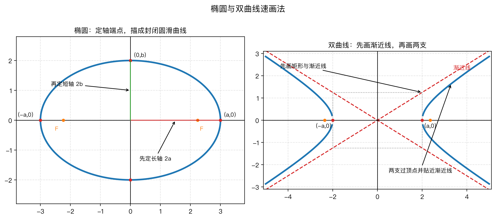

# 常用平面图形

## 1. 摆线（平摆线 / Cycloid）

**参数方程**（ $a > 0$ ）：

$$\begin{cases} x = a(t - \sin t) \\ y = a(1 - \cos t) \end{cases}$$

**关键特征**：
- 拱顶： $t = \pi$ 时，最高点 $(\pi a,\, 2a)$
- 周期： $2\pi a$ （一个拱的宽度）
- 一拱面积： $3\pi a^2$
- 一拱弧长： $8a$
- 尖点在 $x$ 轴上（ $t = 2k\pi$ 处）

---

## 2. 伯努利双纽线（Lemniscate of Bernoulli）

### 2.1 $r^2 = a^2 \cos 2\theta$（关于 $x$ 轴对称）

**极坐标方程**： $r^2 = a^2 \cos 2\theta$ （ $a > 0$ ）

**直角坐标方程**： $(x^2 + y^2)^2 = a^2(x^2 - y^2)$

**关键特征**：
- 对称轴：$x$ 轴、$y$ 轴、原点
- 存在范围：$\cos 2\theta \geq 0$，即 $\theta \in [-\frac{\pi}{4},\, \frac{\pi}{4}] \cup [\frac{3\pi}{4},\, \frac{5\pi}{4}]$
- 最远点：$\theta = 0$ 时 $r = a$，对应点 $(a,\, 0)$
- 过极点：$\theta = \pm\frac{\pi}{4}$ 时 $r = 0$
- 总面积：$a^2$

### 2.2 $r^2 = a^2 \sin 2\theta$（关于 $y = x$ 对称）

**极坐标方程**： $r^2 = a^2 \sin 2\theta$ （ $a > 0$ ）

**直角坐标方程**： $(x^2 + y^2)^2 = 2a^2 xy$

**关键特征**：
- 对称轴：直线 $y = x$、原点
- 存在范围：$\sin 2\theta \geq 0$，即 $\theta \in [0,\, \frac{\pi}{2}] \cup [\pi,\, \frac{3\pi}{2}]$
- 最远点：$\theta = \frac{\pi}{4}$ 时 $r = a$
- 过极点：$\theta = 0,\, \frac{\pi}{2}$ 时 $r = 0$
- 总面积：$a^2$

> [!tip] 两种双纽线的区别
> $\cos 2\theta$ 型关于 $x$ 轴对称（横"8"字），$\sin 2\theta$ 型关于 $y=x$ 对称（斜"8"字），相当于旋转了 $45°$。

---
---

## 3. 圆（Circle）速画法

> [!note] 图的作用
> 圆的画法最核心是“圆心 + 半径”：先定中心 $C(h,k)$，再在上下左右标出四个半径端点，最后圆滑连接。

**标准方程**：

$$
(x-h)^2+(y-k)^2=r^2, \quad r>0
$$

- 圆心：$(h,k)$。
- 半径：$r$。
- 与坐标轴平行方向的四个关键点：$(h\pm r,k)$、$(h,k\pm r)$。

**画图步骤**：
1. **化成标准式**：先看能否写成 $(x-h)^2+(y-k)^2=r^2$。
2. **定圆心**：在图上标出中心 $C(h,k)$。
3. **定半径**：从圆心向左、右、上、下各量 $r$，得到四个端点。
4. **圆滑连接**：过四个端点画一条封闭圆滑曲线，四个方向离圆心距离都等于 $r$。

**一般方程识别**：

$$
x^2+y^2+Dx+Ey+F=0
$$

- 先确认 $x^2$、$y^2$ 系数相同，且没有 $xy$ 项。
- 圆心：$(-\frac{D}{2},-\frac{E}{2})$。
- 半径：$r=\frac{1}{2}\sqrt{D^2+E^2-4F}$，要求 $D^2+E^2-4F>0$。

> [!tip] 考研速记
> 圆就是“两个平方系数一样 + 没有 $xy$ 项”。一般式先配方找圆心，再用半径画四点。
## 4. 椭圆（Ellipse）速画法

> [!note] 图的作用
> 左图对应椭圆画法：先定长轴、短轴端点；右图对应双曲线画法：先画辅助矩形和渐近线，再贴线描两支。

**标准方程**（以长轴在 $x$ 轴上为例）：

$$
\frac{x^2}{a^2} + \frac{y^2}{b^2} = 1, \quad a>b>0
$$

**画图步骤**：
1. **定中心**：标准式中心在原点；若是 $\frac{(x-h)^2}{a^2}+\frac{(y-k)^2}{b^2}=1$，中心是 $(h,k)$。
2. **看谁分母大**：$a^2$ 在 $x^2$ 下方且 $a>b$，长轴沿 $x$ 轴；若大分母在 $y^2$ 下方，长轴沿 $y$ 轴。
3. **标四个端点**：长轴端点 $(\pm a,0)$，短轴端点 $(0,\pm b)$；平移型整体加上中心坐标。
4. **圆滑连接**：过四个端点画封闭、关于两轴对称的扁圆，不要画成菱形。
5. **需要焦点时再补**：$c=\sqrt{a^2-b^2}$，长轴横放时焦点为 $(\pm c,0)$。

**参数方程**：

$$
\begin{cases}
x=a\cos t,\\
y=b\sin t
\end{cases} \quad 0\leq t<2\pi
$$

> [!tip] 考研速记
> 椭圆先看“最大分母定长轴”，再标 $(\pm a,0)$、$(0,\pm b)$。如果题目给的是平移型，先找中心，再把四个端点整体平移。

---

## 5. 双曲线（Hyperbola）速画法

**横开口标准方程**：

$$
\frac{x^2}{a^2} - \frac{y^2}{b^2} = 1, \quad a>0,b>0
$$

**画图步骤（横开口）**：
1. **定中心**：标准式中心在原点；平移型先找中心 $(h,k)$。
2. **看正项决定开口方向**：$x^2$ 项为正，向左右开口；$y^2$ 项为正，向上下开口。
3. **标顶点**：横开口顶点是 $(\pm a,0)$；平移型为 $(h\pm a,k)$。
4. **画辅助矩形**：以中心为中点，半宽 $a$、半高 $b$，画出矩形。
5. **画渐近线**：横开口时渐近线是 $y=\pm \frac{b}{a}x$；平移型是 $y-k=\pm \frac{b}{a}(x-h)$。
6. **贴线描两支**：两支曲线经过顶点，越远越贴近渐近线，但永远不与渐近线相交。
7. **需要焦点时再补**：$c=\sqrt{a^2+b^2}$，横开口焦点为 $(\pm c,0)$。

**竖开口标准方程**：

$$
\frac{y^2}{a^2} - \frac{x^2}{b^2} = 1
$$

- 顶点：$(0,\pm a)$。
- 渐近线：$y=\pm \frac{a}{b}x$。
- 平移型：$y-k=\pm \frac{a}{b}(x-h)$。

> [!warning] 易错点
> 双曲线不是“两个抛物线”。必须先画渐近线，曲线两端贴近渐近线；而且 $c^2=a^2+b^2$，不要和椭圆的 $c^2=a^2-b^2$ 混淆。
