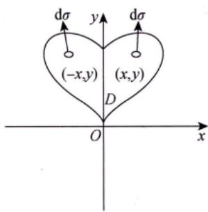
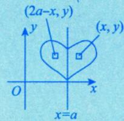
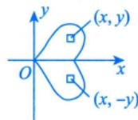
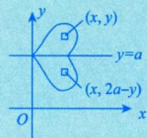
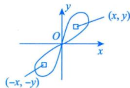
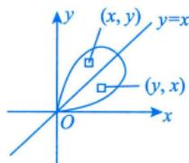

# 普通对称性

> [!important] 重要考点！
> 遇到二重积分的题目，首先应考虑对称性，看能否化简。

## 核心口诀

**偶倍奇零**：函数在对称点处相等 → 2倍；相反 → 0

## 四种对称情况

### ① D 关于 $y$ 轴对称

对称点：$(x, y) \leftrightarrow (-x, y)$

$$\iint_{D} f(x, y) \mathrm{d} \sigma = \begin{cases} 2\iint_{D_{1}} f(x, y) \mathrm{d} \sigma, & f(x, y) = f(-x, y), \\ 0, & f(x, y) = -f(-x, y). \end{cases}$$

其中 $D_{1}$ 是 $D$ 在 $y$ 轴右侧的部分。

> **推广**：若 $D$ 关于 $x = a$（$a \neq 0$）对称，$(x,y)$ 关于 $x = a$ 的对称点为 $(2a - x, y)$，则将 $x$ 替换为 $2a - x$ 即可。
> $$

\text {相 当 于 将} \stackrel {\vee} {x} = 0 \text {平} \text {移 了} a \text {个 单 位 长 度} \iint_ {D} f (x, y) \mathrm {d} \sigma = \left\{ \begin{array}{l l} 2 \iint_ {D _ {1}} f (x, y) \mathrm {d} \sigma , & f (x, y) = f (2 a - x, y), \\ 0, & f (x, y) = - f (2 a - x, y), \end{array} \right.

$$

### ② D 关于 $x$ 轴对称

对称点：$(x, y) \leftrightarrow (x, -y)$

$$\iint_{D} f(x, y) \mathrm{d} \sigma = \begin{cases} 2\iint_{D_{1}} f(x, y) \mathrm{d} \sigma, & f(x, y) = f(x, -y), \\ 0, & f(x, y) = -f(x, -y). \end{cases}$$

其中 $D_{1}$ 是 $D$ 在 $x$ 轴上侧的部分。

> **推广**：若 $D$ 关于 $y = a$ 对称，对称点为 $(x, 2a - y)$。
> $$

\iint_ {D} f (x, y) \mathrm {d} \sigma = \left\{ \begin{array}{l l} 2 \iint_ {D _ {1}} f (x, y) \mathrm {d} \sigma , & f (x, y) = f (x, 2 a - y), \\ 0, & f (x, y) = - f (x, 2 a - y), \end{array} \right.

$$

### ③ D 关于原点对称

对称点：$(x, y) \leftrightarrow (-x, -y)$

$$\iint_{D} f(x, y) \mathrm{d} \sigma = \begin{cases} 2\iint_{D_{1}} f(x, y) \mathrm{d} \sigma, & f(x, y) = f(-x, -y), \\ 0, & f(x, y) = -f(-x, -y). \end{cases}$$

### ④ D 关于 $y = x$ 对称

对称点：$(x, y) \leftrightarrow (y, x)$（$x, y$ 对调）

$$\iint_{D} f(x, y) \mathrm{d} \sigma = \begin{cases} 2\iint_{D_{1}} f(x, y) \mathrm{d} \sigma, & f(x, y) = f(y, x), \\ 0, & f(x, y) = -f(y, x). \end{cases}$$

## 使用步骤

1. 看 $D$ 关于**谁**对称
2. 将对称点代入 $f(x, y)$：**相等则2倍，相反则为0**

> [!warning] 辅助曲线创造对称性
> 当 $D$ 本身不对称时，可以作辅助曲线创造对称性。对称部分积分为0，只需计算剩余部分。

---

## 个人笔记

> [!personal]
> （在此记录个人理解和笔记）
