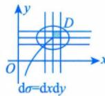
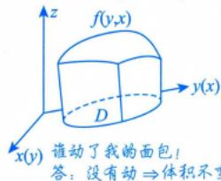

# 轮换对称性

> [!important] 对称问题尽量用对称方法去解决！

## 引入

### 引例1

$$\iint_{D_{1}: \frac{x^{2}}{4} + \frac{y^{2}}{3} \leqslant 1} (2x^{2} + 3y^{2}) \mathrm{d}x \mathrm{d}y \stackrel{?}{=} \iint_{D_{2}: \frac{y^{2}}{4} + \frac{x^{2}}{3} \leqslant 1} (2y^{2} + 3x^{2}) \mathrm{d}y \mathrm{d}x$$

> [!note] 解
> 上述两个积分只是将 $x$ 与 $y$ 这两个字母对调了，而**积分值与用什么字母表示是无关的**，故它们相等。

### 引例2

$$\iint_{D: \frac{x^{2}}{4} + \frac{y^{2}}{4} \leqslant 1} (2x^{2} + 3y^{2}) \mathrm{d}x \mathrm{d}y = \iint_{D: \frac{x^{2}}{4} + \frac{y^{2}}{4} \leqslant 1} (2y^{2} + 3x^{2}) \mathrm{d}y \mathrm{d}x$$

> [!note] 解
> 理由同上，它们也是相等的。

> [!abstract] 关键观察
> 引例2中的区域 $D$ 有个特点：当你把 $x$ 与 $y$ 对调后，**区域 $D$ 不变**（事实上，区域 $D$ 关于 $y = x$ 对称）。

## 定义

在**直角坐标系**下，若把 $x$ 与 $y$ 对调后，区域 $D$ 不变（即 $D$ 关于 $y = x$ 对称），则

$$\iint_{D} f(x, y) \mathrm{d} \sigma = \iint_{D} f(y, x) \mathrm{d} \sigma$$

> [!info] 其中 $\mathrm{d}\sigma = \mathrm{d}x\mathrm{d}y = \mathrm{d}y\mathrm{d}x$

## 核心应用

当 $\iint_{D} f(x,y) \mathrm{d}\sigma$ 难计算，但 $f(x,y) + f(y,x)$ 之和简单时，利用轮换对称性：

$$I = \frac{1}{2} \iint_{D} [f(x, y) + f(y, x)] \mathrm{d}\sigma$$

> [!note] 注：当 $f(x, y) + f(y, x) = a$（常数）时的推导
> 在直角坐标系中，若 $f(x, y) + f(y, x) = a$，则
>
> $$I = \frac{1}{2} \iint_{D} [f(x, y) + f(y, x)] \mathrm{d}x \mathrm{d}y = \frac{1}{2} \iint_{D} a \, \mathrm{d}x \mathrm{d}y = \frac{a}{2} S_{D}$$

## 普通对称性 vs 轮换对称性

| | 普通对称性（④） | 轮换对称性 |
|--|-----------------|-----------|
| 条件 | $D$ 关于 $y = x$ 对称 | $D$ 关于 $y = x$ 对称 |
| 考查对象 | $f(x,y)$ 与 $f(y,x)$ 是否相等或相反 | $f(x,y) + f(y,x)$ 是否简单 |
| 结论 | 相等→2倍；相反→0 | 利用和简化计算 |

> [!tip] 何时使用
> 当 $D$ 关于 $y = x$ 对称时：
> - 若 $f(x,y) = \pm f(y,x)$，用**普通对称性**
> - 若不满足，看 $f(x,y) + f(y,x)$ 是否简单，考虑**轮换对称性**

> [!warning] 两者联系
> 虽然普通对称性④与轮换对称性都是 $D$ 关于 $y = x$ 对称，但普通对称性考查的是 $f(x, y)$ 与 $f(y, x)$ 是相等还是相反，轮换对称性考查的是 $f(x, y) + f(y, x)$ 是否简单。事实上，**当 $f(x, y) = -f(y, x)$ 时，它们是一回事**（此时轮换对称性退化为普通对称性的"相反→0"情形）。

## 典型例题

$$\iint_{D} \frac{a\sqrt{f(x)} + b\sqrt{f(y)}}{\sqrt{f(x)} + \sqrt{f(y)}} \mathrm{d}\sigma = \frac{a+b}{2} \cdot S_{D}$$

---

## 个人笔记

> [!personal]
> （在此记录个人理解和笔记）
