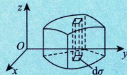

# 概念

## 一、定义

> [!abstract] 四步走：分割 → 近似 → 求和 → 取极限

设 $f(x,y)$ 是有界闭区域 $D$ 上的有界函数。

**1. 分割**：将 $D$ 任意分成 $n$ 个小闭区域

$$\Delta \sigma_{1},\; \Delta \sigma_{2},\; \dots,\; \Delta \sigma_{n}$$

其中 $\Delta \sigma_{i}$ 既表示第 $i$ 个小闭区域，也表示它的面积。

**2. 近似**：在每个 $\Delta \sigma_{i}$ 上任取一点 $(\xi_i,\eta_i)$，作乘积

$$f(\xi_i,\eta_i)\,\Delta \sigma_i \quad (i = 1,2,\dots,n)$$

> [!tip] 直觉理解
> 底面积 $\Delta \sigma_i$ 乘以高 $f(\xi_i,\eta_i)$ → 得到一个"小柱体"体积的近似。
> 类比定积分：$f(\xi_i)\Delta x_i$ 是"小矩形面积"的近似。

**3. 求和**：

$$\sum_{i = 1}^{n}f(\xi_i,\eta_i)\,\Delta \sigma_i$$

**4. 取极限**：令 $\lambda = \max\{\Delta \sigma_{i}\} \to 0$，若极限存在（与分法及取点均无关），则称为 $f(x,y)$ 在 $D$ 上的**二重积分**：

$$\boxed{\iint_{D} f(x,y)\,\mathrm{d}\sigma = \lim_{\lambda \to 0} \sum_{i = 1}^{n} f(\xi_{i},\eta_{i})\,\Delta \sigma_{i}}$$

---

## 二、记号说明

| 符号 | 名称 | 备注 |
|------|------|------|
| $f(x,y)$ | 被积函数 | |
| $f(x,y)\,\mathrm{d}\sigma$ | 被积表达式 | |
| $\mathrm{d}\sigma$ | 面积元素 | $\mathrm{d}\sigma > 0$（始终为正） |
| $x,\,y$ | 积分变量 | |
| $D$ | 积分区域 | |
| $\iint$ | 二重积分号 | 维度 = 2 → 两个 $\int$ |

---

## 三、几何意义

> [!info] 核心直觉
> 二重积分 = 以 $D$ 为底、$z = f(x,y)$ 为顶的**曲顶柱体**的**有符号体积**。

| 情况 | 几何含义 | 积分值 |
|------|----------|--------|
| $f(x,y) \geq 0$ | 曲顶柱体在 $xOy$ 面上方 | 等于柱体**体积** |
| $f(x,y) \leq 0$ | 曲顶柱体在 $xOy$ 面下方 | **负值**，绝对值等于柱体体积 |
| $f(x,y)$ 有正有负 | 部分在上、部分在下 | 上方体积 **减去** 下方体积 |

---

## 四、存在条件

> [!theorem] 可积的充分条件
> 若 $f(x,y)$ 在有界闭区域 $D$ 上**连续**，则 $\displaystyle\iint_{D} f(x,y)\,\mathrm{d}\sigma$ **一定存在**。

---

## 五、积分维度的统一类比

| | 一维（定积分） | 二维（二重积分） | 三维（三重积分） |
|--|:-:|:-:|:-:|
| **分割对象** | 线段 | 平面区域 | 空间区域 |
| **微元** | $\Delta x_i$ | $\Delta \sigma_i$ | $\Delta v_i$ |
| **积分号** | $\displaystyle\int$ | $\displaystyle\iint$ | $\displaystyle\iiint$ |
| **物理模型** | 细质杆质量 | 平面薄板质量 | 空间物体质量 |
| **几何意义** | 曲边梯形面积 | 曲顶柱体体积 | — |

三重积分的极限定义：

$$\iiint_{\Omega}f(x,y,z)\,\mathrm{d}v = \lim_{\lambda \to 0}\sum_{i = 1}^{n}f(\xi_i,\eta_i,\zeta_i)\,\Delta v_i$$

> [!tip] 核心思想一脉相承
> 先把区域分得足够细（测度足够小），在微元上近似认为函数值是常数，再求和、取极限。

---

## 个人笔记

> [!personal]
> （在此记录个人理解和笔记）
