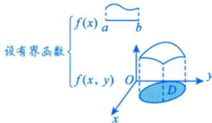

# 概念

## 定义

设 $f(x,y)$ 是有界闭区域 $D$ 上的有界函数，将闭区域 $D$ 任意分成 $n$ 个小闭区域 $\Delta \sigma_{1}, \Delta \sigma_{2}, \dots, \Delta \sigma_{n}$，其中 $\Delta \sigma_{i}$ 表示第 $i$ 个小闭区域，也表示它的面积。

在每个 $\Delta \sigma_{i}$ 上任取一点 $(\xi_i,\eta_i)$，作乘积 $f(\xi_i,\eta_i)\Delta \sigma_i$，并作和 $\sum_{i = 1}^{n}f(\xi_i,\eta_i)\Delta \sigma_i$。

如果当各小闭区域的直径中的最大值 $\lambda$ 趋于零时，此和的极限总存在（与 $\Delta \sigma_{i}$ 的分法及点 $(\xi_i,\eta_i)$ 的取法均无关），则称此极限值为函数 $f(x,y)$ 在闭区域 $D$ 上的**二重积分**，记作 $\iint_{D}f(x,y)\mathrm{d}\sigma$。

$$\iint_{D} f(x, y) \mathrm{d} \sigma = \lim_{\lambda \rightarrow 0} \sum_{i = 1}^{n} f(\xi_{i}, \eta_{i}) \Delta \sigma_{i}$$

## 记号说明

| 符号 | 名称 |
|------|------|
| $f(x,y)$ | 被积函数 |
| $f(x,y)\mathrm{d}\sigma$ | 被积表达式 |
| $\mathrm{d}\sigma$ | 面积元素（$\mathrm{d}\sigma > 0$） |
| $x, y$ | 积分变量 |
| $D$ | 积分区域 |

## 几何意义

- **$f(x,y) \geq 0$**：二重积分等于**曲顶柱体的体积**（$\mathrm{d}\sigma$ 乘以高 $f(x,y)$ 得"小竖条"体积，在 $D$ 上累加）
- **$f(x,y) \leq 0$**：柱体在 $xOy$ 面下方，二重积分值为负，绝对值等于柱体体积
- **$f(x,y)$ 有正有负**：二重积分等于 $xOy$ 面上方体积减去下方体积

## 存在条件

若 $f(x,y)$ 在有界闭区域 $D$ 上**连续**，则二重积分 $\iint_{D} f(x,y) \mathrm{d}\sigma$ 一定存在。

## 与定积分的类比

| | 定积分（一维） | 二重积分（二维） |
|--|----------------|------------------|
| 分割对象 | 线段 | 平面区域 |
| 微元 | $\Delta x_i$ | $\Delta \sigma_i$ |
| 积分号 | $\int$ | $\iint$ |
| 实际意义 | 细质杆质量 | 平面薄板质量 |
| 数学思想 | 分割→近似→求和→取极限 | 分割→近似→求和→取极限 |

> [!tip] 核心思想
> 数学思想一脉相承：先把区域分得足够细，在微元上近似认为函数值是常数，再求和、求极限。

---

## 个人笔记

> [!personal]
> （在此记录个人理解和笔记）
