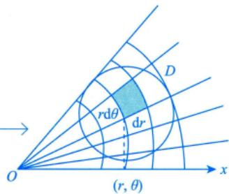
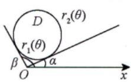
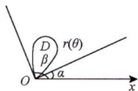
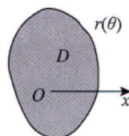

# 极坐标系

> 极坐标系：与中心对称图像有关！一般**先积 $r$，后积 $\theta$**

## 坐标转换

$$\begin{cases} x = r\cos\theta \\ y = r\sin\theta \end{cases} \quad \mathrm{d}\sigma = r\,\mathrm{d}r\,\mathrm{d}\theta$$

## 三种情况

### (1) 极点在区域外部

$$\iint_{D} f(x, y) \mathrm{d}\sigma = \int_{\alpha}^{\beta} \mathrm{d}\theta \int_{r_1(\theta)}^{r_2(\theta)} f(r\cos\theta, r\sin\theta) \, r \, \mathrm{d}r$$

### (2) 极点在区域边界上

$$\iint_{D} f(x, y) \mathrm{d}\sigma = \int_{\alpha}^{\beta} \mathrm{d}\theta \int_{0}^{r(\theta)} f(r\cos\theta, r\sin\theta) \, r \, \mathrm{d}r$$

### (3) 极点在区域内部

$$\iint_{D} f(x, y) \mathrm{d}\sigma = \int_{0}^{2\pi} \mathrm{d}\theta \int_{0}^{r(\theta)} f(r\cos\theta, r\sin\theta) \, r \, \mathrm{d}r$$

## 确定积分限的方法

1. 从 $Ox$ 轴逆时针出发，先碰到区域时记 $\theta = \alpha$，后离开时记 $\theta = \beta$
2. 限内画射线，先交内曲线记 $r = r_1(\theta)$，后交外曲线记 $r = r_2(\theta)$

## 选择极坐标系的一般原则

> [!tip] 何时使用极坐标系
> 满足以下**至少一条**即可优先选用极坐标系：
>
> ① 被积函数含 $f(x^2 + y^2)$、$f\left(\dfrac{y}{x}\right)$、$f\left(\dfrac{x}{y}\right)$ 等形式
>
> ② 积分区域是圆或圆的一部分

---

## 个人笔记

> [!personal]
> （在此记录个人理解和笔记）
