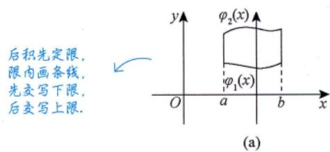

# 直角坐标系

> $\mathrm{d}\sigma = \mathrm{d}x\mathrm{d}y$（直角坐标系下的标志）

## X型区域（先 $y$ 后 $x$）

穿过 $D$ 内部且平行于 $y$ 轴的直线与 $D$ 的边界相交**不多于两点**。

$$\iint_{D} f(x, y) \mathrm{d}\sigma = \int_{a}^{b} \mathrm{d}x \int_{\varphi_1(x)}^{\varphi_2(x)} f(x, y) \mathrm{d}y$$

其中 $D$：$\varphi_1(x) \leqslant y \leqslant \varphi_2(x)$，$a \leqslant x \leqslant b$。

## Y型区域（先 $x$ 后 $y$）

穿过 $D$ 内部且平行于 $x$ 轴的直线与 $D$ 的边界相交**不多于两点**。

$$\iint_{D} f(x, y) \mathrm{d}\sigma = \int_{c}^{d} \mathrm{d}y \int_{\psi_1(y)}^{\psi_2(y)} f(x, y) \mathrm{d}x$$

其中 $D$：$\psi_1(y) \leqslant x \leqslant \psi_2(y)$，$c \leqslant y \leqslant d$。

## 重要注意事项

1. **下限必须 $\leqslant$ 上限**：$\mathrm{d}x > 0$，$\mathrm{d}y > 0$，$\mathrm{d}\sigma > 0$
2. 若上限 < 下限，需先添负号交换上下限
3. **选择积分次序的原则**：
   - 被积函数易于对谁积分 → 先积谁
   - 积分区域是X型 → 先 $y$ 后 $x$；Y型 → 先 $x$ 后 $y$
4. **画图确定积分限**是关键

## 交换积分次序 ⭐⭐⭐

> [!important] 何时交换积分次序
> 以下函数没有初等函数形式的原函数，见到它们一般都要交换积分次序：
> $\dfrac{\sin x}{x}$, $\dfrac{\cos x}{x}$, $\dfrac{\ln(1+x)}{x}$, $\dfrac{1}{\ln x}$, $\sin x^2$, $\cos x^2$, $\sin\dfrac{1}{x}$, $\cos\dfrac{1}{x}$, $\dfrac{e^x}{x}$, $e^{ax^2+bx+c}(a \neq 0)$

**交换步骤**：
1. 由原累次积分确定积分区域 $D$
2. 画出 $D$ 的边界图形
3. 按新的积分次序写出累次积分

---

## 个人笔记

> [!personal]
> （在此记录个人理解和笔记）
