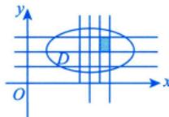
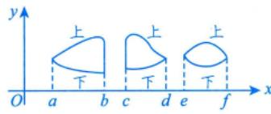
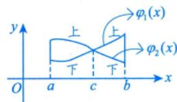
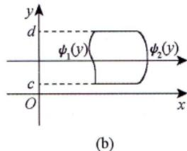

# 直角坐标系

> $\mathrm{d}\sigma = \mathrm{d}x\mathrm{d}y$（直角坐标系下的面积元素标志）

---

## X型区域（先 $y$ 后 $x$）

**几何特征**：穿过 $D$ 内部且平行于 $y$ 轴的直线与 $D$ 的边界相交**不多于两点**。

$$\iint_{D} f(x, y) \mathrm{d}\sigma = \int_{a}^{b} \mathrm{d}x \int_{\varphi_1(x)}^{\varphi_2(x)} f(x, y) \mathrm{d}y$$

**积分区域**：$D = \{(x, y) \mid \varphi_1(x) \leqslant y \leqslant \varphi_2(x),\; a \leqslant x \leqslant b\}$

|  |  |
| -------------------------------------------- | -------------------------------------------- |

---

## Y型区域（先 $x$ 后 $y$）

**几何特征**：穿过 $D$ 内部且平行于 $x$ 轴的直线与 $D$ 的边界相交**不多于两点**。

$$\iint_{D} f(x, y) \mathrm{d}\sigma = \int_{c}^{d} \mathrm{d}y \int_{\psi_1(y)}^{\psi_2(y)} f(x, y) \mathrm{d}x$$

**积分区域**：$D = \{(x, y) \mid \psi_1(y) \leqslant x \leqslant \psi_2(y),\; c \leqslant y \leqslant d\}$

---

## 重要注意事项

> [!warning] 下限 $\leqslant$ 上限
> 因为 $\mathrm{d}x > 0$，$\mathrm{d}y > 0$，$\mathrm{d}\sigma > 0$，所以积分的**下限必须 $\leqslant$ 上限**。
> 若出现上限 < 下限的情况，需先添负号再交换上下限。

> [!tip] 如何选择积分次序
> - 被积函数 $f(x,y)$ 易于对 $y$ 积分，**或**积分区域 $D$ 是 X型 → **先 $y$ 后 $x$**
> - 被积函数 $f(x,y)$ 易于对 $x$ 积分，**或**积分区域 $D$ 是 Y型 → **先 $x$ 后 $y$**

> [!tip] 如何确定积分限
> **画图**是确定积分限的关键。当边界图形不易画出时，写出 $D$ 的不等式表达式，从而确定上下限。

---

## 交换积分次序 ⭐⭐⭐

> [!important] 何时交换积分次序
> 以下函数**没有初等函数形式的原函数**，见到它们一般都要交换积分次序：
>
> $\dfrac{\sin x}{x}$，$\dfrac{\cos x}{x}$，$\dfrac{\ln(1+x)}{x}$，$\dfrac{1}{\ln x}$，$\sin x^2$，$\cos x^2$，$\sin\dfrac{1}{x}$，$\cos\dfrac{1}{x}$，$\dfrac{e^x}{x}$，$e^{ax^2+bx+c}\;(a \neq 0)$

**交换步骤**：

1. 由原累次积分确定积分区域 $D$
2. 画出 $D$ 的边界图形
3. 按新的积分次序写出累次积分

---

## 个人笔记

> [!personal]
> （在此记录个人理解和笔记）
