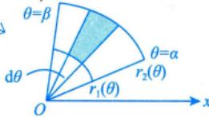
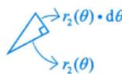
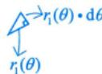

---
tags:
  - 考研数学
  - 一元函数积分学
  - 几何应用
  - 平面图形面积
  - 极坐标
---

# 极坐标系下的面积

## 公式

曲线 $r = r_1(\theta)$ 与 $r = r_2(\theta)$ 与两射线 $\theta = \alpha$、$\theta = \beta$（$0 < \beta - \alpha \leqslant 2\pi$）所围成的曲边扇形的面积：

$$S = \int_\alpha^\beta \frac{1}{2}|r_2^2(\theta) - r_1^2(\theta)| \, \mathrm{d}\theta$$

## 推导思路（微元法）

1. **分割**：用经过极点 $O$ 的射线将扇形区域切分为无数小扇形，由两条射线 $\theta = \alpha$、$\theta = \beta$ 界定

2. **取微元**：在 $[\theta, \, \theta + \mathrm{d}\theta]$ 上，内外半径分别为 $r_1(\theta)$、$r_2(\theta)$，当 $\mathrm{d}\theta \to 0$ 时，微元扇环近似为三角形

$$\mathrm{d}S = \frac{1}{2}r_2^2(\theta) \, \mathrm{d}\theta - \frac{1}{2}r_1^2(\theta) \, \mathrm{d}\theta = \frac{1}{2}|r_2^2(\theta) - r_1^2(\theta)| \, \mathrm{d}\theta$$

3. **积分**：将所有微元累加

$$S = \int_\alpha^\beta \frac{1}{2}|r_2^2(\theta) - r_1^2(\theta)| \, \mathrm{d}\theta$$

> [!tip] 关键点
> - 绝对值保证面积非负（$r_1$、$r_2$ 大小关系不确定时）
> - 当 $r_1(\theta) = 0$（从极点出发）时，公式退化为 $S = \dfrac{1}{2}\displaystyle\int_\alpha^\beta r^2(\theta) \, \mathrm{d}\theta$
> - 利用对称性简化计算（如伯努利双纽线 $r^2 = a^2\cos 2\theta$，只需算第一象限再乘 2）

## 个人笔记

