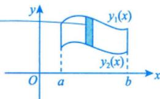

---
tags:
  - 考研数学
  - 一元函数积分学
  - 几何应用
  - 平面图形面积
---

# 直角坐标系下的面积

## 公式

曲线 $y = y_1(x)$ 与 $y = y_2(x)$ 及 $x = a$，$x = b$（$a < b$）所围成的平面图形的面积：

$$S = \int_a^b |y_1(x) - y_2(x)| \, \mathrm{d}x$$

## 推导思路（微元法）

1. **取微元**：$\Delta S = |y_1(x) - y_2(x)| \, \mathrm{d}x$
2. **积分**：$S = \int_a^b |y_1 - y_2| \, \mathrm{d}x$

> [!tip] 关键点
> - 绝对值保证面积非负
> - 用大函数减去小函数，即 $S = \int_a^b y_1 \, \mathrm{d}x - \int_a^b y_2 \, \mathrm{d}x$
> - 可能用到收敛的反常积分

> [!warning] 常见错误
> 忘记取绝对值，导致面积为负

## 个人笔记

